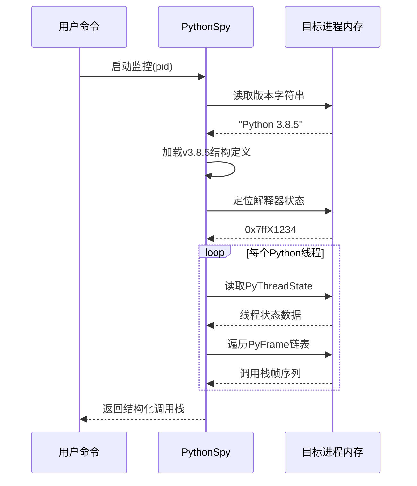

# 第5章：Python进程监控

在[第4章：二进制与符号解析器](04_binary___symbol_parser_.md)中，我们了解到`py-spy`通过解析二进制文件获取了Python内部结构的"藏宝图"。

但知道宝藏位置只是开始——如何==将这些内存地址转化为有意义的调用栈和变量值==？这正是**Python进程监控**组件的核心使命。

作为`py-spy`的中枢神经系统，它将底层内存访问能力与Python版本特性知识相结合，实现运行时行为的精准还原。

## 核心挑战：从内存地址到语义理解

设想我们需要解析一台复杂机器（Python解释器）的运行日志：
- **已知条件**：机器的内存布局图纸（二进制解析结果）
- **能力基础**：可读取任意内存位置的数据（进程内存访问）

**核心难题**在于：如何将原始字节流转化为"线程A正在执行函数B，由函数C调用"这样的高级语义？Python进程监控组件通过以下知识体系解决这个问题：
1. **版本特征库**：记忆不同Python版本的内存布局差异
2. **对象关系图谱**：理解`PyInterpreterState`、`PyThreadState`等核心对象的关联关系
3. **调用链重建算法**：通过`f_back`指针回溯完整的调用栈

## 组件架构

### PythonSpy核心结构
```rust
pub struct PythonSpy {
    process: Process,              // 进程内存访问接口
    version: Version,              // 检测到的Python版本
    interpreter_addr: usize,       // PyInterpreterState内存地址
    threadstate_addr: usize,       // 线程状态链表头地址
    config: Config,                // 用户配置项
    #[cfg(feature = "unwind")]
    unwinder: Option<Unwinder>,    // 本地栈展开器
}
```

### 工作流程


## 关键技术

### 版本自适应检测
```rust
// 版本特征检测算法
fn detect_version(proc: &Process) -> Result<Version> {
    // 方案1：通过Py_GetVersion符号定位
    if let Ok(ver) = read_version_string(proc, "_Py_GetVersion") {
        return Ok(ver);
    }
    
    // 方案2：扫描内存特征码
    let bss = find_bss_section(proc)?;
    for addr in (bss.start..bss.end).step_by(8) {
        if let Ok(bytes) = proc.copy(addr, 16) {
            if let Some(ver) = Version::match_signature(&bytes) {
                return Ok(ver);
            }
        }
    }
    Err("Version detection failed")
}
```

### 线程状态遍历
```rust
// 线程状态遍历器（支持Python 3.7+）
fn walk_threads(&self) -> Result<Vec<ThreadTrace>> {
    let interp = self.read_interpreter_state()?;
    let mut current = interp.threads_head;  // 获取线程链表头
    
    let mut traces = vec![];
    while !current.is_null() {
        let thread = self.read_thread_state(current)?;
        traces.push(self.build_thread_trace(&thread)?);
        current = thread.next;  // 移动到下一个线程状态
    }
    Ok(traces)
}
```

### 🎢调用栈重建
```rust
// 帧栈展开实现
fn unwind_frames(&self, frame_ptr: usize) -> Result<Vec<Frame>> {
    let mut frames = vec![];
    let mut current_ptr = frame_ptr;
    
    while !current_ptr.is_null() {
        let frame = self.read_frame_object(current_ptr)?;
        frames.push(Frame {
            function: self.parse_code_object(frame.f_code)?,
            lineno: frame.f_lineno,
            locals: if self.config.dump_locals {
                self.parse_locals(&frame)?
            } else { None }
        });
        current_ptr = frame.f_back;  // 回溯上一帧
    }
    Ok(frames)
}
```

## 版本兼容性矩阵

| Python版本 | 解释器状态定位方式      | 线程状态链表头         | 帧对象结构差异 |
| ---------- | ----------------------- | ---------------------- | -------------- |
| 2.7        | interp_head符号         | PyThreadState_HEAD     | 无f_lasti字段  |
| 3.3-3.6    | _PyRuntimeState全局变量 | _PyThreadState_Current | 增加f_code字段 |
| 3.7+       | _PyRuntime符号          | 通过PyInterpreterState | 帧对象压缩布局 |
| 3.11+      | _PyRuntime静态变量      | 线程本地存储(TLS)      | 优化帧布局     |

## 性能优化策略

1. **热路径缓存**：对频繁访问的符号地址建立缓存
2. **批量读取**：合并相邻内存区域的读取请求
3. **惰性解析**：仅在需要时加载局部变量等非核心数据
4. **自适应采样**：根据线程活跃度动态调整采样频率

## 错误恢复机制

1. **内存页失效处理**：自动跳过不可读的内存区域
2. **结构验证**：通过魔数校验对象有效性
3. **版本回退**：当特征匹配失败时尝试相邻版本布局
4. **安全边界**：严格限制单次内存读取范围

## 生产环境保障

1. **零指令注入**：完全依赖读取操作，避免修改目标进程
2. **锁规避策略**：通过内存快照避免GIL竞争
3. **资源限额**：限制内存占用和CPU使用峰值
4. **僵死进程处理**：支持已冻结进程的诊断分析

## 总结

Python进程监控组件是`py-spy`的能力聚合器，将前序章节的底层技术转化为高级语义。

但其中最关键的是对不同Python版本内部结构的精确描述——这正是下一章[Python解释器抽象层](06_python_interpreter_abstraction_.md)要探讨的核心内容，我们将揭示`py-spy`如何通过版本特定的结构定义实现跨版本兼容。

[下一章：Python解释器抽象层](06_python_interpreter_abstraction_.md)

