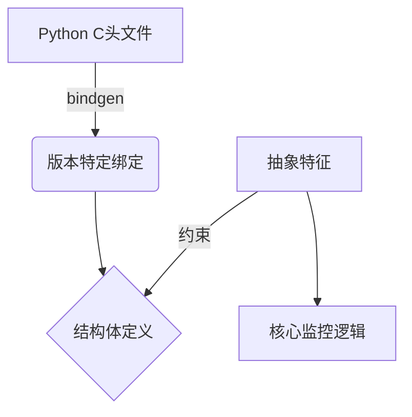

# 第6章：Python解释器抽象层

在[第5章：Python进程监控](05_python_process_spy_.md)中，我们了解到`py-spy`==通过`Python Process Spy`组件实现了对运行中Python程序的深度监控==。

但一个关键问题随之而来：如何让监控逻辑适配**所有Python版本**的内存布局差异？从Python 2.7到3.11，`PyFrameObject`等核心结构的字段偏移和语义已发生多次重大变更。**Python解释器抽象层**正是解决这一难题的终极方案。

## 核心挑战：Python内部结构的版本分化

想象我们需要解析一系列加密报文，但每版发报机都使用不同的加密算法：
- **Python 2.7**：`PyStringObject`表示字符串
- **Python 3.0-3.10**：改用`PyUnicodeObject`并多次优化编码存储
- **Python 3.11+**：引入轻量级`_PyInterpreterFrame`重构调用栈

传统硬编码字段偏移的方式将导致代码迅速腐化。我们需要一种**声明式抽象机制**，既能精确描述各版本内存布局，又能保持核心逻辑的统一性。

(一层不行 那我们就再加一层doge)

## 技术架构

### 双重抽象体系


1. **==版本绑定生成器==**  
   通过`generate_bindings.py`脚本，从CPython源码自动生成Rust结构体定义：
   
   ```python
   # 生成Python 3.11绑定的示例
   subprocess.run([
       "bindgen",
       "python-3.11/Include/frameobject.h",
       "-o", "src/python_bindings/v3_11_0.rs"
   ])
   ```
   
2. **==统一特征约束==**  
   定义跨版本通用接口：
   
   ```rust
   pub trait FrameObject {
       fn code(&self) -> *mut PyCodeObject;
       fn back(&self) -> *mut Self;
   }
   ```

## 技术实现

### 版本适配型结构体
```rust
// Python 3.11帧结构绑定
#[repr(C)]
pub struct _PyInterpreterFrame {
    pub f_func: *mut PyFunctionObject,
    pub f_code: *mut PyCodeObject,  // 代码对象指针
    pub previous: *mut _PyInterpreterFrame, // 调用链回溯
    pub localsplus: [*mut PyObject; 1], // 局部变量
}
```

### 特征实现宏
```rust
macro_rules! impl_frame_trait {
    ($version:ty, $frame:ty) => {
        impl FrameObject for $frame {
            fn code(&self) -> *mut PyCodeObject {
                unsafe { (*self).f_code }
            }
            fn back(&self) -> *mut Self {
                unsafe { (*self).previous }
            }
        }
    };
}
// 为各版本生成实现
impl_frame_trait!(v3_11_0, v3_11_0::_PyInterpreterFrame);
impl_frame_trait!(v2_7_15, v2_7_15::PyFrameObject);
```

### 动态版本调度
```rust
fn get_stack_trace(version: Version) -> Result<StackTrace> {
    match version {
        Version { major: 2, .. } => v2_x::unwind(),
        Version { major: 3, minor: 11.. } => v3_11::unwind(),
        _ => generic_unwind()
    }
}
```

## 版本差异处理策略

| 变更类型        | 处理方案                   | 示例版本          |
| --------------- | -------------------------- | ----------------- |
| 字段偏移变更    | 通过`offset_of!`宏自动计算 | 3.10→3.11帧布局   |
| 字段语义变更    | 特征方法内嵌版本判断       | 字符串存储格式    |
| 结构体拆分/合并 | 定义适配层结构体           | 3.11分拆帧结构    |
| 新增必需字段    | 特征扩展+默认实现          | 3.9新增解释器标识 |

## 性能优化手段

1. **编译期偏移计算**  
   ```rust
   const FRAME_CODE_OFFSET: usize = offset_of!(v3_11_0::_PyInterpreterFrame, f_code);
   ```

2. **内存访问批处理**  
   ```rust
   fn read_frame_batch(addr: usize) -> [u8; 64] {
       process.copy(addr, 64).unwrap_or_default()
   }
   ```

3. **热点路径内联**  
   ```rust
   #[inline(always)]
   fn get_code_ptr(frame: *mut impl FrameObject) -> *mut PyCodeObject {
       unsafe { (*frame).code() }
   }
   ```

## 错误恢复机制

1. **魔数验证**  
   ```rust
   fn validate_frame(ptr: usize) -> bool {
       let magic = process.copy::<u32>(ptr + MAGIC_OFFSET);
       magic == EXPECTED_MAGIC
   }
   ```

2. **版本回退**  
   ```rust
   fn fallback_parse(version: Version) -> Result<Frame> {
       let minor = version.minor.saturating_sub(1);
       try_parse(Version { minor, ..version })
   }
   ```

3. **安全边界检查**  
   ```rust
   if addr > process.memory_map.end {
       return Err("Address out of bounds");
   }
   ```

## 生产环境验证

1. **模糊测试**  
   使用`cargo fuzz`对内存解析器进行随机输入测试

2. **版本矩阵测试**  
   ```bash
   for py in 2.7 3.{8..12}; do
     pytest --python=$py test_memory_layout.py
   done
   ```

3. **崩溃报告**  
   集成`sentry`收集现场内存快照

## 总结

Python解释器抽象层通过**自动生成绑定**与**统一特征约束**的组合，实现了对CPython多版本内存布局的优雅适配。

这种设计使得`py-spy`在添加新版本支持时，==只需关注差异点==（如何实现？）而无需重写核心逻辑。下一章我们将深入[调用栈数据模型](07_stack_trace_data_model_.md)，揭示如何==将原始内存数据转化为丰富的诊断信息==。

[下一章：调用栈数据模型](07_stack_trace_data_model_.md)

