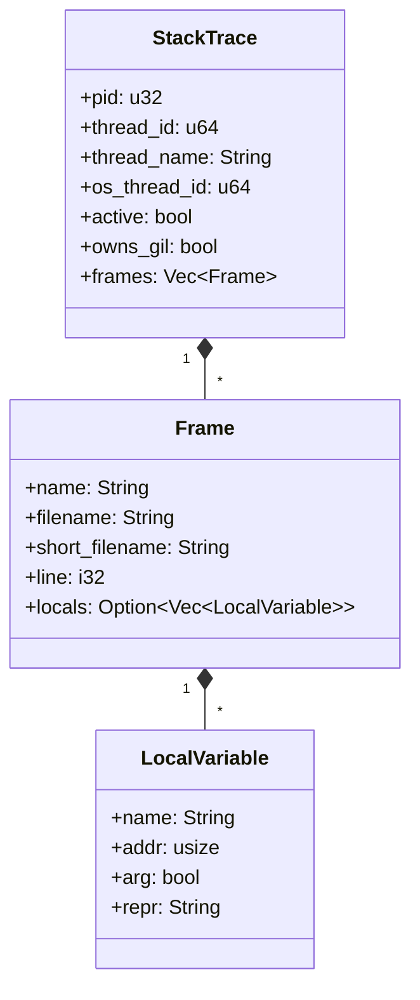

# 第7章：调用栈数据模型

在[第6章：Python解释器抽象层](06_python_interpreter_abstraction_.md)中，我们探讨了`py-spy`如何作为"通用翻译器"动态适配不同Python版本的内存布局。这种机制使得`py-spy`能够正确读取运行中Python程序的内存数据，并理解其含义——无论是`PyThreadState`对象、`PyFrameObject`还是`PyCodeObject`。

现在假设`py-spy`已成功从内存中收集到所有分散的信息：函数名、文件名、行号、线程ID等。如何将这些原始数据组织成有意义且易于处理的格式，以便生成火焰图或文本报告？这正是**调用栈数据模型**的核心作用——它是`py-spy`内部用于结构化性能数据的蓝图，如同将侦查线索系统化整理成案件档案。

## 核心挑战：性能线索的系统化组织

设想您是一名侦探（`py-spy`进程），刚刚收集了大量关于目标（被监控Python程序）的线索：
- 函数名位于内存地址`0xABC`
- 文件名位于`0xDEF`
- 该函数由`0xGHI`处的函数调用
- 线程ID为`12345`
- 该线程持有GIL

**调用栈数据模型**通过以下结构解决这一混乱：

### 核心数据结构


## 关键技术实现

### 数据模型构建流程
```rust
// 简化的调用栈构建逻辑
fn build_stack_trace(thread: &PyThreadState) -> StackTrace {
    let mut frames = vec![];
    let mut frame_ptr = thread.current_frame();

    while !frame_ptr.is_null() {
        let frame = read_frame(frame_ptr);
        frames.push(Frame {
            name: extract_function_name(&frame),
            filename: extract_filename(&frame),
            line: calculate_lineno(&frame),
            locals: if dump_locals { extract_locals(&frame) } else { None }
        });
        frame_ptr = frame.f_back; // 回溯调用链
    }

    StackTrace {
        pid: thread.pid,
        thread_id: thread.id,
        frames,
        ..Default::default()
    }
}
```

### 版本差异处理
通过特征约束实现多版本兼容：
```rust
trait FrameReader {
    fn name(&self) -> String;
    fn filename(&self) -> String;
    fn line(&self) -> i32;
}

// Python 3.11帧解析实现
impl FrameReader for v3_11::Frame {
    fn line(&self) -> i32 {
        self.instr_ptr.offset_from(self.code.start) as i32
    }
}
```

## 生产环境应用

### 诊断数据输出
执行`py-spy dump`时的数据转换：
```bash
Thread 0x1a3e (active+gil): "MainThread"
    function_a (example.py:15)
    function_b (example.py:20)  # locals: x=42
    <module> (example.py:25)
```

对应内存中的数据结构：
```rust
StackTrace {
    thread_id: 0x1a3e,
    thread_name: "MainThread",
    owns_gil: true,
    frames: [
        Frame { name: "function_a", line: 15, .. },
        Frame { 
            name: "function_b", 
            line: 20,
            locals: Some(vec![
                LocalVariable { name: "x", repr: "42" }
            ])
        }
    ]
}
```

## 性能优化策略

1. **零拷贝解析**  
   直接操作原始指针避免中间拷贝：
   ```rust
   unsafe { (*frame_ptr).f_code.as_ref() }
   ```

2. **惰性加载**  
   仅在需要时解析局部变量：
   ```rust
   locals: config.dump_locals.then(|| parse_locals(frame))
   ```

3. **内存预读**  
   批量读取相邻内存区域：
   ```rust
   let chunk = process.copy(frame_ptr, 128)?;
   ```

## 错误恢复机制

1. **残缺栈处理**  
   ```rust
   fn safe_unwind(frame_ptr: *mut Frame) -> Vec<Frame> {
       let mut frames = vec![];
       for _ in 0..MAX_DEPTH {
           if let Ok(frame) = validate_and_read(frame_ptr) {
               frames.push(frame);
               frame_ptr = frame.back;
           } else {
               frames.push(Frame::corrupted());
               break;
           }
       }
       frames
   }
   ```

2. **校验和验证**  
   通过魔数检测内存损坏：
   ```rust
   const FRAME_MAGIC: u32 = 0x0F0B0C0D;
   if frame.magic != FRAME_MAGIC { ... }
   ```

## 总结与展望

调用栈数据模型作为`py-spy`的核心抽象，实现了从原始内存数据到语义化性能报告的转化。但仅监控Python层调用栈可能无法揭示原生扩展或系统调用中的瓶颈，下一章我们将深入[原生栈追踪技术](08_native_stack_tracing_.md)，探索如何突破Python虚拟机的边界获取完整性能画像。

[下一章：原生栈追踪](08_native_stack_tracing_.md)

