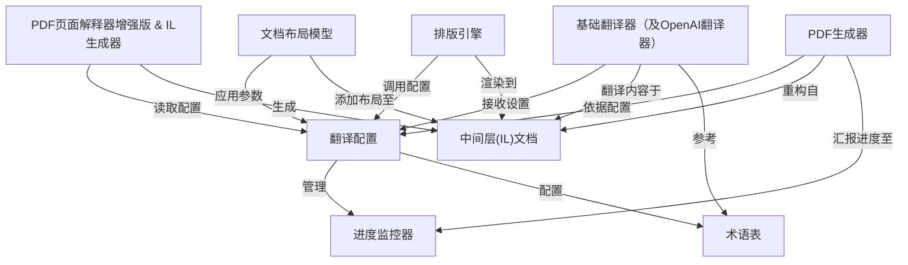
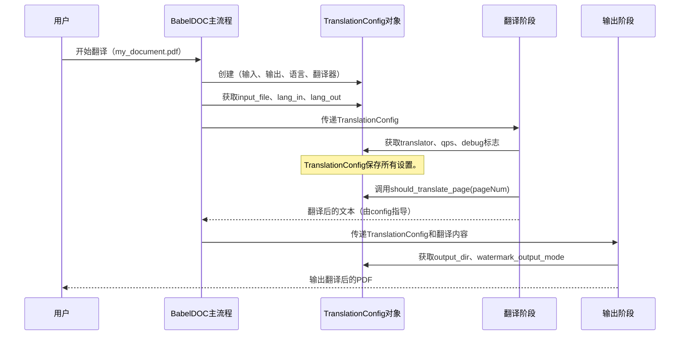

链接：

# docs：BabelDOC

BabelDOC 是一款先进工具，专为**自动翻译PDF文档**而设计，同时严格*保留原始排版与样式*

其工作原理是将复杂PDF文件==解构==为内部可编辑格式，对文本内容进行机器==翻译==，随后*精细==重组==*生成包含翻译内容的文档

## 可视化概览



## 章节

1. [翻译配置](01_translationconfig_.md)
2. [PDF页面解释器增强版 & IL生成器](02_pdfpageinterpreterex___ilcreater_.md)
3. [中间层(IL)文档](03_intermediate_layer__il__document_.md)
4. [术语表](04_glossary_.md)
5. [基础翻译器（及OpenAI翻译器）](05_basetranslator__and_openai_translator__.md)
6. [文档布局模型](06_doclayoutmodel_.md)
7. [排版引擎](07_typesetting_.md)
8. [PDF生成器](08_pdfcreater_.md)
9. [进度监控器](09_progressmonitor_.md)

---
# 第1章：翻译配置

想象一下，我们要烤一个蛋糕。肯定不会直接把原料扔进碗里吧？我们会按照详细的食谱操作

这份食谱会告诉我们需要的原料、每种原料的用量、烤箱的温度设定以及烘烤时长。

在BabelDOC的世界里，当我们需要翻译PDF时，同样需要一份"食谱"。这份食谱正是`TranslationConfig`的职责所在

它是核心蓝图，是"主操作手册"，告诉BabelDOC完美翻译PDF文档所需的一切信息。

## 核心问题：BabelDOC如何知道该做什么？

假设我们有一个英文PDF需要翻译成中文，希望将翻译后的PDF保存到特定文件夹，并且要使用OpenAI这样的强大翻译服务。如何将这些指令传达给BabelDOC？

这正是`TranslationConfig`的用武之地！它==将所有偏好和细节收集到一个整洁的包中==，指导BabelDOC完成翻译过程的每一步。

## 什么是`TranslationConfig`？

可以将`TranslationConfig`视为终极控制面板或PDF翻译的详细项目计划。它包含所有关键信息

例如：

*   **PDF的位置**：输入文件在哪里？
*   **期望输出**：翻译后的PDF应该保存在哪里？需要哪些语言？
*   **翻译引擎**：BabelDOC应该使用哪种翻译服务（例如OpenAI）？
*   **细节调优**：是否需要翻译特定页面？有什么特殊的排版要求？

让我们分解其中的一些关键设置。

### 翻译食谱中的关键设置

`TranslationConfig`存储了==许多参数==，但对于初学者，我们重点关注最重要的几类：

| 类别              | 控制内容                          | 示例参数                         |
| :---------------- | :-------------------------------- | :------------------------------- |
| **输入/输出路径** | BabelDOC查找PDF和保存结果的位置。 | `input_file`                     |
| **语言**          | 翻译的源语言和目标语言。          | `lang_in`, `lang_out`            |
| **翻译服务**      | 执行翻译的AI服务。                | `translator`                     |
| **页面选择**      | 需要翻译PDF的哪些页面（或全部）。 | `pages` (`page_ranges`)          |
| **调试与输出**    | 日志的详细程度以及输出变体。      | `debug`, `watermark_output_mode` |

### 输入/输出路径

这些参数告诉BabelDOC在哪里找到原始PDF以及将翻译后的文件保存在哪里。

*   `input_file`：需要翻译的PDF路径。
*   `output_dir`：保存翻译后PDF的文件夹。
*   `working_dir`：BabelDOC在翻译过程中使用的临时文件夹，通常自动处理。
*   `no_dual`, `no_mono`：标志，用于指定是否不需要双语（原文+译文）或单语（仅译文）PDF。

### 语言

非常简单：
*   `lang_in`：原始PDF的语言（例如，"en"表示英语）。
*   `lang_out`：需要翻译成的目标语言（例如，"zh"表示中文）。

### 翻译服务

这是告诉BabelDOC由"谁"执行实际翻译工作的地方。我们需要传递一个`BaseTranslator`的实例（例如`OpenAITranslator`）给它。
*   `translator`：执行文本翻译的引擎（例如，包含API密钥的OpenAI对象）。
*   `qps`：每秒查询次数——设置BabelDOC向翻译服务发送请求的速度，帮助管理API成本和限制。

### 页面选择

有时我们只需要翻译部分页面，而不是整个文档。
*   `pages`：字符串，例如`"1,3-5"`，用于指定页码或范围。
*   `page_ranges`：`pages`的内部表示（例如`[(1,1), (3,5)]`）。
*   `should_translate_page(page_number)`：一个有用的方法，根据`page_ranges`检查特定页面是否需要翻译。

让我们看一个`should_translate_page`的示例：

```python
# 在TranslationConfig中，解析类似"1,3-5"的`pages`后
# self.page_ranges将是[(1, 1), (3, 5)]

def should_translate_page(self, page_number: int) -> bool:
    # 如果未设置特定页面，则翻译所有页面。
    if not self.page_ranges:
        return True

    # 检查page_number是否在指定的任何范围内。
    for start, end in self.page_ranges:
        if start <= page_number and (end == -1 or page_number <= end):
            return True # 此页面需要翻译！
    return False # 此页面不在任何指定范围内。

# 示例用法：
# config = TranslationConfig(pages="1,3-5", ...)
# config.should_translate_page(1) # True
# config.should_translate_page(2) # False
# config.should_translate_page(4) # True
```
这个方法让BabelDOC轻松决定需要处理哪些页面，跳过不需要的部分。

## 解决我们的用例：使用`TranslationConfig`翻译PDF

要将PDF从英文翻译成中文，保存到特定文件夹并使用OpenAI，我们需要先设置OpenAI翻译器，然后创建`TranslationConfig`。

首先，创建翻译器，告诉它需要处理的语言并提供API密钥。

```python
from babeldoc.translator.translator import OpenAITranslator
from babeldoc.format.pdf.translation_config import TranslationConfig

# 1. 准备翻译引擎（"大脑"）
# 通常我们会从环境变量或安全位置获取API密钥。
openai_api_key = "YOUR_OPENAI_API_KEY"
my_translator = OpenAITranslator(
    lang_in="en",
    lang_out="zh",
    model="gpt-4o-mini", # 经济高效的OpenAI模型
    api_key=openai_api_key,
)

# 这里发生了什么？
# 我们创建了一个知道如何与OpenAI翻译服务对话的对象。
# 它配置了源语言（en）和目标语言（zh），以及密钥。
```

接下来，创建`TranslationConfig`本身，传入所有指令：

```python
from pathlib import Path
# ... (my_translator设置如上) ...

# 2. 创建TranslationConfig（"食谱"）
my_pdf_path = Path("my_document.pdf")
output_folder = Path("./translated_pdfs")

config = TranslationConfig(
    input_file=my_pdf_path,
    output_dir=output_folder,
    lang_in="en",
    lang_out="zh",
    translator=my_translator, # 我们的OpenAI大脑！
    # 可选：启用调试模式以保存更多中间文件供检查
    debug=True,
    # 可选：设置特定的QPS以控制API调用速率
    qps=4,
)

# 这里发生了什么？
# 我们构建了整个翻译计划。
# BabelDOC将知道获取'my_document.pdf'，使用我们的'my_translator'（OpenAI）将其从英文翻译成中文，
# 并将结果保存在'translated_pdfs'文件夹中。
# `debug=True`标志告诉BabelDOC保存额外的文件以供调试。
```

现在，有了这个`config`对象，BabelDOC就拥有了启动翻译过程所需的所有信息！实际的翻译由另一个函数触发（我们将在后续章节中看到），但它完全依赖于这个`TranslationConfig`对象。

## 底层原理：`TranslationConfig`如何指导流程

`TranslationConfig`不仅仅是一个被动的容器；它被BabelDOC的不同部分主动使用。当我们调用主翻译函数时，它会接收这个`config`对象，并将其传递给各个内部阶段。

让我们简化流程的可视化：



可以看到，`TranslationConfig`几乎在每一个主要步骤中都被调用。它就像乐队的指挥，确保每件乐器（或组件）按照乐谱演奏。

### 代码：`TranslationConfig`属性和方法

`TranslationConfig`类定义在`babeldoc/format/pdf/translation_config.py`中。它是一个Python类，将所有配置值保存为属性。

以下是其`__init__`方法中部分属性初始化的简化示例：

```python
# --- 文件: babeldoc/format/pdf/translation_config.py ---
class TranslationConfig:
    def __init__(
        self,
        translator: BaseTranslator, # 提供的翻译器对象
        input_file: str | Path,    # PDF路径
        lang_in: str,              # 源语言代码
        lang_out: str,             # 目标语言代码
        output_dir: str | Path | None = None, # 输出文件夹
        debug: bool = False,       # 调试模式标志
        # ... 其他参数 ...
    ):
        self.translator = translator
        self.input_file = input_file
        self.lang_in = lang_in
        self.lang_out = lang_out
        self.debug = debug

        # 设置输出目录，如果未提供则默认为当前工作目录
        if output_dir is None:
            output_dir = Path.cwd()
        self.output_dir = output_dir

        # 初始化进度监视器（用于跟踪进度）
        self.progress_monitor = None # 稍后由high_level.py设置

        # ... 其他初始化，如working_dir、page_ranges等 ...
```
这个`__init__`方法接收所有指定的参数，并将它们分配给`TranslationConfig`对象的内部变量（如`self.input_file`、`self.lang_out`等）。

随后，BabelDOC的其他部分（如`DetectScannedFile`阶段）通过传递给它们的`translation_config`对象直接访问这些设置。

例如，当BabelDOC检查PDF是否为扫描件时，可能会使用`TranslationConfig`中的`debug`标志：

```python
# --- 文件: babeldoc/format/pdf/document_il/midend/detect_scanned_file.py ---
class DetectScannedFile:
    stage_name = "DetectScannedFile"

    def __init__(self, translation_config: TranslationConfig):
        # translation_config对象被传递到这里！
        self.translation_config = translation_config

    def _save_debug_box_to_page(self, page: il_version_1.Page, similarity: float):
        """保存调试框和文本标签到PDF页面。"""
        # 检查config中是否启用了调试模式
        if not self.translation_config.debug:
            return
        # ... 如果'debug'为True，则继续添加调试信息 ...
```
这段代码展示了`DetectScannedFile`如何使用`TranslationConfig`中的`debug`设置。如果启用了调试模式，它会向PDF页面添加额外的信息；否则，跳过此步骤，保持输出简洁。

可以看到，`TranslationConfig`充当全局上下文，使所有翻译设置对任何需要的组件可用。

## 结论

`TranslationConfig`是BabelDOC中任何翻译的基础起点。它是"大脑"，集中了从基本输入/输出路径和语言到高级调试和服务特定设置的所有指令。通过创建`TranslationConfig`对象，我们实际上为BabelDOC提供了一个完整且详细的翻译计划。

现在，我们了解了如何定义"食谱"，下一步是了解如何收集和准备第一个原料。在下一章中，我们将探索`PDFPageInterpreterEx`和`ILCreater`，它们负责读取PDF并开始构建对其内容的理解，所有这些都遵循我们在`TranslationConfig`中设置的规则。

[下一章：PDFPageInterpreterEx & ILCreater](02_pdfpageinterpreterex___ilcreater_.md)

