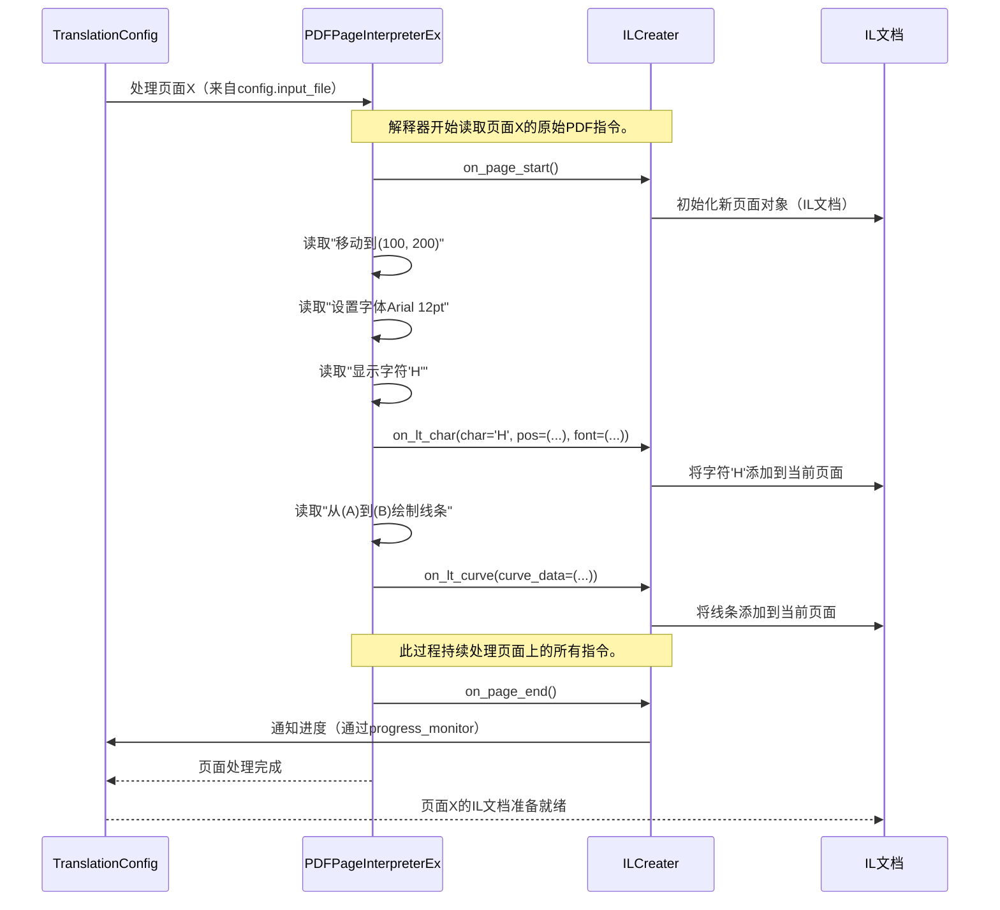

# 第2章：PDF页面解释器增强版 与 中间层文档生成器

在[第1章：翻译配置](01_translationconfig_.md)中，我们了解到`TranslationConfig`如同BabelDOC的"食谱"，告诉它翻译任务的各项参数

- 但BabelDOC究竟如何实际*读取*PDF并理解原始文档中的所有元素？

这正是`PDFPageInterpreterEx`和`ILCreater`这对组合的职责所在

它们是首对动态搭档，负责破解PDF文件并解析其内容。

## 核心问题：解读PDF的隐形指令

想象我们有一份印刷精美的食谱。可以看到列出的原料、步骤说明和配图。但对BabelDOC而言，它不能直接"看到"这些内容，而是需要理解那些告诉打印机（或屏幕）如何绘制每个字符、线条和图像的*底层指令*。

PDF文件并非简单的文本图像，它包含一系列复杂的"绘制指令"，精确描述每个字符的位置、字体、颜色以及线条和图形的绘制方式。

挑战在于：BabelDOC如何高效"读取"这些底层绘制指令，并将其转化为结构化、可理解的内容以供翻译？

## 认识这对搭档：PDFPageInterpreterEx（观察者）与ILCreater（记录员）

这两个组件协同工作来解决这个问题。可以这样理解它们：

*   **`PDFPageInterpreterEx`**：这是我们细致的**PDF观察者**。它逐条解析PDF页面的指令，就像厨师仔细观察食谱制作的每个步骤。它能"看到"一切——每个字符、每条线条、每张图像。

*   **`ILCreater`**：这是我们勤勉的**记录员**。当`PDFPageInterpreterEx`观察并处理每条指令时，`ILCreater`专注记录。它捕捉所有重要细节（实际文本、位置、字体、大小、颜色、图像等），并将其组织成结构化格式——[中间层(IL)文档](03_intermediate_layer__il__document_.md)。

它们的共同任务是将PDF原始的复杂绘制指令转换为文档内容的详细、结构化、机器可读的表示形式。

## 协作流程：从PDF指令到结构化数据

当BabelDOC开始处理PDF页面时：

1.  `TranslationConfig`（我们的食谱）告诉BabelDOC需要处理哪些页面。
2.  `PDFPageInterpreterEx`开始读取该页面的原始PDF内容流。这个流包含一系列指令，例如"移动到位置(X,Y)"、"设置字体为Arial 12pt"、"绘制字符'H'"、"绘制线条"等。
3.  每当`PDFPageInterpreterEx`遇到有意义的指令（如"绘制字符'A'"或"放置图像"），它会立即通知`ILCreater`。
4.  `ILCreater`细致记录这些信息。对于字符，它会记录字符本身、精确坐标、使用的字体、大小、颜色和任何特殊图形样式。对于图像，则记录其位置、大小和引用信息。
5.  这些被捕获和组织的信息成为[中间层(IL)文档](03_intermediate_layer__il__document_.md)的一部分，这是PDF内容的完整结构化数字表示。

此过程会针对每个需要翻译的页面重复执行，逐步构建出完整的[中间层(IL)文档](03_intermediate_layer__il__document_.md)，供BabelDOC后续使用。

### 核心角色一览

| 组件                   | 角色/类比          | 功能                                         |
| :--------------------- | :----------------- | :------------------------------------------- |
| `PDFPageInterpreterEx` | **PDF观察者**      | 读取底层PDF绘制指令，理解其含义。            |
| `ILCreater`            | **细致记录员**     | 监听解释器，捕获细节并组织成结构化数字文档。 |
| `TranslationConfig`    | **总体规划/食谱**  | 指导整个流程，包括需要解析哪些页面。         |
| `IL文档`               | **结构化数字食谱** | 输出结果——PDF内容的详细机器可读表示形式。    |

## 技术实现

让我们深入看看`PDFPageInterpreterEx`和`ILCreater`如何交互。

### 初始协作：处理页面

当BabelDOC需要翻译PDF页面时，它会调用`PDFPageInterpreterEx`进行处理。此时`ILCreater`开始构建[IL文档](03_intermediate_layer__il__document_.md)。



如图所示，`TranslationConfig`启动流程后，`PDFPageInterpreterEx`作为主动读取者，持续向`ILCreater`传递信息，后者则构建结构化的[IL文档](03_intermediate_layer__il__document_.md)。

### 代码：`PDFPageInterpreterEx`如何"观察"

`PDFPageInterpreterEx`是标准PDF解释器的扩展，其主要职责是理解PDF操作符（指令）及其参数。当发现有意义的内容时，它会调用`ILCreater`对象的对应方法。

以下是`PDFPageInterpreterEx`开始处理页面并解释文本显示指令（`TJ`）的简化代码：

```python
# --- 摘自babeldoc/format/pdf/pdfinterp.py的简化片段 ---

class PDFPageInterpreterEx(PDFPageInterpreter):
    def __init__(self, rsrcmgr, device, obj_patch, il_creater: ILCreater) -> None:
        # ... (初始化) ...
        self.il_creater = il_creater # 此处传入ILCreater对象！

    def process_page(self, page: PDFPage) -> None:
        # BabelDOC为每个页面调用此方法。
        # 它设置页面，然后调用render_contents进行主要处理。
        self.il_creater.on_page_start() # 通知ILCreater新页面开始
        self.il_creater.on_page_crop_box(...) # 通知页面边界

        # ... 然后渲染页面内容 ...
        self.render_contents(page.resources, page.contents, ctm=ctm)

        self.il_creater.on_page_end() # 通知ILCreater页面处理完成

    def do_TJ(self, seq: PDFStackT) -> None:
        # 'TJ'是PDF中用于显示文本的操作符。
        # 当PDFPageInterpreterEx看到'TJ'时，调用此方法。
        # 然后委托'device'（即PDFConverterEx）处理渲染。
        # PDFConverterEx随后为每个字符调用il_creater.on_lt_char。
        self.device.render_string(self.textstate, seq, self.ncs, self.graphicstate)
        # ... 更多文本处理逻辑 ...
```
在`process_page`中，可以看到直接调用`self.il_creater.on_page_start()`和`on_page_end()`。`do_TJ`方法（处理文本绘制）将文本传递给`self.device`。在BabelDOC的设置中，这个`device`通常是`PDFConverterEx`，它会进一步将文本分解为单个字符并传递给`ILCreater`。

### 代码：`ILCreater`如何"记录"

`ILCreater`是核心组件，接收所有信息并将其转换为结构化的[IL文档](03_intermediate_layer__il__document_.md)对象。

以下是`ILCreater`接收字符信息的简化视图：

```python
# --- 摘自babeldoc/format/pdf/document_il/frontend/il_creater.py的简化片段 ---
import logging
from babeldoc.format.pdf.document_il import il_version_1 # 我们的IL文档结构
from babeldoc.pdfminer.layout import LTChar # PDF解释器中的字符对象

logger = logging.getLogger(__name__)

class ILCreater:
    def __init__(self, translation_config: TranslationConfig):
        # ... (初始化) ...
        self.docs = il_version_1.Document(page=[]) # 用于保存IL文档
        self.current_page: il_version_1.Page = None # 当前正在构建的页面

    def on_page_start(self):
        # 当新页面开始时由PDFPageInterpreterEx调用
        self.current_page = il_version_1.Page(
            pdf_font=[], pdf_character=[], page_layout=[] # 初始化页面组件
            # ... 其他页面元素 ...
        )
        self.docs.page.append(self.current_page) # 将新页面添加到IL文档

    def on_lt_char(self, char: LTChar):
        # 解释器每发现一个字符就调用此方法！
        if char.aw_font_id is None:
            return # 如果缺少字体ID则跳过

        # 从原始字符对象(LTChar)提取细节
        char_unicode = char.get_text()
        bbox = il_version_1.Box(x=char.bbox[0], y=char.bbox[1], x2=char.bbox[2], y2=char.bbox[3])
        # ... 更多逻辑获取字体、样式、位置等 ...

        # 创建IL文档字符对象
        pdf_char = il_version_1.PdfCharacter(
            box=bbox,
            pdf_character_id=char.cid,
            char_unicode=char_unicode,
            # ... 分配其他收集的细节如字体、样式、位置 ...
        )
        # 将新创建的字符添加到当前页面的字符列表中
        self.current_page.pdf_character.append(pdf_char)

        # 如果TranslationConfig中启用了'show_char_box'，则添加调试框
        if self.translation_config.show_char_box:
            self.current_page.pdf_rectangle.append(...)
```

`on_lt_char`方法至关重要。它接收`LTChar`对象（表示PDF中的单个字符），并细致提取其所有属性：文本、边界框（位置和大小）、字体、图形状态（如颜色或线条粗细）等。随后，它将这些细节封装为`il_version_1.PdfCharacter`对象，并将其添加到`self.current_page.pdf_character`列表中，逐步构建[IL文档](03_intermediate_layer__il__document_.md)。

`ILCreater`还有类似的`on_...`方法用于图像（`on_xobj_form`）、曲线（`on_lt_curve`）和其他PDF元素，确保每个细节都被捕获。

## 结论

`PDFPageInterpreterEx`和`ILCreater`是理解PDF的基础组件。它们如同BabelDOC的"眼睛"和"耳朵"，细致地将PDF底层的打印指令转换为结构化且语义丰富的[中间层(IL)文档](03_intermediate_layer__il__document_.md)。这份IL文档是后续翻译流程的关键基础。

现在我们已经了解PDF如何被读取并处理为结构化格式，下一步自然要探索这个结构化格式——"中间层(IL)文档"本身的具体形态。

[下一章：中间层(IL)文档](03_intermediate_layer__il__document_.md)

