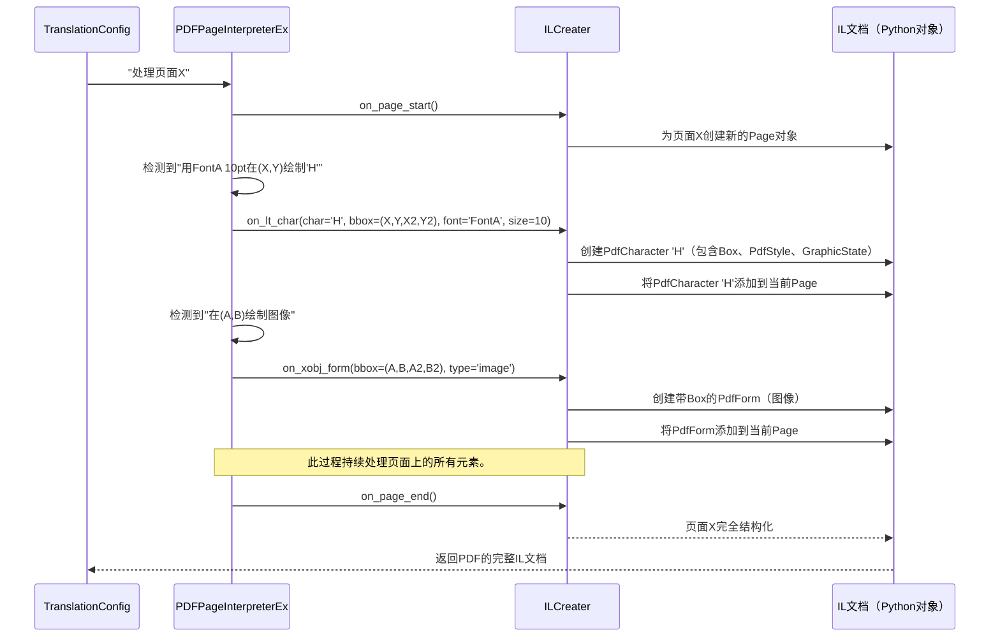

# 第3章：中间层(IL)文档

在[第2章：PDF页面解释器增强版与中间层文档生成器](02_pdfpageinterpreterex___ilcreater_.md)中，我们了解到BabelDOC的`PDFPageInterpreterEx`如同细致的观察者，读取PDF底层的"绘制指令"

同时，`ILCreater`作为勤勉的记录员，捕获所有这些细节。但这些"记录"究竟是什么？它们又是如何组织的？

本章将介绍**中间层(IL)文档**，这是`ILCreater`生成的高度结构化且详尽的输出。它是BabelDOC用于真正理解、操作并最终翻译PDF的核心蓝图。

## 核心问题：PDF如同拼图，而非书籍

想象我们有一张精美的海报。可以看到文字、图片和色彩。但在内部，PDF并非以"这是一个段落"或"这是一张图片"的形式存储。相反，它是一系列指令，例如："在(100, 200)处用Arial 12pt绘制'H'"，接着"在(105, 200)处用Arial 12pt绘制'e'"，以此类推。图像仅仅是"将这块像素放在这里"。PDF本身没有"含义"或"结构"来告诉BabelDOC这是标题、段落还是表格。

**BabelDOC面临的挑战是：**如何将这些原始、零散的绘制指令转换为对页面内容有意义且组织良好的理解？如何判断哪些文本属于同一部分，哪些是图像或公式，从而在翻译和重新排列时不破坏整体布局？

## 解决方案：中间层(IL)文档

**中间层(IL)文档**是BabelDOC的巧妙解决方案。可以将其视为每页PDF的详细注释蓝图。它将复杂的PDF绘制指令转换为结构化的、机器可读的数据。

IL文档不仅知道"在这里绘制'H'"，还知道：

*   "在精确的位置有一个字符'H'。"
*   "它使用了特定的字体和大小。"
*   "它属于从某处开始到某处结束的文本块。"
*   "这是一张图像，位于这些坐标。"
*   "这是一个矩形，用于边框。"

这种结构化格式至关重要，因为它使得以下操作更加容易：

1.  **操作内容**：修改文本、移动元素。
2.  **准确翻译**：理解上下文以优化翻译。
3.  **重建布局**：逐页重建翻译后的PDF，同时保留原始格式等重要信息。

这就像将复杂模型（PDF绘制指令）中的所有独立乐高积木拆解，然后创建一份清晰的分步说明书（IL文档），不仅列出每块积木，还说明其位置、颜色以及在整体结构中的作用。

## IL文档的内容：蓝图的细节

IL文档是一个由Python对象（特别是数据类）构成的层次结构，以高度组织化的方式表示整个PDF的内容。以下是其主要组件：

| 组件           | 表示内容                                | 类比                                             |
| :------------- | :-------------------------------------- | :----------------------------------------------- |
| `Document`     | 整个PDF文件。                           | 完整的乐高说明书。                               |
| `Page`         | PDF中的单页。                           | 说明书中的一页。                                 |
| `PdfCharacter` | 单个字符（如'A'、'!'、'5'）。           | 特定的乐高积木："红色2x2积木"。                  |
| `Box`          | 元素的确切位置和大小（边界框）。        | 放置乐高积木的坐标。                             |
| `PdfStyle`     | 文本的字体、大小和其他视觉样式。        | 说明书页面上文本的样式。                         |
| `GraphicState` | 原始PDF的渲染参数（颜色、线条宽度等）。 | 乐高积木的颜色或纹理。                           |
| `PdfForm`      | 图像、嵌入图形等的通用容器。            | 预组装的小乐高模型（如一棵树）。                 |
| `PdfCurve`     | 线条、圆形或其他矢量形状。              | 特殊的弯曲乐高积木。                             |
| `PdfRectangle` | 矩形形状。                              | 矩形平板乐高积木。                               |
| `PdfFont`      | 页面上使用的特定字体的详细信息。        | 特定类型乐高积木的信息（如"这是圆形光滑积木"）。 |

这种结构意味着，当BabelDOC处理PDF时，它不是在处理原始字节，而是在处理明确定义页面上每个可见元素及其属性和位置的Python对象。

## IL文档如何解决我们的用例

让我们重新审视问题：将PDF从英文翻译为中文。有了IL文档，这项任务变得可行。

BabelDOC无需费力识别哪些"绘制指令"构成英文句子并替换为中文指令（这几乎不可能！），而是可以：

1.  识别构成英文单词或句子的`PdfCharacter`对象序列。
2.  从这些对象中提取`char_unicode`（实际文本）。
3.  将此文本发送给翻译服务（由[第1章：翻译配置](01_translationconfig_.md)指导）。
4.  接收翻译后的中文文本。
5.  为中文文本创建*新的*`PdfCharacter`对象，并将其放置在适当位置（后续章节中的`DocLayoutModel`和`Typesetting`将发挥作用！）。
6.  确保`PdfForm`对象（图像）和`PdfCurve`对象（线条）相对于新文本保留其原始位置。

IL文档是BabelDOC内部的通用语言，使系统的不同部分能够无缝协作。

## 技术实现：作为Python对象的IL文档

IL文档最初并非独立文件，而是由`ILCreater`创建的Python对象集合。

当`ILCreater`处理PDF页面时，它实际上是在构建这个`Document`对象，并用包含`PdfCharacter`、`PdfForm`、`PdfCurve`等列表的`Page`对象填充它。

以下是简化流程：



BabelDOC中的`il_version_1.py`文件定义了所有这些Python`dataclass`对象。这些数据类是保存结构化数据的对象的蓝图。

例如，`PdfCharacter`的定义如下：

```python
# --- 摘自babeldoc/format/pdf/document_il/il_version_1.py的简化片段 ---
@dataclass(slots=True)
class PdfCharacter:
    class Meta:
        name = "pdfCharacter"

    pdf_style: PdfStyle | None = field(...) # 包含font_id、font_size、graphic_state
    box: Box | None = field(...)             # 字符的位置和大小
    char_unicode: str | None = field(...)    # 实际文本字符（如"H"）
    # ... 其他属性如vertical、advance、xobj_id、render_order ...
```
此数据类定义了PDF中*每个字符*在IL文档中存储的信息。包括其视觉样式（`pdf_style`）、位置（`box`）和实际Unicode字符（`char_unicode`）。

随后，`ILCreater`使用这些定义构建实际对象。当`ILCreater`处理字符时，其`on_lt_char`方法执行以下操作：

```python
# --- 摘自babeldoc/format/pdf/document_il/frontend/il_creater.py的简化片段 ---
# ...
class ILCreater:
    def __init__(self, translation_config: TranslationConfig):
        # ... 初始化一个Document对象以保存所有内容 ...
        self.docs = il_version_1.Document(page=[])
        self.current_page: il_version_1.Page = None # 当前页面的占位符

    def on_lt_char(self, char: LTChar):
        # 1. 从原始PDF字符对象（'char'）收集所有细节
        char_unicode = char.get_text()
        bbox = il_version_1.Box(x=char.bbox[0], y=char.bbox[1], x2=char.bbox[2], y2=char.bbox[3])
        gs = self.create_graphic_state(char.graphicstate) # 创建GraphicState对象

        pdf_style = il_version_1.PdfStyle(
            font_id=char.aw_font_id,
            font_size=char.size,
            graphic_state=gs,
        )

        # 2. 使用这些细节创建PdfCharacter对象
        pdf_char = il_version_1.PdfCharacter(
            box=bbox,
            char_unicode=char_unicode,
            pdf_style=pdf_style,
            # ... 分配其他收集的细节 ...
        )

        # 3. 将新创建的PdfCharacter对象添加到IL文档的当前页面
        self.current_page.pdf_character.append(pdf_char)

        # ... （可选的调试信息） ...
```
此代码片段清晰地展示了原始字符数据（`LTChar`）如何转换为结构化的`il_version_1.PdfCharacter`对象，包括其边界框、Unicode值和样式信息，随后添加到整体`Document`结构中。

处理完整个PDF后，`ILCreater`在内存中拥有一个完整的`il_version_1.Document`对象。此对象可以传递给BabelDOC的其他阶段，或通过`XMLConverter`保存为XML或JSON文件以供后续检查或处理。

```python
# --- 摘自BabelDOC主流程的简化示例 ---
from babeldoc.format.pdf.document_il import il_version_1
from babeldoc.format.pdf.document_il.xml_converter import XMLConverter

# 假设'il_document_object'是ILCreater创建的完整il_version_1.Document
# （处理完所有页面后，此对象在内存中）

converter = XMLConverter()

# 可以将此结构化文档保存到文件：
# 用于调试或稍后恢复翻译。
output_xml_path = "my_translated_document_il.xml"
converter.write_xml(il_document_object, output_xml_path)

# 也可以稍后加载：
loaded_il_document = converter.read_xml(output_xml_path)

# 甚至可以转换为人类可读的JSON格式：
json_output = converter.to_json(il_document_object)
print(json_output[:500]) # 打印前500个字符以查看结构
```
`XMLConverter`提供了将IL文档保存和加载为XML或JSON格式的实用函数，这对于调试或理解PDF页面的内部结构非常有帮助。例如，`PdfCharacter`在JSON中的一小段示例：

```json
{
  "page": [
    {
      "pdf_character": [
        {
          "advance": 5.556,
          "box": {
            "x": 100.0,
            "x2": 105.556,
            "y": 700.0,
            "y2": 710.0
          },
          "char_unicode": "H",
          "pdf_style": {
            "font_id": "F1",
            "font_size": 10.0,
            "graphic_state": {
              "passthroughPerCharInstruction": "0 0 0 rg 0 0 0 RG"
            }
          }
        }
      ]
    }
  ]
}
```
这清晰地展示了每个字符如何用其边界框、Unicode值、字体ID、字体大小和图形状态表示——与原始PDF指令截然不同！

## 结论

中间层(IL)文档是BabelDOC理解PDF的核心。它将混乱的底层PDF数据转换为清晰、可操作的Python对象。通过拥有每页的详细蓝图，BabelDOC能够准确提取文本、保留布局，并为稳健的翻译和后续排版做好准备。

现在我们已经了解了BabelDOC构建和使用的核心结构，让我们简要定义一些在BabelDOC生态系统中会遇到的关键术语。下一章将探索[术语表](04_glossary_.md)。

[下一章：术语表](04_glossary_.md)

