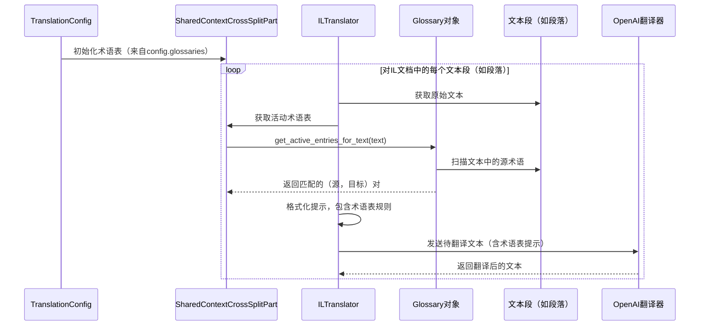

# 第4章：术语表

在[第3章：中间层(IL)文档](03_intermediate_layer__il__document_.md)中，我们了解到BabelDOC如何将PDF细致解构为结构化的Python对象"蓝图"

这种IL文档是理解内容的强大工具。但如果某些特定词汇或短语需要始终以特定方式翻译，而无论通用翻译引擎如何建议，该怎么办？

## 核心问题：当标准翻译不够用时

假设我们正在翻译一份关于新产品"AquaFlow Pro"的技术手册。标准翻译服务可能会将"AquaFlow Pro"翻译为另一种语言中的"Water Flow Professional"。虽然语法正确，但这完全忽略了"AquaFlow Pro"是一个品牌名称，可能应保持不翻译或使用其官方指定译名。

类似情况还包括法律文件中的专业术语、公司名称、缩写（如"BabelDOC"本身！）或在特定行业中具有精确含义的词汇。如果翻译服务试图"创造性"地翻译这些内容，可能会导致混淆、错误和意义丢失。

**挑战在于：**如何告诉BabelDOC对某些术语使用*我们*的首选翻译，以确保一致性和准确性，特别是针对领域特定的内容？

## 解决方案：BabelDOC的术语表

这正是**术语表**抽象功能的用武之地！可以将术语表视为BabelDOC在将文本发送给主翻译引擎之前参考的专属定制词典。它就像一份关键术语的"特殊指令"列表。

当BabelDOC遇到术语表中的单词或短语时，它甚至不会询问主翻译服务，而是直接应用预定义的翻译，确保这些术语始终按照我们的意图准确翻译。这显著提高了技术、品牌或领域特定文档的翻译准确性和一致性。

## 什么是术语表？概念解析

BabelDOC中的术语表是一组自定义翻译规则，围绕两个核心概念构建：

1.  **`GlossaryEntry`**：这是一条具体的翻译规则，包含原始"源"术语及其期望的"目标"翻译。
    *   **示例**：`source="BabelDOC"`, `target="巴贝尔文档"`（BabelDOC的官方中文译名）。

2.  **`Glossary`**：这是多个`GlossaryEntry`项的集合。我们可以为不同主题或项目创建多个术语表，例如"IT术语"、"法律术语"和"产品名称"。

BabelDOC处理这些术语表，在主翻译之前高效查找并替换文档中的术语。它甚至能智能处理变体（如"AI"与"ai"），以确保更广泛的匹配。

## 如何使用术语表：解决我们的用例

假设我们需要翻译一份文档，其中"BabelDOC"应始终译为"巴贝尔文档"，"API"在英译中时应始终译为"应用程序接口"（Application Programming Interface）。

以下是BabelDOC中准备和使用术语表的步骤：

### 步骤1：创建术语表条目

首先使用`GlossaryEntry`对象定义具体的翻译对。

```python
from babeldoc.glossary import GlossaryEntry

# 定义具体翻译规则
entry_babeldoc = GlossaryEntry(
    source="BabelDOC",
    target="巴贝尔文档",
    target_language="zh" # 可选：指定此条目的目标语言
)

entry_api = GlossaryEntry(
    source="API",
    target="应用程序接口",
    target_language="zh"
)

# 发生了什么？
# 我们创建了两条规则。每条规则表示：
# "当看到'BabelDOC'（英文）时，替换为'巴贝尔文档'（中文）。"
# "当看到'API'（英文）时，替换为'应用程序接口'（中文）。"
```

### 步骤2：创建术语表集合

接下来，将这些条目分组到一个`Glossary`对象中，并为其命名。

```python
from babeldoc.glossary import Glossary
# ...（步骤1中的GlossaryEntry定义）...

# 将条目收集到术语表中
my_tech_glossary = Glossary(
    name="技术术语",
    entries=[entry_babeldoc, entry_api]
)

# 发生了什么？
# 我们现在有了一个命名集合，包含特定的翻译规则。
# 这使得管理术语组更加方便。
```

### 步骤3：从CSV文件加载（可选但强大）

对于大型术语表，手动创建条目不切实际。BabelDOC可以直接从CSV文件加载术语表！这是管理术语的常见且高效方式。

假设有一个名为`my_terms.csv`的文件，内容如下：

```csv
source,target,tgt_lng
BabelDOC,巴贝尔文档,zh
API,应用程序接口,zh
Database,数据库,zh
Frontend,前端,zh
```

可以直接加载：

```python
from babeldoc.glossary import Glossary
from pathlib import Path

# 创建演示用的CSV文件
csv_content = """source,target,tgt_lng
BabelDOC,巴贝尔文档,zh
API,应用程序接口,zh
Database,数据库,zh
Frontend,前端,zh
"""
csv_file_path = Path("my_terms.csv")
with open(csv_file_path, "w", encoding="utf-8") as f:
    f.write(csv_content)

# 从CSV文件加载术语表
loaded_glossary = Glossary.from_csv(csv_file_path, target_lang_out="zh")

print(f"已加载术语表'{loaded_glossary.name}'，包含{len(loaded_glossary.entries)}个条目。")
# 输出：已加载术语表'my_terms'，包含4个条目。

# 发生了什么？
# BabelDOC读取CSV文件，为每行创建GlossaryEntry对象，
# 并将其编译为名为"my_terms"（来自文件名）的新Glossary对象。
# 它还筛选了目标语言为"zh"的条目。
```

### 步骤4：将术语表传递给`TranslationConfig`

最后，将`Glossary`对象（或其列表）提供给`TranslationConfig`（来自[第1章：翻译配置](01_translationconfig_.md)的"食谱"）。

```python
from babeldoc.translator.translator import OpenAITranslator
from babeldoc.format.pdf.translation_config import TranslationConfig
from babeldoc.docvision.doclayout import DocLayoutModel
from pathlib import Path

# 假设'my_document.pdf'存在且loaded_glossary已创建

# 1. 准备翻译引擎（"大脑"）
openai_api_key = "YOUR_OPENAI_API_KEY"
my_translator = OpenAITranslator(
    lang_in="en",
    lang_out="zh",
    model="gpt-4o-mini",
    api_key=openai_api_key,
)

# 2. 获取DocLayoutModel实例（第6章介绍）
doc_layout_model = DocLayoutModel.load_available()

# 3. 创建TranslationConfig，包括术语表
config = TranslationConfig(
    input_file=Path("my_document.pdf"),
    output_dir=Path("./translated_pdfs"),
    lang_in="en",
    lang_out="zh",
    translator=my_translator,
    doc_layout_model=doc_layout_model, # 必需
    glossaries=[loaded_glossary], # <--- 在此添加术语表！
    debug=True,
    qps=4,
)

# 发生了什么？
# 现在，当BabelDOC处理'my_document.pdf'进行翻译时，
# 它将首先检查'loaded_glossary'。如果找到"BabelDOC"，
# 会在将文本发送给OpenAI之前替换为"巴贝尔文档"。
# 这确保了我们指定术语的一致性。
```

通过在`TranslationConfig`中添加`glossaries=[loaded_glossary]`，BabelDOC自动将自定义规则纳入翻译流程。

## 技术实现：术语表的使用方式

当BabelDOC开始翻译文档时，`ILTranslator`（执行实际文本翻译的组件，将在[第5章：基础翻译器（及OpenAI翻译器）](05_basetranslator__and_openai_translator__.md)中详细介绍）负责与我们提供的术语表交互。

以下是术语表在翻译过程中的简化流程：



### 代码：`Glossary`类

`Glossary`类（定义于`babeldoc/glossary.py`）专为高效术语匹配设计。

`Glossary`类的关键部分：

*   **`_build_regex_and_lookup()`**：此方法在初始化时调用。它获取所有`GlossaryEntry`项，并使用`hyperscan`将其编译为高度优化的搜索模式。`hyperscan`是一个强大的正则表达式匹配库，可快速在大型文本中查找多种模式，使术语查找极其迅速。
*   **`get_active_entries_for_text(self, text: str)`**：这是`ILTranslator`调用的方法。它使用预编译的`hyperscan`数据库扫描输入文本，快速识别所有匹配的源术语，并返回其对应的目标翻译。

以下是`Glossary`类的简化核心功能：

```python
# --- 摘自babeldoc/glossary.py的简化片段 ---
import re
import hyperscan # 高度优化的正则表达式库
# ... 其他导入 ...

class Glossary:
    def __init__(self, name: str, entries: list['GlossaryEntry']):
        self.name = name
        self.entries = entries # GlossaryEntry对象列表
        self.id_lookup: list[tuple[str, str]] = [] # 存储（源，目标）对
        self.hs_dbs: list[hyperscan.Database] | None = None # 编译的hyperscan数据库
        self._build_regex_and_lookup() # 构建高效搜索索引

    def _build_regex_and_lookup(self):
        # 此方法准备条目以实现超快速搜索
        # 为Hyperscan创建模式，转义特殊正则字符
        hs_patterns = []
        for idx, entry in enumerate(self.entries):
            # 存储原始源/目标以供后续查找
            self.id_lookup.append((entry.source, entry.target))
            # 转义源术语以在正则中使用并添加到模式
            hs_patterns.append((re.escape(entry.source).encode("utf-8"), idx))

        if hs_patterns:
            # 将这些模式编译为Hyperscan数据库以快速扫描
            hs_db = hyperscan.Database()
            hs_db.compile(
                expressions=[p[0] for p in hs_patterns], # 仅正则模式
                ids=[p[1] for p in hs_patterns],         # 条目索引
                # 不区分大小写和每术语单次匹配的标志
                flags=hyperscan.HS_FLAG_CASELESS | hyperscan.HS_FLAG_SINGLEMATCH,
            )
            self.hs_dbs = [hs_db] # 存储编译后的数据库

    def get_active_entries_for_text(self, text: str) -> list[tuple[str, str]]:
        if not self.hs_dbs or not text:
            return []

        active_entries = []
        def on_match(idx: int, _from: int, _to: int, _flags: int, _context=None):
            # 当hyperscan找到匹配时调用此函数
            # 使用'idx'查找原始（源，目标）对
            active_entries.append(self.id_lookup[idx])
            return False # 继续扫描其他匹配

        # 遍历所有hyperscan数据库（条目多时可能有多个）
        for hs_db in self.hs_dbs:
            scratch = hyperscan.Scratch(hs_db)
            hs_db.scan(text.encode("utf-8"), on_match, scratch=scratch)
        return active_entries

# 发生了什么？
# `Glossary`类高效存储自定义翻译规则。
# 当BabelDOC需要检查一段文本时，`get_active_entries_for_text`
# 使用超快的`hyperscan`引擎查找所有匹配术语表条目的术语。
# 这确保即使术语表非常大，查找也非常迅速。
```

### 代码：`ILTranslator`如何使用术语表

`ILTranslator`（定义于`babeldoc/format/pdf/document_il/midend/il_translator.py`）是使用术语表的组件。在将段落发送给主翻译引擎（如OpenAI）之前，它会准备一个详细的提示，包含所有匹配的术语表术语。

```python
# --- 摘自babeldoc/format/pdf/document_il/midend/il_translator.py的简化片段 ---
# ...（导入和类定义）...

class ILTranslator:
    def __init__(
        self,
        translate_engine: BaseTranslator,
        translation_config: TranslationConfig,
        # ...
    ):
        # ...（初始化）...
        self.translation_config = translation_config
        # 在初始化时缓存术语表以便快速访问
        self._cached_glossaries = (
            self.translation_config.shared_context_cross_split_part.get_glossaries_for_translation(
                self.translation_config.auto_extract_glossary
            )
        )

    def generate_prompt_for_llm(
        self,
        text: str, # 待翻译的文本段（如段落）
        # ... 其他参数 ...
    ):
        # ...（翻译规则提示部分等）...

        active_glossary_markdown_blocks: list[str] = []
        # 使用配置中的缓存术语表
        if self._cached_glossaries:
            for glossary in self._cached_glossaries:
                # 要求术语表在当前文本中查找匹配术语
                active_entries = glossary.get_active_entries_for_text(text)

                if active_entries:
                    current_glossary_md_entries: list[str] = []
                    for original_source, target_text in sorted(active_entries):
                        current_glossary_md_entries.append(
                            f"| {original_source} | {target_text} |"
                        )

                    if current_glossary_md_entries:
                        # 将匹配术语格式化为Markdown表格以用于LLM提示
                        glossary_table_md = (
                            f"### 术语表: {glossary.name}\n\n"
                            "| 源术语 | 目标术语 |\n"
                            "|-------------|-------------|\n"
                            + "\n".join(current_glossary_md_entries)
                        )
                        active_glossary_markdown_blocks.append(glossary_table_md)

        # 如果找到任何匹配的术语表条目，将其添加到LLM的提示中
        if active_glossary_markdown_blocks:
            llm_input.append(
                # 严格遵循术语表的指令
                "你必须严格遵循以下术语表。如果文本中出现表中的源术语，请在翻译中使用对应的目标术语："
            )
            for md_block in active_glossary_markdown_blocks:
                llm_input.append(f"\n{md_block}\n")

        # ...（提示的其余部分）...
        final_input = "\n".join(llm_input).strip()
        return final_input

# 发生了什么？
# `ILTranslator`获取当前文本段（`text`）。
# 然后要求每个活动的`Glossary`对象查找该文本中的匹配术语。
# 找到的任何匹配术语都会被格式化为清晰的Markdown表格，
# 并直接包含在发送给LLM（如OpenAI）的提示中。
# 这样，LLM会明确知道如何翻译这些特定术语，
# 确保输出的一致性和准确性。
```
这表明BabelDOC不仅"替换"术语，还智能地告知翻译引擎所需的翻译，通常能提高输出的整体质量和一致性。

## 结论

术语表功能是BabelDOC中的强大工具，允许我们对特定术语和短语施加自定义翻译规则

通过提供"专属词典"，我们确保了一致性和准确性，特别是对技术、品牌或领域特定的文档至关重要。它通过高效识别文档中的术语，并明确指示翻译引擎其目标翻译来工作。

现在我们已经了解了如何自定义术语翻译，接下来让我们深入探讨执行实际翻译的核心组件：`BaseTranslator`及其具体实现，如`OpenAITranslator`。

[下一章：基础翻译器（及OpenAI翻译器）](05_basetranslator__and_openai_translator__.md)

