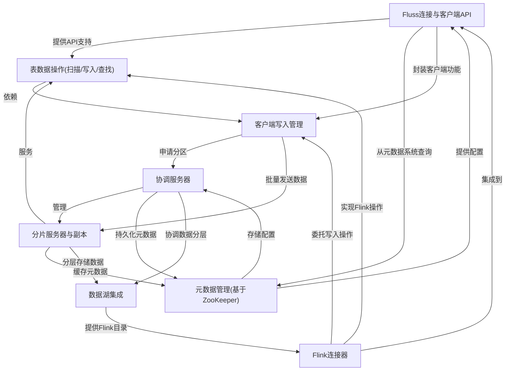

链接：

# docs：Fluss分布式数据系统

Fluss是一个专为**实时数据处理与存储**设计的分布式数据系统。它提供**客户端API**供应用程序交互数据，由中央*协调服务器(Coordinator Server)*管理，并通过*分片服务器(Tablet Server)*分布式存储数据副本。Fluss支持*数据操作*如扫描、写入和记录查找，并提供与Iceberg、Flink等*数据湖生态集成*能力。

## 系统架构

## 章节

1. [Fluss连接与客户端API](01_fluss_connection___client_api_.md)
2. [表数据操作(扫描/写入/查找)](02_table_data_operations__scan__write__lookup__.md)
3. [客户端写入管理](03_client_side_write_management_.md)
4. [Flink连接器](04_flink_connector_.md)
5. [协调服务器](05_coordinator_server_.md)
6. [分片服务器与副本](06_tablet_server___replicas_.md)
7. [元数据管理(基于ZooKeeper)](07_metadata_management__zookeeper_backed__.md)
8. [数据湖集成](08_data_lake_integration_.md)

