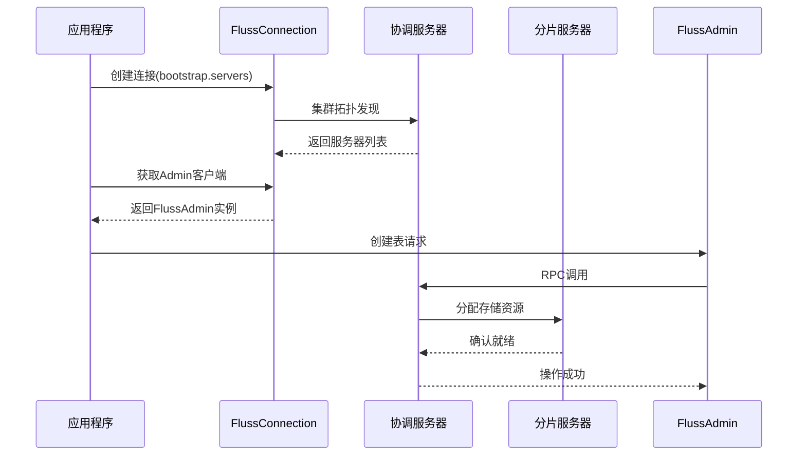

# 第1章：Fluss连接与客户端API

欢迎来到Fluss

如果您需要高效存储和管理海量数据，这里正是您的最佳选择。本章将介绍应用程序与Fluss集群通信的核心方式——`Fluss连接与客户端API`。

## 分布式系统通信挑战

Fluss作为*分布式数据系统*，由多台服务器协同工作。直接与每台服务器建立连接并定位数据将带来巨大复杂度：

**本章目标**：学习如何建立到==Fluss集群的稳定连接==，并获取不同功能的"工具"（客户端）来执行建表、读写数据等操作。

## 解决方案：Fluss连接与客户端体系

Fluss通过智能的`Connection`对象作为应用程序访问集群的统一入口。该连接可自动处理服务发现、网络管理等底层复杂性，同时提供两类核心客户端：

1. **`Admin`管理客户端**：执行集群管理操作（创建数据库/表、查看元数据等）
2. **`Table`表客户端**：针对特定表进行数据操作（扫描/写入/查询等）

### 基础使用示例

以下代码展示从建立连接到创建表的完整流程：

```java
import org.apache.fluss.config.Configuration;
import org.apache.fluss.client.Connection;
import org.apache.fluss.client.ConnectionFactory;
import org.apache.fluss.client.admin.Admin;
import org.apache.fluss.metadata.*;

// 1. 配置集群接入点
Configuration conf = new Configuration();
conf.setString("bootstrap.servers", "localhost:9092"); // 引导服务器地址

// 2. 创建连接（建议全局复用）
try (Connection connection = ConnectionFactory.createConnection(conf)) {
    
    // 3. 获取管理客户端
    Admin adminClient = connection.getAdmin();

    // 4. 定义表结构
    TablePath tablePath = TablePath.of("test_db", "user_table");
    Schema schema = Schema.newBuilder()
                    .column(Column.of("user_id", DataTypes.STRING()))
                    .column(Column.of("user_name", DataTypes.STRING()))
                    .primaryKey("user_id")
                    .build();
    
    // 5. 执行建表操作
    adminClient.createTable(tablePath, TableDescriptor.of(schema), true).get();
    System.out.println("表创建成功");

    // 6. 获取表客户端准备数据操作
    Table userTable = connection.getTable(tablePath);
    // 后续数据操作见下章...

} catch (Exception e) {
    e.printStackTrace();
}
```

### 连接机制

#### 核心组件协作流程



#### 关键源码

**连接工厂(ConnectionFactory)**：
```java
public class ConnectionFactory {
    public static Connection createConnection(Configuration conf) {
        return new FlussConnection(conf); // 返回线程安全的连接实例
    }
}
```

**连接核心实现(FlussConnection)**：
```java
public class FlussConnection implements Connection {
    private final RpcClient rpcClient; // RPC通信客户端
    private final MetadataUpdater metadataUpdater; // 元数据管理器

    public Admin getAdmin() {
        return new FlussAdmin(rpcClient, metadataUpdater); 
    }

    public Table getTable(TablePath path) {
        metadataUpdater.updateTableMetadata(path); // 刷新元数据
        return new FlussTable(this, path); 
    }
}
```

**管理客户端(FlussAdmin)**：
```java
public class FlussAdmin implements Admin {
    public CompletableFuture<Void> createTable(TablePath path, 
                                           TableDescriptor desc, 
                                           boolean ignoreExists) {
        // 构造RPC请求并发送到协调服务器
        return rpcClient.createTableAsync(path, desc);
    }
}
```

## 建议

1. **连接管理**：
   - 单个应用维护一个全局`Connection`实例
   - 使用try-with-resources确保连接关闭
   - 避免频繁创建/销毁连接

2. **客户端使用**：
   - `Admin`客户端适合低频管理操作
   - `Table`客户端需按表获取，建议缓存复用
   - 多线程环境应为每个线程创建独立客户端实例

3. **异常处理**：
   - 捕获`RpcException`处理网络问题
   - 监控`ConnectionStateListener`连接状态事件

## 总结

Fluss连接体系通过：
- **统一接入点**：简化分布式集群访问复杂度
- **职责分离**：管理客户端与数据客户端各司其职
- **资源优化**：内置连接池与元数据缓存机制
为后续数据操作奠定基础。

接下来我们将深入[表数据操作](02_table_data_operations__scan__write__lookup_.md)的具体实现。

