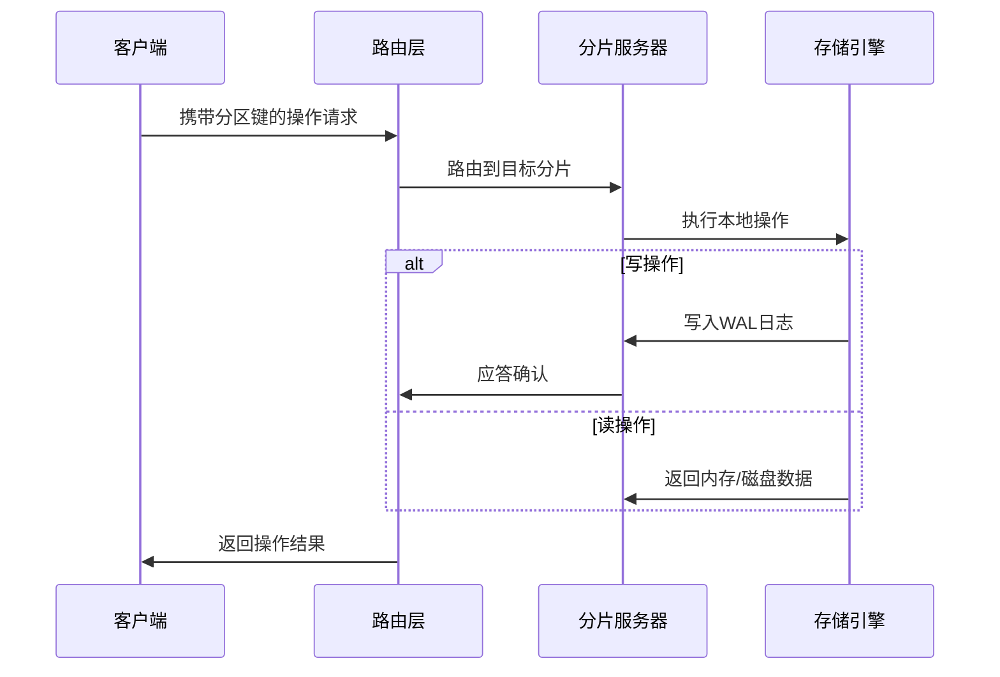

# 第2章：表数据操作（扫描/写入/查找）

在[第1章：Fluss连接与客户端API](01_fluss_connection___client_api_.md)中，我们掌握了如何获取表客户端。本章将深入讲解三大核心数据操作：

## 数据操作全景图

| 操作类型 | 适用场景           | 典型API调用链                          | 核心特点               |
| -------- | ------------------ | -------------------------------------- | ---------------------- |
| **写入** | 新增/修改数据      | `table.newUpsert().createWriter()`     | 支持批量化与事务性写入 |
| **查找** | 按主键快速检索     | `table.newLookup().createLookuper()`   | 亚毫秒级延迟           |
| **扫描** | 全表或范围数据遍历 | `table.newScan().createBatchScanner()` | 支持列投影与谓词下推   |

## 写入操作

### 1. 主键表(Upsert)写入

```java
// 创建Upsert写入器（线程不安全，建议每个线程独立实例）
UpsertWriter writer = userTable.newUpsert()
    .partialUpdate("name", "email") // 声明可更新字段
    .createWriter();

// 构造数据行（需匹配表结构）
GenericRow user1 = GenericRow.of("user001", "张三", "zhangsan@example.com");
GenericRow user2 = GenericRow.of("user002", "李四", null); // 允许空值

// 批量写入（异步）
List<CompletableFuture<UpsertResult>> futures = Arrays.asList(
    writer.upsert(user1),
    writer.upsert(user2)
);

// 等待所有写入完成（生产环境建议使用异步回调）
CompletableFuture.allOf(futures.toArray(new CompletableFuture[0])).join();
```

**关键注意事项**：
- 主键字段必须完整且非空
- 部分更新需预先声明目标字段
- 批量写入时注意背压控制

### 2. 日志表(Append)写入

```java
AppendWriter logWriter = eventTable.newAppend()
    .withDeliveryGuarantee(DeliveryGuarantee.AT_LEAST_ONCE)
    .createWriter();

// 追加不可变事件记录
logWriter.append(GenericRow.of("event001", Instant.now(), "page_view"));
```

## 查找操作实践

```java
// 创建查找器（支持复用）
Lookuper lookuper = userTable.newLookup()
    .withConsistency(ConsistencyLevel.STRONG)
    .createLookuper();

// 主键查找（支持复合主键）
GenericRow key = GenericRow.of("user001");
LookupResult result = lookuper.lookup(key).get(1, TimeUnit.SECONDS);

// 处理结果
result.getRows().forEach(row -> 
    System.out.printf("找到用户: ID=%s, 姓名=%s%n", 
        row.getString(0), row.getString(1)));
```

**优化技巧**：

- 设置合理的超时时间
- 对热点数据启用客户端缓存
- 批量查找时使用`lookupBatch`接口

## 扫描操作模式

### 1. 批量扫描

```java
// 创建分片扫描器
BatchScanner scanner = orderTable.newScan()
    .project("order_id", "total_amount")  // 列投影减少IO
    .filter(new GreaterThan("create_time", "2023-01-01"))  // 谓词下推
    .createBatchScanner(bucket);

// 分批获取数据
try (CloseableIterator<InternalRow> it = scanner.pollBatch(Duration.ofSeconds(30))) {
    while (it.hasNext()) {
        InternalRow row = it.next();
        // 处理行数据...
    }
}
```

### 2. 流式扫描

```java
LogScanner logScanner = eventTable.newScan()
    .fromOffset(LogOffset.LATEST)
    .createLogScanner();

// 订阅分区变更
logScanner.registerBucketListener(new BucketEventListener() {
    @Override
    public void onRecords(TableBucket bucket, List<InternalRow> records) {
        // 实时处理新数据
    }
});
```

## 底层原理

### 数据操作执行链路



### 一致性模型

| 级别     | 特性         | 适用场景   |
| -------- | ------------ | ---------- |
| STRONG   | 线性一致性   | 金融交易   |
| EVENTUAL | 最终一致性   | 社交动态   |
| TIMELINE | 时间线一致性 | 物联网数据 |

## 性能调优指南

1. **写入优化**
   - 批量提交（建议10-100ms/次）
   - 合理设置`write.buffer.size`（默认4MB）
   - 对账本表使用`UNORDERED`提交模式

2. **查询优化**
   - 使用`project`减少数据传输
   - 对历史数据启用`COLD`存储标记
   - 预计算热点查询路径

3. **资源控制**
   ```java
   // 客户端资源限制配置
   config.set("operation.timeout.ms", "30000");
   config.set("max.concurrent.requests", "500");
   ```

## 总结

通过本章我们掌握了：
- 三类数据操作的API规范与适用场景
- 不同表类型（主键表/日志表）的写入差异
- 查询性能优化方法论

接下来将深入[客户端写入管理](03_client_side_write_management_.md)机制，了解如何确保数据可靠性与一致性。

