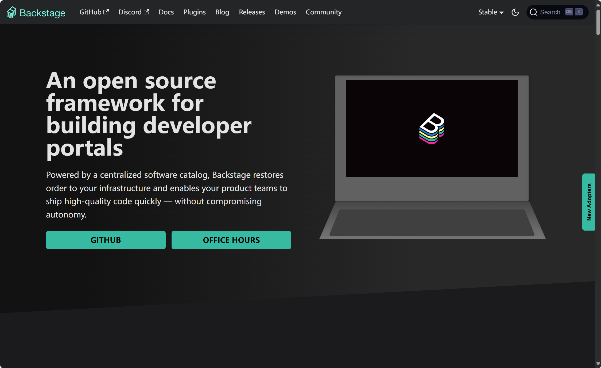
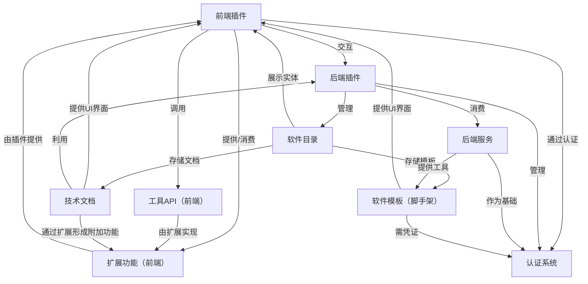
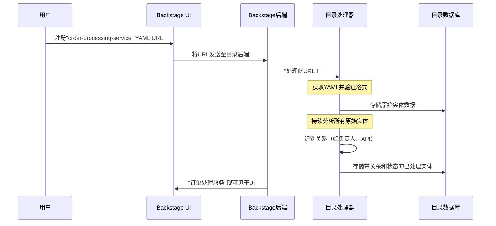

链接：[Backstage Software Catalog and Developer Platform](https://backstage.io/)

[Search Documentation | Backstage Software Catalog and Developer Platform](https://backstage.io/docs/features/search/)



# docs：Backstage后台架构

Backstage是一个**开源框架**，用于构建统一基础设施工具、服务和文档的*开发者工具*。

其核心驱动力是**==集中式软件目录==**，帮助团队高效管理*微服务*并*快速交付高质量代码*。

该平台通过**==插件架构==**实现高度可扩展性，提供**软件模板**（用于项目创建）和**TechDocs**（代码化文档）等功能，并通过灵活的**认证系统**保障安全性。

## 可视化概览



## 章节列表

1. [软件目录](01_software_catalog_.md)
2. [前端插件](02_frontend_plugins_.md)
3. [后端服务](03_backend_services_.md)
4. [认证系统](04_authentication_.md)
5. [后端插件](05_backend_plugins_.md)
6. [软件模板（脚手架）](06_software_templates__scaffolder__.md)
7. [技术文档](07_techdocs_.md)
8. [工具API（前端）](08_utility_apis__frontend__.md)
9. [扩展功能（前端）](09_extensions__frontend__.md)

---

# 第1章：软件目录

想象一下，公司拥有众多软件模块：网站、移动应用后端、支付服务、数据分析工具等等。随着公司规模扩大，回答以下简单问题变得异常困难：

*   "支付服务的负责人是谁？"
*   "在哪里可以找到数据分析工具的文档？"
*   "移动应用后端开放了哪些API接口？"
*   "是否有其他团队正在开发与我的新项目构思类似的内容？"

这种情况会导致混乱、重复劳动和无人维护的"孤儿"软件。Backstage中的**软件目录**正是为此而生

它就像我们所有软件的中央通讯录或目录，通过提供组织内所有软件资产的统一清单，让混乱重归秩序。

让我们设想一个常见场景：一位新加入公司的开发人员需要了解某个"订单处理服务"的信息。软件目录如何帮助他快速掌握所需知识？

## 软件目录的核心概念

要理解目录的工作原理，我们需要解析其核心思想：

*   **统一清单**：将目录视为所有软件组件的唯一真实来源。这包括微服务、网站、API、库、数据管道，甚至团队和用户等人力资源实体。它提供了一个全局视图。
*   **元数据（YAML文件）**：目录如何知晓这些软件？通过名为YAML的简单文本文件定义。这些文件包含"元数据"——即关于数据的数据。例如对于"订单处理服务"，其元数据可能包含名称、描述、负责人、服务类型以及代码或文档链接。这些YAML文件通常与代码一起存储在版本控制系统（如Git）中。
*   **处理、数据库、API**：Backstage持续读取并解析（或"处理"）这些YAML文件，将结构化信息存储在内置数据库中，然后通过专用**API**使Backstage UI和其他工具能够便捷访问，确保信息始终最新且可发现。
*   **所有权**：目录明确定义*归属关系*，杜绝猜测或遗忘负责人的情况。
*   **发现机制**：即使不清楚确切名称或代码位置，也能轻松找到任何软件组件。目录提供搜索和筛选功能。
*   **工具集成**：软件在目录中注册后，可将各类开发工具（如CI/CD流水线、监控看板、文档、事件管理系统）直接关联到这些目录项，实现工具集中化管理。

## 解决用例：查找"订单处理服务"

回到那位寻找"订单处理服务"的新人开发人员：

1.  **打开Backstage**：访问公司的Backstage实例（如`http://localhost:3000`）
2.  **进入目录**：点击主导航中的"Catalog"标签页
3.  **搜索**：在搜索栏输入"订单处理"
4.  **发现**：目录立即显示"订单处理服务"条目
5.  **探索**：点击服务后，开发者可立即查看：
    *   负责人（如"支付团队"）
    *   功能简介
    *   代码库链接、文档（可能通过[TechDocs](07_techdocs_.md)提供）和监控看板
    *   开放的API接口
    *   依赖的其他组件或资源

这种关键信息的即时获取，使开发者无需四处询问或翻查多个系统就能理解服务全貌。

### "订单处理服务"如何加入目录？

最常见的方式是在服务代码仓库中放置`catalog-info.yaml`文件。

以下是该文件的简化示例：

```yaml
# 声明Backstage文件类型及版本
apiVersion: backstage.io/v1alpha1
kind: Component
metadata:
  # 服务唯一名称
  name: order-processing-service
  # 友好显示名称（可选）
  title: 订单处理服务
  # 简要描述
  description: 处理客户订单提交与追踪
  # 负责人（引用目录中的Group实体）
  owner: payments-team
  # 分类标签
  tags: ["backend", "payments"]
spec:
  # 软件类型（如service/website/library）
  type: service
  # 生命周期状态（生产/实验/弃用）
  lifecycle: production
  # 所属系统（引用System实体）
  system: core-commerce
  # 提供的API（引用API实体）
  providesApis:
    - order-api
```
**字段解析**：
*   `apiVersion`和`kind`：定义软件组件类型，此处是使用Backstage API规范`v1alpha1`的`Component`
*   `metadata`：包含核心标识和描述信息
    *   `name`：唯一标识符（类似实体ID）
    *   `title`：人性化显示名称，可与`name`不同
    *   `description`：服务功能摘要
    *   `owner`：链接到目录中名为`payments-team`的`Group`实体，建立归属关系
    *   `tags`：简单标签（如`backend`/`payments`）便于分类筛选
*   `spec`：包含该类型软件的技术规范
    *   `type`：标识是`service`/`website`/`library`等
    *   `lifecycle`：成熟度标识（`production`/`experimental`/`deprecated`）
    *   `system`：链接到更宏观的`System`实体，将相关组件组织为逻辑组
    *   `providesApis`：声明该组件开放的API，此`order-api`也应在目录中定义为独立`API`实体

通常将此`catalog-info.yaml`文件置于`order-processing-service`代码库根目录。

文件就绪后，可通过Backstage UI注册其URL：

```text
https://github.com/your-org/order-processing-service/blob/main/catalog-info.yaml
```

Backstage将获取该文件，读取内容并将"订单处理服务"添加至目录

## 底层原理：实体的生命周期

注册`catalog-info.yaml`文件后，Backstage不仅显示内容，还会触发完整的后台处理流程，确保数据有效、存储正确并与生态系统中其他软件互连。

以下是简化的事件序列：



**逐步解析**：

1.  **用户注册URL**：通过Backstage UI提供`catalog-info.yaml`文件URL
2.  **后端接收URL**：UI将URL发送至**Backstage后端**
3.  **目录处理器启动**：后端将URL传递给**目录处理器**，这些智能模块能读取解析各类目录数据
4.  **获取与验证**：专用于URL的处理器从源地址（如GitHub）获取YAML内容，检查格式是否符合Backstage实体规则
5.  **初始存储**：YAML基础信息作为"未处理实体"存入**目录数据库**，此时仍是原始数据
6.  **持续处理**：处理器会重新分析*所有*实体。对于"订单处理服务"，它将：
    *   解析`owner: payments-team`等字段，创建与`payments-team`实体（目录中定义为`Group`）的"关系"链接
    *   从`spec`确定`type`、`lifecycle`和`system`
    *   生成`status`字段标识处理过程中的错误
7.  **缝合**：所有信息片段——实体数据、关联关系和处理状态——被"缝合"为最终完整实体对象，即用户可见版本
8.  **可发现状态**：缝合完成后，实体在数据库中建立索引并通过**目录API**开放，用户可通过Backstage UI搜索发现

从原始YAML到功能完备的目录条目，这一完整过程在Backstage中被称为"实体生命周期"。更多阶段详情及"孤儿"等概念，可参阅[实体生命周期](life-of-an-entity.md)文档。

### 代码

实体定义的核心在于描述符格式文档：

*   **[目录实体描述符格式](descriptor-format.md)**：完整规范`catalog-info.yaml`文件，详述每类实体（如`Component`、`API`、`Group`、`User`）的合法字段。

    以下是`API`实体定义示例，类似"order-processing-service"`Component`的定义方式：

    ```yaml
    apiVersion: backstage.io/v1alpha1
    kind: API
    metadata:
      name: order-api
      description: 客户订单管理API
    spec:
      type: openapi # API定义类型（如openapi/graphql）
      lifecycle: production
      owner: payments-team
      definition: |
        # 实际API定义（如OpenAPI JSON）
        openapi: "3.0.0"
        info:
          version: 1.0.0
          title: 订单API
    ```
    注意`owner`字段再次链接到`payments-team`，在目录中构建不同类型实体间的连接。

目录使用**处理器**处理`catalog-info.yaml`文件。这些模块读取YAML、验证内容并创建关系。例如，`UrlReaderProcessor`（Backstage核心组件）负责从URL获取文件。

*   **[目录配置](configuration.md)**：说明如何配置这些处理器及目录后端的其他方面。

我们甚至可以编写自定义处理器或实体提供者，集成到内部特有系统（不限于Git仓库）：

*   **[外部集成](external-integrations.md)**：指导如何扩展Backstage，从组织使用的*任何*外部系统摄取实体，作为桥梁将数据引入软件目录。

最终，所有处理数据通过API开放，供Backstage UI和其他工具展示：

*   **[API](software-catalog-api.md)**：详述可通过编程方式查询实体、位置等目录数据的REST API。例如Backstage UI使用`/entities`端点获取显示组件。

    ```http
    GET /api/catalog/entities/by-query?filter=kind=component,metadata.name=order-processing-service
    ```
    这是向目录API查询特定服务的简化HTTP请求，返回包含元数据、规范及计算关系的`order-processing-service`实体JSON表示。

## 总结

本章探索了Backstage的核心神经系统——**软件目录**。

我们了解到它是==基于YAML文件定义元数据==构建的统一软件清单，对管理所有权、发现软件组件及集成各类工具至关重要。

通过理解实体的定义和处理过程，我们已经迈出了利用Backstage为组织软件生态带来秩序与清晰度的第一步。

接下来，我们将通过**[前端插件](02_frontend_plugins_.md)**深入了解Backstage用户界面的构建与扩展机制。

