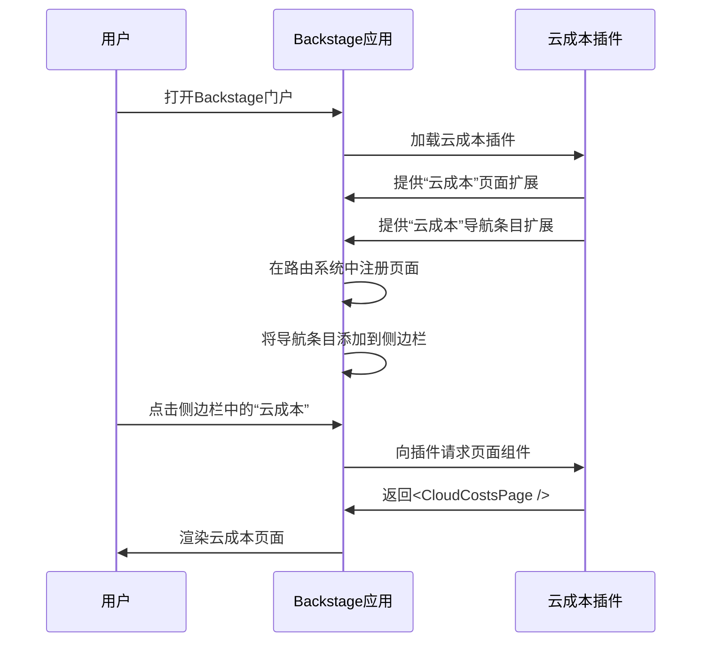

# 第2章：前端插件

在上一章中，我们学习了[软件目录](01_software_catalog_.md)以及它如何组织Backstage中的所有软件，为我们==提供了一个集中查找信息的地方==

但这些信息（例如“订单处理服务”及其所有者）需要以==用户友好的方式显示==

我们如何查看这些详细信息？如何向Backstage添加新的自定义功能，例如新的仪表板或特殊报告？

这就是**前端插件**的用武之地！它们是让我们的Backstage门户具有交互性、可定制性和独特性的秘密武器。

想象一下，我们的Backstage门户就像一栋空荡荡的大房子。[软件目录](01_software_catalog_.md)提供了所有家具（我们的软件组件）及其摆放位置的蓝图。而**前端插件**则是家具本身，再加上我们可以添加的所有酷炫电器、装饰品，甚至是新房间

它们提供了我们实际看到和交互的内容。

## 前端插件解决了什么问题？

Backstage的设计非常灵活。每家公司都有独特的需求、工具和工作流程

如果Backstage内置了*所有*功能，它会变得臃肿且难以适应。前端插件通过以下方式解决了这个问题：

*   **添加新功能**：想要为服务添加“成本跟踪”页面？在每项服务的页面上显示“构建状态”卡片？或者添加一个部署服务的新按钮？前端插件让我们可以构建并添加这些功能。
*   **自定义用户界面（UI）**：它们定义了用户看到的内容——从全新的页面到小卡片，再到导航菜单中的条目。
*   **与其他系统集成**：虽然前端插件在浏览器中运行，但它们通常连接到外部工具或公司的后端系统，以获取和显示动态数据。
*   **保持组织性**：每个插件都是独立的，专注于特定功能。这使得我们的Backstage门户模块化且更易于维护。

**让我们看一个实际用例**：公司希望查看[软件目录](01_software_catalog_.md)中每项服务的云成本。我们决定在`Backstage中添加一个名为“云成本”的新页面，并将其链接到主导航`。如何实现这一点？通过前端插件

## 前端插件的核心概念

前端插件功能强大，但其核心思想非常简单：

*   **浏览器中的迷你应用**：将每个前端插件视为一个==在浏览器中直接运行的小型独立React应用==。它负责自己的用户界面部分。
*   **构建块（扩展）**：插件不仅仅是“存在”；它们提供了特定的UI或功能，称为“扩展”。这些可以是一个完整页面、显示在其他页面上的卡片，甚至是一个按钮。
*   **即插即用**：我们可以选择在Backstage应用中安装哪些插件，就像在手机上添加应用一样。这使得我们的Backstage独一无二。
*   **通信**：插件可以通过特殊的“`Utility API`”和灵活的“`路由系统`”共享信息并相互链接。我们将在后续章节中深入探讨这些内容

## 构建“云成本”页面：前端插件示例

为了添加“云成本”页面，我们将创建一个简单的前端插件，提供两个主要内容：

1.  一个显示成本信息的新页面。
2.  Backstage侧边栏导航中的一个新条目，链接到该页面。

以下是该插件的简化代码示例：

```tsx
// 1. 首先，我们为新页面定义一个“路由”。
// 这就像为我们的页面在Backstage中分配一个唯一地址。
import { createRouteRef } from '@backstage/frontend-plugin-api';

// 这是“云成本”页面路由的唯一标识符。
export const cloudCostsRouteRef = createRouteRef({
  id: 'cloud-costs',
});
```
*说明*：`createRouteRef`帮助Backstage的路由系统了解我们的页面，而无需立即指定其确切URL路径。它是一个稳定的标识符。

接下来，我们定义页面本身和导航条目。

```tsx
// 2. 现在我们导入构建插件的主要工具。
import {
  createFrontendPlugin, // 创建插件的主函数
  PageBlueprint,        // 定义新页面
  NavItemBlueprint,     // 定义导航条目
} from '@backstage/frontend-plugin-api';
import { cloudCostsRouteRef } from './routes'; // 我们的路由定义

// 页面的简单React组件。这将延迟加载。
// 在实际插件中，这会包含更复杂的逻辑和UI。
function CloudCostsPage() {
  return (
    <div>
      <h1>云成本仪表板</h1>
      <p>这里将显示所有云支出数据！</p>
    </div>
  );
}

// 3. 定义我们的插件将提供的“扩展”。

// 创建新的“云成本”页面。
const cloudCostsPageExtension = PageBlueprint.make({
  params: {
    // 将其链接到我们的唯一路由引用。
    routeRef: cloudCostsRouteRef,
    // 这是页面的默认URL路径。
    path: '/cloud-costs',
    // Backstage在需要时加载页面组件的方式。
    loader: () => Promise.resolve(<CloudCostsPage />),
  },
});

// 创建侧边栏的导航条目。
const cloudCostsNavItemExtension = NavItemBlueprint.make({
  params: {
    // 它链接到与页面相同的路由。
    routeRef: cloudCostsRouteRef,
    title: '云成本', // 侧边栏中显示的文本。
    icon: () => <span>💰</span>, // 导航条目的简单图标（例如钱袋表情）。
  },
});
```
*说明*：
- `PageBlueprint.make`告诉Backstage：“嘿，我想添加一个新页面！”它需要知道页面属于哪个`routeRef`、其`path`以及如何`loader`渲染页面的React组件。
- `NavItemBlueprint.make`告诉Backstage：“我想在导航中添加一个新条目。”它也需要一个`routeRef`（以便知道链接到哪里）、一个`title`和一个`icon`。

最后，我们将所有内容打包到前端插件中：

```tsx
// 4. 创建前端插件本身，打包所有扩展。
export const cloudCostsPlugin = createFrontendPlugin({
  pluginId: 'cloud-costs', // 插件的唯一ID（例如'cloud-costs-plugin'）。
  extensions: [
    cloudCostsPageExtension,    // 我们的新页面
    cloudCostsNavItemExtension, // 我们的新导航条目
  ],
  // 我们公开路由，以便其他插件以后可以链接到它。
  routes: {
    root: cloudCostsRouteRef,
  },
});
```
*说明*：
- `createFrontendPlugin`是主函数。
- `pluginId`：插件的唯一名称（例如`cloud-costs`）。
- `extensions`：这是插件添加的所有酷炫功能（页面、导航条目）的列表。
- `routes`：我们告诉Backstage，`cloudCostsRouteRef`是插件提供的主要路由。

一旦这个`cloudCostsPlugin`被“安装”到Backstage应用中，我们就会在侧边栏中看到一个“云成本”条目。点击它会跳转到新页面

## 底层原理：前端插件的生命周期

当我们定义并安装前端插件时，Backstage不会随意将其扔到屏幕上。它有一个组织良好的过程，将插件无缝集成到门户中。

以下是“云成本”插件的简化事件序列：



**逐步说明**：

1.  **用户打开Backstage门户**：我们在浏览器中打开Backstage应用。
2.  **Backstage应用加载插件**：主Backstage应用（“App”）启动并查找所有配置使用的插件。它找到并加载我们的`云成本插件`。
3.  **插件提供扩展**：`云成本插件`告诉`Backstage应用`：“这是我的扩展！我有一个用于'/cloud-costs'的`Page`扩展和一个名为'云成本'的`NavItem`扩展。”
4.  **应用注册扩展**：`Backstage应用`接收这些扩展：
    *   它将`Page`扩展注册到内部路由系统中，以便知道当有人导航到`/cloud-costs`时显示什么。
    *   它将`NavItem`扩展添加到侧边栏，使“云成本”可见并可点击。
5.  **用户点击导航条目**：我们在侧边栏中看到“云成本”并点击它。
6.  **应用请求页面组件**：`Backstage应用`发现我们想要跳转到与“云成本”导航条目关联的页面。它使用`routeRef`识别正确的`Page`扩展，并向`云成本插件`请求其实际的React组件。
7.  **插件返回组件**：`云成本插件`提供`<CloudCostsPage />` React组件。
8.  **应用渲染页面**：`Backstage应用`接收该组件并将其渲染到屏幕上供我们查看。

这一过程确保插件可以添加或移除，而不会破坏整个应用，并且每个插件仅在需要时加载其重量级组件（延迟加载）

### 代码

定义和使用前端插件的核心机制由`@backstage/frontend-plugin-api`包提供。

*   **`createFrontendPlugin`**：这是我们定义插件时使用的主函数，如示例所示。它接收一个包含`pluginId`、`extensions`和`routes`的对象。
    *   更多关于创建插件的详细信息，请参阅[构建前端插件概述](frontend-system/building-plugins/01-index.md)。
*   **`PageBlueprint`和`NavItemBlueprint`**：这些是“扩展蓝图”的示例。蓝图是常见扩展类型的模板。
    *   `PageBlueprint`用于创建完整页面功能。
    *   `NavItemBlueprint`用于向主导航（例如侧边栏）添加条目。
    *   Backstage有许多[常见扩展蓝图](frontend-system/building-plugins/03-common-extension-blueprints.md)用于各种UI元素。
*   **扩展**：这些是插件提供的实际构建块。它们可以是视觉化的（如页面或卡片）或非视觉化的（如Utility API）。
    *   [前端系统架构文档中的扩展部分](frontend-system/architecture/20-extensions.md)进一步解释了这一概念。

本质上，我们的Backstage应用`packages/app`被配置为加载这些插件。它就像主控制面板，协调所有单独的插件“应用”，形成一个完整的开发者门户。

## 结论

在本章中，我们探讨了**前端插件**，这是为Backstage开发者添加和自定义功能的核心机制。

我们了解到插件是独立的“迷你应用”，提供诸如页面和导航条目等`extensions`。通过理解如何定义插件及其扩展，我们现在掌握了如何基于[软件目录](01_software_catalog_.md)提供的有序数据，在Backstage中实现独特功能和集成。

接下来，我们将==从Backstage的用户界面部分转向服务器端==，学习**[后端服务](03_backend_services_.md)**以及它们如何为这些前端功能提供支持。

