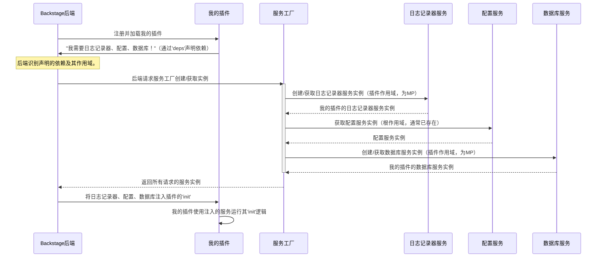

# 第3章：后端服务

在上一章[前端插件](02_frontend_plugins_.md)中，我们探讨了如何构建交互式用户界面，并向Backstage添加用户可见且可点击的新功能。

但当前端插件（或Backstage的任何部分）需要执行任务时，幕后会发生什么？例如，当[软件目录](01_software_catalog_.md)需要获取实体数据时，或者当模板需要创建新仓库时？这些操作通常涉及与数据库通信、读取配置或在服务器上执行日志记录。

这就是**后端服务**的用武之地，它们是Backstage后端的支柱，提供了一套==标准化的“工具包”==，包含所有后端插件`可以依赖的通用工具和功能`。

将Backstage后端想象成一个繁忙的工厂，有许多不同的部门（后端插件），每个部门生产特定的产品。每个部门都需要通用工具，例如叉车（用于数据库访问）、公告板（用于配置）或安全报告表（用于日志记录）。

与其让每个部门购买自己独特版本的这些工具，工厂的中央管理层（Backstage后端系统）提供了一套标准化、共享的高质量工具，所有部门都可以请求和使用。如果工厂决定升级叉车，它会集中进行，所有部门自动获得新的改进版本，而无需改变其操作方式。

## 后端服务解决了什么问题？

Backstage后端插件与任何服务器端应用一样，经常需要执行以下常见任务：

*   **日志记录**：记录事件、错误或信息，用于调试和监控。
*   **配置**：读取Backstage管理员定义的设置和参数。
*   **数据库访问**：存储和检索数据。
*   **调度**：在特定时间间隔运行后台任务。
*   **认证/授权**：处理传入请求的安全问题。

如果没有==标准化系统==，每个后端插件将不得不：

1.  **重复造轮子**：每个插件都会以自己的方式实现日志记录、连接数据库等功能，导致代码重复。
2.  **不一致**：不同插件可能以不同格式记录日志，使用不同的数据库驱动，或以不同方式访问配置。
3.  **僵化**：更改基础工具（例如从一种数据库切换到另一种）需要修改每个插件。

后端服务通过提供强大的**依赖注入**系统解决了这些问题。这意味着插件可以*声明其需求*（例如“我需要一个日志记录器”），而Backstage后端系统*提供它*，插件无需关心具体实现。

这使得插件更简洁、更一致，并且更容易在整体Backstage应用级别进行定制或扩展

**让我们看一个实际用例**：我们正在构建一个新的后端插件“我的示例插件”，并希望它：

1.  在启动时==记录==一条消息。
2.  从Backstage配置中==读取==自定义欢迎消息。
3.  （可选）将该消息==保存==到数据库。

后端服务如何帮助“我的示例插件”干净地实现这些功能？

## 后端服务的核心概念

后端服务是Backstage后端的基础。以下是其核心思想：

*   **共享、可复用的功能**：它们是通用工具（例如日志记录、配置、数据库访问），任何后端插件或模块都可以请求和使用。
*   **服务接口与引用（`ServiceRef`）**：这是插件*声明其需求*的方式。`ServiceRef`就像合同或蓝图，定义了服务*能做什么*（其方法和类型），而不是*如何做*。这是插件请求“日志记录器”或“数据库客户端”的标准方式。
*   **服务工厂**：这些是“车间”，负责创建服务的实际具体实现。当插件通过`ServiceRef`请求“日志记录器”时，`ServiceFactory`负责构建并提供实际的日志记录器实例。
*   **依赖注入（DI）**：这是核心机制。插件只需声明其依赖（所需的`ServiceRef`）。Backstage后端在插件启动时“注入”（提供）正确的服务实现。插件无需知道服务*如何*创建或配置，只需使用它。
*   **定制与覆盖**：由于依赖注入，Backstage管理员可以轻松替换或定制服务实现，而无需修改插件代码。例如，可以通过为`database`或`logger`服务提供不同的`ServiceFactory`，从内存数据库切换到PostgreSQL，或集成到企业日志系统。
*   **服务作用域**：服务可以在不同的“作用域”中创建：
    *   **插件作用域**：为*每个*请求插件的服务创建新实例。这适用于需要为每个插件定制的服务（例如自动将插件ID添加到每条日志消息的日志记录器）。
    *   **根作用域**：创建单个服务实例，并在整个后端的*所有*插件和模块中共享。这适用于全局工具，如主配置读取器或主HTTP路由器。

## 解决用例：“我的示例插件”

让我们看看“我的示例插件”如何使用后端服务记录消息、读取配置并与数据库交互。

首先，我们需要创建一个简单的后端插件（例如在`plugins/my-example-plugin/src/plugin.ts`文件中）：

```typescript
// plugins/my-example-plugin/src/plugin.ts
import { createBackendPlugin, coreServices } from '@backstage/backend-plugin-api';

export const myExamplePlugin = createBackendPlugin({
  pluginId: 'my-example', // 插件的唯一ID
  register(env) {
    env.registerInit({
      // 这里声明插件所需的服务！
      // coreServices是Backstage提供的常见内置服务集合。
      deps: {
        logger: coreServices.logger,     // 用于记录消息
        config: coreServices.rootConfig, // 用于读取配置
        database: coreServices.database, // 用于数据库访问
      },
      // Backstage在插件初始化时自动提供这些服务
      async init({ logger, config, database }) {
        logger.info('我的示例插件正在启动！');

        // 1. 从Backstage配置中读取设置
        // 我们向'config'服务请求一个字符串值。
        const welcomeMessage = config.getOptionalString('myExamplePlugin.welcomeMessage') ?? '来自Backstage后端的问候！';
        logger.info(`配置的消息: "${welcomeMessage}"`);
        // 如果app-config.yaml中定义了'myExamplePlugin.welcomeMessage'，则使用它。
        // 否则，默认为"来自Backstage后端的问候！"。

        // 2. 与数据库服务交互
        // 获取插件数据库的客户端（如连接）。
        const dbClient = await database.getClient();
        // 在实际场景中，这里会执行迁移和复杂查询。
        // 为简化，我们仅记录连接成功。
        logger.info('成功连接到我的示例插件的数据库。');

        // 3. 初始化完成时记录事件
        logger.info('我的示例插件完成初始化。');
      },
    });
  },
});
```
**代码说明**：

*   `createBackendPlugin({ pluginId: 'my-example', ... })`：这是我们定义后端插件的方式。`pluginId`为其指定唯一名称。
*   `env.registerInit({ deps: { ... }, async init({ ... }) { ... } })`：这是插件启动逻辑的核心。
    *   `deps`：这是我们声明“依赖”的地方。我们告诉Backstage：“我需要`logger`、`config`读取器和`database`客户端。”我们使用`coreServices.logger`、`coreServices.rootConfig`和`coreServices.database`，因为这些是Backstage提供的常见内置服务。
    *   `async init({ logger, config, database })`：Backstage的依赖注入系统读取我们的`deps`列表。当启动插件时，它会自动创建（或查找现有）这些服务的实例，并将它们作为参数传递给`init`函数。然后我们可以在插件逻辑中直接使用`logger`、`config`和`database`！

为了使插件运行，通常需要将其添加到主后端应用（例如在`packages/backend/src/index.ts`中）：

```typescript
// packages/backend/src/index.ts（简化）
import { createBackend } from '@backstage/backend-defaults';
import { myExamplePlugin } from './plugins/my-example-plugin'; // 我们的自定义插件

const backend = createBackend();

// 添加自定义插件
backend.add(myExamplePlugin());

// ...（添加其他Backstage插件，例如catalog、scaffolder）...

backend.start();
```

要为插件定义自定义消息，可以在`app-config.yaml`中添加以下内容：

```yaml
# app-config.yaml
# ...其他配置...
myExamplePlugin:
  welcomeMessage: "欢迎使用我们的自定义Backstage设置！"
```

启动Backstage后端时，控制台会输出类似以下内容：

```text
info: 我的示例插件正在启动！ plugin=my-example
info: 配置的消息: "欢迎使用我们的自定义Backstage设置！" plugin=my-example
info: 成功连接到我的示例插件的数据库。 plugin=my-example
info: 我的示例插件完成初始化。 plugin=my-example
```
注意，每条日志消息都自动添加了`plugin=my-example`标签

这是默认`logger`服务的功能，它是插件作用域的，知道自己在为哪个插件服务。

## 底层原理：服务的生命周期

当我们将`myExamplePlugin`添加到Backstage后端时，一系列事件确保其所需的所有服务都正确设置和注入。



**逐步说明**：

1.  **后端注册插件**：`Backstage后端`启动并加载`我的插件`，因为通过`backend.add(myExamplePlugin())`添加了它。
2.  **插件声明依赖**：`我的插件`通过`deps`对象（`logger`、`config`、`database`）向`Backstage后端`声明所需服务。
3.  **后端解析服务**：`Backstage后端`查看每个声明的依赖及其`ServiceRef`（例如`coreServices.logger`）。确定服务是插件作用域（每个插件需要新实例）还是根作用域（所有插件共享一个实例）。
4.  **服务工厂行动**：
    *   对于**插件作用域**服务（如`logger`和`database`），`Backstage后端`调用其`服务工厂`为`我的插件`创建*新实例*。这些工厂可能配置服务（例如为日志记录器添加`plugin=my-example`，或连接到插件特定的数据库）。
    *   对于**根作用域**服务（如`rootConfig`），`Backstage后端`直接获取*已存在的共享实例*。
5.  **注入**：所有所需服务实例准备就绪后，`Backstage后端`通过将实例作为参数传递给`我的插件`的`init`函数来“注入”它们。
6.  **插件执行**：`我的插件`使用完全配置且可直接使用的`logger`、`config`和`database`服务实例执行其`init`逻辑。

### 代码

后端服务的魔力来自几个核心构造：

*   **`createServiceRef`**：此函数用于定义`ServiceRef`——服务的蓝图或合同。
    *   **文件位置**：`packages/backend-plugin-api/src/services/definitions/coreServices.ts`（核心服务）或插件的`src/services/refs.ts`。
    *   **示例（简化定义虚构的`FooService`）**：
        ```typescript
        // 定义FooService的功能
        export interface FooService {
          doSomething(input: string): Promise<string>;
        }
        
        // 创建FooService的引用（蓝图）
        export const fooServiceRef = createServiceRef<FooService>({
          id: 'example.foo', // 服务的全局唯一ID
          scope: 'plugin',   // 或'root'
        });
        ```
    *   `id`：全局唯一标识符（通常为`pluginId.serviceName`）。
    *   `scope`：定义服务是`plugin`作用域（每个插件新实例）还是`root`作用域（所有插件共享单个实例）。

*   **`createServiceFactory`**：此函数创建`ServiceFactory`——构建具体服务实现的“车间”。
    *   **文件位置**：通常在`packages/backend-defaults/src/entrypoints/`中用于默认实现，或在插件的后端包中。
    *   **示例（简化`FooService`工厂）**：
        ```typescript
        import { createServiceFactory } from '@backstage/backend-plugin-api';
        
        class DefaultFooService implements FooService {
          // ...实现...
          async doSomething(input: string): Promise<string> {
            return `处理: ${input}`;
          }
        }
        
        export const fooServiceFactory = createServiceFactory({
          service: fooServiceRef, // 链接到FooService蓝图
          deps: {}, // 此简单工厂无依赖
          factory() {
            // 此函数创建并返回实际服务实例
            return new DefaultFooService();
          },
        });
        ```
    *   `service`：将工厂链接到特定`ServiceRef`。
    *   `deps`：列出此工厂自身构建服务所需的其他`ServiceRef`（例如数据库工厂可能依赖日志记录器）。
    *   `factory`：实际创建并返回服务实例的函数。

*   **`coreServices`**：Backstage提供了一组始终可用的基本内置服务。“我的示例插件”中使用了这些服务。
    *   **文档**：完整列表及用法见[核心后端服务API](../backend-system/core-services/01-index.md)。
    *   示例包括：
        *   [`coreServices.logger`](../backend-system/core-services/logger.md)：记录信息。
        *   [`coreServices.rootConfig`](../backend-system/core-services/root-config.md)：读取应用配置。
        *   [`coreServices.database`](../backend-system/core-services/database.md)：与数据库交互。
        *   [`coreServices.httpRouter`](../backend-system/core-services/http-router.md)：为插件注册HTTP端点。

通过替换这些默认的`ServiceFactory`实现，可以定制后端，如[构建后端 - 自定义服务实现](../backend-system/building-backends/01-index.md#custom-service-implementations)所述

> 例如，可以切换默认日志库或集成不同数据库系统，而无需修改插件代码。

## 结论

在本章中，我们揭秘了**后端服务**——支持Backstage服务器端功能的标准工具包。我们了解到这些服务通过==强大的依赖注入系统，提供了日志记录、配置和数据库访问等基本工具==。

通过理解`ServiceRef`和`ServiceFactory`，我们现在掌握了后端插件如何声明需求，以及Backstage如何高效提供这些需求，使后端可扩展、一致且高度可定制。

接下来，我们将深入探讨现代应用的关键方面：Backstage如何处理**[认证](04_authentication_.md)**，以确保用户和服务的安全访问。

