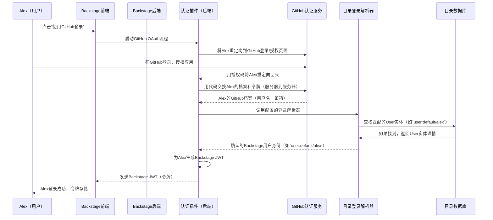

# 第4章：认证

在上一章[后端服务](03_backend_services_.md)中，我们学习了Backstage的服务器端如何使用共享工具包来处理日志记录和数据库访问等常见任务。

这些服务对插件的运行至关重要，但在任何插件能为特定用户执行有意义的功能之前，Backstage需要回答一个基本问题："==你是谁==？"

这就是**认证**的用武之地

它是处理用户登录并确保Backstage知道谁在使用它的系统。可以把它想象成整个Backstage开发者的安全检查点和身份验证系统。

没有它，任何人都可以访问任何内容，这显然不是我们对宝贵软件目录和工具的期望

## 认证解决了什么问题？

想象一下，我们的Backstage是一座繁忙的办公楼。

- [软件目录](01_software_catalog_.md)是所有部门和资源的目录。[前端插件](02_frontend_plugins_.md)是可见的办公室和工具。[后端服务](03_backend_services_.md)是保持一切运行的隐藏机制。

但谁可以进入哪个办公室？谁可以访问安全数据？谁被允许进行更改？我们肯定不希望街上的任何人都能随意进入并干扰我们的关键系统

认证通过以下方式解决这些问题：

*   **识别用户**：验证你就是你声称的那个人（例如，"是的，这是支付团队的Jane！"）。
*   **保护访问**：确保只有经过认证的用户（和服务）可以与Backstage交互。
*   **启用委托**：允许Backstage（及其插件）在与其他服务（如GitHub或Jira）通信时代表你行事。例如，如果你想从Backstage部署服务，它需要你的权限才能与CI/CD系统通信。

> **让我们考虑一个实际用例**：一位新开发者"Alex"加入公司。他们需要使用公司的GitHub账户首次登录Backstage。Backstage如何确保真的是Alex，给予他们正确的访问权限，并将他们的GitHub身份与Backstage用户档案关联？

## 认证的核心概念

Backstage的认证系统设计灵活且安全。以下是其核心思想：

*   **外部提供者（公司工卡）**：Backstage通常不直接存储用户名和密码。相反，它依赖于公司已经使用的外部身份提供者，如GitHub、Google、Okta、Azure AD等。这些就像公司的官方工卡发放机构。
*   **Backstage用户身份（办公室门禁卡）**：一旦外部提供者确认了你的身份，Backstage需要为其==创建一个内部身份==。这个"Backstage用户身份"将你的外部登录与内部用户档案==关联==，通常表示为[软件目录](01_software_catalog_.md)中的`User`实体。这个身份定义了你的唯一名称、团队成员身份以及你在Backstage中"拥有"的内容。
*   **登录解析器（翻译器）**：这是将你的外部身份（如GitHub用户名和邮箱）转换为Backstage用户身份（如名为`alex`的`User`实体，属于`payments-team`组的`memberOf`）的关键部分。我们可以配置甚至编写自定义解析器，将外部用户数据与内部Backstage目录数据匹配。
*   **令牌（密封护照）**：认证后，Backstage会给你一个数字"令牌"。这个==令牌就像密封的护照==，证明你未来请求的身份。Backstage主要使用JSON Web Tokens（JWTs），它们安全且可以包含关于你是谁的信息。
*   **会话**：当你登录时，Backstage会创建一个"会话"。这让你在`一定时间内保持登录状态`，无需每次点击都重新输入凭证。
*   **代理认证**：在某些公司设置中，另一个系统（如AWS ALB或Google IAP的"认证代理"）在流量到达Backstage之前处理初始登录。Backstage可以与这些代理集成，无缝识别已经认证的用户。

## 解决用例：Alex使用GitHub登录

让我们看看Alex首次使用公司GitHub账户登录的过程：

1.  **Alex打开Backstage**：Alex在网页浏览器中导航到公司的Backstage门户。他们看到一个登录页面。
2.  **选择GitHub**：Alex点击"使用GitHub登录"按钮。
3.  **重定向到GitHub**：Backstage的前端告诉Backstage后端的认证系统Alex想用GitHub登录。后端将Alex的浏览器重定向到GitHub的登录页面。
4.  **GitHub认证**：Alex在GitHub网站上输入凭证，并授权Backstage访问其档案（如用户名、邮箱）。
5.  **GitHub重定向回来**：GitHub将Alex送回Backstage后端，包括一个特殊代码。
6.  **后端处理登录**：Backstage后端用这个代码与GitHub交换，获取Alex的GitHub档案信息和访问令牌。
7.  **登录解析器工作**：配置的**登录解析器**获取Alex的GitHub档案（如用户名"alex-dev"和邮箱"alex@example.com"），并尝试在[软件目录](01_software_catalog_.md)中找到匹配的`User`实体。假设它找到一个名为`alex`的`User`实体，`metadata.name: alex-dev`且`spec.profile.email: alex@example.com`。
8.  **颁发Backstage令牌**：因为找到了匹配（感谢登录解析器！），Backstage后端为Alex生成一个**Backstage令牌**（JWT）。这个令牌包含Alex的Backstage用户身份（如`user:default/alex`，属于`group:default/payments-team`）。
9.  **登录成功**：令牌发送到Alex的浏览器，他们现在成功登录Backstage，看到门户的个性化视图，拥有适合其团队的访问权限！

### 如何配置GitHub提供者？

为了实现这一点，Backstage需要==在`app-config.yaml`和一些前端代码中进行配置==。

首先，在`app-config.yaml`中，用GitHub应用的`clientId`和`clientSecret`定义GitHub提供者：

```yaml title="app-config.yaml"
auth:
  environment: development # 或'production'
  providers:
    github:
      development: # 环境特定配置
        clientId: YOUR_GITHUB_CLIENT_ID
        clientSecret: YOUR_GITHUB_CLIENT_SECRET
        signIn:
          resolvers:
            - resolver: usernameMatchingUserEntityName # 我们的登录解析器
```
*说明*：
*   `auth`：认证的顶级配置键。
*   `providers`：列出所有外部认证提供者。
*   `github`：GitHub提供者的特定配置。
*   `development`：当Backstage运行在`development`模式时应用此部分（也可以有`production`或其他环境）。
*   `clientId`和`clientSecret`：在GitHub注册Backstage应用时获得的唯一密钥。
*   `signIn`：这个关键部分告诉Backstage*如何*将成功的GitHub登录转换为Backstage用户身份。
*   `resolvers`：登录解析器列表。这里我们使用`usernameMatchingUserEntityName`，意味着Backstage会尝试将GitHub用户名与[软件目录](01_software_catalog_.md)中`User`实体的`metadata.name`匹配。

接下来，为了让"使用GitHub登录"按钮出现在登录页面，我们需要==配置前端应用==（如`packages/app/src/App.tsx`）：

```tsx title="packages/app/src/App.tsx"
// packages/app/src/App.tsx（简化）
import { githubAuthApiRef } from '@backstage/core-plugin-api';
import { SignInPage } from '@backstage/core-components';

const app = createApp({
  components: {
    SignInPage: props => (
      <SignInPage
        {...props}
        auto // 如果只有一个提供者，自动尝试登录
        provider={{
          id: 'github-auth-provider', // 此特定提供者实例的唯一ID
          title: 'GitHub',
          message: '使用GitHub登录',
          apiRef: githubAuthApiRef, // 链接到GitHub认证API
        }}
      />
    ),
  },
  // ... 其他应用配置
});
```
*说明*：
*   我们导入`githubAuthApiRef`（这是GitHub认证API的特殊"引用"）和`SignInPage`（预构建的登录组件）。
*   在`createApp`中，我们自定义`SignInPage`组件。
*   我们向`SignInPage`传递一个`provider`对象，告诉它显示GitHub登录选项，并链接到`githubAuthApiRef`。

最后，==后端需要被告知*包含*GitHub认证模块==。这通常在`packages/backend/src/index.ts`文件中完成，类似于我们添加其他[后端服务](03_backend_services_.md)或插件的方式：

```typescript title="packages/backend/src/index.ts"
// packages/backend/src/index.ts（简化）
import { createBackend } from '@backstage/backend-defaults';

const backend = createBackend();

backend.add(import('@backstage/plugin-auth-backend')); // 主认证插件
backend.add(import('@backstage/plugin-auth-backend-module-github-provider')); // 特定GitHub提供者模块

backend.start();
```
*说明*：
*   `@backstage/plugin-auth-backend`：这是协调所有认证逻辑的核心认证后端插件。
*   `@backstage/plugin-auth-backend-module-github-provider`：这是向`auth-backend`插件添加GitHub认证支持的具体模块。

有了这些配置，Alex就可以成功使用GitHub账户登录啦~

## 底层原理：认证请求的旅程

当Alex点击"使用GitHub登录"并最终登录时，一个复杂但定义明确的过程展开。以下是简化的事件序列：



**逐步说明**：

1.  **Alex点击"使用GitHub登录"**：从Backstage[前端插件](02_frontend_plugins_.md)（`SignInPage`），Alex启动登录。
2.  **前端联系后端认证插件**：前端向[Backstage后端](03_backend_services_.md)的`认证插件`发送请求，启动GitHub OAuth流程。
3.  **认证插件重定向到GitHub**：`认证插件`构建一个特殊URL，告诉Alex的浏览器前往GitHub的授权页面。
4.  **Alex在GitHub认证**：Alex在GitHub网站上登录，并授权Backstage访问其基本档案信息。
5.  **GitHub重定向回认证插件**：成功授权后，GitHub将Alex的浏览器重定向回`认证插件`的特定端点，包括一个临时的"授权码"。
6.  **认证插件与GitHub交换代码**：`认证插件`（服务器端）使用这个授权码向GitHub的API发出安全、直接的请求，用代码交换Alex的完整GitHub档案数据和访问令牌。这是安全的服务器到服务器通信。
7.  **调用登录解析器**：有了Alex的GitHub档案，`认证插件`调用配置的`目录登录解析器`。
8.  **解析器查询目录**：`登录解析器`获取Alex的GitHub详情（如用户名或邮箱），并查询[软件目录](01_software_catalog_.md)（特别是`目录数据库`）以找到匹配的`User`实体。例如，它可能查找`metadata.name`匹配Alex GitHub用户名的`User`实体。
9.  **确认用户身份**：如果找到匹配，`登录解析器`确认Alex的内部Backstage用户身份（如`user:default/alex`）。如果没有找到匹配（且没有其他解析器成功），登录尝试将失败。
10. **生成Backstage JWT**：`认证插件`为Alex创建一个唯一的**Backstage JWT**。这个令牌包含Alex的Backstage身份和任何相关的所有权声明（如`group:default/payments-team`）。
11. **令牌发送到前端**：Backstage JWT发送回Alex的浏览器，通常存储在cookie或页面响应中。
12. **Alex登录成功**：Backstage前端存储这个令牌。从现在开始，每当Alex与Backstage交互（如浏览[软件目录](01_software_catalog_.md)，使用与[后端服务](03_backend_services_.md)通信的[前端插件](02_frontend_plugins_.md)），这个Backstage JWT都会包含在请求中以证明Alex的身份。

### 代码

Backstage后端的认证核心服务由`auth`和`httpAuth`[后端服务](03_backend_services_.md)提供。

*   **`coreServices.auth`**：这个服务（`@backstage/backend-plugin-api`）处理令牌生成、验证和凭证操作的基本方面。
    *   **使用示例（来自后端插件）**：
        ```typescript
        // 在后端插件的init函数中
        // deps: { auth: coreServices.auth, httpAuth: coreServices.httpAuth }
        
        // 从传入的HTTP请求获取凭证
        const credentials = await httpAuth.credentials(req);
        
        // 代表当前用户向另一个后端插件发出请求
        const { token } = await auth.getPluginRequestToken({
          onBehalfOf: credentials,
          targetPluginId: 'catalog', // 例如，调用Catalog插件
        });
        
        // 或者，以插件本身身份发出请求（不代表用户）
        const { token: serviceToken } = await auth.getPluginRequestToken({
          onBehalfOf: await auth.getOwnServiceCredentials(),
          targetPluginId: 'my-other-plugin',
        });
        ```
    *   这个服务允许插件请求令牌以调用其他Backstage服务（如[软件目录](01_software_catalog_.md)或[软件模板（Scaffolder）](06_software_templates__scaffolder__.md)），确保安全、认证的通信。

*   **`coreServices.httpAuth`**：这个服务专注于处理HTTP请求和响应中的凭证，特别是REST接口。
    *   **使用示例（来自后端插件的==Express路由器==）**：
        
        ```typescript
        // 在Express路由处理程序中
        // deps: { httpAuth: coreServices.httpAuth }
        
        router.get('/my-secure-endpoint', async (req, res) => {
          // 从传入请求提取并验证凭证
          const credentials = await httpAuth.credentials(req, { allow: ['user'] });
        
          // 如果使用'allow: ["user"]'，TypeScript现在知道
          // credentials.principal.type === 'user'
          logger.info(`来自用户的请求: ${credentials.principal.userEntityRef}`);
        
          res.json({ message: `你好, ${credentials.principal.userEntityRef}!` });
        });
        ```
    *   `httpAuth.credentials(req)`从传入请求中提取已验证的用户或服务凭证。`allow`选项可以限制接受的凭证类型（如仅用户、仅服务）。

认证提供者的配置，包括`登录解析器`，在Backstage官方文档中有详细说明：

*   **[Backstage中的认证](../auth/index.md)**：认证系统的概述。
*   **[登录身份和解析器](../auth/identity-resolver.md)**：深入探讨Backstage如何将外部身份映射到内部用户档案。这里可以找到关于`usernameMatchingUserEntityName`的详细信息以及如何编写自定义解析器。
*   **[GitHub认证提供者](../auth/github/provider.md)**：设置GitHub作为认证提供者的具体说明。其他提供者如[Google认证提供者](../auth/google/provider.md)、[Okta认证提供者](../auth/okta/provider.md)等也有类似页面。

这些文档将指导我们设置不同的提供者，并根据组织需求定制身份解析。

## 结论

在本章中，我们揭示了**认证**，这是管理Backstage中用户登录和身份识别的关键系统。

我们了解到Backstage利用外部身份提供者，使用**登录解析器**将这些外部身份映射到内部**Backstage用户身份**，并通过**令牌**保护通信。通过理解这些概念，我们可以确保Backstage门户既对开发者可访问，又对组织安全。

接下来，我们将深入探讨**[后端插件](05_backend_plugins_.md)**，探索它们如何==扩展Backstage的服务器端能力==，超越常见的[后端服务](03_backend_services_.md)。

