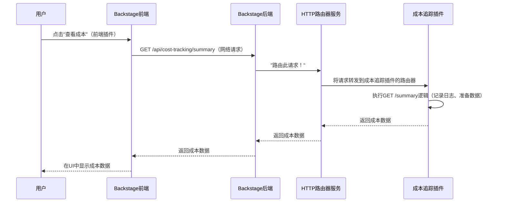

# 第5章：后端插件

在上一章[认证](04_authentication_.md)中，我们学习了Backstage如何安全地识别用户，确保只有授权人员才能访问门户及其功能

这种安全性至关重要，但功能本身呢？Backstage中许多强大的功能，如处理[软件目录](01_software_catalog_.md)实体、生成[软件模板（Scaffolder）](06_software_templates__scaffolder__.md)或连接外部系统，都需要服务器端逻辑。

这就是**后端插件**的用武之地

它们是Backstage应用中强大且独立的引擎，运行在服务器上。可以将它们视为执行繁重任务并将Backstage与外部世界连接起来的专用引擎，为核心功能注入生命力。

## 后端插件解决了什么问题？

将Backstage门户想象成一座庞大的数字城市。[软件目录](01_software_catalog_.md)是它的主目录，[前端插件](02_frontend_plugins_.md)是交互式的店面与公共空间。[后端服务](03_backend_services_.md)是城市的基础设施，如电网或供水系统，提供日志记录和配置等通用需求。

但如果我们需要一个专门的工厂将原材料（数据）加工为成品（功能）呢？如果需要`与外部供应链`（第三方API）集成的物流中心呢？这就是**后端插件**的角色。

Backstage设计为高度可扩展。不同于一个庞大、单一的后端试图完成所有任务，后端插件：

*   **提供核心功能**：它们交付特定的复杂功能，如管理[软件目录](01_software_catalog_.md)数据、运行CI/CD集成或处理复杂业务逻辑。
*   **封装逻辑**：每个插件专注于单一职责，使后端更易于理解、开发和维护。
*   **实现集成**：它们作为Backstage与外部服务（如Git提供商、CI/CD系统、云平台）之间的安全桥梁，处理API调用和数据转换。
*   **促进隔离**：关键的是，`每个后端插件像独立的微服务一样运行`。它们不直接共享代码或内存；如果需要通信，会通过网络进行，确保==强隔离性==，防止一个插件破坏另一个

**让我们考虑一个实际用例**：公司希望在Backstage中添加"云成本报告"功能。该功能允许开发者查看其服务的预估成本，数据直接从云提供商（如AWS、GCP、Azure）拉取。这需要从外部系统获取敏感数据并进行处理。**后端插件**是完美的解决方案

## 后端插件的核心概念

后端插件是Backstage服务器端架构的核心。以下是其核心思想：

*   **服务器端组件**：与在浏览器中运行的[前端插件](02_frontend_plugins_.md)不同，后端插件运行在Backstage服务器上。这对于处理敏感数据、复杂计算和`不应直接暴露`给客户端的系统集成至关重要
*   **独立微服务**：这是基本原则。每个后端插件被视为独立、自包含的单元。如果"插件A"需要与"插件B"通信，它会通过==网络请求==（如HTTP API调用）实现，而非直接调用插件B的代码。这种隔离使Backstage极其健壮且可扩展。
*   **数据获取与业务逻辑**：它们负责从数据库或外部API获取数据，应用必要的业务规则，并为前端或其他服务准备数据。
*   **集成**：它们管理与GitHub、Jira、监控工具或云API等外部系统的安全连接和交互
*   **共享服务依赖**：正如我们在[后端服务](03_backend_services_.md)中看到的，后端插件严重依赖它们来获取日志记录、配置和数据库访问等通用工具。它们*声明*需求，Backstage后端*注入*适当的服务
*   **扩展点与模块**：一些后端插件提供"扩展点"。这些特定钩子允许其他专用"模块"插入并扩展插件功能，而无需修改其核心代码。例如，"目录后端插件"可能有"实体提供者"扩展点，允许模块定义如何从不同来源摄取实体

## 构建"云成本报告"后端插件

为解决用例，我们将创建一个简单的"成本追踪"后端插件

该插件暴露一个API端点，供[前端插件](02_frontend_plugins_.md)调用以获取成本数据。

首先，使用`createBackendPlugin`定义插件（在`plugins/cost-tracking-backend/src/plugin.ts`中）：

```typescript
// plugins/cost-tracking-backend/src/plugin.ts
import {
  coreServices,
  createBackendPlugin,
} from '@backstage/backend-plugin-api';
import { Router } from 'express'; // 用于创建API端点

// 创建Express路由器的辅助函数（简化）
async function createCostTrackingRouter({ logger }: { logger: typeof coreServices.logger }) {
  const router = Router();

  // 定义API端点
  router.get('/summary', (_, res) => {
    logger.info('获取云成本摘要...');
    // 实际插件中，这里会调用外部云提供商API
    // 为简化，返回模拟数据
    const mockCosts = {
      totalMonthly: 'USD 1234.56',
      services: [
        { name: 'order-processing-service', cost: 'USD 300.00' },
        { name: 'payment-gateway', cost: 'USD 900.00' },
      ],
    };
    res.json(mockCosts);
  });

  return router;
}

export const costTrackingPlugin = createBackendPlugin({
  pluginId: 'cost-tracking', // 插件的唯一ID
  register(env) {
    env.registerInit({
      // 声明插件所需的后端服务
      deps: {
        logger: coreServices.logger,     // 用于记录消息
        httpRouter: coreServices.httpRouter, // 用于创建HTTP API端点
      },
      // Backstage在插件初始化时注入这些服务
      async init({ logger, httpRouter }) {
        logger.info('成本追踪插件正在启动！');

        // 创建API路由器
        const router = await createCostTrackingRouter({ logger });

        // 将路由器注册到HTTP路由器服务
        // 这使得端点可通过/api/cost-tracking/<路径>访问
        httpRouter.use(router);

        // 可选：如果端点应公开访问，添加认证策略
        // （默认情况下，端点需要认证）
        httpRouter.addAuthPolicy({
          path: '/summary',
          allow: 'unauthenticated', // 演示允许未认证访问成本摘要
        });

        logger.info('成本追踪插件完成初始化并注册API端点。');
      },
    });
  },
});
```
**代码说明**：

*   `createBackendPlugin({ pluginId: 'cost-tracking', ... })`：用唯一`pluginId`定义后端插件。
*   `env.registerInit({ deps: { ... }, async init({ ... }) { ... } })`：声明插件的启动逻辑和依赖。
    *   `deps`：声明插件需要`coreServices.logger`（日志记录）和`coreServices.httpRouter`（暴露API）。
    *   `async init({ logger, httpRouter })`：Backstage的依赖注入系统提供`logger`和`httpRouter`服务的实际实例。
*   `createCostTrackingRouter({ logger })`：创建`express.Router`的辅助函数，定义HTTP端点。
*   `router.get('/summary', ...)`：在`/summary`创建GET端点。收到请求时记录消息并返回模拟成本数据。
*   `httpRouter.use(router)`：关键！将路由器注册到主Backstage后端的HTTP路由系统，使端点可通过类似`/api/cost-tracking/summary`的URL访问。
*   `httpRouter.addAuthPolicy(...)`：默认所有后端端点需要认证。这里为演示允许`allow: 'unauthenticated'`访问`/summary`端点。实际应用中可能需要用户认证（如`allow: ['user']`）。

要使插件生效，需将其添加到主后端应用（如`packages/backend/src/index.ts`）：

```typescript
// packages/backend/src/index.ts（简化）
import { createBackend } from '@backstage/backend-defaults';

const backend = createBackend();

// 添加自定义成本追踪插件
backend.add(import('./plugins/cost-tracking-backend')); // 假设插件路径

// ...（添加其他Backstage插件，如catalog、scaffolder）...

backend.start();
```

启动Backstage后端后，可发起`curl`请求：

```bash
curl http://localhost:7007/api/cost-tracking/summary
```

将返回模拟成本数据：

```json
{"totalMonthly":"USD 1234.56","services":[{"name":"order-processing-service","cost":"USD 300.00"},{"name":"payment-gateway","cost":"USD 900.00"}]}
```

此后端点可由[前端插件](02_frontend_plugins_.md)调用，在Backstage UI中显示成本信息

## 底层原理：后端插件请求的旅程

当"成本追踪插件"激活并收到`/api/cost-tracking/summary`请求时，服务器上会执行一个精心编排的过程



**逐步说明**：

1.  **用户与前端交互**：用户在浏览器中的[前端插件](02_frontend_plugins_.md)点击"查看成本"按钮。
2.  **前端发起网络请求**：[前端插件](02_frontend_plugins_.md)向Backstage后端发送HTTP GET请求，目标为`/api/cost-tracking/summary`。这是标准的网络调用，如同调用任何外部API。
3.  **后端接收请求**：主Backstage后端应用收到此网络请求。
4.  **后端路由请求**：后端将请求委托给`HTTP路由器服务`（处理所有传入HTTP流量的[后端服务](03_backend_services_.md)）。路由器发现路径`/api/cost-tracking/summary`匹配"成本追踪插件"注册的端点。
5.  **请求交给插件**：`HTTP路由器服务`将请求直接转发到"成本追踪插件"提供的`express.Router`实例。
6.  **插件处理逻辑**："成本追踪插件"执行与`/summary`端点关联的代码。它使用注入的`logger`服务记录消息并准备模拟成本数据。实际场景中，这里会调用外部云提供商API、执行计算等。
7.  **插件返回响应**：插件的路由器将准备好的成本数据返回给`HTTP路由器服务`。
8.  **后端返回响应**：`HTTP路由器服务`将响应传回主Backstage后端，后者通过网络将其返回给发起请求的[前端插件](02_frontend_plugins_.md)。
9.  **前端显示数据**：[前端插件](02_frontend_plugins_.md)接收数据并更新用户界面以显示云成本。

整个流程展示了Backstage不同部分之间的隔离和基于网络的通信，使插件能够作为健壮、独立的单元运行。

### 代码

后端插件的核心概念在`backend-system`部分的Backstage文档中有定义和解释。

*   **`createBackendPlugin`**：这是定义后端插件的基本函数，如示例所示。
    *   **文档**：更多使用和结构细节见[后端插件文档](../backend-system/architecture/04-plugins.md)和[构建后端插件和模块概述](../backend-system/building-plugins-and-modules/01-index.md)。
*   **`coreServices`**：示例中使用了`coreServices.logger`和`coreServices.httpRouter`。这些是所有插件可依赖的必需[后端服务](03_backend_services_.md)。
    *   **文档**：完整列表和详细用法见[核心后端服务API](../backend-system/core-services/01-index.md)。
*   **`httpRouter.addAuthPolicy`**：`httpRouter`服务的方法对定义插件端点的认证规则至关重要。
    *   **文档**：更多认证策略见[迁移到新认证服务教程](../tutorials/auth-service-migration.md)。
*   **包结构**：后端插件通常位于名为`plugin-<pluginId>-backend`的包中（如`plugins/cost-tracking-backend`）。如果插件为其他模块暴露扩展点或工具，可能还有`-node`包（如`plugin-cost-tracking-node`）。
    *   **文档**：[架构概述 - 包架构](../overview/architecture-overview.md#package-architecture)提供了此结构的详细信息。

这些参考将帮助更深入理解架构并构建自己的健壮后端插件。

## 结论

在本章中，我们探讨了**后端插件**，它们是Backstage中交付核心功能和实现集成的服务器端核心

我们了解到它们作为==独立微服务==运行，处理数据、逻辑和外部连接，同时依赖共享的[后端服务](03_backend_services_.md)。通过理解如何定义和部署后端插件，我们现在掌握了扩展Backstage的能力，为其添加强大的服务器端功能，安全地将门户连接到整个工程生态系统。

接下来，我们将深入探讨Backstage另一个强大的功能，它利用这些==后端能力自动化开发者工作流==：**[软件模板（Scaffolder）](06_software_templates__scaffolder__.md)**。

