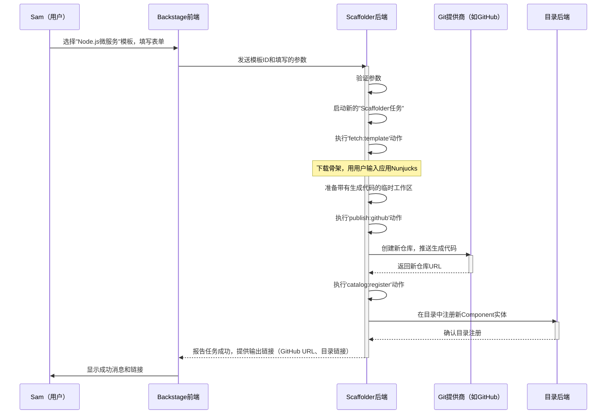

# 第6章：软件模板（Scaffolder）

在上一章[后端插件](05_backend_plugins_.md)中，我们探讨了服务器端组件如何扩展Backstage的能力，处理复杂逻辑和与外部系统的集成

这些后端功能许多用于自动化常规开发任务，其中最强大的例子之一就是**软件模板**。

想象公司正在快速发展，新团队不断创建新的软件组件——微服务、网站、库、数据管道等。每当新项目启动时，开发者都会面临类似的问题：

*   "在这里设置新的Node.js服务的'正确'方式是什么？"
*   "我应该使用哪种文件夹结构？"
*   "如何配置我们的标准CI/CD流水线？"
*   "我应该把`catalog-info.yaml`文件放在哪里以注册到[软件目录](01_software_catalog_.md)？"
*   "默认应该包含哪些依赖？"

这通常导致开发者复制旧项目，遗漏关键配置，或最终导致整个组织内的设置不一致。这种"==重复造轮子=="浪费了时间，引入错误，并使得长期维护项目更加困难。

Backstage中的**软件模板**功能（通常称为**Scaffolder**）解决了这个问题

它就像开发者门户中的主厨，==只需你提供少量"食材"，就能快速制作出完美标准化的新项目==。它提供创建新软件组件的"配方"，确保一致性、最佳实践和开发者的快速启动。

## 软件模板解决了什么问题？

软件模板简化了创建新软件的过程。它们提供了一种引导式、自动化的方式来启动项目，而非手动设置或复制粘贴。它们帮助我们：

*   **标准化项目**：确保所有新项目遵循组织的最佳实践、技术栈和结构。
*   **加速开发**：开发者可以在几分钟内启动新项目，==预先配置好所需的一切==，让他们专注于==编写功能代码==，而非样板代码。
*   **减少错误**：自动化重复的设置任务，最小化人为错误，确保关键配置（如安全设置或合规性）始终包含。
*   **即时集成**：自动将新组件注册到[软件目录](01_software_catalog_.md)，通过[TechDocs](07_techdocs_.md)链接到文档，并从一开始就设置好CI/CD流水线。

**让我们考虑一个实际用例**：新开发者"Sam"需要为公司`创建一个全新的"邮件通知服务"`。它需要是一个标准的Node.js微服务，遵循公司关于文件夹结构的最佳实践，包含基本的CI/CD流水线，并自动注册到[软件目录](01_software_catalog_.md)。软件模板如何帮助Sam快速且正确地实现这一点？

## 软件模板的核心概念

软件模板由几个核心思想定义：

1.  **模板（配方卡片）**：本质上，模板是描述如何创建新软件组件的YAML文件。它们包含：
    *   **元数据**：关于模板本身的基本信息（名称、描述、所有者）。
    *   **参数**：定义用户需要提供的信息（如项目名称、所有者、仓库URL）。Backstage用此生成用户友好的表单。
    *   **步骤/动作**：Scaffolder后端将执行的任务序列。可能包括获取代码、修改代码、创建仓库或注册实体。

2.  **Scaffolder（自动化主厨）**：这是Backstage中的后端插件，负责获取模板、收集用户输入并执行所有定义的步骤。它协调新软件组件的创建。

3.  **动作（烹饪步骤）**：这些是Scaffolder可以执行的独立、预定义操作。可以将其视为单独的烹饪指令。例如：
    *   `fetch:template`：下载代码"骨架"（基本项目结构）并应用模板。
    *   `publish:github`：创建新的GitHub仓库并将模板化代码推送到其中。
    *   `catalog:register`：将新创建的组件作为实体注册到[软件目录](01_software_catalog_.md)。
    Backstage提供了许多[内置动作](https://backstage.io/docs/features/software-templates/builtin-actions)，甚至可以[编写自定义动作](https://backstage.io/docs/features/software-templates/writing-custom-actions)。

4.  **模板引擎（智能搅拌器）**：在`fetch:template`下载的代码"骨架"中，有特殊的占位符（如`${{ values.name }}`）。Backstage使用模板引擎（如[Nunjucks](https://mozilla.github.io/nunjucks/)）将这些占位符替换为用户在表单中提供的值，为新项目定制代码。

## 解决用例：创建"邮件通知服务"

让我们看看Sam如何使用软件模板快速正确地创建"邮件通知服务"：

1.  **导航到"创建"**：Sam打开Backstage门户，点击主导航中的"创建"标签。这里列出了所有可用的软件模板。
2.  **选择模板**：Sam选择"Node.js微服务"模板，该模板用于标准化新的后端服务。
3.  **填写表单**：出现一个表单，直接由模板的`parameters`部分生成。Sam提供必要的细节：
    *   **项目名称**：`email-notification-service`
    *   **所有者**：`notifications-team`（使用`OwnerPicker`字段从[软件目录](01_software_catalog_.md)拉取）
    *   **仓库位置**：`github.com/my-org/email-notification-service`（使用`RepoUrlPicker`字段）
4.  **审查并创建**：Sam审查输入并点击"创建"。
5.  **Scaffolder接管**：Backstage Scaffolder（一个[后端插件](05_backend_plugins_.md)）开始执行模板定义的`steps`。
6.  **成功**：片刻之后，过程完成。Sam看到新GitHub仓库和新注册的[软件目录](01_software_catalog_.md)实体的链接。

### "Node.js微服务"模板如何定义？

让我们看一个简化版的`template.yaml`文件示例。该文件通常位于Backstage监控的Git仓库中。

```yaml
# 告诉Backstage这是一个模板及其版本
apiVersion: scaffolder.backstage.io/v1beta3
kind: Template
metadata:
  name: nodejs-microservice-template
  title: Node.js微服务
  description: 带有基本CI/CD的标准Node.js微服务，准备部署。
spec:
  owner: default/platform-team # 谁维护此模板
  type: service # 创建什么类型的软件

  # 定义用户在Backstage UI中看到的输入字段
  parameters:
    - title: 提供基本信息
      required: ['name', 'owner']
      properties:
        name:
          title: 项目名称
          type: string
          description: 新服务的唯一标识符（如email-notification-service）
          ui:autofocus: true
        owner:
          title: 所有者
          type: string
          description: 拥有此服务的团队或用户。
          ui:field: OwnerPicker # 从目录实体中选择的特殊UI字段
          ui:options:
            catalogFilter:
              kind: Group # 仅显示组作为所有者
    - title: 选择仓库位置
      required: ['repoUrl']
      properties:
        repoUrl:
          title: 仓库位置
          type: string
          ui:field: RepoUrlPicker # 另一个用于Git仓库的特殊UI字段
          ui:options:
            allowedHosts:
              - github.com # 仅允许GitHub仓库

  # Scaffolder后端将执行的动作
  steps:
    - id: fetch-skeleton
      name: 获取基础代码骨架
      action: fetch:template # 获取代码模板的内置动作
      input:
        url: ./skeleton # 指向模板仓库中名为'skeleton'的子文件夹
        values:
          name: ${{ parameters.name }} # 将用户输入传递给骨架
          owner: ${{ parameters.owner }}
    - id: publish-repo
      name: 发布到GitHub
      action: publish:github # 创建并推送到GitHub的内置动作
      input:
        repoUrl: ${{ parameters.repoUrl }} # 使用用户输入的仓库URL
        description: ${{ parameters.name }}的微服务
        defaultBranch: 'main'
    - id: register-catalog-entity
      name: 注册到软件目录
      action: catalog:register # 注册到目录的内置动作
      input:
        # 从'publish-repo'步骤的输出中获取新仓库内容的URL
        repoContentsUrl: ${{ steps['publish-repo'].output.repoContentsUrl }}
        catalogInfoPath: '/catalog-info.yaml' # 新仓库中catalog-info.yaml的路径

  # 成功创建后向用户显示的链接
  output:
    links:
      - title: 在GitHub中打开
        url: ${{ steps['publish-repo'].output.remoteUrl }} # 新GitHub仓库的链接
      - title: 在目录中打开
        icon: catalog
        entityRef: ${{ steps['register-catalog-entity'].output.entityRef }} # 新目录实体的链接
```
**字段说明：**
*   `apiVersion`和`kind`：标识此YAML为Scaffolder的`Template`实体。
*   `metadata`：模板的基本信息。
*   `spec.owner`：定义组织中谁维护此模板。
*   `spec.parameters`：用户填写的"步骤"列表。每个步骤是标准的`JSONSchema`定义，通过`ui:`属性增强以自定义Backstage表单中的字段显示。
    *   `name`和`owner`：简单字符串输入。注意`ui:field: OwnerPicker`是一个[自定义字段扩展](https://backstage.io/docs/features/software-templates/writing-custom-field-extensions)，帮助用户从[软件目录](01_software_catalog_.md)中选择现有实体。
    *   `repoUrl`：使用`ui:field: RepoUrlPicker`智能输入Git仓库URL，`allowedHosts`限制为`github.com`。
*   `spec.steps`：核心逻辑！这是Scaffolder将执行的有序`action`列表。
    *   `fetch:template`：从`./skeleton`目录下载样板代码，并使用用户的`name`和`owner`输入进行定制。
    *   `publish:github`：将`fetch:template`的输出推送到新的GitHub仓库，使用用户输入的`repoUrl`和`description`。
    *   `catalog:register`：通过指向新仓库中的`catalog-info.yaml`文件，将新组件注册到[软件目录](01_software_catalog_.md)。它使用`publish:github`动作输出的`repoContentsUrl`。
*   `output`：定义模板运行成功后向用户显示的链接和信息。

### 代码骨架（`./skeleton/catalog-info.yaml`）

`fetch:template`动作引用`./skeleton`目录。该目录包含新服务的实际样板代码。以下是骨架中`catalog-info.yaml`的可能内容：

```yaml
# 这是模板生成代码的一部分
apiVersion: backstage.io/v1alpha1
kind: Component
metadata:
  # 这些值将由Nunjucks模板引擎填充
  name: ${{ values.name }} # 如'email-notification-service'
  description: ${{ values.name }}的微服务
  # 新组件的所有者（引用目录中的Group实体）
  owner: default/${{ values.owner }} # 如'default/notifications-team'
spec:
  type: service
  lifecycle: experimental # 或'production'、'staging'等
  system: default/notification-platform # 所属的逻辑系统
```
**说明：**
*   注意`${{ values.name }}`和`${{ values.owner }}`。这些是Nunjucks占位符。当`fetch:template`运行时，会用用户在表单中提供的`name`（`email-notification-service`）和`owner`（`notifications-team`）替换它们。这使得模板能动态生成定制文件。

## 底层原理：软件模板的旅程

当Sam为"邮件通知服务"模板点击"创建"时，Backstage的前端和后端会协调执行一系列步骤。



**逐步说明：**

1.  **Sam启动模板**：Sam使用Backstage的[前端插件](02_frontend_plugins_.md)选择模板并提供必要的输入参数（如`project name`、`owner`、`repoUrl`）。
2.  **前端调用Scaffolder后端**：Backstage前端将模板ID和收集的参数发送给`Scaffolder后端`，这是一个专用于模板执行的[后端插件](05_backend_plugins_.md)。
3.  **Scaffolder后端验证并启动任务**：`Scaffolder后端`首先根据模板的模式验证输入。如果有效，则启动新的"Scaffolder任务"以跟踪整个过程。
4.  **`fetch:template`动作**：后端执行第一个动作`fetch:template`。该动作下载模板的代码"骨架"（如示例中的`./skeleton`目录）到临时工作区。关键的是，它使用[Nunjucks模板引擎](https://mozilla.github.io/nunjucks/templating.html)将这些骨架文件中的占位符（如`${{ values.name }}`）替换为Sam提供的实际值（如`email-notification-service`）。
5.  **`publish:github`动作**：接下来执行`publish:github`动作。该动作从临时工作区获取完全模板化的代码，与配置的**Git提供商**（如GitHub API）交互，创建新仓库（如`my-org/email-notification-service`），并将生成的代码推送到其中。Git提供商返回新仓库的最终URL。
6.  **`catalog:register`动作**：最后运行`catalog:register`动作。它获取新创建的仓库URL（从`publish:github`步骤的输出中获取），并通过处理其`catalog-info.yaml`文件将其作为`Component`实体注册到[软件目录](01_software_catalog_.md)。
7.  **成功报告和链接**：所有步骤完成后，`Scaffolder后端`向前端报告任务成功，包括定义的输出链接（如新GitHub仓库的直接链接和新[软件目录](01_software_catalog_.md)实体的链接）。
8.  **用户查看结果**：Sam的Backstage UI更新，显示成功消息并提供可点击的链接，指向新创建并注册的"邮件通知服务"。

## 代码

支持软件模板的核心组件主要位于`@backstage/plugin-scaffolder`（前端）和`@backstage/plugin-scaffolder-backend`（后端）包中。

*   **模板YAML结构**：`Template`实体的定义，包括`apiVersion`、`metadata`、`spec.parameters`、`spec.steps`和`output`，详见官方文档：
    *   [编写模板](https://backstage.io/docs/features/software-templates/writing-templates)
    *   [目录实体描述符格式 - Kind: Template](https://backstage.io/docs/software-catalog/descriptor-format.md#kind-template)

*   **Scaffolder前端插件**：这是渲染"创建"页面、列出模板、从`parameters`生成表单并显示任务进度和结果的UI部分。
    *   通常通过在`packages/app/src/App.tsx`中添加`import { ScaffolderPage } from '@backstage/plugin-scaffolder';`并配置其路由来启用。

*   **Scaffolder后端插件**：这是协调模板执行的服务器端组件。它处理`template.yaml`中定义的`spec.steps`。
    *   通过在`packages/backend/src/index.ts`中添加`backend.add(import('@backstage/plugin-scaffolder-backend'));`来启用。
    *   它严重依赖[后端服务](03_backend_services_.md)进行日志记录、配置和潜在的数据库访问。

*   **内置动作**：Backstage提供了一系列强大的开箱即用动作。
    *   `fetch:template`：用于下载代码骨架并应用模板逻辑。
    *   `publish:github`：与GitHub交互以创建仓库。这需要在`app-config.yaml`中正确配置[集成](https://backstage.io/docs/integrations/)。
    *   `catalog:register`：与[软件目录](01_software_catalog_.md)后端通信以注册新实体。
    *   完整列表及安装方法见[内置动作](https://backstage.io/docs/features/software-templates/builtin-actions)。

*   **自定义动作**：如果内置动作不满足需求，可以[编写自定义动作](https://backstage.io/docs/features/software-templates/writing-custom-actions)以扩展Scaffolder的能力。这涉及使用`@backstage/plugin-scaffolder-node`中的`createTemplateAction`。

*   **模板语法**：`template.yaml`中的`${{ parameters.name }}`和骨架文件中的`${{ values.name }}`等表达式使用[Nunjucks模板](https://mozilla.github.io/nunjucks/templating.html)。这个强大的引擎允许在模板中进行动态数据注入和条件逻辑。
    *   更多信息见[模板语法](https://backstage.io/docs/features/software-templates/writing-templates#the-templating-syntax)。

*   **自定义字段扩展**：为更定制化的用户输入，可以[编写自定义字段扩展](https://backstage.io/docs/features/software-templates/writing-custom-field-extensions)（如`OwnerPicker`或`RepoUrlPicker`）以增强表单体验。

## 结论

在本章中，我们探讨了**软件模板（Scaffolder）**，这是Backstage中改变游戏规则的功能，它==自动化并标准化了新软件组件的创建==

我们了解到模板由其`parameters`（用户输入）和`steps`（Scaffolder后端执行的动作）定义，这些步骤利用模板引擎生成定制代码。通过理解如何定义模板、使用内置动作和自定义用户体验，我们现在掌握了让开发者快速、一致地创建新项目并遵循组织最佳实践的工具。

接下来，我们将深入探讨另一个管理软件生态系统的强大功能：**[TechDocs](07_techdocs_.md)**，Backstage的"==文档即代码=="解决方案。

