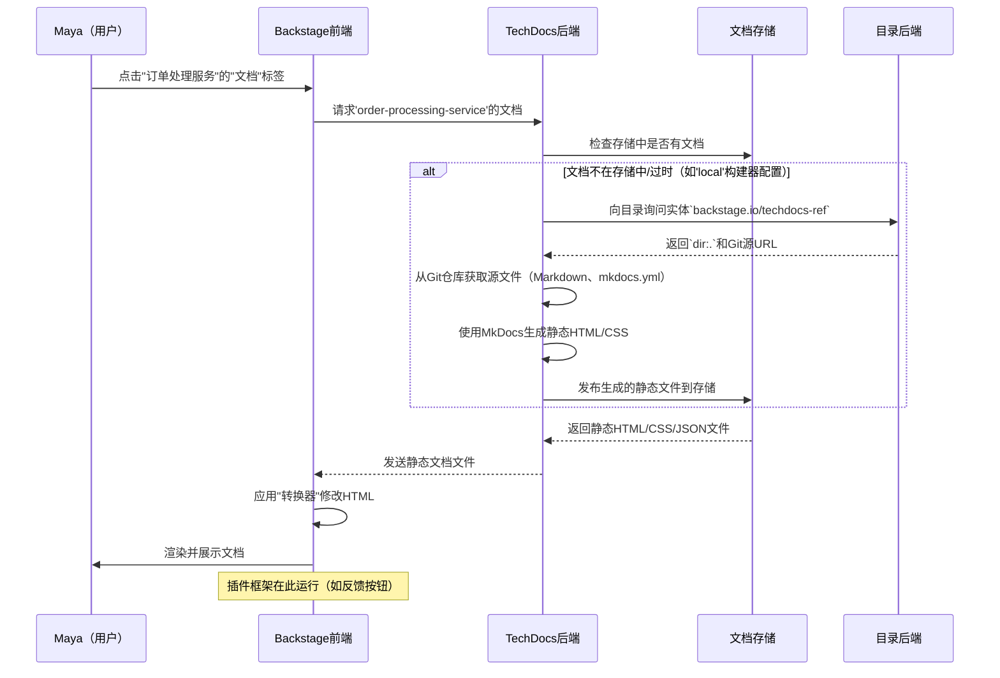

# 第7章：技术文档（TechDocs）

在上一章[软件模板（Scaffolder）](06_software_templates__scaffolder__.md)中，我们学习了如何快速创建新的标准化软件组件，比如一个新的微服务。

但服务创建后，开发者如何学习使用它？他们去哪里找API文档、部署说明或故障排除指南？

通常，这些关键信息分散在维基、过时的README中，或者只存在于某些人的脑子里。这导致时间浪费、混乱和难以共享的"部落知识"。

这就是**TechDocs**的用武之地！TechDocs是Backstage强大的"==文档即代码=="解决方案。它将技术文档视为源代码：用Markdown编写，与代码一起存储，通过Git进行版本控制，并作为美观易读的网站发布在Backstage中。

- 想象Backstage门户是一座图书馆。[软件目录](01_software_catalog_.md)是所有书籍（软件）的总目录。[软件模板](06_software_templates__scaffolder__.md)像是即时装订机，快速组装新书

- 而**TechDocs**则是确保每本书都有最新、组织良好的目录和清晰可访问章节的系统，所有内容都一致地存储和展示在一个地方。

## TechDocs解决了什么问题？

TechDocs解决了技术文档的常见痛点：

*   **信息过时**：当文档单独存放时，常落后于代码。TechDocs将它们放在一起，鼓励随代码更新文档。
*   **知识分散**：无需搜索多个平台（维基、Notion、Google文档），所有文档都集中在Backstage中并可被发现。
*   **不一致**：TechDocs强制执行一致的样式，使开发者更容易跨服务和团队消费信息。
*   **可发现性差**：直接从[软件目录](01_software_catalog_.md)链接文档，让任何人都能轻松找到任何服务的文档。

**让我们考虑一个实际用例**：==新开发者"Maya"加入团队，需要了解如何使用"订单处理服务"==（可能用[软件模板](06_software_templates__scaffolder__.md)创建）。她需要找到其API端点、常见使用模式和故障排除技巧。TechDocs如何帮她快速找到这些可靠信息？

## TechDocs的核心概念

TechDocs基于几个核心原则构建：

*   **文档即代码**：基本理念是将文档视为代码。用Markdown文件编写，与服务的代码存放在同一Git仓库中，通过拉取请求和代码评审更新。这种做法保持文档新鲜并对团队可见。
*   **Markdown文件**：文档用简单易读的Markdown（`.md`）文件编写。
*   **`mkdocs.yml`**：这是仓库中的配置文件（YAML），告诉TechDocs（底层使用MkDocs静态站点生成器）如何构建文档站点：站点名称、导航结构和使用的插件。
*   **静态站点生成**：Backstage构建TechDocs站点时，使用MkDocs将Markdown文件转换为静态HTML、CSS等资源。这些静态文件随后可被展示。
*   **`backstage.io/techdocs-ref`注解**：`catalog-info.yaml`中的这个特殊注解告诉[软件目录](01_software_catalog_.md)（和TechDocs）在哪里找到Git仓库中特定实体的文档源文件。
*   **TechDocs后端**：这是Backstage中的[后端插件](05_backend_plugins_.md)，负责获取文档源文件、生成静态站点（使用MkDocs）并将静态文件发布到存储。
*   **TechDocs前端**：这是Backstage中的[前端插件](02_frontend_plugins_.md)，从存储中检索静态文档文件并在Backstage UI中以用户友好的方式展示。
*   **存储**：生成的静态文档站点存储在指定位置。可以是Backstage后端的本地文件系统（简单设置），或更常见的生产环境云存储方案（如AWS S3或Google Cloud Storage）。
*   **插件框架**：TechDocs提供灵活的插件框架，允许在"阅读时"扩展文档体验。可以添加交互功能、反馈机制或自定义UI元素，增强用户与文档的交互。

## 解决用例：查找"订单处理服务"文档

让我们回到Maya需要查找"订单处理服务"文档的场景。

1.  **打开Backstage并导航到目录**：Maya打开Backstage，导航到[软件目录](01_software_catalog_.md)。
2.  **找到服务**：她搜索"订单处理服务"并点击其条目。
3.  **发现文档**：在服务的概览页面上，她看到"文档"标签或直接链接到其文档的入口。点击此链接打开TechDocs查看器。
4.  **阅读和理解**：Maya现在可以直接在Backstage中浏览"订单处理服务"的文档，找到所有需要的信息。

### 这些文档是如何提供的？

为了让"订单处理服务"文档出现在TechDocs中，其Git仓库中需要三样东西：

1.  **`catalog-info.yaml`**：实体定义需要注解告诉TechDocs在哪里找到源文件。

    ```yaml
    # 在order-processing-service/catalog-info.yaml中
    apiVersion: backstage.io/v1alpha1
    kind: Component
    metadata:
      name: order-processing-service
      # ...其他元数据...
      annotations:
        # 告诉TechDocs在当前目录（dir:.）查找文档
        # 文档源文件（mkdocs.yml和docs/文件夹）
        # 预期与此catalog-info.yaml在同一仓库中。
        backstage.io/techdocs-ref: dir:.
    spec:
      # ...其他spec详情...
    ```
    *说明*：`backstage.io/techdocs-ref: dir:.`注解至关重要。它指向文档源文件相对于`catalog-info.yaml`的位置。`dir:.`表示"查看同一目录"。

2.  **`mkdocs.yml`**：MkDocs的配置文件，定义文档站点的结构和元数据。此文件通常位于仓库根目录，与`catalog-info.yaml`并列。

    ```yaml
    # 在order-processing-service/mkdocs.yml中
    site_name: 订单处理服务文档
    site_description: 订单处理服务的技术文档。

    nav: # 定义文档站点的导航结构
      - 介绍: index.md
      - API参考: api.md
      - 故障排除: troubleshooting.md

    plugins:
      - techdocs-core # 必要的Backstage特定MkDocs插件
    ```
    *说明*：
    *   `site_name`和`site_description`：文档的基本信息。
    *   `nav`：组织内容的方式。每个条目指向一个Markdown文件。
    *   `plugins`：`techdocs-core`是Backstage的特殊MkDocs插件，提供通用功能和样式。

3.  **包含Markdown文件的`docs/`目录**：此目录包含用Markdown编写的实际文档内容。通常是`mkdocs.yml`的同级目录。

    ```markdown
    <!-- 在order-processing-service/docs/index.md中 -->
    # 订单处理服务：介绍
    
    欢迎阅读订单处理服务的文档！
    该服务处理客户订单的生命周期。
    
    ## 主要功能
    
    *   订单创建和验证
    *   支付集成
    *   履行跟踪
    
    详细API信息请参阅"API参考"。
    ```
    *说明*：这是标准的Markdown文件。`index.md`通常是文档的主页。你可以在`docs/`目录中创建其他Markdown文件（如`api.md`和`troubleshooting.md`）以匹配`mkdocs.yml`中的`nav`结构。

### TechDocs如何获取文档

一旦这些文件在Git仓库中且服务注册到[软件目录](01_software_catalog_.md)，TechDocs有两种主要方式生成和提供文档：

1.  **本地生成（基本设置）**：Backstage后端获取源文件，运行MkDocs，并将生成的静态HTML文件存储在其本地磁盘上。常用于快速本地开发。
2.  **外部生成（生产推荐）**：文档由服务的CI/CD流水线（如GitHub Actions、GitLab CI）生成并发布到专用云存储桶（如AWS S3或Google Cloud Storage）。Backstage后端在用户请求时从云存储获取这些预构建的静态文件。这种方法提供更好的可扩展性和关注点分离。

对我们的用例来说，无论文档是由Backstage本地构建还是CI/CD流水线构建，结果都一样：Maya在Backstage中看到实时交互的文档站点。

## 底层原理：TechDocs页面的旅程

当Maya点击"订单处理服务"的"文档"标签时，一系列事件确保文档被获取并展示。



**逐步说明：**

1.  **Maya请求文档**：Maya在Backstage前端点击"订单处理服务"的"文档"标签。
2.  **前端请求后端**：`TechDocs前端`（[前端插件](02_frontend_plugins_.md)）向`TechDocs后端`（[后端插件](05_backend_plugins_.md)）发送请求，要求获取指定实体的文档。
3.  **后端检查存储**：`TechDocs后端`首先检查配置的`文档存储`（如云存储桶或本地文件系统）中是否已有`order-processing-service`的预构建静态文档。
4.  **可选：生成（如果需要）**：
    *   如果`app-config.yaml`中的`techdocs.builder`配置为`'local'`，且文档未找到或已过期，`TechDocs后端`将启动构建。
    *   它向[软件目录](01_software_catalog_.md)询问实体的`backstage.io/techdocs-ref`注解以找到源代码位置。
    *   然后从Git仓库获取Markdown文件和`mkdocs.yml`。
    *   运行MkDocs生成静态HTML、CSS和元数据文件。
    *   最后，将这些新生成的静态文件发布到`文档存储`。
5.  **后端从存储获取**：无论文档是刚生成还是已存在，`TechDocs后端`从`文档存储`获取静态HTML、CSS和其他资源。
6.  **后端发送到前端**：`TechDocs后端`将这些静态文件发送回`Backstage前端`。
7.  **前端渲染文档**：`Backstage前端`接收静态文件。可能应用"转换器"（修改HTML的小代码片段，如重写内部链接），然后为Maya渲染文档页面。这也是任何[插件框架](docs/features/techdocs/addons.md)组件（如"报告问题"按钮）被注入和运行的地方。

### 代码

TechDocs涉及的主要包是`@backstage/plugin-techdocs`（前端）和`@backstage/plugin-techdocs-backend`（后端）。

*   **前端插件集成（`packages/app/src/App.tsx`）**：在这里将TechDocs的UI组件添加到Backstage应用。

    ```tsx
    // packages/app/src/App.tsx（简化）
    import {
      TechDocsIndexPage,
      TechDocsReaderPage,
    } from '@backstage/plugin-techdocs';
    // highlight-next-line
    import { TechDocsAddons } from '@backstage/plugin-techdocs-react';
    // highlight-next-line
    import { ReportIssue } from '@backstage/plugin-techdocs-module-addons-contrib';

    const AppRoutes = () => {
      <FlatRoutes>
        {/* TechDocs主页路由（列出所有文档） */}
        <Route path="/docs" element={<TechDocsIndexPage />} />
        {/* 单个文档页面的路由 */}
        <Route
          path="/docs/:namespace/:kind/:name/*"
          element={<TechDocsReaderPage />}
        >
          {/* highlight-start */}
          {/* 在此添加TechDocs插件以扩展阅读体验 */}
          <TechDocsAddons>
            <ReportIssue /> {/* 示例：反馈按钮插件 */}
          </TechDocsAddons>
          {/* highlight-end */}
        </Route>
      </FlatRoutes>;
    };
    ```
    *说明*：
    *   `TechDocsIndexPage`：显示所有可用文档站点的列表。
    *   `TechDocsReaderPage`：负责显示特定文档站点的组件。
    *   `TechDocsAddons`：在此可以嵌入各种"插件"以增强阅读体验（如从`@backstage/plugin-techdocs-module-addons-contrib`添加带`<ReportIssue />`的反馈按钮）。

*   **后端插件集成（`packages/backend/src/index.ts`）**：启用TechDocs的服务器端能力。

    ```typescript
    // packages/backend/src/index.ts（简化）
    import { createBackend } from '@backstage/backend-defaults';

    const backend = createBackend();

    // highlight-next-line
    backend.add(import('@backstage/plugin-techdocs-backend'));

    backend.start();
    ```
    *说明*：通过添加`plugin-techdocs-backend`，Backstage后端现在可以处理获取、生成和提供文档的所有逻辑。

*   **配置（`app-config.yaml`）**：TechDocs的关键设置在此定义。

    ```yaml
    # app-config.yaml（简化）
    techdocs:
      # 'local'：Backstage后端生成文档。'external'：假设文档已预构建（如通过CI/CD）。
      builder: 'local'
      publisher:
        # 'local'：将文档存储在后端服务器的文件系统上。
        # 'googleGcs'、'awsS3'、'azureBlobStorage'：将文档存储在云存储中。
        type: 'local'
    ```
    *说明*：此配置控制TechDocs如何生成和存储文档。开发时常用`builder: 'local'`和`publisher: 'local'`。生产环境推荐`builder: 'external'`和云`publisher.type`以提高可扩展性。更多详情见[TechDocs配置选项](docs/features/techdocs/configuration.md)。

这些核心组件与你的Markdown文件和`mkdocs.yml`一起，在Backstage中为文档注入生命力。

## 结论

在本章中，我们探讨了**TechDocs**，Backstage强大的文档即代码解决方案

我们了解到它如何通过将文档视为代码、使用Markdown和`mkdocs.yml`定义内容，并利用Backstage的前端和后端插件处理、存储和展示这些重要资源，来解决常见的文档挑战。通过==启用TechDocs，为开发者提供了所有软件文档的集中、可靠和最新的真实来源==，使知识发现变得无缝且高效。

接下来，我们将深入探讨**[实用API（前端）](08_utility_apis__frontend__.md)**，学习Backstage==前端的不同部分如何通信和共享功能==，以创建一致的用户体验。

