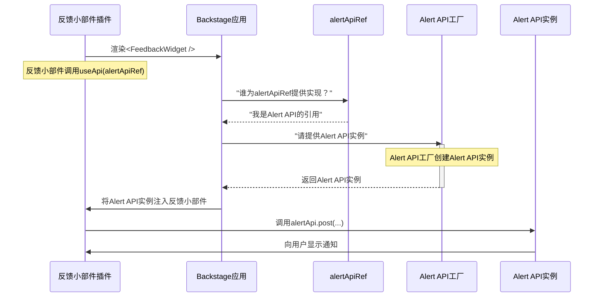

# 第8章：实用API（前端）

在上一章[技术文档（TechDocs）](07_techdocs_.md)中，我们探讨了如何在Backstage中保持软件文档的新鲜和可访问性。我们看到一致的结构和集中访问如何让开发者的生活更轻松。但想象一下，如果Backstage中有许多不同的[前端插件](02_frontend_plugins_.md)——[软件目录](01_software_catalog_.md)需要展示实体，[软件模板](06_software_templates__scaffolder__.md)需要"创建"表单，[技术文档](07_techdocs_.md)需要显示内容。如果所有这些插件都需要做常见的事情，比如向用户显示弹出消息，或者使用标准方法获取数据，该怎么办？

如果每个插件都为这些常见任务重新造轮子，你的Backstage门户将变得不一致、难以维护，并且比实际需要的体积大得多。

这就是**实用API（前端）**的用武之地！它们就像一个共享的"工具箱"或通用"语言"，所有Backstage[前端插件](02_frontend_plugins_.md)都可以使用它来共享功能并与通用服务集成。每个插件不需要构建自己的错误显示方式或与特定后端通信的方式，而是可以使用实用API提供的标准化接口。

## 实用API解决了什么问题？

想象你的Backstage门户有许多不同的房间（你的[前端插件](02_frontend_plugins_.md)）。每个房间都需要基本设施，如电灯开关、恒温器或紧急按钮。与其让每个房间对这些东西采用完全不同的设计，导致使用混乱，不如由建筑管理（Backstage）提供标准化、易于使用的控制版本，所有房间都可以访问。

实用API解决了以下问题：

*   **一致性**：确保常见操作（如显示通知或记录错误）在所有插件中看起来和行为方式一致。
*   **代码复用**：通过让插件共享通用逻辑和工具，避免重复代码。
*   **松耦合**：插件不需要知道共享函数的*确切*实现，只需要知道它的"契约"。这意味着实现可以更新或替换，而不会破坏使用它的插件。
*   **定制化**：你的Backstage应用可以定制或完全替换这些共享工具，以适应组织的特定需求。

**让我们考虑一个实际用例**：你正在为Backstage门户构建一个新的"反馈小部件"[前端插件](02_frontend_plugins_.md)。这个小部件需要能够：
1.  显示短暂的"toast"通知（如"反馈提交成功！"）。
2.  报告小部件内发生的任何内部错误。

实用API如何帮助"反馈小部件"实现这些功能，而无需构建自己的通知系统或错误记录器？

## 实用API的核心概念

实用API是[前端插件](02_frontend_plugins_.md)交互的基础。以下是其核心思想：

*   **TypeScript接口（契约）**：每个实用API都以TypeScript接口开始。这就像定义API*能做什么*（其方法及其预期输入/输出）的蓝图，但不定义*如何做*。对于我们的通知示例，接口可能定义一个接受消息的`post`方法。
*   **API引用（`createApiRef`）（名称标签）**：这是特定实用API的唯一标识符（称为`ApiRef`的特殊对象）。插件通过它"请求"特定API。就像给我们的通知服务贴一个名称标签，例如`alertApiRef`。
*   **消费（`useApi`）（请求工具）**：当[前端插件](02_frontend_plugins_.md)需要使用实用API时，它通过`useApi` React钩子"消费"它。你提供`ApiRef`（名称标签），Backstage提供API的实际实现。
*   **提供（`createApiFactory`）（提供工具）**：实际*实现*实用API的代码（"如何做"部分）通过`ApiFactory`提供。这个工厂知道如何创建符合其`ApiRef`接口的API实例。Backstage本身提供了许多核心API实现，[前端插件](02_frontend_plugins_.md)也可以提供自己的实现。
*   **定制和覆盖**：实用API的优点是灵活性。你的Backstage应用可以用自定义实现替换默认API实现。例如，如果Backstage的默认通知系统不符合公司的品牌，你可以为`alertApiRef`提供自己的`ApiFactory`，使用自定义UI组件，而无需插件改变"请求"通知的方式。

## 解决用例："反馈小部件"

让我们看看"反馈小部件"[前端插件](02_frontend_plugins_.md)如何使用现有的Backstage实用API来显示通知和报告错误。Backstage已经提供了`alertApiRef`（用于通知）和`errorApiRef`（用于错误）。

首先，想象我们的`FeedbackWidget`组件：

```tsx
// plugins/feedback-widget/src/components/FeedbackWidget.tsx
import { useApi, alertApiRef, errorApiRef } from '@backstage/core-plugin-api';
import React, { useState } from 'react';

export const FeedbackWidget = () => {
  // 1. 使用ApiRefs"请求"Alert API和Error API
  const alertApi = useApi(alertApiRef);
  const errorApi = useApi(errorApiRef);

  const [feedback, setFeedback] = useState('');

  const handleSubmit = async () => {
    try {
      // 在实际插件中，这里会将反馈发送到后端
      // 在此示例中，我们仅模拟成功或失败

      if (feedback.includes('bug')) {
        throw new Error('报告了一个错误！');
      }

      // 2. 使用Alert API显示成功通知
      alertApi.post({ message: '反馈提交成功！谢谢！', severity: 'success' });
      setFeedback(''); // 清空输入

    } catch (error) {
      // 3. 使用Error API报告错误
      errorApi.post(new Error(`提交反馈失败：${error.message}`));
      alertApi.post({ message: '提交反馈失败。请查看控制台详情。', severity: 'error' });
    }
  };

  return (
    <div>
      <h3>发送反馈</h3>
      <textarea
        value={feedback}
        onChange={e => setFeedback(e.target.value)}
        placeholder="告诉我们你的想法..."
        rows={4}
      />
      <button onClick={handleSubmit}>提交</button>
    </div>
  );
};
```
**代码说明：**

1.  `const alertApi = useApi(alertApiRef);`：这行代码使用`useApi`钩子获取`AlertApi`的实例。我们传递`alertApiRef`（"名称标签"）告诉Backstage我们需要哪个API。
2.  `const errorApi = useApi(errorApiRef);`：类似地，我们使用`errorApiRef`获取`ErrorApi`的实例。
3.  `alertApi.post(...)`：当反馈成功提交时，我们调用`alertApi`实例的`post`方法显示绿色的"成功"通知。
4.  `errorApi.post(...)`：如果出现问题（如模拟的"错误"报告），我们调用`errorApi`实例的`post`方法记录错误。这通常会在UI中显示更持久的错误消息或内部记录。我们还显示`alertApi`消息给用户。

这个例子展示了`FeedbackWidget`如何轻松使用标准化的Backstage功能，而无需知道`AlertApi`或`ErrorApi`内部的*工作原理*。它只需要知道它们提供*什么*方法。

## 底层原理：实用API的生命周期

当[前端插件](02_frontend_plugins_.md)使用`useApi`请求实用API时，Backstage会快速查找并提供正确的实现。

让我们看看`FeedbackWidget`请求`alertApiRef`时的简化事件序列：



**逐步说明：**

1.  **反馈小部件渲染**：我们的`FeedbackWidget`[前端插件](02_frontend_plugins_.md)组件在浏览器中渲染。
2.  **插件请求API**：在`FeedbackWidget`内部，调用`useApi(alertApiRef)`钩子。
3.  **Backstage应用解析API引用**：`Backstage应用`的内部系统查找`alertApiRef`。它知道`alertApiRef`是`AlertApi`的唯一标识符。
4.  **工厂提供实例**：`Backstage应用`找到为`alertApiRef`注册的`ApiFactory`。这个工厂然后创建（或提供现有的）符合`AlertApi` TypeScript接口的`Alert API实例`。
5.  **实例注入**：这个`Alert API实例`通过`useApi`钩子返回给`反馈小部件插件`。
6.  **插件使用API**：`反馈小部件插件`现在有一个具体的`alertApi`对象，可以调用其`post`方法，然后在UI中显示通知。

这种机制确保你的插件始终获得API的正确配置实现，无论它们请求多少次或底层实现如何变化。

## 代码参考（简化）

实用API的核心功能由`@backstage/frontend-plugin-api`包提供。

*   **`createApiRef`（定义"名称标签"）**：此函数用于为API创建唯一引用。
    *   **示例（为`AlertApi`）：**
        ```typescript
        // packages/core-plugin-api/src/apis/definitions/AlertApi.ts（简化）
        import { createApiRef } from '@backstage/frontend-plugin-api';
        
        export interface AlertApi {
          post(options: { message: string; severity: 'info' | 'success' | 'warning' | 'error' }): void;
        }
        
        export const alertApiRef = createApiRef<AlertApi>({
          id: 'core.alert', // Alert API的唯一ID
        });
        ```
    *   `id`是全局唯一标识符，通常遵循`pluginId.apiName`的模式。

*   **`createApiFactory`（提供"工具"）**：此函数创建提供API实现的工厂。
    *   **示例（`AlertApi`的简化工厂）：**
        ```typescript
        // packages/app/src/apis.ts（简化）
        import { createApiFactory, alertApiRef } from '@backstage/frontend-plugin-api';
        
        // AlertApi的实际实现（如使用Material-UI Snackbar）
        class MaterialUIAlertApi implements AlertApi {
          post(options: { message: string; severity: 'info' | 'success' | 'warning' | 'error' }): void {
            console.log(`[${options.severity.toUpperCase()}] ${options.message}`);
            // 在实际应用中，这会显示UI通知。
          }
        }
        
        export const defaultApis = [
          createApiFactory({
            api: alertApiRef, // 链接到我们的AlertApi蓝图
            deps: {}, // 此工厂可能也依赖其他API！
            factory() {
              return new MaterialUIAlertApi(); // 返回实际的API实例
            },
          }),
          // ... 其他API工厂
        ];
        ```
    *   `factory`函数是你创建并返回API具体实例的地方。`deps`对象允许工厂接收构建自身可能需要的其他实用API实例。

*   **`useApi`（请求"工具"）**：组件用于访问API的React钩子。
    *   **示例（如我们的`FeedbackWidget`中所示）：**
        ```tsx
        import { useApi, alertApiRef } from '@backstage/frontend-plugin-api';
        
        const MyComponent = () => {
          const alertApi = useApi(alertApiRef);
          // ... 使用alertApi
        };
        ```

*   **`app-config.yaml`中的配置**：虽然通常`createApiFactory`定义实现，但Backstage允许强大的定制。对于更高级的场景，你可以直接在`app-config.yaml`或通过`createApp`配置覆盖默认API实现。这种灵活性允许你替换实现以定制Backstage适应组织的特定需求，而无需修改插件代码。

    *   例如，如果`plugin.example.work`是一个API ID，你可以这样配置：
        ```yaml
        # app-config.yaml
        app:
          extensions:
            - api:plugin.example.work: # API扩展的ID
                config:
                  goSlow: true # 此API的自定义配置
        ```
    *   文档在[配置实用API](docs/frontend-system/utility-apis/04-configuring.md)中详细说明了这一点。

你可以在Backstage文档中找到更详细的解释：
*   [实用API概述](docs/frontend-system/utility-apis/01-index.md)
*   [创建实用API](docs/frontend-system/utility-apis/02-creating.md)
*   [消费实用API](docs/frontend-system/utility-apis/03-consuming.md)

## 结论

在本章中，我们探讨了**实用API（前端）**，这个标准化工具包使Backstage[前端插件](02_frontend_plugins_.md)之间的无缝通信和共享功能成为可能。我们学习了**TypeScript接口**如何定义契约，**API引用**如何标识API，**`useApi`**如何消费它们，以及**`createApiFactory`**如何提供实现。通过利用这个系统，你可以确保Backstage门户中的一致、可维护和高度可定制的用户体验。

接下来，我们将深入探讨这些前端构建块如何共同构成Backstage应用的结构，学习**[扩展（前端）](09_extensions__frontend__.md)**。

