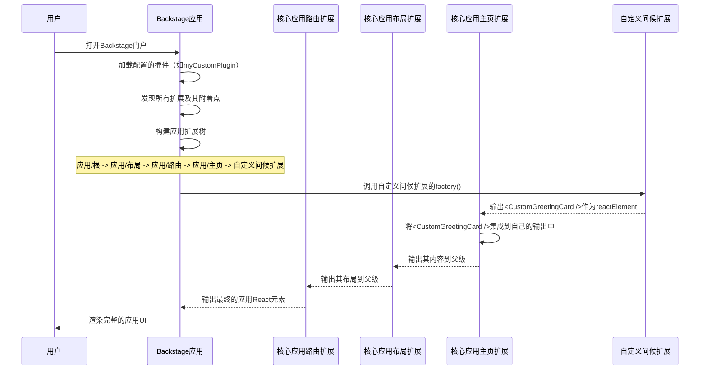

# 第9章：扩展（前端）

在上一章[实用API（前端）](08_utility_apis__frontend_.md)中，我们学习了Backstage前端的==不同部分如何共享通知==显示或错误处理等通用功能

这些API为插件提供了一致的通信方式。但这些插件本身，连同它们的页面、导航项甚至它们提供的API

> 是如何==组织和连接==起来形成一个完整、连贯的Backstage应用的呢？

Backstage如何知道在哪里放置新页面，或者如何在另一个插件的视图中显示自定义卡片？

这就是**扩展（前端）**的用武之地

扩展是构建整个Backstage前端应用视觉和功能框架的基本构建块。

## 前端扩展解决了什么问题？

想象Backstage应用是一个复杂的乐高模型。每个**扩展**就像一块单独的乐高积木。[前端插件](02_frontend_plugins_.md)则像是特定积木的集合，组合在一起可以构建特定功能（如乐高汽车或房子）

从许多独立插件构建大型可定制应用的挑战在于确保所有部分能无缝衔接。如果没有标准化的方式来定义和连接这些部分，最终会导致混乱、不一致以及定制或替换部分功能的巨大困难。

> ==扩展通过提供通用结构解决了这个问题==。每个扩展定义了它是*哪种*积木、*连接到哪里*（输入）、*提供什么*（输出）以及*如何行为*（工厂函数）。这种模块化方法支持灵活的组装和覆盖，实现应用UI和功能的深度定制。

## 前端扩展的核心概念

扩展是Backstage前端的基石。以下是其核心思想：

1.  **乐高积木（扩展）**：
    *   扩展是一个自包含的UI或功能单元。它可以是一个完整页面、页面的一部分、按钮，甚至是像[实用API](08_utility_apis__frontend_.md)实现这样的非可视化部分。
    *   使用`createExtension`或称为"蓝图"的辅助函数定义扩展。

2.  **应用扩展树（乐高模型）**：
    *   所有扩展按层次排列，形成树状结构。每个扩展通常是另一个"父"扩展的"子"扩展。
    *   这棵树决定了整个应用的构建和渲染方式，确保一切各归其位。

3.  **输入和输出（乐高凸点和凹槽）**：
    *   **输出**：扩展向父级*提供*的数据或React元素。可以将其视为乐高积木顶部的"凸点"。每个输出必须与特殊共享引用（如`coreExtensionData.reactElement`）关联以定义其类型。
    *   **输入**：扩展从子级*接收*的数据或React元素。这就像乐高积木底部的"凹槽"。扩展明确声明它*期望*从子级获得哪种数据。
    *   这是扩展通信和沿树传递信息的主要方式。

4.  **工厂函数（积木内部机制）**：
    *   这是扩展创建时运行的实际代码。它接收输入和配置（如果有），然后生成扩展定义的输出。它是乐高积木内部的"逻辑"。

5.  **附着点（`attachTo`）**：
    *   此属性定义扩展在`应用扩展树`中的*连接位置*。它指定父扩展的唯一`id`和应连接到的该父级的输入`name`。这就是将一块乐高积木连接到另一块的方式。

6.  **配置（`config`）**：
    *   扩展可以接受配置参数，允许在不更改底层代码的情况下定制其行为。就像选择乐高积木的颜色或特定细节。

7.  **扩展蓝图（预设计的乐高件）**：
    *   虽然可以直接使用`createExtension`（最基本的方式），但Backstage也提供了"蓝图"如`PageBlueprint`、`NavItemBlueprint`或`ApiBlueprint`。这些是常见扩展类型的模板，使创建具有预配置通用属性的扩展更容易，就像使用预设计的乐高车轮件。

## 解决用例：添加自定义主页部分

假设Backstage主页有一个特殊区域（在名为`app/homepage`的扩展上暴露为名为`main-content`的输入），可以在此添加自定义React元素。我们希望在此添加一个`CustomGreetingCard`来欢迎用户。

首先，创建简单的React组件：

```tsx
// plugins/my-custom-plugin/src/components/CustomGreetingCard.tsx
import React from 'react';

export const CustomGreetingCard = () => {
  return (
    <div style={{
      padding: '20px',
      border: '1px solid #ccc',
      borderRadius: '8px',
      background: '#e0f7fa',
      textAlign: 'center'
    }}>
      <h2>👋 欢迎来到Backstage，团队！</h2>
      <p>这是你的个性化门户。快速探索目录并创建新服务！</p>
    </div>
  );
};
```
现在，将其定义为**扩展**并指定如何连接到`应用扩展树`。我们将此放入名为`my-custom-plugin`的新插件中。

```tsx
// plugins/my-custom-plugin/src/plugin.ts
import {
  createFrontendPlugin,
  createExtension, // 使用基础扩展创建器
  coreExtensionData, // 用于常见数据类型如React元素
} from '@backstage/frontend-plugin-api';
import { CustomGreetingCard } from './components/CustomGreetingCard';
import React from 'react'; // 别忘了导入React

// 1. 定义我们的自定义扩展
const customGreetingExtension = createExtension({
  id: 'my-custom-plugin/greeting-card', // 扩展的唯一ID
  // 2. 我们希望将其连接到假设的'homepage'扩展的'main-content'输入。
  // 在实际应用中，你会从文档/代码中找到正确的父ID和输入名称。
  attachTo: { id: 'app/homepage', input: 'main-content' },
  // 3. 此扩展输出一个React元素。
  output: [coreExtensionData.reactElement],
  // 4. 工厂函数生成输出。
  factory() {
    return [coreExtensionData.reactElement(<CustomGreetingCard />)];
  },
});

// 5. 创建一个插件来托管我们的扩展
export const myCustomPlugin = createFrontendPlugin({
  pluginId: 'my-custom-plugin',
  extensions: [customGreetingExtension],
});
```
*代码说明：*
*   `createExtension`：这是定义扩展的基本函数。
*   `id`：这是Backstage用来管理扩展的唯一标识符（如`my-custom-plugin/greeting-card`）。
*   `attachTo`：此属性至关重要！它告诉Backstage我们的`customGreetingExtension`应连接到`应用扩展树`中的*哪里*。我们指定父级的ID（`app/homepage`）和应插入的特定输入名称（`main-content`）。
*   `output`：我们声明扩展将提供一个`React.JSX.Element`。`coreExtensionData.reactElement`是Backstage提供的特殊引用，表示此类输出。
*   `factory()`：此函数是我们扩展的核心。当Backstage构建应用时，此函数运行。它接收输入和配置（如果有）并返回输出数组。这里，它简单地返回我们的`<CustomGreetingCard />`组件，用其`coreExtensionData.reactElement`引用包装。
*   `createFrontendPlugin`：我们的`my-custom-plugin`简单地打包`customGreetingExtension`，以便可以将其安装到Backstage应用中。

要使此生效，需将`myCustomPlugin`添加到`packages/app/src/App.tsx`文件（类似于第2章中添加`cloudCostsPlugin`的方式）：

```tsx
// packages/app/src/App.tsx（简化）
import { createApp } from '@backstage/frontend-defaults';
import { myCustomPlugin } from './plugins/my-custom-plugin'; // 我们的自定义插件
// ... 其他插件的导入

const app = createApp({
  features: [
    myCustomPlugin,
    // ... 其他插件和功能
  ],
});

export default app.createRoot();
```
*说明：* `createApp`中的`features`数组是你告诉Backstage加载哪些插件（以及它们提供的扩展）到应用中的地方。

## 底层原理：应用扩展树在运行中

当Backstage应用启动时，它不会随机显示内容。它通过像乐高积木一样连接所有`扩展`，系统地构建和渲染`应用扩展树`。

让我们追踪加载`myCustomPlugin`及其`customGreetingExtension`时发生的情况：



**逐步说明：**

1.  **用户打开Backstage门户**：你在浏览器中打开Backstage应用。
2.  **Backstage应用加载插件和扩展**：`createApp`函数初始化并加载所有配置的[前端插件](02_frontend_plugins_.md)，包括`myCustomPlugin`。然后发现这些插件提供的所有扩展（如`customGreetingExtension`）。
3.  **应用识别附着点**：Backstage检查每个扩展的`attachTo`属性。对于`customGreetingExtension`，它注意到它希望连接到`app/homepage`扩展的`main-content`输入。
4.  **构建应用扩展树**：Backstage构建所有活动扩展的完整层次树。此树从核心内置扩展（如`App/Root`、`App/Layout`、`App/Routes`和我们假设的`App/Homepage`）开始，并在指定附着点集成插件提供的扩展（如`customGreetingExtension`）。
5.  **工厂函数执行（自底向上）**：Backstage应用通过调用其`factory`函数实例化扩展，从叶节点（没有子级的扩展）开始，沿树向上工作。
    *   我们的`customGreetingExtension`的`factory()`函数运行，生成`<CustomGreetingCard />`组件。然后此组件作为"输入"提供给其父级`App/Homepage`。
    *   `App/Homepage`接收此输入，将其与自己的逻辑集成（如将其放入特定的`div`中），并生成自己的输出，然后成为其父级（`App/Layout`）的输入。
    *   此过程沿树向上继续，直到`App/Root`扩展生成整个应用的最终完整React元素。
6.  **应用渲染UI**：最终的React元素随后在屏幕上渲染，将你的自定义问候卡片无缝集成到Backstage主页中。

这种树结构和自底向上的实例化确保组件在构建时所有依赖（输入）已解析，从而产生灵活且可组合的UI。

## 代码

前端扩展的基础主要在`@backstage/frontend-plugin-api`包中。

*   **`createExtension`**：这是定义任何扩展的基本底层函数，如我们的示例所示。
    *   **文档**：官方[前端扩展文档](docs/frontend-system/architecture/20-extensions.md)深入探讨了其结构和用法。
*   **`coreExtensionData`**：用于定义输入和输出的常见`ExtensionDataRef`集合。
    *   **文档**：[内置数据引用文档](docs/frontend-system/building-plugins/04-built-in-data-refs.md)列出了各种引用，如`reactElement`（用于React组件）、`routeRef`（用于路由）和`title`（用于显示文本）。
*   **扩展蓝图**：用于创建特定类型扩展的高级辅助函数，使开发更容易。
    *   **示例**：
        *   `PageBlueprint.make`：用于创建完整页面，如[前端插件](02_frontend_plugins_.md)中所示。（文档：[常见扩展蓝图](docs/frontend-system/building-plugins/03-common-extension-blueprints.md)）
        *   `NavItemBlueprint.make`：用于向导航侧边栏添加项。
        *   `ApiBlueprint.make`：用于提供[实用API（前端）](08_utility_apis__frontend_.md)。
*   **扩展配置（`app-config.yaml`）**：可以直接在`app-config.yaml`文件中配置、启用或禁用扩展。
    *   **文档**：[在应用中配置扩展](docs/frontend-system/building-apps/02-configuring-extensions.md)文档解释了如何使用`app.extensions`键。
    ```yaml
    # app-config.yaml
    app:
      extensions:
        # 示例：如果需要，禁用我们的自定义问候卡片
        - my-custom-plugin/greeting-card: false
        # 示例：配置内置的警报显示扩展
        - app-root-element:app/alert-display:
            config:
              transientTimeoutMs: 10000 # 让警报停留更久（默认为5000ms）
    ```
    （可以在[应用内置扩展文档](docs/frontend-system/building-apps/03-built-in-extensions.md)中找到`app-root-element:app/alert-display`。）
*   **扩展覆盖**：为了更深度定制，可以使用`.override()`方法替换或修改现有扩展。
    *   **文档**：[前端扩展覆盖](docs/frontend-system/architecture/25-extension-overrides.md)文档提供了如何实现这一点的详细示例。

## 结论

在本章中，我们探讨了**扩展（前端）**，这些核心构建块构建了整个Backstage前端应用

我们了解到扩展就像单独的乐高积木，在分层的"应用扩展树"中连接，通过明确定义的输入和输出进行通信

通过理解如何创建、配置和连接这些扩展，现在具备了深度定制、扩展和集成Backstage门户功能的基础知识，可以构建一致且量身定制的开发者体验。

END*★,°*:.☆(￣▽￣)/*.°★* 。