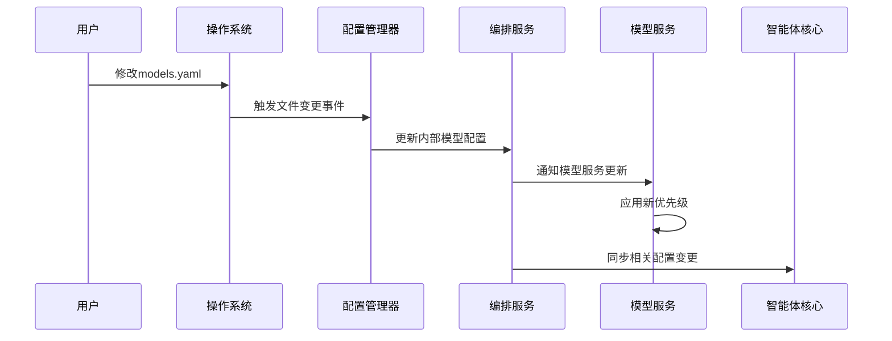

# 第一章：配置系统

欢迎来到Shannon

在第一章中，我们将探索Shannon的"大脑"——**配置系统**。这套系统如同飞机驾驶舱中的总控面板，无需修改代码即可定义整个平台的运行规则。

## 核心挑战：AI智能体的精准管控
假设我们正在构建一组AI智能体集群，需要指定它们使用特定AI模型（如GPT-4或Claude），在预算范围内运行，并遵循严格的安全策略

当需要切换成本更优的模型、调整内存限制或更新安全规则时，难道必须停机修改代码并重启整个系统吗？这对生产环境无疑是灾难性的。

这正是Shannon配置系统的价值所在。它通过灵活的配置管理，确保AI智能体在==动态调整==中持续稳定、可靠且经济高效地运行。

## 实战入门：切换AI模型
让我们从一个具体场景开始：假设我们需要指定Shannon使用的AI模型及其优先级。比如新获得了一个高效经济的模型，希望智能体优先采用；或需要为关键任务分配更多资源给高性能但昂贵的"大型"模型。

> Shannon通过**YAML**格式的配置文件实现这一需求。

### YAML格式简介
YAML（"YAML不是标记语言"的递归缩写）是一种人性化的数据序列化标准。它采用==缩进==（注意使用空格而非Tab）表示层级关系，类似大纲结构。例如：

```yaml
# 这是注释
平台名称: Shannon
版本: 0.1
功能特性:
  模型服务: 启用
  安全沙箱: 启用
```

## Shannon配置文件解析
Shannon通过多个YAML文件组织配置，存放于项目`config/`目录下：

* **`config/shannon.yaml`**：系统核心配置（端口、安全、健康检查）
* **`config/features.yaml`**：功能开关与智能体行为控制（执行模式、资源限制）
* **`config/models.yaml`**：AI模型定义与优先级配置
* **`config/opa/policies/*.rego`**：Rego语言编写的安全策略

### `config/models.yaml`
打开该文件可见`model_tiers`按规模（small/medium/large）分类模型，`providers`列出各厂商的具体模型。示例片段：

```yaml
# config/models.yaml（简化示例）
模型分级:
  小型:
    分配比例: 50  # 50%请求使用小型模型
    供应商:
      - 厂商: openai
        模型: gpt-4o-mini
        优先级: 1
      - 厂商: anthropic
        模型: claude-3-5-haiku-20241022
        优先级: 2
  中型:
    分配比例: 40
    # ...更多中型模型配置
```

### 实践：调整模型优先级
若想提升`gpt-4o-mini`的优先级，只需编辑配置文件：

```yaml
模型分级:
  小型:
    分配比例: 50
    供应商:
      - 厂商: openai
        模型: gpt-4o-mini
        优先级: 1  # 保持最高优先级
      - 厂商: anthropic
        模型: claude-3-5-haiku-20241022
        优先级: 3  # 降低该模型优先级
```

### 热重载机制
保存修改后**无需重启服务**！Shannon通过==**热重载**自动检测配置变更并立即生效==，这对需要持续可用的生产环境至关重要。

## 配置更新机制
Shannon的Go语言编排服务在启动时会建立`config/`目录的==监听器==：



### 核心代码
Go编排服务中的`ConfigManager`使用`fsnotify`库监控配置目录：

```go
// go/orchestrator/internal/config/manager.go（简化）
func (cm *ConfigManager) Start(ctx context.Context) error 
{
    cm.watcher.Add(cm.configDir)  // 监听配置目录
    go cm.watchLoop()  // 启动监听循环
}

func (cm *ConfigManager) handleWatchEvent(event fsnotify.Event) 
{
    // 处理文件变更事件
    cm.loadUpdatedConfig(event.Name)
}
```

Python模型服务通过`pydantic`加载配置：

```python
# python/llm-service/llm_service/config.py
class Settings(BaseSettings):
    openai_api_key: str = Field(env="OPENAI_API_KEY")
    class Config:
        env_file = ".env"
```

Rust智能体核心同样支持==环境变量覆盖==：

```rust
// rust/agent-core/src/config.rs
impl Config {
    pub fn load() -> AgentResult<Self> {
        if let Ok(path) = env::var("AGENT_CONFIG_PATH") {
            Self::from_file(&path)
        } else {
            Ok(Self::from_env(Self::default()))
        }
    }
}
```

## 小结
配置系统是Shannon平台的隐形支柱，通过人性化的YAML文件和热重载机制，让我们能动态管控AI模型选择、资源分配和安全策略。现在已掌握配置要诀，接下来可以探索[模型与工具服务(Python)](02_llm___tooling_service__python__.md)，了解大语言模型的==集成==之道。

[下一章：大模型与工具服务(Python)](02_llm___tooling_service__python__.md)

