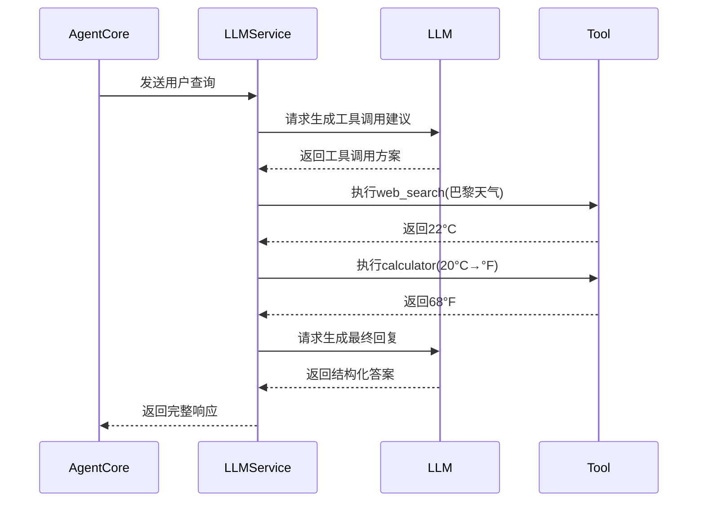

# 第二章：大模型与工具服务（Python）

欢迎回到Shannon

在[第一章关于配置系统](01_configuration_system_.md)的学习中，我们已经掌握了如何通过YAML文件灵活配置平台核心行为，甚至选择心仪的AI模型。现在，我们将深入探索Shannon的"智能中枢"——**大模型与工具服务（Python）**。

## 核心命题：赋予AI知行合一的能力
假设我们需要一个不仅能对话，还能回答如下问题的AI智能体：
_"巴黎当前天气如何？如果是20摄氏度，换算成华氏度是多少？"_

这要求AI具备两种能力：
1. **强大的认知内核（大语言模型LLM）**：==理解问题意图==，判断需获取天气信息并进行单位换算
2. **专业的执行工具**：通过网络搜索==获取==实时天气，调用计算器完成温度转换

这正是本服务的价值所在。它如同**智能接线总机**，为AI智能体动态调度大模型（"大脑"）与工具（"手足"），==将原始AI能力转化为实际问题的解决方案==。

## 任务：教会AI使用工具
让我们以天气查询为例，解析完整处理流程：
1. 理解自然语言提问
2. 识别需要获取天气数据
3. 识别需要执行温度换算
4. 调用对应工具执行
5. 生成连贯回答

## 架构解析
本Python服务通过以下模块实现智能调度：

### 1. 大语言模型（LLM）调度
- **功能定位**：对接OpenAI的GPT-4、Anthropic的Claude等各类大模型
- **智能路由**：根据`config/models.yaml`配置的模型分级（small/medium/large）和成本策略，自动选择最优模型
- **统一接口**：通过ProviderManager标准化不同厂商的API调用，对上层服务透明

### 2. 工具生态系统
- **核心工具库**：
  - `web_search`：实时网络搜索
  - `calculator`：精准数学计算
  - `python_wasi_executor`：安全沙箱执行Python代码（详见[第四章](04_agent_core__rust__.md)）
  
  > **扩展能力**：通过MCP协议集成第三方工具，描述工具功能与调用规范

### 3. 工具智能调度
- **动态选择**：服务收到任务后，先由大模型分析问题，从注册工具中推荐最佳方案
- **执行编排**：==自动组装工具调用链，处理依赖关系与数据传递==

### 4. 成本管控
- **Token计量**：实时统计各模型调用的输入/输出token量
- **费用预估**：基于配置的单价模型计算每次交互成本

## 技术实现
以下是服务核心组件的代码：

### 1. 服务主入口（`main.py`）
```python
# 初始化全局服务
cache_manager = CacheManager(settings)  # 缓存管理
provider_manager = ProviderManager(settings)  # 模型调度中心
```

### 2. 请求处理端点（`completions.py`）
```python
@router.post("/")
async def generate_completion(request: Request, body: CompletionRequest):
    # 根据请求的model_tier选择模型层级
    tier = ModelTier(body.model_tier.lower())  
    # 交由ProviderManager处理
    result = await providers.generate_completion(messages=body.messages, tier=tier)
    return result
```

### 3. 模型调度器（`manager.py`）
```python
class LLMManager:
    def _select_provider(self, request):
        # 基于config/models.yaml的优先级配置选择模型
        return self.registry.select_provider_for_request(request)

    async def complete(self, messages, model_tier):
        provider = self._select_provider(request)  # 模型选择
        response = await provider.complete(request)  # 实际调用
        self._update_usage_tracking(request, response)  # 成本统计
```

### 4. 工具执行引擎（`tools.py`）
```python
@router.post("/execute")
async def execute_tool(request: ToolExecuteRequest):
    tool = registry.get_tool(request.tool_name)  # 获取工具实例
    result = await tool.execute(**request.parameters)  # 执行工具
    return ToolExecuteResponse(output=result.output)
```

### 5. 工具实现示例（`web_search.py`）
```python
class WebSearchTool(Tool):
    def _execute_impl(self, query, max_results=5):
        results = await self.provider.search(query, max_results)  # 调用搜索API
        return ToolResult(success=True, output=results)
```

## 系统运作流程


## 小结
大模型与工具服务是Shannon平台的智能中枢，通过：
- 统一调度多厂商大模型
- 动态编排工具调用链
- 实时监控资源消耗

使AI智能体真正获得解决复杂问题的能力。

接下来我们将探索==保障系统安全==的[策略引擎(OPA)](03_policy_engine__opa__.md)。

[下一章：策略引擎(OPA)](03_policy_engine__opa__.md)

