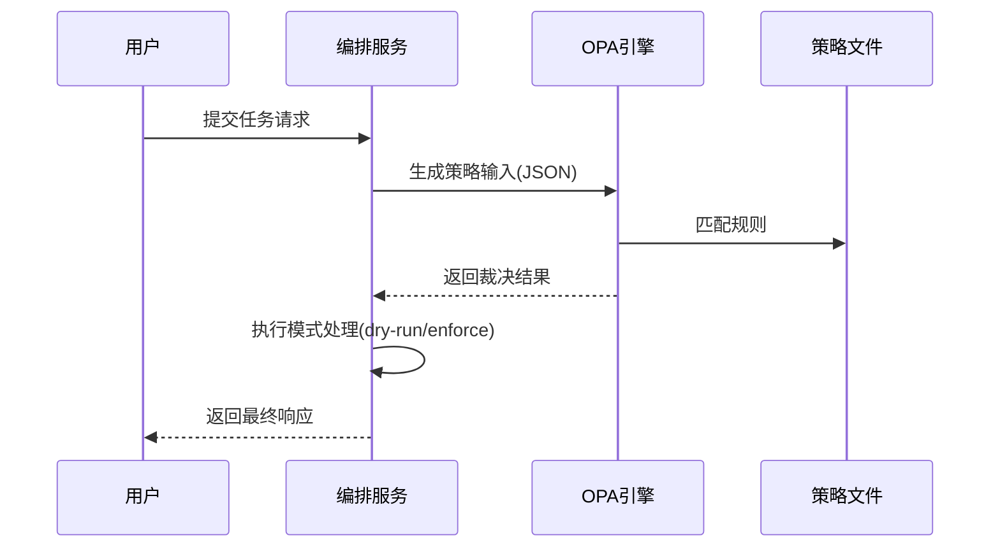

# 第三章：策略引擎（OPA）

欢迎回到Shannon

在[上一章关于大模型与工具服务（Python）](02_llm___tooling_service__python__.md)的学习中，我们了解了如何通过大语言模型和工具赋予AI智能体强大的认知与执行能力。

但强大的能力需要严格的约束——如何==确保AI智能体不会越界==操作？如何控制成本、保障安全并符合企业规范？这正是**策略引擎（OPA）**的核心使命。

## 核心命题：AI智能体的行为约束
设想Shannon是一座拥有众多聪明助手（AI智能体）的图书馆，这些助手可以调用各类书籍（AI模型）和使用工具（如计算器、网络搜索）。此时我们需要制定以下规则：
- **成本管控**：客服团队仅允许使用经济型小模型，数据科学团队可使用高性能模型但需专项审批
- **安全红线**：任何团队不得直接操作客户数据库
- **风险审批**：高危操作需人工复核

若无严格的规则手册和执行机制，这些高智能体可能引发安全漏洞、成本失控或违规操作。策略引擎正是扮演"铁面图书管理员"的角色，确保所有AI行为符合预设规范。

## 实战任务：实施团队差异化策略
以客服团队与数据科学团队为例，我们需要实现：
1. **客服团队**：仅允许使用`gpt-4o-mini`模型，禁止数据库写入工具
2. **数据科学团队**：允许使用`gpt-4o`或`claude-3-sonnet`模型，享有更高token配额

## 技术架构

[Open Policy Agent - Homepage | Open Policy Agent](https://www.openpolicyagent.org/)

Shannon采用开源项目**Open Policy Agent（OPA）**作为策略引擎。OPA如同智能裁判，接收请求上下文（用户身份、操作类型、资源使用等），基于预置规则返回`允许`或`拒绝`的裁决。

### 1. Rego规则语言
策略规则使用专为策略决策设计的**Rego语言**编写，具有声明式、易读的特点：

```rego
package shannon.example

default allow = false  # 默认拒绝所有请求

allow {  # 当满足以下条件时允许
    input.user == "Alice"  # 用户是Alice
    input.action == "read"  # 且操作为读取
}
```

### 2. 策略文件管理
所有Rego规则文件存放于`config/opa/policies/`目录，Shannon启动时会自动加载并编译这些规则。

### 3. 策略执行模式
系统支持三种执行模式，通过`config/shannon.yaml`配置：

| 模式      | 执行强度             | 适用场景     | 风险等级 |
| :-------- | :------------------- | :----------- | :------- |
| `off`     | 完全禁用             | 开发调试环境 | 高       |
| `dry-run` | 仅记录违规（不阻断） | 规则测试验证 | 中       |
| `enforce` | 严格执行阻断         | 生产环境     | 低       |

### 4. 热更新机制
与[配置系统](01_configuration_system_.md)类似，策略引擎支持**热更新**——修改Rego文件或切换模式无需重启服务，可快速响应安全策略变更。

## 策略实施示例
以下是为两个团队定制的策略规则：

### 1. 客服团队策略（`customer-support.rego`）
```rego
package shannon.teams.support

default decision = {
    "allow": false,
    "reason": "客服团队默认拒绝"
}

# 允许使用gpt-4o-mini模型
decision = {"allow": true, "reason": "允许使用经济型模型"} {
    input.team == "customer-support"
    input.model == "gpt-4o-mini"
}

# 禁止数据库写入操作
deny[reason] {
    input.team == "customer-support"
    input.tool == "database_write"
    reason := "客服团队禁止数据库写入"
}
```

### 2. 数据科学团队策略（`data-science.rego`）
```rego
package shannon.teams.datascience

default decision = {
    "allow": false,
    "reason": "数据团队默认拒绝"
}

# 允许使用高性能模型（配额≤5万token）
decision = {"allow": true, "reason": "允许数据团队专用模型"} {
    input.team == "data-science"
    input.model in ["gpt-4o", "claude-3-sonnet"]
    input.token_budget <= 50000
}
```

### 引擎配置（`shannon.yaml`片段）
```yaml
policy:
  enabled: true
  mode: "dry-run"  # 初始测试阶段采用观察模式
  path: "/app/config/opa/policies"
  fail_closed: false  # 策略加载失败时放行请求
  environment: "staging"  # 环境标识（dev/test/prod）
```

## 系统运作流程


## 代码
核心逻辑位于Go编排服务的`policy`模块：

### 1. 策略配置解析（`config.go`）
```go
type Config struct {
    Enabled     bool
    Mode        string  // "off/dry-run/enforce"
    Path        string  // 策略文件路径
    FailClosed  bool    // 故障时是否拒绝请求
}
```

### 2. 策略引擎核心（`engine.go`）
```go
type OPAEngine struct {
    compiled *rego.PreparedEvalQuery  // 预编译策略
}

func (e *OPAEngine) Evaluate(input PolicyInput) Decision {
    // 1. 转换输入为OPA格式
    // 2. 执行策略评估
    // 3. 应用执行模式（dry-run不阻断）
    return Decision{
        Allow:  true,  // 或false
        Reason: "符合数据团队规则",
    }
}
```

## 小结
策略引擎通过：
- 声明式的Rego规则语言
- 多级执行模式（dry-run/enforce）
- 动态热加载机制

为Shannon平台提供灵活强大的治理能力，确保AI智能体在安全可控的范围内发挥价值。

接下来我们将探索==AI智能体的执行核心==——[智能体核心（Rust）](04_agent_core__rust_.md)。

[下一章：智能体核心（Rust）](04_agent_core__rust_.md)

