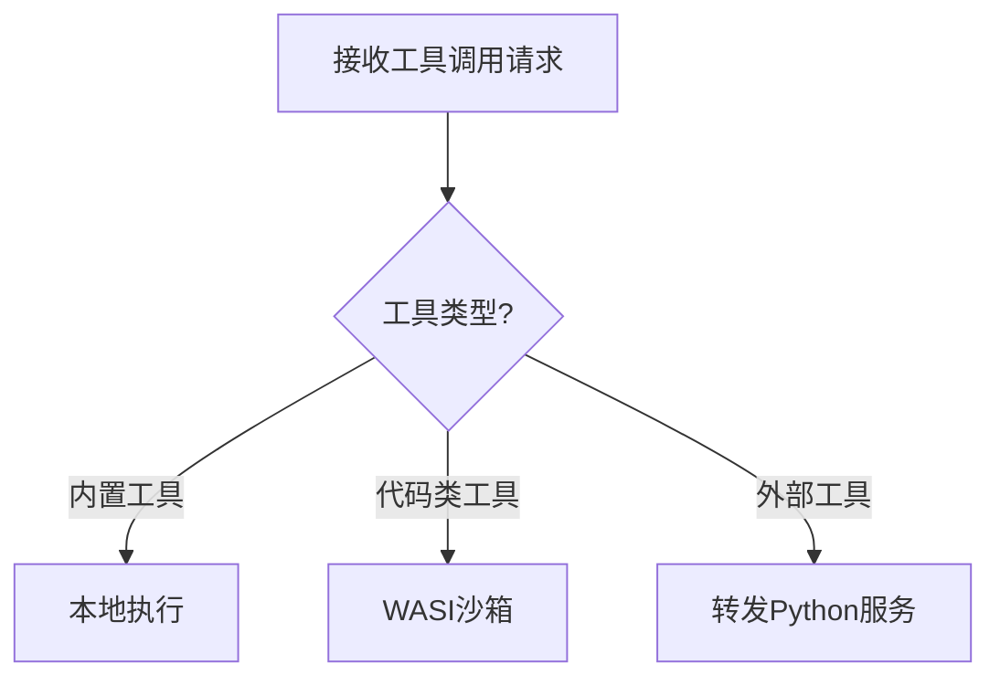

# 第四章：智能体核心（Rust）

欢迎回到Shannon

在[上一章关于策略引擎（OPA）](03_policy_engine__opa__.md)的学习中，我们了解了如何==通过Rego策略确保AI智能体的行为合规==。

但策略批准后的实际操作由谁执行？这正是**智能体核心（Rust）**的职责所在——它如同Shannon的**安全车间**，==以高性能和零信任原则执行所有任务==。

## 核心挑战：安全可靠的任务执行
假设AI智能体需要完成以下任务：
1. **计算复杂财务公式**：需保证快速准确
2. **运行Python脚本处理数据**：需防范恶意代码破坏系统

若缺乏严格管控，可能导致安全漏洞或系统崩溃。智能体核心通过以下机制解决这些问题：
- **WASI沙箱**：代码执行的隔离牢笼
- **强制访问控制**：资源限额与操作审计
- **本地化工具加速**：内置高频工具（如计算器）避免远程调用

## 架构解析

### 1. WASI沙箱：代码的隔离囚笼
- **技术本质**：基于WebAssembly系统接口（WASI）的轻量级安全容器
- **安全特性**：
  - 无默认文件系统/网络权限
  - 内存用量硬性隔离（如256MB上限）
  - CPU执行时间配额（通过"fuel"机制）
- **性能表现**：接近原生代码的执行效率

### 2. 执行网关：资源守门人
每个请求需通过四重校验：

（校验真的很重要，再写网站一定要写好安全校验，虽然可能平时没什么感觉，但一被攻击就真老实了qwq）

| 检查维度 | 控制目标     | 典型阈值            |
| :------- | :----------- | :------------------ |
| 令牌预算 | 防止资源透支 | 单请求≤1万tokens    |
| 速率限制 | 防DDoS攻击   | 每秒≤10次调用       |
| 熔断机制 | 故障自动隔离 | 连续5次失败触发熔断 |
| 超时控制 | 防长时阻塞   | 最长30秒执行时间    |

### 3. 工具执行路由
智能体核心根据工具类型选择最优执行路径：


## 演示：计算与脚本执行

### 案例1：财务公式计算
输入请求
```json
{
  "tool": "calculator",
  "parameters": {"expression": "(150 * 0.20) / 3"}
}
```

**执行流程**：
1. 网关校验令牌预算与速率限制
2. 识别为内置计算器工具
3. 调用Rust数学库`meval`直接运算
4. 返回结构化结果：
```json
{"result": 10.0, "status": "OK"}
```

### 案例2：Python脚本安全执行
**输入请求**：
```json
{
  "tool": "code_executor",
  "parameters": {
    "wasm_path": "/opt/python.wasm",
    "argv": ["-c", "print('Shannon安全执行')"]
  }
}
```

**沙箱化处理**：
1. 加载Python WASM解释器
2. 配置沙箱策略：
   - 内存上限：256MB
   - 零网络访问
   - 只读文件系统（白名单控制）
3. 捕获执行输出：
```json
{"output": "Shannon安全执行\n", "status": "OK"}
```

## 代码实现

### 1. gRPC服务入口（`grpc_server.rs`）
```rust
async fn execute_task(&self, request: Request<ExecuteTaskRequest>) -> Result<Response<ExecuteTaskResponse>> 
{
    let req = request.into_inner();
    // 强制访问控制校验
    let _permit = self.enforcer.check(&req.metadata)?; 
    // 工具路由执行
    let result = self.tool_router.execute(req.tool_call).await?;
    Ok(Response::new(result))
}
```

### 2. WASI沙箱核心（`wasi_sandbox.rs`）
```rust
pub async fn execute_wasm(&self, wasm_bytes: &[u8]) -> Result<String> {
    // 构建零信任环境
    let mut ctx = WasiCtxBuilder::new()
        .stdin(pipe::MemoryInput::new(vec![]))
        .stdout(pipe::MemoryOutput::new(1024))
        .inherit_stderr()  // 错误日志外泄
        .build();

    // 设置资源配额
    let mut store = Store::new(&self.engine, ctx);
    store.limiter(|s| &mut s.limits)
        .memory_limit(256)  // MB
        .fuel(10_000);      // 计算燃料

    // 安全执行
    let instance = self.linker.instantiate(&mut store, &Module::new(&wasm_bytes)?)?;
    instance.get_func("_start").unwrap().call(&mut store, &[])?;
    
    // 获取输出
    Ok(store.data().stdout.contents().to_string())
}
```

## 本章小结
智能体核心通过：
- **Rust语言特性**：==内存安全+高性能==
- **WASI沙箱**：代码执行的绝对==隔离==
- **四重门禁**：令牌/速率/熔断/超时控制

构建了Shannon平台的安全执行基座。

接下来我们将探索任务编排的中枢——[编排工作流（Go）](05_orchestration_workflows__go__.md)。

[下一章：编排工作流（Go）](05_orchestration_workflows__go__.md)

