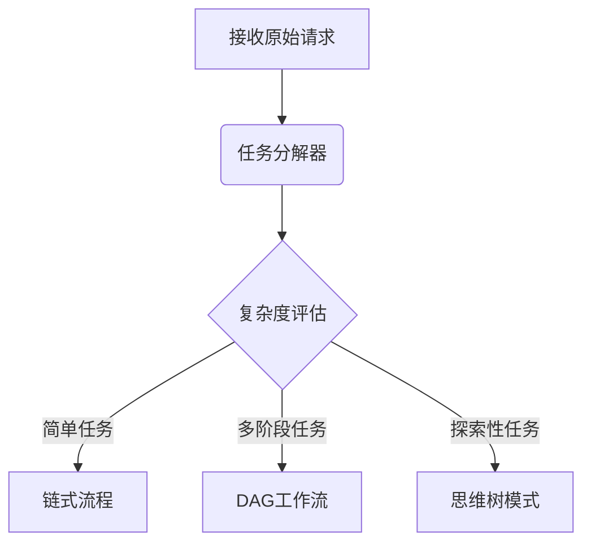

# 第五章：编排工作流（Go）

欢迎回到Shannon

在[上一章关于智能体核心（Rust）](04_agent_core__rust_.md)的学习中，我们了解了如何通过WASI沙箱和安全执行机制实现任务的安全运行

但==单个任务如何串联成完整的智能工作流==？如何将复杂请求拆解、分配，并确保在部分系统故障时仍可靠完成？这正是**编排工作流（Go）**的职责——它如同交响乐指挥大师，协调AI智能体们奏响乐章。

## 核心挑战：智能工作流的协同指挥
假设我们需要完成以下项目：
_"研究电动汽车最新市场趋势，总结前三大机遇，并撰写高管简报"_

这要求AI系统能够：
1. **理解全局目标**
2. **任务拆解**：划分为`研究`、`总结`、`报告`三个阶段
3. **动态路由**：根据子任务特性选择串行/并行策略
4. **容错处理**：当研究阶段首次失败时自动重试
5. **结果合成**：将分散结果整合为连贯交付物

若无中央协调器，这些智能但独立的模块将陷入混乱。编排工作流组件通过以下机制解决该问题：

## 架构解析

### 1. Temporal工作流引擎：永不宕机的项目管家
- **工作流（Workflow）**：定义完整项目蓝图（如研究→总结→报告的全流程）
- **活动（Activity）**：最小工作单元（如"调用LLM生成摘要"）
- **核心优势**：
  - 自动记录所有步骤状态
  - 支持断点续执行
  - 提供完整操作历史回溯

### 2. 认知模式库：AI的思维策略工具箱
系统内置多种任务处理范式：

| 模式名称         | 运作原理                 | 典型场景               |
| :--------------- | :----------------------- | :--------------------- |
| **链式思考**     | 线性分步执行             | 简单逻辑推理任务       |
| **``ReAct`循环** | 推理→执行→观察的迭代过程 | 需要工具调用的交互任务 |
| **思维树**       | 并行探索多种解决方案     | 创新性问题求解         |
| **反思优化**     | `对输出结果进行迭代`改进 | 高质量内容生成         |

### 3. 动态任务路由
工作流引擎通过以下流程实现智能调度：


## 演示：市场研究项目

### 1. 请求接收（gRPC接口）
```json
{
  "query": "研究电动汽车市场趋势，总结三大机遇并撰写高管报告",
  "user_id": "exec-123",
  "session_id": "ev-research-2023"
}
```

### 2. ==任务分解==（Decompose-Task活动）
调用LLM服务生成任务分解方案：
```json
{
  "subtasks": [
    {"id": 1, "desc": "收集全球EV市场数据", "depends_on": []},
    {"id": 2, "desc": "识别关键趋势", "depends_on": [1]},
    {"id": 3, "desc": "提炼TOP3机遇", "depends_on": [2]},
    {"id": 4, "desc": "撰写1页高管摘要", "depends_on": [3]}
  ],
  "strategy": "DAGWorkflow"
}
```

### 3. DAG工作流执行
```go
func DAGWorkflow(ctx workflow.Context, input DAGInput) (Result, error) 
{
    // 阶段1：并行执行数据收集
    futures := make([]workflow.Future, len(input.DataTasks))
    for i, task := range input.DataTasks {
        futures[i] = workflow.ExecuteChildWorkflow(ctx, DataCollectionWorkflow, task)
    }
    
    // 等待所有数据任务完成
    var trends []Trend
    for _, future := range futures {
        if err := future.Get(ctx, &trends); err != nil {
            workflow.GetLogger(ctx).Error("数据任务失败", "error", err)
            continue // 允许部分失败
        }
    }

    // 阶段2：串行执行分析任务
    analysisResult := workflow.ExecuteChildWorkflow(ctx, AnalysisWorkflow, trends).Get(ctx, &opps)
    reportResult := workflow.ExecuteChildWorkflow(ctx, ReportWorkflow, opps).Get(ctx, &report)
    
    return Result{Report: report}, nil
}
```

## 代码

### 1. 工作流注册中心（registry.go）
```go
func RegisterWorkflows(w worker.Worker) {
    // 核心路由工作流
    w.RegisterWorkflow(OrchestratorWorkflow)
    
    // 认知模式工作流
    w.RegisterWorkflow(ReactWorkflow)
    w.RegisterWorkflow(TreeOfThoughtsWorkflow)
    
    // 策略工作流
    w.RegisterWorkflow(DAGWorkflow) 
}
```

### 2. ReAct模式实现（react.go）
```go
func ReactLoop(ctx workflow.Context, query string) (Result, error) {
    for i := 0; i < maxRetries; i++ {
        // 推理阶段
        reasoning := workflow.ExecuteActivity(ctx, ReasonActivity, query).Get(ctx, &plan)
        
        // 执行阶段
        action := workflow.ExecuteActivity(ctx, ExecuteActivity, plan).Get(ctx, &result)
        
        // 观察阶段
        if result.Confidence > threshold {
            return workflow.ExecuteActivity(ctx, SynthesizeActivity, result).Get(ctx, &final)
        }
    }
    return Result{}, errors.New("超过最大重试次数")
}
```

### 3. 执行网关（agent_executor.go）
```go
type AgentExecutionInput struct {
    Query      string            `json:"query"`
    Tools      []ToolConfig      `json:"tools"` 
    Session    SessionContext    `json:"session"`
    PolicyCheck bool             `json:"policy_check"`
}

func ExecuteAgent(ctx context.Context, input AgentExecutionInput) (AgentResult, error) {
    // 策略检查
    if input.PolicyCheck {
        if err := policyClient.Check(input); err != nil {
            return AgentResult{}, err
        }
    }
    
    // 调用Rust智能体核心
    resp, err := agentCoreClient.Execute(input)
    return AgentResult{
        TokensUsed: resp.TokenUsage,
        Output:     resp.Answer,
    }, err
}
```

## 本章小结
编排工作流组件通过：
- **Temporal引擎**：提供==原子级==故障恢复能力
- **动态认知模式**：根据任务特性自动选择==最优==策略
- **DAG调度器**：复杂任务的==依赖==关系管理

构建了Shannon的==智能调度中枢==。

接下来我们将探索系统的==记忆能力==——[会话管理系统](06_session_management_.md)。

[下一章：会话管理系统](06_session_management_.md)

