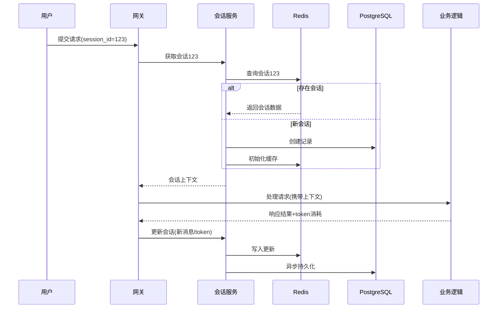

# 第六章：会话管理系统

欢迎回到Shannon

在[上一章关于编排工作流（Go）](05_orchestration_workflows__go_.md)的学习中，我们了解了如何通过Temporal引擎协调复杂AI项目的执行

但当任务完成后，==系统如何记住对话历史==？如何让智能体在下次交互时保持上下文连贯？这正是**会话管理系统**的核心价值。

## 核心挑战：AI的记忆能力
设想以下对话场景：

**用户**："今天天气怎么样？"  
**AI**："您想查询哪个城市？"  
**用户**："巴黎"  
**AI**："巴黎当前气温22℃，多云"  
**用户**："那明天呢？"

要让AI正确理解最后一个问题中的"明天"指代巴黎，需要系统具备两种记忆能力：
1. **短期记忆**：记住当前对话中的"巴黎"定位
2. **长期记忆**：记录用户偏好等持久信息

## 技术架构

### 1. ==双存储引擎==设计
| 存储类型     | 技术栈     | 数据时效性 | 典型数据                     |
| :----------- | :--------- | :--------- | :--------------------------- |
| **短期记忆** | Redis      | 会话级     | 当前对话历史、临时上下文变量 |
| **长期记忆** | PostgreSQL | 持久化     | 历史会话归档、token消耗统计  |

前文传送：

[Redis 文档学习_lvy](https://blog.csdn.net/2301_80171004/category_12835991.html?spm=1001.2014.3001.5482)

PostgreSQL运用：[[p2p-Magnet\] 数据模型(GORM) | DHT爬虫 | 分类器](https://blog.csdn.net/2301_80171004/article/details/150963176?ops_request_misc=%7B%22request%5Fid%22%3A%22481a69a5bb6b14c8135c0e5a42cf8f6b%22%2C%22scm%22%3A%2220140713.130102334.pc%5Fblog.%22%7D&request_id=481a69a5bb6b14c8135c0e5a42cf8f6b&biz_id=0&utm_medium=distribute.pc_search_result.none-task-blog-2~blog~first_rank_ecpm_v1~rank_v31_ecpm-5-150963176-null-null.nonecase&utm_term=PostgreSQL&spm=1018.2226.3001.4450)

### 2. 会话数据结构

```go
type Session struct {
    ID         string                 // 会话唯一标识
    Context    map[string]interface{} // 动态上下文(如用户偏好)
    History    []Message              // 消息历史记录
    TokenUsage TokenTracker           // token消耗统计
}

type Message struct {
    Role       string    // "user"或"assistant"
    Content    string    // 消息内容
    Tokens     int       // 消耗token数
    Timestamp  time.Time // 发生时间
}
```

### 3. ⭕核心流程


## 实战：天气查询场景

### 1. 初始请求（新建会话）
```bash
POST /api/tasks
{
  "query": "今天天气怎么样",
  "session_id": "weather-001" 
}
```
**系统响应**：
- Redis新建会话记录
- PostgreSQL创建会话元数据
- 返回响应："您想查询哪个城市？"

### 2. 后续请求（会话延续）
```bash
POST /api/tasks
{
  "query": "巴黎",
  "session_id": "weather-001"
}
```
**上下文处理**：
1. 从Redis加载完整历史记录：
   ```json
   {
     "history": [
       {"role": "user", "content": "今天天气怎么样"},
       {"role": "assistant", "content": "您想查询哪个城市？"}
     ]
   }
   ```
2. 将"巴黎"存入上下文：
   ```json
   {
     "context": {
       "location": "巴黎"
     }
   }
   ```

### 3. 最终请求（上下文理解）
```bash
POST /api/tasks
{
  "query": "那明天呢",
  "session_id": "weather-001"
}
```
**智能响应**：

1. 自动补全为"明天巴黎的天气"
2. 返回精准查询结果

## 核心代码

### 1. 会话管理器（manager.go）
```go
func (m *Manager) GetSession(ctx context.Context, id string) (*Session, error) {
    // 优先查询本地缓存
    if sess, ok := m.localCache[id]; ok {
        return sess, nil
    }

    // Redis查询
    data, err := m.redis.Get(ctx, id).Bytes()
    if err == redis.Nil {
        // 新会话持久化
        if err := m.pg.CreateSession(ctx, id); err != nil {
            return nil, err
        }
        return &Session{ID: id}, nil
    }

    // 反序列化会话
    var sess Session
    if err := json.Unmarshal(data, &sess); err != nil {
        return nil, err
    }
    
    // 更新本地缓存
    m.localCache[id] = &sess
    return &sess, nil
}
```

### 2. Token统计模块（tracker.go）
```go
func (t *Tracker) Record(ctx context.Context, sessionID string, usage TokenUsage) error {
    // 实时更新Redis
    if err := t.redis.HIncrBy(ctx, 
        fmt.Sprintf("session:%s", sessionID),
        "tokens_used",
        usage.Total).Err(); err != nil {
            return err
    }

    // 异步持久化到PostgreSQL
    go func() {
        _ = t.pg.ExecContext(ctx, `
            INSERT INTO token_usage 
            (session_id, model, tokens) 
            VALUES ($1, $2, $3)`,
            sessionID, usage.Model, usage.Total)
    }()
    
    return nil
}
```

### 3. 上下文处理器（context.go）
```go
func ProcessInput(ctx context.Context, session *Session, input string) (*Session, error) {
    // 历史消息处理（保留最近50条）
    session.History = append(session.History, Message{
        Role:    "user",
        Content: input,
    })
    if len(session.History) > 50 {
        session.History = session.History[len(session.History)-50:]
    }

    // ！！！！！！！实体提取（如地点、时间）
    if entities := extractEntities(input); entities.Location != "" {
        session.Context["location"] = entities.Location
    }

    return session, nil
}
```

## 小结
会话管理系统通过：
- **Redis高速缓存**：实现毫秒级上下文读取
- **PostgreSQL持久化**：保障数据可靠性
- **智能上下文处理**：自动提取关键信息

构建了Shannon平台的==记忆==中枢，使AI交互具备真正的连贯性。

接下来我们将探索系统的==监控能力==——[可观测性体系](07_observability_stack_.md)。

[下一章：可观测性体系](07_observability_stack_.md)

