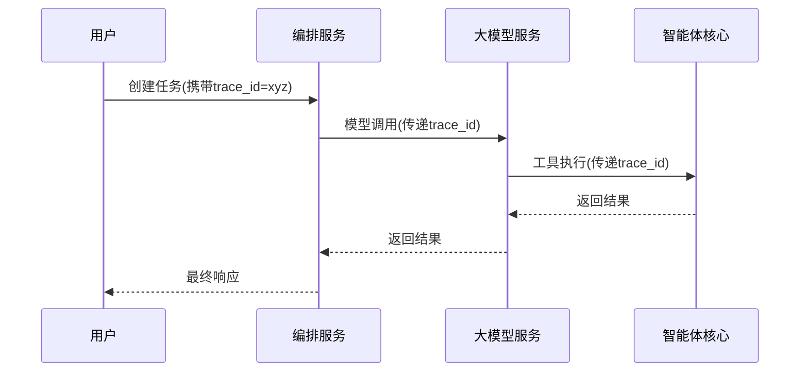

# 第七章：可观测性体系

欢迎回到Shannon

在[上一章关于会话管理系统](06_session_management_.md)的学习中，我们了解了如何让AI智能体具备记忆能力。但当智能体响应变慢或成本激增时，如何快速定位根因？**可观测性体系**正是解决这一问题的关键——它如同Shannon的**空中交通管制塔**，提供全方位系统监控能力。

## 核心挑战：AI系统的透明化
假设出现以下异常场景：
- 用户反馈："AI响应速度极慢！"
- 财务警报："今日AI成本暴涨50%！"

传统排查方式需要人工检查：
1. [大模型服务(Python)](02_llm___tooling_service__python__.md)是否过载？
2. [智能体核心(Rust)](04_agent_core__rust_.md)是否陷入复杂计算？
3. [策略引擎(OPA)](03_policy_engine__opa__.md)规则是否导致意外拒绝？
4. [会话管理](06_session_management_.md)缓存是否失效？

可观测性体系通过三大支柱解决这些问题：

## 技术架构解析

### 1. 指标监控（Prometheus）
| 指标类型 | 监控维度            | 典型场景       |
| :------- | :------------------ | :------------- |
| 吞吐量   | 请求量/秒           | 检测流量突增   |
| 延迟     | P95/P99响应时间     | 发现性能瓶颈   |
| 资源消耗 | Token消耗/成本(USD) | 成本异常预警   |
| 错误率   | 5xx错误计数         | 服务健康度评估 |

**实现示例（Go）**：
```go
// 工作流耗时统计
WorkflowDuration = prometheus.NewHistogramVec(
    prometheus.HistogramOpts{
        Name:    "shannon_workflow_duration_seconds",
        Buckets: []float64{0.1, 0.5, 1, 5, 10},
    },
    []string{"workflow_type"},
)
```

### 2. 分布式追踪（OpenTelemetry）


**关键优势**：
- 可视化全链路调用关系
- 精确定位耗时最长环节
- 跨语言服务关联分析

### 3. 可视化看板（Grafana）
Shannon提供预置看板模板：
- **全局概览**：系统健康状态总览
- **成本分析**：按服务/用户/任务分解成本
- **性能热图**：延迟分布可视化
- **实时事件流**：AI智能体活动监控

## 实战演示：慢请求诊断

### 1. 现象确认（全局看板）
- 发现`p99延迟`从500ms升至8s
- `token消耗`同比增加3倍

### 2. 下钻分析（PromQL查询）
```promql
# 查找高延迟工作流
topk(3, 
  rate(shannon_workflow_duration_seconds_sum[5m])
  /
  rate(shannon_workflow_duration_seconds_count[5m])
)
```

### 3. 根因定位（Jaeger追踪）
```json
{
  "trace_id": "abc123",
  "spans": [
    {"name": "Orchestrator", "duration_ms": 120},
    {"name": "LLMService", "duration_ms": 7800},
    {"name": "AgentCore", "duration_ms": 150}
  ]
}
```
结论：大模型服务调用耗时占比98%

## 核心代码实现

### 1. 指标埋点（Rust）
```rust
// 工具执行监控
lazy_static! {
    static ref TOOL_DURATION: HistogramVec = register_histogram_vec!(
        "tool_execution_duration_seconds",
        "Tool execution time",
        &["tool_name"],
        vec![0.01, 0.1, 1.0, 5.0]
    ).unwrap();
}

fn execute_tool(tool: &str) {
    let timer = TOOL_DURATION.with_label_values(&[tool]).start_timer();
    // ...工具逻辑...
    timer.observe_duration();
}
```

### 2. 追踪上下文传递（Python）
```python
from opentelemetry import trace

def llm_call(prompt):
    tracer = trace.get_tracer(__name__)
    with tracer.start_as_current_span("llm_inference") as span:
        span.set_attribute("model", "gpt-4")
        # ...调用逻辑...
        return result
```

### 3. 实时事件流（Dashboard）
```typescript
// 智能体活动雷达组件
function AgentRadar() {
  const [agents, setAgents] = useState<Agent[]>([]);
  
  useEffect(() => {
    const eventSource = new EventSource('/api/events');
    eventSource.onmessage = (e) => {
      setAgents(JSON.parse(e.data));
    };
    return () => eventSource.close();
  }, []);

  return <RadarVisualization agents={agents} />;
}
```

## 小结
可观测性体系通过：
- **多维度指标**：量化系统运行状态
- **全链路追踪**：透视跨服务调用
- **交互式看板**：提供决策支持
构建了Shannon平台的监控中枢，使AI系统运行状态完全透明。

至此，我们已完成Shannon核心架构的全景学习。从配置系统到可观测体系，您已掌握构建生产级AI智能体的完整方法论。

