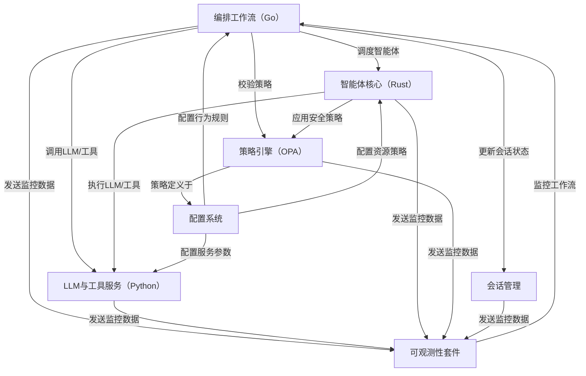

链接：[Kocoro-lab/Shannon: Kubernetes/Linux of AI Agents - An enterprise-ready AI agent platform built with Rust for performance, Go for orchestration, Python for LLMs, and Solana for Web3 trust.](https://github.com/Kocoro-lab/Shannon)

# docs：Shannon平台


Shannon是一个生产就绪的平台，专为大规模构建和运行可靠AI智能体而设计。它扮演着*总指挥*（Orchestration Workflows）的角色，负责分解复杂请求并协调多个*安全智能体*（Agent Core）在隔离沙箱中执行任务。这些智能体连接至*智能AI模型与专用工具*（LLM & Tooling Service），同时遵循*中央规则集*（Policy Engine），维护*会话记忆*（Session Management）。所有功能均可通过*主控面板*（Configuration System）配置，并由*全方位监控套件*（Observability Stack）实时追踪，确保性能、成本控制与安全性。

## 总览



## 章节导航

1. [配置系统](01_configuration_system_.md)
2. [LLM与工具服务（Python）](02_llm___tooling_service__python__.md)
3. [策略引擎（OPA）](03_policy_engine__opa__.md)
4. [智能体核心（Rust）](04_agent_core__rust__.md)
5. [编排工作流（Go）](05_orchestration_workflows__go__.md)
6. [会话管理](06_session_management_.md)
7. [可观测性套件](07_observability_stack_.md)

-----

## 构造

根据 Shannon 项目的架构，多种编程语言之间的衔接主要通过以下几种方式实现：

## 1. **基于 Temporal 的工作流编排**
- **Go** 作为主要的编排层，负责整体的工作流管理
- Temporal 提供了跨语言的工作流引擎，允许不同语言的组件在同一个工作流中协作
- 通过 Temporal 的 SDK，各语言组件可以注册为 Workers 并参与工作流执行

## 2. **WASI (WebAssembly System Interface) 沙箱**
- **Rust** 编写的代理核心可以编译为 WebAssembly 模块
- WASI 提供了标准化的系统接口，使得 Rust 代码可以在沙箱环境中安全执行
- Go 编排层可以通过 WASI 运行时加载和执行 Rust 编译的 WASM 模块

## 3. **HTTP/gRPC API 接口**
- **Python** LLM 服务通过 REST API 或 gRPC 暴露服务接口
- Go 编排层通过网络调用访问 Python 提供的 LLM 功能
- 这种松耦合的方式允许各服务独立部署和扩展

## 4. **消息队列和事件系统**
- 使用 **Redis** 作为消息中间件，实现异步通信
- 各语言组件通过发布/订阅模式进行事件驱动的交互
- 支持代理之间的消息传递和状态同步

## 5. **共享数据存储**
- **PostgreSQL** 存储持久化数据和工作流状态
- **Qdrant** 向量数据库存储嵌入向量
- 各语言组件通过标准数据库协议访问共享数据

## 6. **标准化接口和协议**
- 使用 **OpenTelemetry** 实现统一的可观察性
- **Prometheus** 指标收集，支持多语言客户端
- 通过标准协议确保各组件间的互操作性

## 架构优势

这种多语言架构设计的优势在于：

- **性能优化**：Rust 提供高性能的代理执行，Go 提供高效的并发编排
- **生态利用**：Python 拥有丰富的 AI/ML 生态系统
- **安全隔离**：WASI 沙箱确保代理执行的安全性
- **可维护性**：各组件职责清晰，可独立开发和部署

这种设计体现了现代云原生应用"选择合适工具解决特定问题"的理念，通过标准化接口和中间件实现了多语言系统的有机整合。

## go/rust/py混编

在 Shannon 这样的多语言系统中，各语言并不是真正的"混合编程"，而是通过**模块化架构**和**标准化接口**实现协作。让我详细解释各种衔接方式：

## 1. **Rust + Go 的集成方式**

### 方式一：CGO 调用 Rust 库
```go
// Go 代码
/*
#cgo LDFLAGS: -L./lib -lagent_core
#include "agent.h"
*/
import "C"

func ExecuteAgent(config string) string {
    cConfig := C.CString(config)
    defer C.free(unsafe.Pointer(cConfig))
    result := C.execute_agent(cConfig)
    return C.GoString(result)
}
```

```rust
// Rust 代码 (编译为 C 兼容库)
#[no_mangle]
pub extern "C" fn execute_agent(config: *const c_char) -> *mut c_char {
    let config_str = unsafe { CStr::from_ptr(config).to_str().unwrap() };
    let result = run_agent_logic(config_str);
    CString::new(result).unwrap().into_raw()
}
```

### 方式二：WASI WebAssembly 沙箱
```go
// Go 加载和执行 WASM 模块
import "github.com/tetratelabs/wazero"

func RunAgentInSandbox(wasmBytes []byte, input string) string {
    ctx := context.Background()
    runtime := wazero.NewRuntime(ctx)
    
    module, _ := runtime.Instantiate(ctx, wasmBytes)
    fn := module.ExportedFunction("execute_agent")
    
    result, _ := fn.Call(ctx, uint64(len(input)))
    return string(result)
}
```

```rust
// Rust 编译为 WASM
#[no_mangle]
pub extern "C" fn execute_agent(input_len: u32) -> u32 {
    // 代理执行逻辑
    let result = process_agent_task();
    result.len() as u32
}
```

## 2. **Python + Go 的集成方式**

### 方式一：HTTP/gRPC 服务调用
```python
# Python LLM 服务
from fastapi import FastAPI
import openai

app = FastAPI()

@app.post("/llm/completion")
async def completion(request: CompletionRequest):
    response = await openai.ChatCompletion.acreate(
        model="gpt-4",
        messages=request.messages
    )
    return {"content": response.choices[0].message.content}
```

```go
// Go 调用 Python 服务
type LLMClient struct {
    baseURL string
    client  *http.Client
}

func (c *LLMClient) GetCompletion(messages []Message) (string, error) {
    payload := CompletionRequest{Messages: messages}
    resp, err := c.client.Post(c.baseURL+"/llm/completion", "application/json", payload)
    // 处理响应...
    return result.Content, nil
}
```

### 方式二：嵌入式 Python 解释器
```go
// 使用 go-python 库
import "github.com/sbinet/go-python"

func CallPythonLLM(script string, args map[string]interface{}) string {
    py.Initialize()
    defer py.Finalize()
    
    module := py.PyImport_ImportModule("llm_service")
    function := module.GetAttrString("process_request")
    
    pyArgs := convertToPyDict(args)
    result := function.Call(pyArgs)
    
    return py.PyString_AsString(result)
}
```

## 3. **Temporal 工作流编排**

```go
// Go Temporal Worker
func AgentWorkflow(ctx workflow.Context, request AgentRequest) (string, error) {
    // 1. 调用 Rust 代理进行预处理
    preprocessResult, err := workflow.ExecuteActivity(ctx, 
        activities.RustPreprocess, request.Input).Get(ctx, nil)
    
    // 2. 调用 Python LLM 服务
    llmResult, err := workflow.ExecuteActivity(ctx, 
        activities.PythonLLMCall, preprocessResult).Get(ctx, nil)
    
    // 3. 调用 Rust 代理进行后处理
    finalResult, err := workflow.ExecuteActivity(ctx, 
        activities.RustPostprocess, llmResult).Get(ctx, nil)
    
    return finalResult, nil
}
```

```python
# Python Temporal Activity
from temporalio import activity

@activity.defn
async def python_llm_call(input_data: str) -> str:
    # 使用 Python AI/ML 生态
    import torch
    import transformers
    
    model = transformers.AutoModel.from_pretrained("gpt-4")
    result = model.generate(input_data)
    return result
```

## 4. **消息队列异步通信**

```go
// Go 发布消息
func PublishAgentTask(task AgentTask) error {
    client := redis.NewClient(&redis.Options{Addr: "localhost:6379"})
    
    taskJSON, _ := json.Marshal(task)
    return client.Publish(ctx, "agent_tasks", taskJSON).Err()
}
```

```python
# Python 订阅处理
import redis
import json

def process_agent_tasks():
    r = redis.Redis(host='localhost', port=6379)
    pubsub = r.pubsub()
    pubsub.subscribe('agent_tasks')
    
    for message in pubsub.listen():
        task = json.loads(message['data'])
        result = run_ml_inference(task)
        
        # 发布结果
        r.publish('agent_results', json.dumps(result))
```

## 5. **共享数据存储**

```rust
// Rust 写入向量数据
use qdrant_client::prelude::*;

async fn store_embeddings(vectors: Vec<Vec<f32>>) -> Result<()> {
    let client = QdrantClient::from_url("http://localhost:6334").build()?;
    
    let points: Vec<PointStruct> = vectors.into_iter()
        .enumerate()
        .map(|(id, vector)| PointStruct::new(id as u64, vector, payload))
        .collect();
    
    client.upsert_points_blocking("agents", points, None).await?;
    Ok(())
}
```

```python
# Python 查询向量数据
from qdrant_client import QdrantClient

def search_similar_agents(query_vector):
    client = QdrantClient("localhost", port=6334)
    
    search_result = client.search(
        collection_name="agents",
        query_vector=query_vector,
        limit=10
    )
    
    return [hit.payload for hit in search_result]
```

## 关键设计原则

1. **松耦合架构**：各语言组件通过标准接口通信，而非直接调用
2. **容器化部署**：每个语言组件独立容器化，便于扩展和维护
3. **标准化协议**：使用 HTTP、gRPC、消息队列等标准协议
4. **数据驱动**：通过共享数据存储实现状态同步
5. **异步处理**：利用消息队列实现非阻塞的异步处理

这种架构让每种语言都能发挥其最大优势，同时保持系统的整体一致性和可维护性。