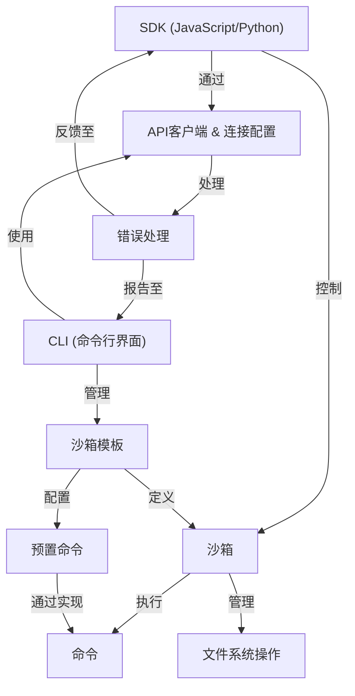

链接：[Documentation - E2B](https://e2b.dev/docs/support)

# docs：E2B

E2B提供了一套*开源基础设施*，允许我们在**安全隔离的云沙箱**中运行AI生成的代码

开发者通过**SDK**（JavaScript/Python）*远程控制*这些沙箱，执行命令并管理文件

**沙箱模板**作为*可定制的蓝图*定义执行环境，便于快速部署专为特定AI任务优化的沙箱。

## 可视化

## 章节

1. [沙箱](01_sandbox_.md)
2. [沙箱模板](02_sandbox_templates_.md)
3. [SDK (JavaScript/Python)](03_sdk__javascript_python__.md)
4. [CLI (命令行界面)](04_cli__command_line_interface__.md)
5. [命令](05_commands_.md)
6. [文件系统操作](06_filesystem_operations_.md)
7. [预置命令](07_ready_commands_.md)
8. [API客户端 & 连接配置](08_api_client___connection_config_.md)
9. [错误处理](09_error_handling_.md)

---
