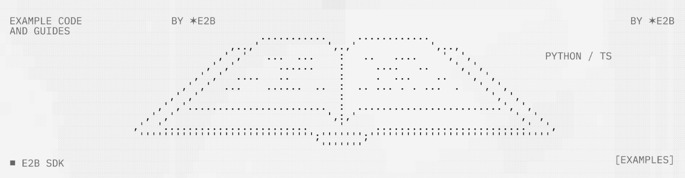
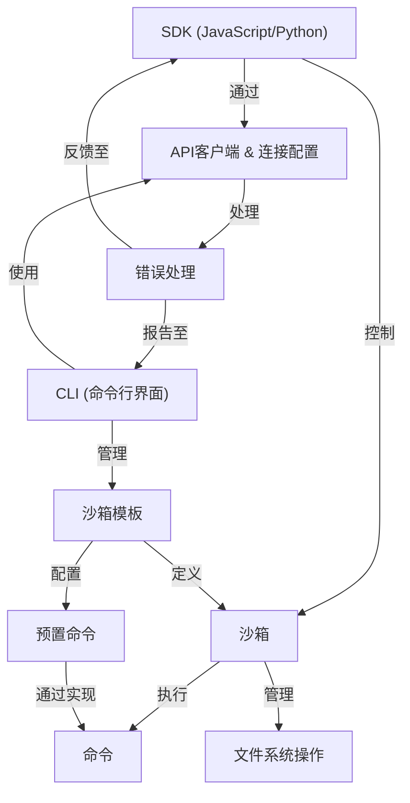
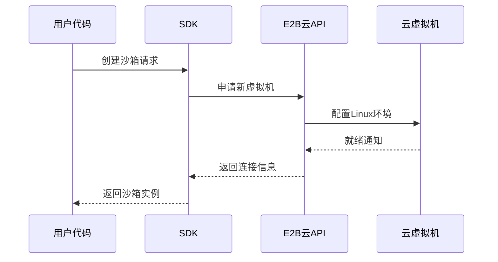

链接：[Documentation - E2B](https://e2b.dev/docs/support)



# docs：E2B

E2B提供了一套*开源基础设施*，允许我们在**安全隔离的云沙箱**中运行AI生成的代码

开发者通过**SDK**（JavaScript/Python）*远程控制*这些沙箱，执行命令并管理文件

**沙箱模板**作为*可定制的蓝图*定义执行环境，便于快速部署专为特定AI任务优化的沙箱。

## 可视化



## 章节

1. [沙箱](01_sandbox_.md)
2. [沙箱模板](02_sandbox_templates_.md)
3. [SDK (JavaScript/Python)](03_sdk__javascript_python__.md)
4. [CLI (命令行界面)](04_cli__command_line_interface__.md)
5. [命令](05_commands_.md)
6. [文件系统操作](06_filesystem_operations_.md)
7. [预置命令](07_ready_commands_.md)
8. [API客户端 & 连接配置](08_api_client___connection_config_.md)
9. [错误处理](09_error_handling_.md)

---
# 第1章：沙箱环境

欢迎来到E2B

如果你想安全高效地运行AI生成的代码，这里正是你需要的。在E2B中首先接触的核心概念就是**沙箱环境**。

## 什么是沙箱？

假设你需要测试一段由AI（或他人）编写的代码，但不确定它的具体行为，或者担心它可能对本地计算机造成危害。直接在本地运行可能存在风险

这时E2B沙箱就派上用场了。你可以把它想象成**云端运行的、安全隔离的微型计算机**，就像拥有一个独立的防护空间，在这里运行代码不会影响其他任何系统。

这个微型计算机提供以下功能：

* **Linux操作系统**：与多数服务器和开发机相同的标准Linux环境，支持熟悉的命令和工具
* **文件系统**：可存储管理文件，支持创建/读取/写入/删除等操作
* **命令执行**：能够运行`ls`、`pip install`、`node index.js`或`python main.py`等命令并返回结果

沙箱是E2B的**核心执行环境**，所有AI代码运行、文件操作和命令执行都在沙箱内完成。

## 为什么使用沙箱？

主要优势包括：

1. **安全性**：保护主机系统免受潜在恶意代码或错误代码影响
2. **隔离性**：每个沙箱相互独立，互不可见互不干扰
3. **一致性**：每次创建的沙箱环境完全相同，避免"在我机器上能运行"的问题

## 快速体验

### 准备工作

需要先准备：
1. **E2B SDK**（任选其一安装）：
```bash
npm i @e2b/code-interpreter  # JavaScript/TypeScript
```
```bash
pip install e2b-code-interpreter  # Python
```

2. **API密钥**：
从[E2B控制台](https://e2b.dev/dashboard?tab=keys)获取后设置为环境变量：
```bash
E2B_API_KEY=e2b_***
```

### 创建沙箱

**JavaScript/TypeScript示例**：

```ts
import { Sandbox } from '@e2b/code-interpreter'

const sandbox = await Sandbox.create()
console.log(`沙箱ID: ${sandbox.sandboxId}`)
await sandbox.close()  // 使用完毕后关闭
```

**Python示例**：

```python
from e2b_code_interpreter import Sandbox

with Sandbox.create() as sandbox:  # with语法自动关闭
    print(f"沙箱ID: {sandbox.sandbox_id}")
```

### 执行代码

**打印消息示例**：

```ts
const execution = await sandbox.runCode('print("你好E2B!")')
console.log(execution.text)  // 输出: 你好E2B!
```


```python
execution = sandbox.run_code('print("你好E2B!")')
print(execution.text)  # 输出: 你好E2B!
```

## 技术原理

当调用`Sandbox.create()`时，后台流程如下：



## 核心特性

| 特性          | 说明               |
| ------------- | ------------------ |
| **安全隔离**  | 完全独立的执行环境 |
| **Linux系统** | 标准开发环境       |
| **文件管理**  | 完整的文件系统操作 |
| **云端托管**  | 无需本地配置       |

现在你已了解基础沙箱操作，下一章我们将学习如何定制沙箱环境！

[下一章：沙箱模板](02_sandbox_templates_.md)

