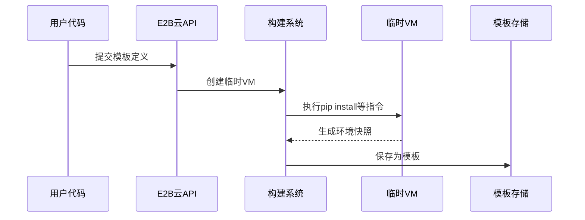

# 第2章：沙箱模板

欢迎回来

在[第1章：沙箱](01_sandbox_.md)中，我们学习了E2B沙箱——云端的安全隔离微型计算机

但如果我们需要的不是标准环境，而是预装特定工具（如Python数据分析库或Node.js工具链）的定制环境呢？

## 什么是沙箱模板？

沙箱模板是**预配置的沙箱蓝图**，相当于定制化的虚拟机镜像。它允许我们定义：
- **基础镜像**：如Python 3.11或Ubuntu 22.04
- **预装依赖**：如`numpy`、`pandas`等Python库
- **环境变量**：如`DEBUG_MODE=true`
- **初始化命令**：沙箱启动时自动执行的命令

## 模板解决的问题

假设AI需要运行数据分析代码，标准沙箱需每次手动安装依赖：
```python
pip install numpy pandas
```
通过模板，我们可以==创建预装所有依赖的环境，实现开箱即用==。

## 创建数据科学模板

### 1. 定义模板

**JavaScript/TypeScript示例**：
```ts
import { Template } from 'e2b'

const dsTemplate = Template()
  .fromPythonImage('3.11')  // Python基础镜像
  .pipInstall('numpy pandas')  // 预装库
```

**Python示例**：
```python
from e2b import Template

ds_template = (
    Template()
    .from_python_image('3.11')
    .pip_install('numpy pandas')
)
```

### 2. 构建模板

**构建命令**：
```ts
await Template.build(dsTemplate, {
  alias: 'py-data-science'  // 模板别名
})
```

```python
Template.build(
    ds_template,
    alias='py-data-science'
)
```

### 3. 使用模板

**创建预装环境的沙箱**：
```ts
const sandbox = await Sandbox.create({
  template: 'py-data-science'  // 指定模板
})
```

```python
with Sandbox.create(template='py-data-science') as sandbox:
    sandbox.run_code("import numpy as np")  # 无需安装
```

## 模板构建方法

| 方法              | 说明           | 示例                       |
| ----------------- | -------------- | -------------------------- |
| `fromPythonImage` | Python基础镜像 | `.fromPythonImage('3.11')` |
| `pipInstall`      | 安装Python包   | `.pipInstall('requests')`  |
| `copy`            | 复制文件到沙箱 | `.copy('app.py', '/app/')` |
| `setEnvs`         | 设置环境变量   | `.setEnvs({DEBUG:'true'})` |

## 技术原理

模板构建流程：
1. 用户通过SDK定义模板指令
2. E2B云端创建临时构建环境
3. 按顺序执行所有指令（安装依赖/复制文件等）
4. 生成环境快照并存储为模板



现在已掌握创建定制化沙箱环境的方法，下一章我们将深入探索SDK的使用

[下一章：SDK详解](03_sdk__javascript_python__.md)

