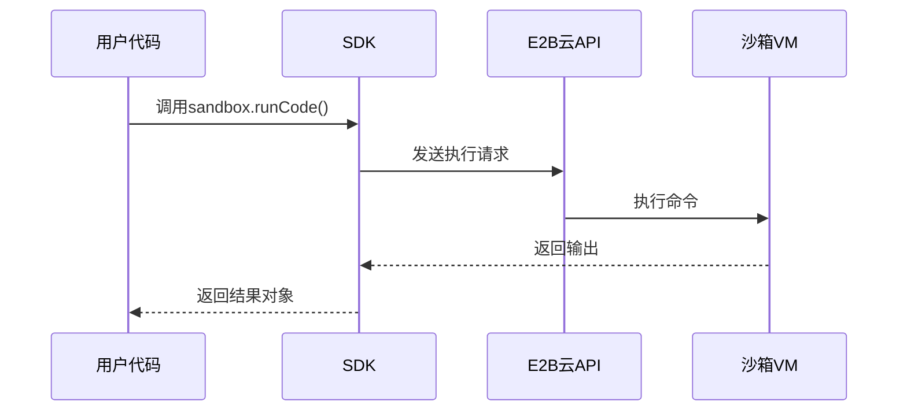
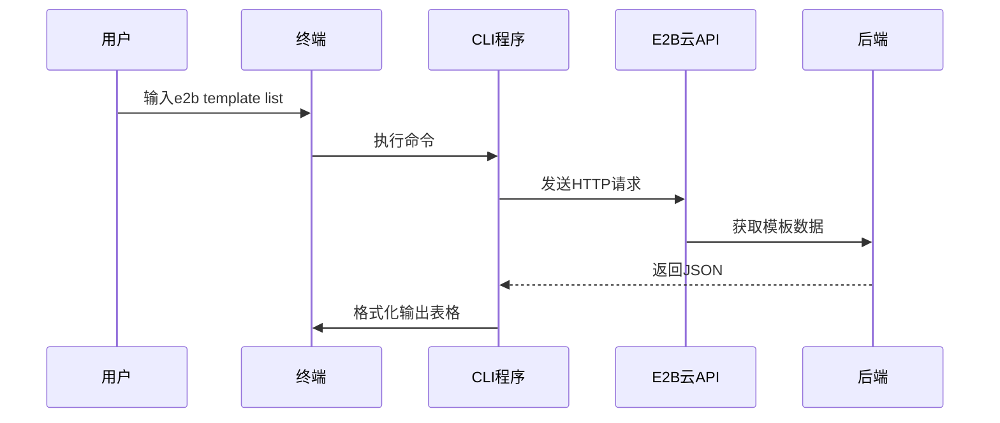

# 第3章：SDK（JavaScript/Python）

欢迎回来

在[第1章：沙箱](01_sandbox_.md)中，我们了解了云端的安全隔离微型计算机。在[第2章：沙箱模板](02_sandbox_templates_.md)中，我们学习了如何通过蓝图定制这些环境。现在，我们将探索如何通过程序与这些沙箱和模板进行交互。

## SDK的作用

想象你有一台智能电视，但没有遥控器。如何换台、调节音量或关机？只能手动操作电视按钮，非常不便

E2B SDK就是你的==遥控器==，它是工具库集合，让你能够：
- 创建沙箱（启动云端计算机）
- 运行命令或代码（执行操作）
- 管理文件（读写数据）
- 控制模板（定制环境）

## 快速入门

### 1. 安装SDK

**JavaScript/TypeScript**：
```bash
npm i @e2b/code-interpreter
```

**Python**：
```bash
pip install e2b-code_interpreter
```

### 2. 基础用法

**创建沙箱并运行代码**：
```ts
import { Sandbox } from '@e2b/code-interpreter'

const sandbox = await Sandbox.create()
const result = await sandbox.runCode('print("Hello E2B")')
console.log(result.text) // 输出: Hello E2B
await sandbox.close()
```

```python
from e2b_code_interpreter import Sandbox

with Sandbox.create() as sandbox:
    result = sandbox.run_code('print("Hello E2B")')
    print(result.text)  # 输出: Hello E2B
```

## 功能

| 功能         | 说明                 | 示例                        |
| ------------ | -------------------- | --------------------------- |
| **沙箱管理** | 创建/关闭沙箱        | `Sandbox.create()`          |
| **代码执行** | 运行Python/Shell代码 | `sandbox.runCode('ls -l')`  |
| **文件操作** | 读写沙箱内文件       | `sandbox.filesystem.read()` |
| **模板控制** | 构建/使用定制模板    | `Template.build()`          |

## 原理

调用SDK方法时的内部流程：
1. 代码调用`Sandbox.create()`
2. SDK将请求转换为HTTP消息
3. E2B云端API接收并分配资源
4. 沙箱执行操作并返回结果
5. SDK将结果封装为对象返回



## 下一步

现在已掌握通过代码控制沙箱的方法，下一章将介绍更便捷的**命令行工具(CLI)**

[下一章：命令行接口](04_cli__command_line_interface_.md)

---

# 第4章：命令行界面(CLI)

在[第3章：SDK](03_sdk__javascript_python__.md)中，我们学习了如何通过编程方式控制E2B沙箱和模板

但如果我们只是想快速检查状态、构建模板或连接沙箱，而不想编写代码呢？这就是**命令行界面(CLI)**的用武之地

## CLI的价值

CLI是专为开发者设计的**终端工具**，能够：
- **快速开发**：无需编写代码即可管理[沙箱模板](02_sandbox_templates_.md)
- **调试**：查看运行中的[沙箱](01_sandbox_.md)或直接连接终端
- **简单自动化**：在Shell脚本中集成基础操作

## 快速上手

### 1. 安装CLI

**macOS (Homebrew)**:
```bash
brew install e2b
```

**全局安装 (npm)**:
```bash
npm install -g @e2b/cli
```

验证安装：
```bash
e2b --version
```

### 2. 登录认证

```bash
e2b auth login
```
浏览器会自动打开完成认证。无图形界面环境可设置`E2B_ACCESS_TOKEN`环境变量：
```bash
E2B_ACCESS_TOKEN=sk_e2b_... e2b template build my-template
```

## 核心功能

### 模板管理

**列出所有模板**：
```bash
e2b template list
```

**通过Dockerfile构建模板**：
```bash
e2b template build my-template
```

### 沙箱操作

**查看运行中的沙箱**：
```bash
e2b sandbox list
```

**连接沙箱终端**：
```bash
e2b sandbox connect 沙箱ID
# 输入exit退出
```

## 技术原理

CLI本质是SDK的终端封装：
1. 解析用户输入的命令
2. 调用对应SDK方法
3. 格式化返回结果



## 下一步

现在你已掌握通过终端管理E2B资源的方法，下一章将深入探索[命令系统](05_commands_.md)！

[下一章：命令系统](05_commands_.md)


