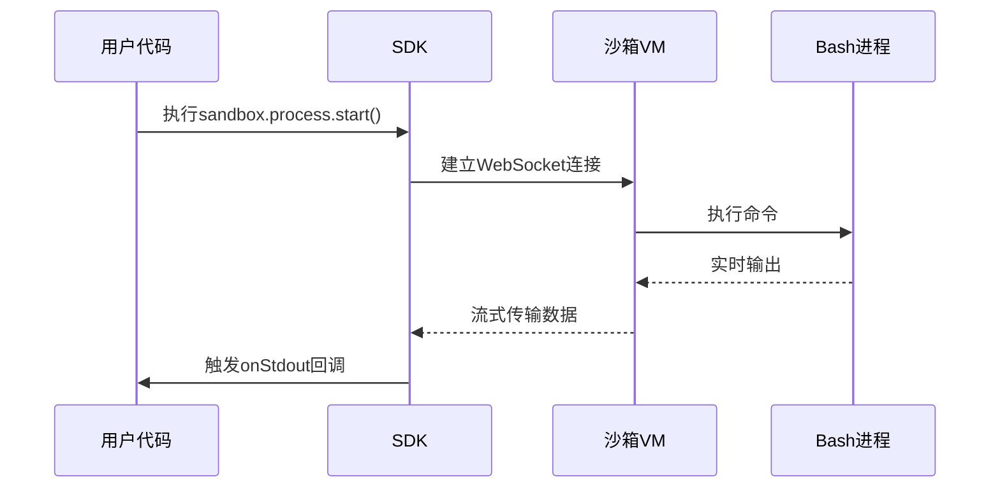
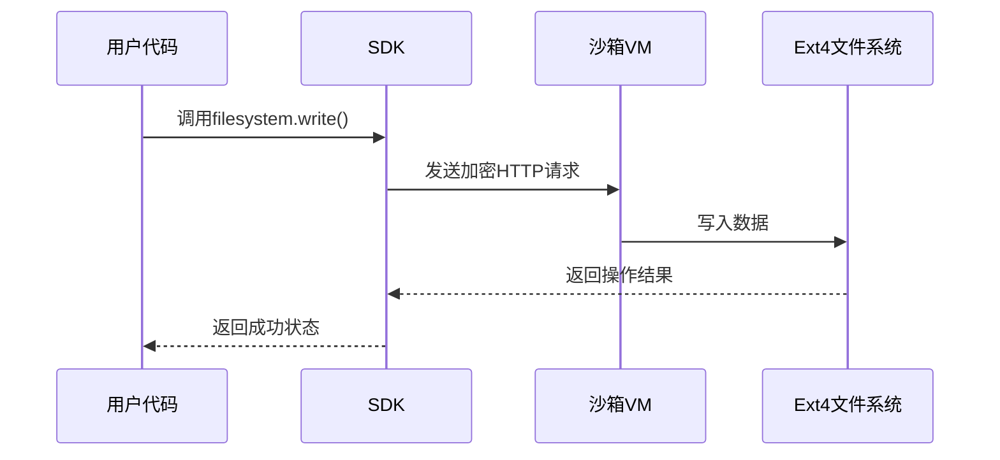

# 第5章：命令系统

欢迎回来

在前几章中，我们已经了解了[沙箱](01_sandbox_.md)的基础知识，以及如何通过[SDK](03_sdk__javascript_python__.md)和[CLI](04_cli__command_line_interface__.md)控制它。现在，我们将深入探索如何在沙箱中**执行命令**——这是与云端迷你计算机交互的核心方式。

## 命令系统的作用

命令系统允许我们：
- **运行代码**：执行Python脚本或Shell命令
- **安装依赖**：通过`pip install`等命令配置环境
- **操作系统交互**：管理文件、查看进程等

## 基础用法

### 执行简单命令

**JavaScript/TypeScript示例**：
```ts
import { Sandbox } from '@e2b/code-interpreter'

const sandbox = await Sandbox.create()
const proc = await sandbox.process.start({ cmd: 'ls -l' })
await proc.wait()
console.log('命令输出:', proc.output.stdout)
await sandbox.close()
```

**Python示例**：
```python
from e2b import Sandbox

with Sandbox() as sandbox:
    proc = sandbox.process.start(cmd='ls -l')
    proc.wait()
    print('命令输出:', proc.stdout)
```

### 实时输出流

**获取实时输出**：
```ts
const proc = await sandbox.process.start({
  cmd: 'echo "实时输出测试"',
  onStdout: (output) => console.log('实时:', output.line)
})
```

### 交互式命令

**发送输入**：
```python
proc = sandbox.process.start(
  cmd='read -p "请输入:" input && echo $input',
  stdin=True
)
proc.send_stdin('你好E2B!\n')
```

## 功能

| 功能           | 说明                     | 示例                    |
| -------------- | ------------------------ | ----------------------- |
| **后台进程**   | 不阻塞主程序执行         | `background=True`       |
| **终止进程**   | 强制结束长时间运行的任务 | `proc.kill()`           |
| **获取进程ID** | 追踪特定进程             | `console.log(proc.pid)` |

## 完整工作流

**运行AI生成的Python脚本**：
```ts
// 1. 保存AI生成的代码
await sandbox.filesystem.write('/main.py', 'print("AI生成内容")')

// 2. 执行脚本
const proc = await sandbox.process.start({
  cmd: 'python3 /main.py',
  onStdout: (output) => console.log('AI输出:', output.line)
})
await proc.wait()
```

## 技术原理

当执行命令时：
1. SDK通过WebSocket连接沙箱
2. 沙箱启动bash进程执行命令
3. 实时流式传输输出回本地
4. 通过进程句柄管理生命周期



## 下一步

现在已掌握命令执行的核心方法，下一章将探索[文件系统操作](06_filesystem_operations_.md)

[下一章：文件系统操作](06_filesystem_operations_.md)

---
# 第6章：文件系统操作

在[第5章：命令系统](05_commands_.md)中，我们学习了如何在沙箱中执行命令。现在，我们将探索如何通过文件系统持久化数据——这是AI代理存储配置、加载资源和保存结果的关键能力。

## 核心功能

### 1. 文件写入

**保存配置文件**：
```ts
await sandbox.filesystem.write('/config.txt', 'api_key=123\nmode=debug')
```

**写入二进制数据**：
```python
sandbox.filesystem.write_bytes('/data.bin', bytearray(b'\x00\xFF'))
```

### 2. 文件读取

**读取文本内容**：
```ts
const config = await sandbox.filesystem.read('/config.txt')
```

**读取二进制文件**：
```python
data = sandbox.filesystem.read_bytes('/data.bin')
```

### 3. 目录管理

**创建多级目录**：
```ts
await sandbox.filesystem.makeDir('/data/logs/2023')
```

**列出目录内容**：
```python
items = sandbox.filesystem.list('/')
for item in items:
    print(f"{item.name} ({'文件' if item.type == 'file' else '目录'})")
```

## 完整工作流示例

**配置管理场景**：
1. 写入配置文件
2. 创建日志目录
3. 验证文件结构

```ts
// 1. 写入配置
await sandbox.filesystem.write('/app.conf', 'timeout=30')

// 2. 创建目录
await sandbox.filesystem.makeDir('/var/log/app')

// 3. 验证
const lsResult = await sandbox.filesystem.list('/')
console.log(lsResult.map(x => x.name)) // 输出: ['app.conf', 'var', ...]
```

## 技术原理

文件操作通过两种方式实现：
1. **小文件**：直接通过RPC调用处理
2. **大文件**：通过HTTP分块传输



该架构采用**==双通道==设计**：

- 小文件走低延迟的RPC协议保证实时性，大文件用HTTP分块传输确保吞吐量和稳定性

通过==智能路由==实现性能与可靠性的最佳平衡

## 下一步

现在你已掌握文件系统操作，下一章将介绍更高效的[预制命令](07_ready_commands_.md)

[下一章：预制命令](07_ready_commands_.md)

