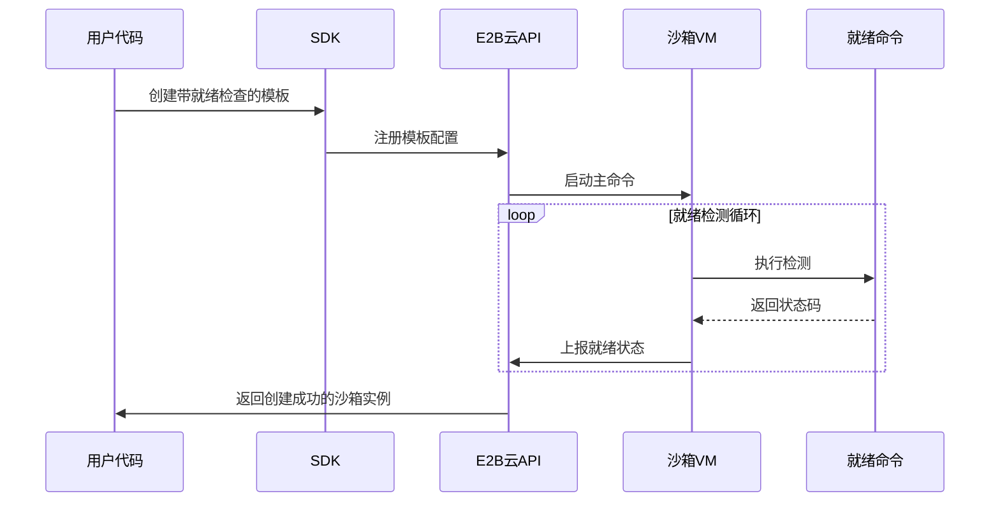
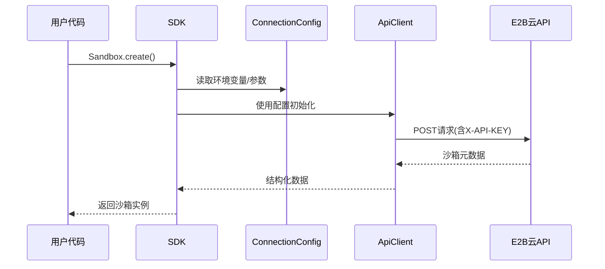
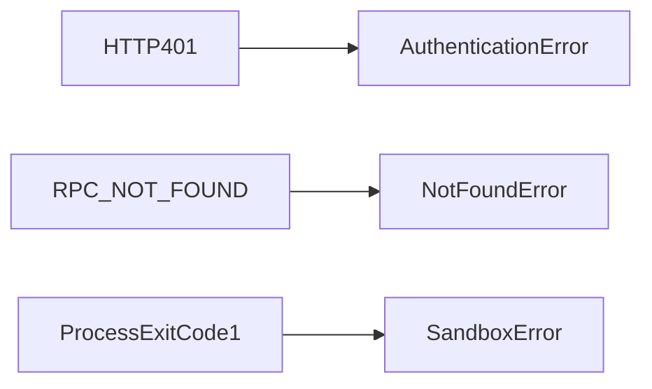

# 第7章：就绪命令

在[第6章：文件系统操作](06_filesystem_operations_.md)中，我们学习了如何管理沙箱内的文件

现在，我们将探索**就绪命令**——确保复杂应用（如Web服务器或数据库）完全启动后再交互的关键机制。

## 核心功能

### 1. 定义就绪条件

**创建带就绪检查的模板**：
```ts
const template = Template()
  .fromPythonImage('3.11')
  .setStartCmd(
    'python3 -m http.server 8000', // 主命令
    waitForPort(8000) // 就绪命令：检测端口
  )
```

### 2. 自动等待机制

**创建沙箱时会阻塞直至条件满足**：
```python
with Sandbox(template='web-server-template') as sandbox:
    # 此处服务器已确认就绪
    print(sandbox.process.run('curl localhost:8000').stdout)
```

## 常用就绪检查器

| 检查类型     | 作用描述         | JavaScript示例            | Python示例                  |
| ------------ | ---------------- | ------------------------- | --------------------------- |
| 端口检测     | 等待特定端口开放 | `waitForPort(3000)`       | `wait_for_port(3000)`       |
| URL可达性    | 验证HTTP服务响应 | `waitForURL('/health')`   | `wait_for_url('/health')`   |
| 文件存在性   | 检查文件是否生成 | `waitForFile('/ready')`   | `wait_for_file('/ready')`   |
| 进程运行状态 | 确认守护进程启动 | `waitForProcess('nginx')` | `wait_for_process('nginx')` |

## 技术实现原理

1. **模板构建阶段**：将就绪命令（如`ss -tuln | grep :8000`）存入模板元数据
2. **沙箱启动阶段**：
   - 启动主命令（如Python HTTP服务）
   - 循环执行就绪命令直至返回0（成功）或超时



## 完整示例

**Node.js服务就绪检测**：
```ts
// 1. 构建模板
const nodeTemplate = Template()
  .fromNodeImage('18')
  .setStartCmd(
    'npm start', // 启动Node服务
    waitForURL('http://localhost:3000/health') // 就绪条件
  )
await Template.build(nodeTemplate, { alias: 'node-app' })

// 2. 使用模板（自动等待就绪）
const sandbox = await Sandbox.create({ template: 'node-app' })
console.log('服务已就绪！')
```

## 下一步

现在已掌握就绪命令的使用方法，下一章将深入探讨[API客户端与连接配置](08_api_client___connection_config_.md)！

[下一章：API客户端与连接配置](08_api_client___connection_config_.md)

---
# 第8章：API客户端与连接配置

在[第7章：就绪命令](07_ready_commands_.md)中，我们学习了如何确保沙箱完全就绪后再进行交互。现在，我们将深入探讨**API客户端与连接配置**——这是本地代码与E2B云服务安全通信的核心机制。

## 核心组件

### 1. 连接配置（ConnectionConfig）

**作用**：存储所有连接E2B服务所需的参数，包括：
- `apiKey`：身份验证密钥（优先从环境变量`E2B_API_KEY`读取）
- `domain`：服务域名（如`e2b.app`）
- `debug`：调试模式开关
- `requestTimeoutMs`：请求超时时间

**推荐用法**（通过环境变量配置）：
```bash
export E2B_API_KEY=your_secret_key
```

### 2. API客户端（ApiClient）

**职责**：
- 基于`ConnectionConfig`发起HTTP请求
- 自动添加`X-API-KEY`请求头
- 处理错误响应和日志记录

## 工作流程示例

当调用`Sandbox.create()`时：
1. SDK自动初始化`ConnectionConfig`
2. 创建配置好的`ApiClient`实例
3. 发送携带认证头的请求到`https://api.e2b.app/sandboxes`
4. 接收并封装返回的沙箱信息



## 代码实现

**JavaScript SDK核心逻辑**：
```ts
// 配置读取优先级：构造函数参数 > 环境变量
class ConnectionConfig {
  static get apiKey() {
    return process.env.E2B_API_KEY // 从环境变量读取
  }
}

class ApiClient {
  constructor(config: ConnectionConfig) {
    this.api = createClient({
      baseUrl: config.apiUrl,
      headers: { 'X-API-KEY': config.apiKey } // 自动注入密钥
    })
  }
}
```

## 安全建议

1. **永远不要硬编码API密钥**：始终通过环境变量传递
2. **区分环境**：为开发/生产环境使用不同密钥
3. **设置合理超时**：避免因网络问题无限等待

## 下一步

现在已掌握安全连接机制，下一章将探讨[错误处理](09_error_handling_.md)的最佳实践

[下一章：错误处理](09_error_handling_.md)

---
# 第9章：错误处理

在[第8章：API客户端与连接配置](08_api_client___connection_config_.md)中，我们学习了如何安全连接E2B服务。现在，我们将探讨**错误处理**——这是构建健壮AI应用的关键能力。

## 核心错误类型

| 错误类型             | 触发场景              | 处理建议                     |
| -------------------- | --------------------- | ---------------------------- |
| **认证错误**         | API密钥无效或缺失     | 检查`E2B_API_KEY`环境变量    |
| **超时错误**         | 沙箱启动/命令执行超时 | 增加超时阈值或优化启动流程   |
| **无效参数错误**     | 非法路径或参数格式    | 验证输入有效性               |
| **资源未找到错误**   | 访问不存在的沙箱/文件 | 检查资源ID或路径             |
| **磁盘空间不足错误** | 沙箱存储空间耗尽      | 清理文件或使用更大容量的沙箱 |

## 最佳实践示例

### 1. 认证错误处理

**JavaScript/TypeScript**:
```ts
try {
  await Sandbox.create() // 未提供API密钥
} catch (err) {
  if (err instanceof AuthenticationError) {
    console.error('请设置E2B_API_KEY环境变量')
  }
}
```

**Python**:
```python
try:
    Sandbox.create() # 未提供API密钥
except AuthenticationException as e:
    print("请设置E2B_API_KEY环境变量")
```

### 2. 命令执行容错

**捕获非零退出码**:
```ts
const proc = await sandbox.process.start({ cmd: 'invalid_cmd' })
try {
  await proc.wait()
} catch (err) {
  if (err instanceof SandboxError) {
    console.error(`命令执行失败，退出码: ${proc.output.exitCode}`)
  }
}
```

## 技术实现原理

SDK内部通过错误映射层将底层协议错误转换为标准错误类型：



## 完整处理流程

1. **捕获**：使用`try/catch`包裹可能失败的操作
2. **识别**：通过`instanceof`检查具体错误类型
3. **恢复**：根据错误类型执行补救措施
4. **日志**：记录错误上下文供调试分析

## 下一步

这是E2B核心概念系列的最后一章！你现在已经掌握：
- 沙箱生命周期管理
- 命令执行与文件操作
- 安全连接配置
- 健壮的错误处理

接下来可以开始构建你自己的AI应用了

END *★,°*:.☆(￣▽￣)/*.°★* 。