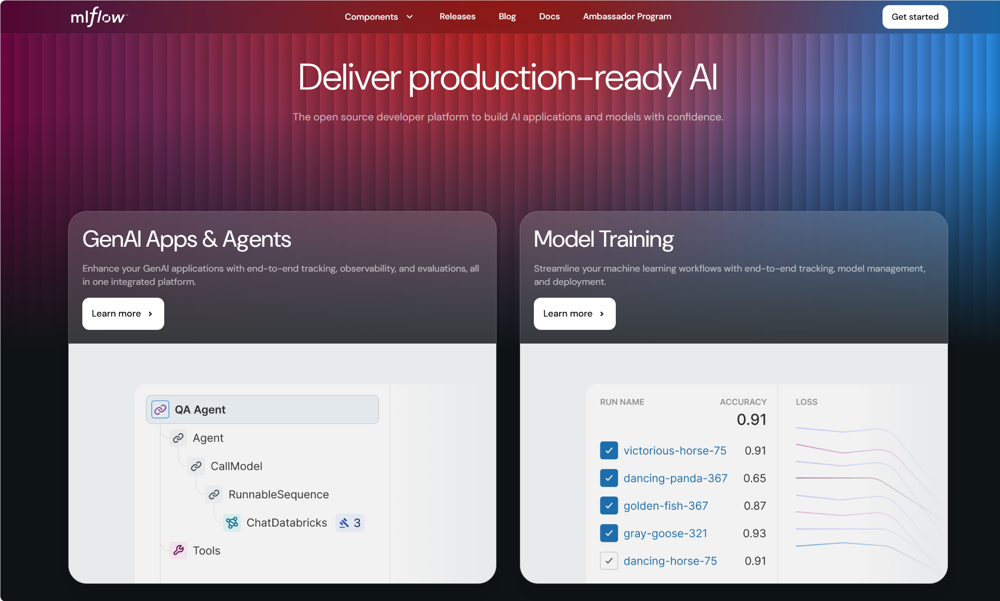
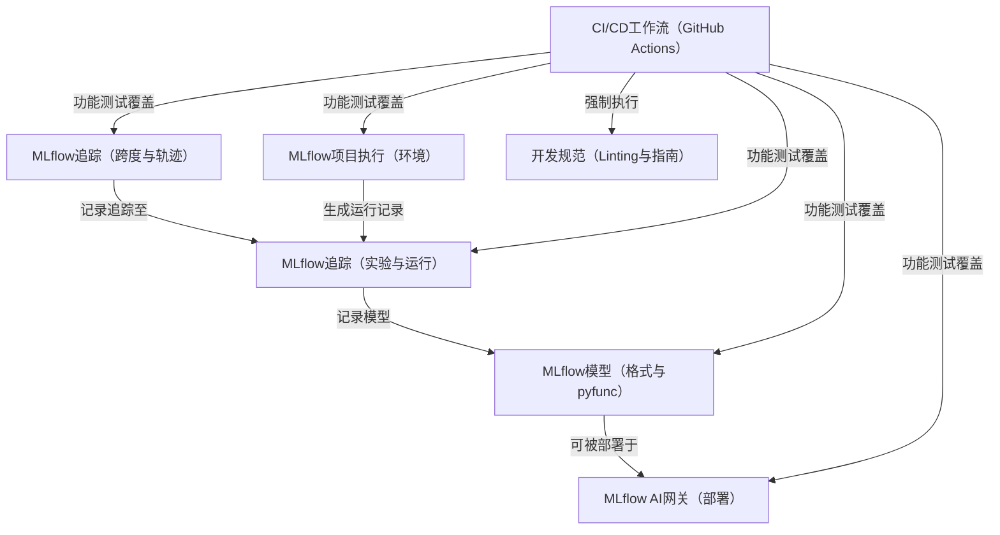
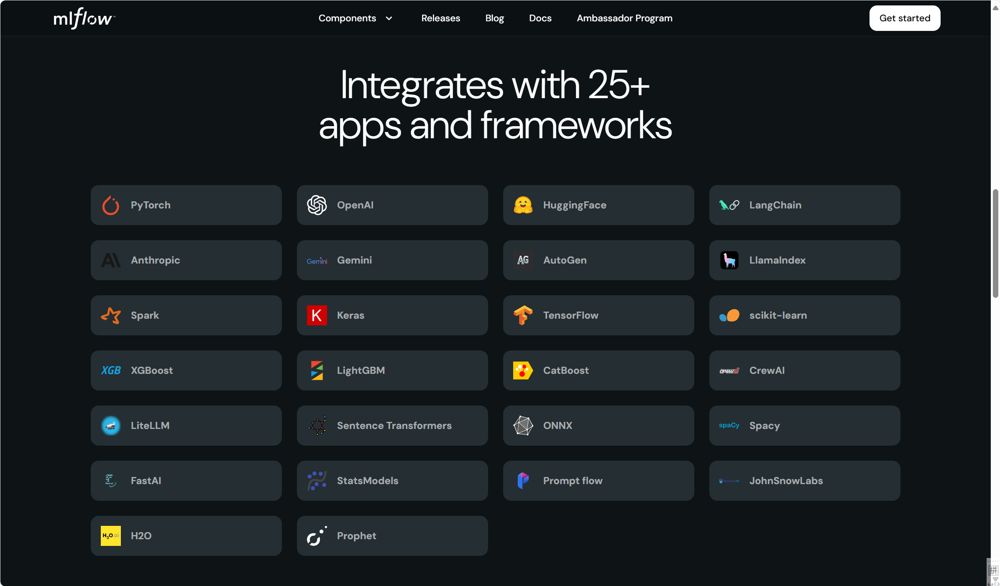

链接：[MLflow](https://mlflow.org/)

[Getting Started with MLflow for GenAI | MLflow](https://mlflow.org/docs/latest/genai/getting-started/)



# MLflow 

MLflow 是一个**开源开发平台**，旨在简化**机器学习全生命周期**的管理
它提供以下核心功能模块：

- **实验追踪**（记录运行参数与指标）
- **模型打包**（支持多种格式及`pyfunc`便携接口）
- **AI/LLM应用可观测性**（追踪请求内的原子操作）
- **可复现的项目执行**（管理依赖与入口点）  

同时提供：
- **AI网关**统一模型服务
- **CI/CD工作流**与**开发规范**保障项目质量与可维护性

## 架构



## 章节

1. [MLflow追踪（实验与运行）](01_mlflow_tracking__runs__experiments__.md)
2. [MLflow项目执行（环境管理）](02_mlflow_project_execution__environments__.md)  
3. [MLflow模型（格式与pyfunc）](03_mlflow_models__flavors__pyfunc__.md)  
4. [MLflow AI网关（部署服务）](04_mlflow_ai_gateway__deployments__.md)  
5. [MLflow追踪（跨度与轨迹）](05_mlflow_tracing__spans__traces__.md)  
6. [CI/CD工作流（GitHub Actions）](06_ci_cd_workflows__github_actions__.md)  
7. [开发规范（代码检查与指南）](07_development_standards__linting__guides__.md)  

被广泛集成运用~



---
# 第一章：MLflow追踪（实验与运行）

欢迎来到MLflow

如果你是机器学习项目的新手，可能已经体会到了管理实验记录的痛苦。想象一下：你尝试了不同的模型参数组合，每次得到略有差异的结果，然后试图回忆哪组参数表现最好——这很快就会变成笔记、电子表格和代码版本的混乱集合。

**MLflow追踪**正是为解决这一问题而生。你可以将其视为专为机器学习工作设计的数字化实验笔记本，自动记录每次模型训练或分析的关键细节。

本章将深入探讨MLflow追踪如何作为机器学习工作的核心记录系统，帮助我们实现：
1. **记录**每次模型训练的关键信息
2. **组织**大量训练实验
3. **便捷对比**不同模型版本

让我们开始吧

## MLflow是什么？

MLflow是一个开源平台，旨在管理机器学习全生命周期。它包含多个组件，我们首先聚焦于**MLflow追踪**模块。

## 核心概念：运行与实验

MLflow追踪建立在两个基础概念上：**运行(Run)**和**实验(Experiment)**。

### 什么是"运行"？

假设你是一位正在研发新菜品的厨师。每次烹饪时，你会调整某种配料（参数），品尝味道（获取指标），并可能保存最佳版本（产出物）。

在机器学习中，**运行**的概念非常相似。它代表机器学习代码的一次完整执行过程。在运行期间，MLflow会自动或手动记录以下关键信息：

* **参数**：模型的配置项，如学习率、网络层数或算法类型
* **指标**：模型性能评估结果，如准确率、错误率或精确度
* **产出物**：运行生成的成果，包括训练好的模型、数据文件或图像等

**类比**：运行就像实验笔记本中的一页记录，完整记载了单次模型训练的输入、过程和结果。

### 什么是"实验"？

当你进行了多次菜品改良（多次"运行"）后，不会将笔记随意散落，而是归类到"新意面酱料研发"项目下。

MLflow中的**实验**就是相关运行的集合，用于系统化组织工作，便于比较分析为同一目标训练的不同模型。

**类比**：实验如同笔记本中的专项分区，集中存放相关尝试的所有记录。

## 实践入门：创建首个MLflow实验

让我们通过安装MLflow并运行Python脚本来实际体验参数、指标和产出物的记录过程。

### 步骤1：安装MLflow

在终端执行以下命令：

```bash
pip install mlflow
```

这将安装MLflow的Python库。

### 步骤2：记录首次运行

创建名为`my_ml_script.py`的脚本：

```python
import os
import random
import mlflow

if __name__ == "__main__":
    print("启动首次MLflow运行...")

    # 设置实验名称（不存在则自动创建）
    mlflow.set_experiment("我的首个ML项目")

    # 开始新运行
    with mlflow.start_run():
        # 记录参数
        learning_rate = random.uniform(0.001, 0.1)
        mlflow.log_param("learning_rate", learning_rate)
        print(f"记录参数'learning_rate': {learning_rate:.4f}")

        # 记录指标
        accuracy = random.uniform(0.7, 0.95)
        mlflow.log_metric("accuracy", accuracy)
        print(f"记录指标'accuracy': {accuracy:.4f}")

        # 创建产出物目录
        artifact_dir = "输出结果"
        os.makedirs(artifact_dir, exist_ok=True)

        # 写入产出物文件
        output_filepath = os.path.join(artifact_dir, "模型摘要.txt")
        with open(output_filepath, "w") as f:
            f.write(f"本次运行使用学习率{learning_rate:.4f}，获得准确率{accuracy:.4f}。\n")
            f.write("模型训练成功完成！\n")
        
        # 记录产出物目录
        mlflow.log_artifacts(artifact_dir)
        print(f"记录产出物目录: {artifact_dir}")

    print("MLflow运行完成。请查看UI界面！")
```

**代码解析**：
* `set_experiment()`指定实验名称
* `start_run()`开启运行上下文
* `log_param()`记录参数
* `log_metric()`记录指标
* `log_artifacts()`保存产出文件

### 步骤3：运行脚本

在终端执行：

```bash
python my_ml_script.py
```

重复运行3-4次，每次都会在"我的首个ML项目"实验中创建新记录。

### 步骤4：查看MLflow UI

在新终端启动UI服务：

```bash
mlflow ui
```

访问`http://localhost:5000`你将看到：
* 实验列表包含"我的首个ML项目"
* 点击实验可查看所有运行记录
* 支持多运行对比参数、指标和产出物

## 技术原理：数据存储机制

MLflow默认在运行目录下创建`mlruns`文件夹，结构如下：

```
mlruns/
└── <实验ID>/
    ├── <运行ID_1>/
    │   ├── metrics/accuracy
    │   ├── params/learning_rate
    │   ├── artifacts/模型摘要.txt
    │   └── meta.yaml
    └── meta.yaml
```

## 核心数据模型

| 概念     | 关键字段                               | 说明                           |
| :------- | :------------------------------------- | :----------------------------- |
| **实验** | experiment_id, name, artifact_location | 分组相关运行，包含唯一ID和名称 |
| **运行** | run_uuid, experiment_id, status        | 单次执行记录，关联所属实验     |
| **参数** | key, value, run_uuid                   | 运行关联的输入配置项           |
| **指标** | key, value, timestamp, run_uuid        | 运行关联的性能指标记录         |

## 小结

通过MLflow追踪，我们实现了：
- 系统化记录训练参数和结果
- 结构化组织实验流程
- 可视化对比模型表现

当项目复杂度增加时，如何确保环境一致性？下一章将探讨[MLflow项目执行（环境管理）](02_mlflow_project_execution__environments__.md)。

