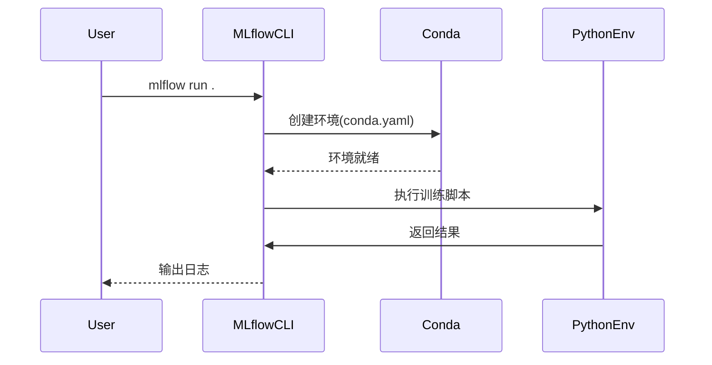
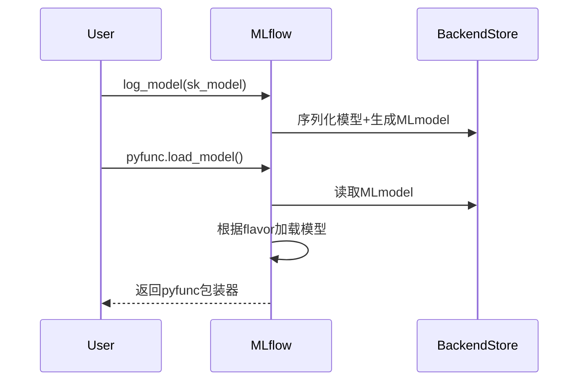

# 第二章：MLflow项目执行（环境管理）

欢迎回来

在[第一章：MLflow追踪（实验与运行）](01_mlflow_tracking__runs__experiments__.md)中，我们学习了如何用MLflow建立数字化的实验记录系统。

现在假设你训练了一个完美模型，但在其他环境运行时却出现"模块未找到"或"Python版本不匹配"等错误——这正是**MLflow项目**要解决的核心问题。

## 核心价值：==可复现==的ML工程

MLflow项目通过以下机制确保代码跨环境一致性：
1. **环境封装**：精确指定Python版本和依赖库
2. **执行标准化**：定义明确的入口点和参数
3. `便携式打包`：支持Conda/Pip/Docker等多种环境方案

## 项目结构详解

### 基础文件组成
```
my_ml_project/
├── MLproject          # 项目定义文件
├── conda.yaml         # Conda环境配置
├── train_model.py     # 训练脚本
└── requirements.txt   # Pip依赖项（可选）
```

### 1. 环境定义文件（conda.yaml示例）
```yaml
name: mlflow-demo-env
channels:
  - defaults
dependencies:
  - python=3.9
  - scikit-learn=1.0.2
  - pip:
    - mlflow>=2.10
```

### 2. 项目定义文件（MLproject示例）
```yaml
name: Iris_Classifier
conda_env: conda.yaml

entry_points:
  train:
    command: "python train.py --alpha {alpha}"
    parameters:
      alpha: {type: float, default: 0.5}
  evaluate:
    command: "python eval.py --data-path {data_path}"
    parameters:
      data_path: {type: string}
```

## 实战：创建MLflow项目

### 步骤1：初始化项目目录
```bash
mkdir sklearn_demo && cd sklearn_demo
```

### 步骤2：编写训练脚本（train.py）
```python
import mlflow
from sklearn import datasets, svm

# 加载数据
iris = datasets.load_iris()
X, y = iris.data, iris.target

# 训练模型
clf = svm.SVC()
clf.fit(X, y)

# 记录结果
with mlflow.start_run():
    mlflow.log_param("kernel", "rbf")
    mlflow.sklearn.log_model(clf, "model")
```

### 步骤3：定义执行环境
```bash
# conda.yaml
name: iris-env
dependencies:
  - python=3.8
  - scikit-learn=1.0
  - pip:
    - mlflow
```

### 步骤4：运行项目
```bash
mlflow run . -P alpha=0.1
```

执行流程：
1. 自动创建conda环境
2. 安装指定依赖项
3. 在隔离环境中执行训练脚本
4. 记录参数和模型

## 配置技巧

### 多步骤工作流
```yaml
# MLproject
entry_points:
  preprocess:
    command: "python preprocess.py --input {input}"
  train:
    command: "python train.py --data {data}"
    depends_on: ["preprocess"]
```

### 参数验证
```yaml
parameters:
  batch_size:
    type: int
    default: 32
    minimum: 8
    maximum: 256
```

## 技术原理

当执行`mlflow run`时：
1. 解析`MLproject`文件
2. 根据`conda.yaml`创建虚拟环境
3. 在隔离环境中执行命令
4. 通过MLflow Tracking记录结果



## 小结

通过MLflow项目我们实现了：
- ==可复现的模型训练环境==
- 标准化的项目结构
- 灵活的参数配置

接下来我们将学习如何将训练好的模型标准化==打包==——[MLflow模型（格式与pyfunc）](03_mlflow_models__flavors__pyfunc__.md)。

-------

# 第三章：MLflow模型（Flavors与pyfunc）

欢迎回到MLflow

在[第一章](01_mlflow_tracking__runs__experiments__.md)我们建立了实验记录系统，[第二章](02_mlflow_project_execution__environments__.md)实现了可复现的代码执行

现在我们将聚焦机器学习项目的==核心产出==——**训练好的模型**。

## 核心挑战：模型标准化

不同框架的模型保存方式各异：
- TensorFlow使用`SavedModel`格式
- PyTorch依赖`torch.save()`
- Scikit-learn常用`pickle`序列化

MLflow通过**模型Flavors**和**pyfunc接口**解决这一难题，实现：
1. **统一封装**：标准化模型保存格式
2. **跨框架兼容**：支持主流ML库
3. **便捷部署**：提供通用预测接口

## 核心概念

### 1. 模型Flavors
| 框架         | MLflow Flavor       | 示例用法                     |
| :----------- | :------------------ | :--------------------------- |
| Scikit-learn | `mlflow.sklearn`    | `log_model(sk_model=lr)`     |
| TensorFlow   | `mlflow.tensorflow` | `log_model(tf_model=cnn)`    |
| PyTorch      | `mlflow.pytorch`    | `log_model(pt_model=resnet)` |

> **技术原理**：每个Flavor包含框架特定的序列化逻辑，同时生成标准化的`MLmodel`元数据文件。

### 2. pyfunc通用接口
无论原始框架如何，所有MLflow模型均可通过以下方式加载：
```python
model = mlflow.pyfunc.load_model(model_uri)
predictions = model.predict(pandas_df)
```

## 实战演示

### 案例1：保存Scikit-learn模型
```python
from sklearn.ensemble import RandomForestClassifier

with mlflow.start_run():
    # 训练模型
    clf = RandomForestClassifier()
    clf.fit(X_train, y_train)
    
    # 记录模型
    mlflow.sklearn.log_model(
        sk_model=clf,
        artifact_path="model",
        registered_model_name="RF_Classifier"
    )
```

### 案例2：自定义pyfunc模型
```python
class TextAnalyzer(mlflow.pyfunc.PythonModel):
    def predict(self, context, model_input):
        # 自定义预测逻辑
        return model_input.apply(lambda x: len(str(x)))
        
mlflow.pyfunc.log_model(
    python_model=TextAnalyzer(),
    artifact_path="text_model"
)
```

## 模型存储结构
```
model/
├── MLmodel            # 核心元数据文件
├── conda.yaml         # 环境依赖
├── model.pkl          # 模型二进制（以sklearn为例）
└── requirements.txt    # pip依赖项
```

**MLmodel文件示例**：
```yaml
flavors:
  sklearn:
    pickled_model: model.pkl
    sklearn_version: 1.0.2
  python_function:
    loader_module: mlflow.sklearn
    env: conda.yaml
```

## 高级应用

### 多框架组合模型
```python
class HybridModel(mlflow.pyfunc.PythonModel):
    def load_context(self, context):
        self.tf_model = mlflow.tensorflow.load_model(context.artifacts["tf_path"])
        self.sk_model = mlflow.sklearn.load_model(context.artifacts["sk_path"])
        
    def predict(self, context, model_input):
        # 组合TensorFlow和Scikit-learn的预测结果
        tf_out = self.tf_model.predict(model_input)
        sk_out = self.sk_model.predict(model_input)
        return (tf_out + sk_out) / 2
```

## 技术原理



## 本章小结

通过MLflow Models我们实现了：
- ==标准化模型打包==
- 跨框架兼容预测
- 灵活的自定义扩展

接下来我们将探索如何将==模型部署==为服务——[MLflow AI网关（部署）](04_mlflow_ai_gateway__deployments__.md)

------


