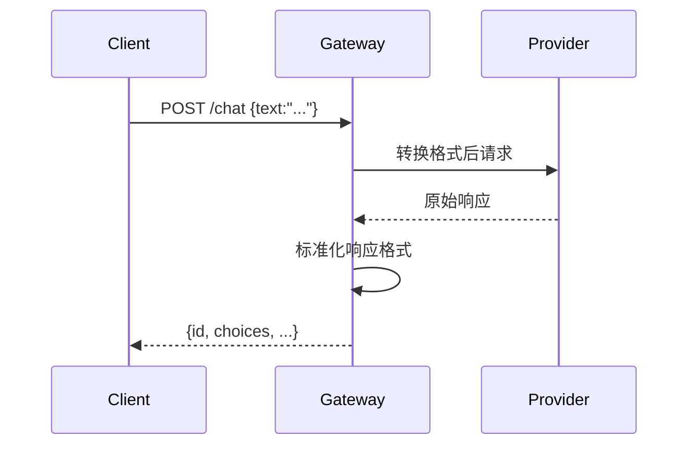
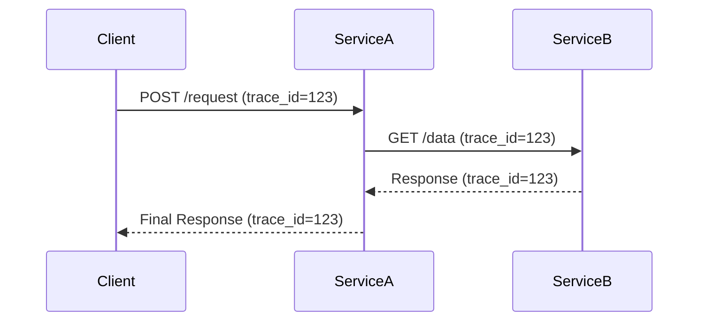

# 第四章：MLflow AI网关（部署）

欢迎来到MLflow

在前三章中，我们分别掌握了实验==记录==、项目==打包==和模型==标准化==。

现在，我们将探索如何让训练好的模型真正投入使用——通过**MLflow AI网关**构建统一的模型服务层。

## 核心价值：统一AI服务入口

MLflow AI网关解决了以下关键问题：
1. **多源模型整合**：同时管理OpenAI等第三方模型和自研MLflow模型
2. **标准化API**：为不同模型提供一致的REST接口
3. **安全管控**：集中管理API密钥和访问限流

## 架构

### 1. 核心组件
| 组件         | 功能说明          | 示例值                |
| :----------- | :---------------- | :-------------------- |
| **Provider** | 模型提供方        | `openai`, `anthropic` |
| **Endpoint** | 对外暴露的API路径 | `/endpoints/chat-gpt` |
| **Route**    | 请求路由规则      | `llm/v1/chat`         |

### 2. 技术栈

相关前文传送：

[[n8n] 工作流数据库管理SQLite | 数据访问层-REST API服务](https://blog.csdn.net/2301_80171004/article/details/150949378?ops_request_misc=%257B%2522request%255Fid%2522%253A%25228cfedbdc0795b7603cb10009cd0b8e77%2522%252C%2522scm%2522%253A%252220140713.130102334.pc%255Fblog.%2522%257D&request_id=8cfedbdc0795b7603cb10009cd0b8e77&biz_id=0&utm_medium=distribute.pc_search_result.none-task-blog-2~blog~first_rank_ecpm_v1~rank_v31_ecpm-1-150949378-null-null.nonecase&utm_term=REST%20API&spm=1018.2226.3001.4450)

[[RestGPT] RestGPT智能体](https://blog.csdn.net/2301_80171004/article/details/150615719?ops_request_misc=%257B%2522request%255Fid%2522%253A%25228cfedbdc0795b7603cb10009cd0b8e77%2522%252C%2522scm%2522%253A%252220140713.130102334.pc%255Fblog.%2522%257D&request_id=8cfedbdc0795b7603cb10009cd0b8e77&biz_id=0&utm_medium=distribute.pc_search_result.none-task-blog-2~blog~first_rank_ecpm_v1~rank_v31_ecpm-6-150615719-null-null.nonecase&utm_term=REST%20API&spm=1018.2226.3001.4450)

- **前端协议**：==REST API== (FastAPI实现)
- **认证机制**：环境变量注入API密钥
- **扩展架构**：==支持自定义Provider插件==

## ⭕演示：部署OpenAI聊天网关

### 步骤1：环境准备
```bash
# 安装MLflow AI网关组件
pip install 'mlflow[genai]'
export OPENAI_API_KEY="your_api_key_here"
```

### 步骤2：配置文件（gateway-config.yaml）
```yaml
endpoints:
  - name: ai-assistant
    endpoint_type: llm/v1/chat
    model:
      provider: openai
      name: gpt-4
      config:
        openai_api_key: $OPENAI_API_KEY
    limit:
      calls: 30
      renewal_period: minute
```

### 步骤3：启动网关服务
```bash
mlflow gateway start --config-path gateway-config.yaml --port 8000
```

### 步骤4：API调用测试
```bash
curl -X POST http://localhost:8000/endpoints/ai-assistant/invocations \
     -H "Content-Type: application/json" \
     -d '{"messages":[{"role":"user","content":"解释机器学习"}]}'
```

**响应示例**：
```json
{
  "id":"chatcmpl-...",
  "model":"gpt-4",
  "choices":[{
    "message":{
      "role":"assistant",
      "content":"机器学习是..."
    }
  }]
}
```

## 配置

### 1. 多模型端点
```yaml
endpoints:
  - name: chat-gpt4
    endpoint_type: llm/v1/chat
    model:
      provider: openai
      name: gpt-4

  - name: embeddings
    endpoint_type: llm/v1/embeddings  
    model:
      provider: openai
      name: text-embedding-3-small
```

### 2. 自定义限流策略
```yaml
limit:
  calls: 100      # 请求次数上限
  renewal_period: hour  # 计数周期
  burst: 10       # 突发流量容忍
```

## 技术原理



**关键处理流程**：
1. 请求路由：根据endpoint_type匹配处理器
2. 凭证管理：自动注入环境变量中的API密钥
3. 格式转换：统一输入输出数据结构
4. 流量控制：令牌桶算法实现限流

## 企业级特性

### 1. 插件开发
可通过继承`BaseProvider`实现：
```python
class CustomProvider(BaseProvider):
    def predict(self, payload):
        # 调用内部模型服务
        return internal_model_api(payload)
```

### 2. 监控指标
内置Prometheus指标端点：
- `gateway_requests_total`
- `gateway_latency_seconds`
- `gateway_errors_total`

## 小结

通过MLflow AI网关我们实现了：
- ==异构模型的统一接入==
- 生产级API服务部署
- 安全的访问控制机制

接下来我们将深入模型服务的==可观测性==——[MLflow追踪（跨度与轨迹）](05_mlflow_tracing__spans__traces__.md)。

---
# 第五章：MLflow追踪（跨度与轨迹）

在前四章中，我们分别掌握了实验记录、项目打包、模型标准化和服务部署。现在，我们将聚焦AI应用的==可观测性核心==——**MLflow追踪**系统。

## 核心价值：AI应用全链路透视

MLflow追踪解决了以下关键问题：
1. **复杂流程可视化**：直观展示请求在AI应用中的完整执行路径
2. **性能瓶颈定位**：精确测量每个步骤的耗时与资源消耗
3. **异常根因分析**：快速定位失败请求的问题环节

## 核心概念

### 1. 追踪(Trace)
- **定义**：单个请求在系统中的端到端执行过程
- **类比**：医疗CT扫描的完整检查报告
- **关键属性**：
  ```python
  {
    "trace_id": "trace_123456",
    "start_time": "2023-10-27T10:00:00Z",
    "duration_ms": 1250,
    "status": "OK"
  }
  ```

### 2. 跨度(Span)
- **定义**：执行过程中的原子操作单元
- **类比**：CT扫描中的单层成像
- **关键属性**：
  ```python
  {
    "span_id": "span_789",
    "parent_id": "span_456",
    "name": "llm_inference",
    "inputs": {"prompt": "Explain MLflow"},
    "outputs": {"content": "MLflow is..."},
    "duration_ms": 820,
    "events": [
      {"timestamp": "10:00:05.123", "name": "start_llm_call"},
      {"timestamp": "10:00:05.943", "name": "end_llm_call"}
    ]
  }
  ```

## 实战演示

### 案例1：基础追踪
```python
import mlflow

@mlflow.trace
def data_processing(input_data):
    # 数据处理逻辑
    return processed_data

@mlflow.trace
def model_inference(features):
    # 模型推理逻辑
    return predictions

def handle_request(request):
    with mlflow.start_span(name="request_handling") as span:
        span.set_inputs({"raw_input": request})
        features = data_processing(request)
        results = model_inference(features)
        span.set_outputs({"final_result": results})
```

### 案例2：LLM应用追踪
```python
class ChatAgent:
    @mlflow.trace
    def retrieve_knowledge(self, query):
        # 知识检索逻辑
        return documents

    @mlflow.trace 
    def generate_response(self, context):
        # LLM生成逻辑
        return answer

    def chat(self, message):
        with mlflow.start_span(name="chat_cycle"):
            docs = self.retrieve_knowledge(message)
            return self.generate_response(docs)
```

## 追踪数据分析

### 1. 性能指标
| 指标名称     | 计算方式           | 分析价值         |
| :----------- | :----------------- | :--------------- |
| 端到端延迟   | Trace.duration_ms  | 整体性能评估     |
| 关键路径耗时 | 各Span持续时间累加 | 瓶颈定位         |
| 步骤吞吐量   | Span计数/时间窗口  | 并发处理能力评估 |

### 2. 错误分析
```python
# 标记失败Span
span.set_status("ERROR", "API timeout")
span.record_exception(e)
```

## 高级功能

### 1. 分布式追踪

trace_id



### 2. 自定义事件
```python
span.add_event("cache_hit", {"key": "user_123"})
span.add_event("fallback_triggered")
```

## 技术实现

### 数据存储结构
```
traces/
├── <date>/
│   ├── <trace_id>.json
│   └── ...
└── indexes/
    ├── by_status/
    ├── by_duration/
    └── ...
```

### 采样策略
```yaml
# mlflow-config.yaml
tracing:
  sampling_rate: 0.2  # 20%的请求会被追踪
  slow_threshold_ms: 1000  # 超过1秒的请求强制追踪
```

## 本章小结

通过MLflow追踪我们实现了：
- 复杂AI工作流的可视化监控
- 毫秒级精度的性能分析
- 分布式系统的全链路追踪

接下来我们将进入ML工程化最后一环——[CI/CD工作流(GitHub Actions)](06_ci_cd_workflows__github_actions__.md)。

