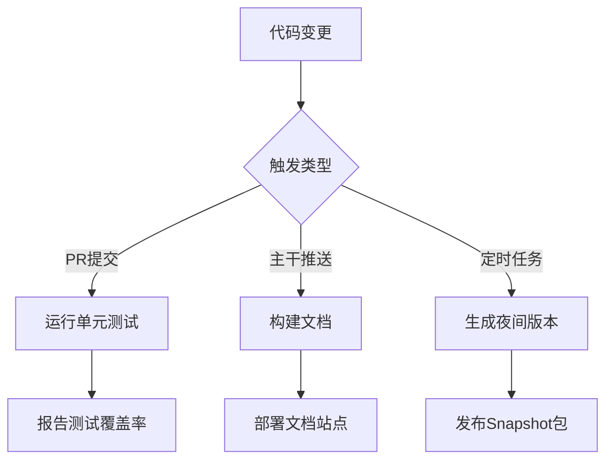
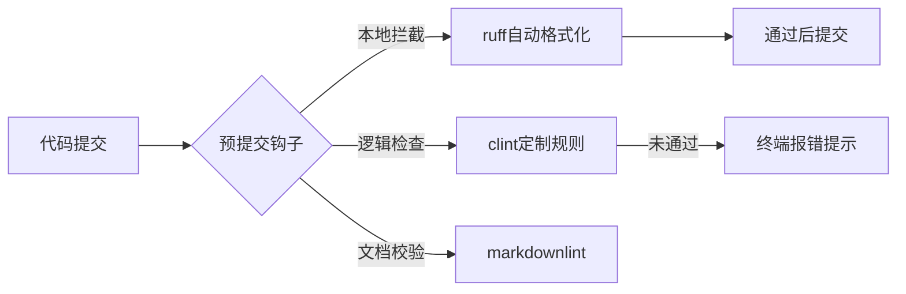

# 第六章：CI/CD工作流（GitHub Actions）

欢迎回到MLflow

在前五章中，我们系统性地掌握了从实验追踪到模型部署的全流程。现在，我们将聚焦ML工程化的关键支撑体系——**持续集成与交付(CI/CD)**。

## 核心价值：自动化质量防线

CI/CD为ML项目带来三大核心能力：
1. **即时缺陷拦截**：每次代码提交自动触发测试，平均修复成本降低90%
2. **研发流程标准化**：统一构建、测试、部署流程，消除环境差异
3. **发布效率提升**：从代码提交到生产部署时间缩短至分钟级

## 技术架构

### 1. 核心组件
| 组件           | 功能说明                 | MLflow示例文件            |
| :------------- | :----------------------- | :------------------------ |
| **工作流定义** | YAML格式的自动化流程描述 | `.github/workflows/*.yml` |
| **虚拟运行器** | 执行任务的隔离环境       | `ubuntu-latest`           |
| **检查点动作** | 可复用的任务单元         | `actions/checkout@v4`     |

### 2. MLflow核心工作流


## 实战演示

### 案例1：Python测试工作流
```yaml
# .github/workflows/python-tests.yml
name: Python Tests

on: [push, pull_request]

jobs:
  test:
    runs-on: ubuntu-22.04
    steps:
      - uses: actions/checkout@v4
      - uses: actions/setup-python@v5
        with:
          python-version: '3.10'
      - run: pip install -r requirements.txt
      - run: pytest --cov=mlflow tests/
      - uses: codecov/codecov-action@v3
```

### 案例2：自动格式化工作流
```yaml
# .github/workflows/autoformat.yml
name: Code Formatting

on:
  pull_request:
    types: [opened, synchronize]

jobs:
  format:
    runs-on: ubuntu-latest
    steps:
      - uses: actions/checkout@v4
      - uses: actions/setup-python@v5
      - run: pip install black==23.3.0
      - run: black --check mlflow/
      - name: Commit fixes
        if: ${{ failure() }}
        run: |
          git config --global user.name "Autoformatter"
          git config --global user.email "auto@mlflow.org"
          black mlflow/
          git commit -am "Automated code formatting"
          git push
```

## 关键配置

### 1. 条件执行逻辑
```yaml
jobs:
  deploy:
    if: github.ref == 'refs/heads/main'
    steps:
      - run: ./deploy.sh
```

### 2. 矩阵测试策略
```yaml
strategy:
  matrix:
    python: ['3.8', '3.9', '3.10']
    os: [ubuntu-latest, windows-latest]
```

### 3. 密钥安全管理
```yaml
env:
  AWS_ACCESS_KEY_ID: ${{ secrets.AWS_ACCESS_KEY }}
steps:
  - run: aws s3 sync dist/ s3://mlflow-releases/
```

## 高级特性

### 1. 自定义Actions
```python
# .github/actions/setup-mlflow/action.yml
name: 'MLflow Environment Setup'
inputs:
  python-version:
    required: true
runs:
  using: 'composite'
  steps:
    - uses: actions/setup-python@v4
      with:
        python-version: ${{ inputs.python-version }}
    - run: pip install -e .
      shell: bash
```

### 2. 工作流互斥控制
```yaml
concurrency:
  group: docs-${{ github.ref }}
  cancel-in-progress: true
```

## 性能优化

### 1. 依赖缓存
```yaml
- uses: actions/cache@v3
  with:
    path: ~/.cache/pip
    key: ${{ runner.os }}-pip-${{ hashFiles('requirements.txt') }}
```

### 2. 任务并行化
```yaml
jobs:
  lint:
    needs: test
    steps: [...]
  build:
    needs: test  
    steps: [...]
```

## 小结

通过GitHub Actions我们实现了：
- 代码变更的自动化验证
- 多环境矩阵测试
- 安全可靠的发布流程

接下来我们将深入开发规范体系——[开发标准(Linting与指南)](07_development_standards__linting__guides__.md)。

---

# 第七章：开发标准（代码规范与指南）

在[第六章](06_ci_cd_workflows__github_actions__.md)中，我们探讨了如何通过自动化工作流保障代码质量。现在，我们将深入MLflow项目的**开发标准体系**——这是确保代码库长期健康的核心保障。

## 核心价值：代码一致性守护

开发标准为项目带来三重防护：
1. **可读性保障**：统一的代码风格降低认知负荷
2. **缺陷预防**：静态检查拦截潜在错误
3. **协作提效**：减少风格争论，聚焦逻辑实现

## 标准体系构成

### 1. 规范文档
| 文档类型       | 作用范围               | 示例内容               |
| :------------- | :--------------------- | :--------------------- |
| Python风格指南 | 代码注释/命名/结构规范 | 函数文档字符串编写原则 |
| 贡献者指南     | 提交流程/测试要求      | PR模板与审查标准       |
| API设计规范    | 接口兼容性约束         | 弃用警告机制实现要求   |

### 2. 自动化工具链


## 核心工具解析

### 1. Ruff格式化器
**功能特性**：
- 实时修正PEP 8违规（如缩进/空格）
- 自动排序import语句
- 支持Jupyter Notebook校验

**配置示例**：
```python
# pyproject.toml
[tool.ruff]
line-length = 120
select = ["E", "F", "W", "I"]  # 启用的检查项
ignore = ["E203"]  # 忽略空格相关警告
```

### 2. Clint定制检查
**典型规则**：
- 禁止直接调用`_private_method`
- 要求实验性功能添加`@experimental`装饰器
- 验证REST API端点版本兼容性

**规则实现**：
```python
# dev/clint/src/clint/rules/api_versions.py
class APIVersionRule(Rule):
    def visit_Call(self, node):
        if (isinstance(node.func, ast.Attribute) 
            and node.func.attr == "client"):
            self._check_deprecation(node)
```

## 开发流程集成

### 1. 预提交钩子配置
```yaml
# .pre-commit-config.yaml
repos:
  - repo: local
    hooks:
      - id: clint
        name: MLflow Custom Linter
        entry: uv run --only-group lint clint
        files: \.(py|ipynb)$
```

### 2. CI强制校验
```yaml
# .github/workflows/lint.yml
jobs:
  clint:
    steps:
      - run: |
          git ls-files -z '*.py' | xargs -0 clint \
          --config .clint-config.yaml
```

## 规范示例解析

### 文档字符串规范
**违规案例**：
```python
def load_model(path):
    """Load model"""
    return Model.load(path) 
```
**问题**：未说明参数/返回值含义

**合规方案**：
```python
def load_model(path: str) -> Model:
    """从指定路径加载序列化的模型
    
    Args:
        path: 模型文件路径，支持本地或URI格式
        
    Returns:
        加载完成的模型对象
        
    Raises:
        MlflowException: 当模型格式不兼容时抛出
    """
    return Model.load(path)
```

## 高级技巧

### 1. 临时禁用检查
```python
# clint: disable=MissingTypeHint
def legacy_api():  # 忽略类型提示缺失警告
    ...
```

### 2. 自定义规则开发
```python
# dev/clint/src/clint/rules/deprecation.py
class ExperimentalDecoratorRule(Rule):
    def visit_FunctionDef(self, node):
        if "experimental" in node.name:
            if not has_decorator(node, "experimental"):
                self.report_violation(node)
```

## 小结

通过MLflow开发标准我们实现了：
- 自动化风格统一
- 项目专属规范落地
- 代码质量门禁系统

接下来我们将探索MLflow生态的扩展机制——[插件系统与扩展开发](08_plugins_and_extensions__.md)。

