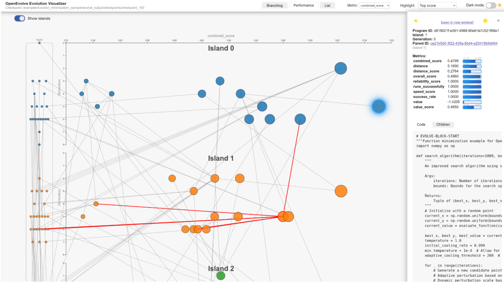

# 第3章：分支图可视化

在上一章[应用状态管理](02_application_state_management_.md)中，我们学习了OpenEvolve可视化工具如何通过共享中央"白板"上的重要数据来保持所有不同部分的同步。

现在，我们将把这些组织好的数据——程序列表（节点）及其父子关系（边）——转化为可视化工具最突出的特性：**分支图可视化**。



## 代码的动态族谱

想象我们有一个悠久的家族历史，想要查看每个人、他们之间的关系以及家族不同分支的发展。对于一个小家族，在纸上绘制静态的族谱可能有效，但如果家族每分钟都在指数级增长，新成员不断出现，新联系不断形成呢？很快就会变成一团乱麻！

这正是演化程序面临的挑战。==OpenEvolve实验可以创建数千个程序，每个程序都源自一个"父"程序，形成复杂的演化路径。"分支图可视化"通过为代码创建**动态族谱**来解决这个问题==。

它的主要目的是：
1.  **可视化呈现**每个程序作为一个独立实体
2.  **展示演化链接**，清晰显示父子关系
3.  **组织**这个复杂网络，使其易于理解，帮助我们一眼发现成功的谱系、死胡同和有趣的分支
4.  允许通过缩放、平移和点击单个程序来**交互**探索演化历史

## 我们的核心用例：探索演化路径

假设我们正在运行一个OpenEvolve实验，打开可视化工具后，我们的目标是：
*   查看所有演化程序的完整集合
*   理解哪个程序导致了哪个程序
*   轻松发现"最佳"程序（例如得分最高的程序）并追溯它们的祖先
*   点击任何程序立即查看其具体细节

分支图可视化旨在使这种探索直观而高效。

## 分支图的关键概念

图可视化依赖几个核心概念来展示演化历史：

### 1. 节点（圆圈）：单个程序

*   **它们是什么**：图中的每个圆圈代表实验中的一个演化程序
*   **它们展示什么**：它们的大小、颜色和边框可以表示重要属性，如性能得分、代数或是否当前被选中/高亮
*   **类比**：我们族谱中的每个人

### 2. 边（线）：父子关系

*   **它们是什么**：连接圆圈的线显示演化关系。从程序A到程序B的线表示程序B从程序A演化而来（A是父，B是子）
*   **它们展示什么**：直接的谱系和演化流向
*   **类比**：连接家庭成员、表明谁是谁的孩子的线

### 3. 力导向布局："物理引擎"

*   **它是什么**：这是一种巧妙算法，使用==类似物理的力来排列屏幕上的节点和边==
*   **工作原理**：
    *   **排斥力**：节点（程序）互相"推开"，防止它们过度重叠
    *   **吸引力**：边（父子链接）将连接的节点"拉"在一起，试图保持相关程序靠近
    *   **向心力**：一种微妙的力将整个图拉向屏幕中心
*   **目的**：这种动态排列帮助图自然地形成一种布局，视觉上分组相关程序并显示清晰的分支，无需手动放置。就像轻轻摇晃一袋磁铁和弹簧，直到它们找到稳定的排列

### 4. 交互性：探索和发现

图不仅是静态图片，我们可以主动与之互动：
*   **拖动节点**：抓住一个节点并将其移动到更方便的位置。其他节点会动态反应，就像真实的物理对象
*   **缩放和平移**：使用鼠标滚轮缩放，拖动背景平移，探索大型演化景观
*   **点击选择**：点击一个节点选择它。这将高亮该节点及其直接连接，并在侧边栏显示其详细信息（如[应用状态管理](02_application_state_management_.md)中讨论，将在[侧边栏UI管理器](07_sidebar_ui_manager_.md)中详述）
*   **双击打开**：`双击一个节点在新浏览器标签中打开其完整代码`

## OpenEvolve如何显示图

分支图可视化主要使用**D3.js（数据驱动文档）**构建，这是一个强大的JavaScript库，用于在网页浏览器中创建动态、交互式数据可视化

(之前[lvy010/lvy010: md](https://github.com/lvy010/lvy010)仓库中有借助物理引擎绘制过类似的网页)

负责绘制和更新图的主要函数是`scripts/static/js/graph.js`文件中的`renderGraph`

每当新数据到达或窗口调整大小时，[应用状态管理](02_application_state_management_.md)系统就会调用它。

让我们看看`renderGraph`如何创建我们的交互式族谱的简化流程：

### 步骤1：准备——SVG画布

首先，我们需要一个绘图区域。在网页开发中，这通常是一个`<svg>`（==可缩放矢量图形==）元素。

`ensureGraphSvg()`函数确保这个元素及其内部的分组元素（`g`）存在且大小正确。

```javascript
// scripts/static/js/graph.js (简化)
import { width, height } from './state.js'; // 获取窗口尺寸

let svg = null; // 我们的SVG元素
export let g = null; // SVG内部的绘图组

function ensureGraphSvg() {
    let svgEl = d3.select('#graph').select('svg');
    if (svgEl.empty()) { // 如果不存在SVG，创建一个
        svgEl = d3.select('#graph').append('svg')
            .attr('width', width) // 从状态设置宽度
            .attr('height', height) // 从状态设置高度
            .attr('id', 'graph-svg');
    } else { // 否则，只更新其尺寸
        svgEl.attr('width', width).attr('height', height);
    }
    let gEl = svgEl.select('g');
    if (gEl.empty()) { // 如果不存在分组元素，创建它
        gEl = svgEl.append('g');
    }
    return { svg: svgEl, g: gEl }; // 返回D3选择
}
```

**说明**：这段代码确保在`id="graph"`的`div`（来自`index.html`）内有一个名为`graph-svg`的SVG元素

所有图元素都将绘制在这个SVG内的`<g>`（组）元素中，使得对整个图应用缩放和平移等变换更容易。

### 步骤2：设置物理引擎

接下来，我们初始化D3力模拟，这是我们的"物理引擎"，将排列节点和边。

```javascript
// scripts/static/js/graph.js (在renderGraph内部，简化)
import { allNodeData } from './main.js'; // 我们的共享程序列表

let simulation = null; // 保存我们的物理引擎

function renderGraph(data, options = {}) {
    const { svg: svgEl, g: gEl } = ensureGraphSvg();
    svg = svgEl; g = gEl; // 更新我们的全局变量

    if (!simulation) { // 如果不存在模拟，创建它
        simulation = d3.forceSimulation(data.nodes) // 给它我们的程序（节点）
            .force("link", d3.forceLink(data.edges).id(d => d.id).distance(80))
            .force("charge", d3.forceManyBody().strength(-200)) // 节点互相排斥
            .force("center", d3.forceCenter(width / 2, height / 2)); // 拉向中心
    } else { // 如果存在，更新其数据并重启
        simulation.nodes(data.nodes);
        simulation.force("link").links(data.edges);
        simulation.alpha(0.7).restart(); // 开始加热模拟
    }
    // ... renderGraph的其余部分继续 ...
}
```

**说明**：这段代码初始化`simulation`。它将`data.nodes`（我们的程序）交给模拟。然后定义三种力：
*   `forceLink`：将`data.edges`（我们的父子关系）拉在一起。`id(d => d.id)`告诉它如何匹配边到节点，`distance(80)`设置链接的理想长度
*   `forceManyBody`：使所有节点互相排斥（强度-200）
*   `forceCenter`：轻轻将所有节点拉向`svg`区域的中心

### 步骤3：绘制边（线）

现在我们添加代表父子关系的线。

```javascript
// scripts/static/js/graph.js (在renderGraph内部，简化)

function renderGraph(data, options = {}) {
    // ... (之前的设置) ...
    g.selectAll("*").remove(); // 清除之前的图元素

    const link = g.append("g") // 为链接创建组
        .attr("stroke", "#999") // 默认颜色
        .attr("stroke-opacity", 0.6) // 轻微透明
        .selectAll("line") // 选择所有线（尚不存在）
        .data(data.edges) // 绑定我们的边数据
        .enter().append("line") // 为每条边追加一条线
        .attr("stroke-width", 2); // 设置线粗细

    // ... renderGraph的其余部分继续 ...
}
```

**说明**：这段代码使用D3的"数据绑定"模式。它获取`data.edges`数组并为每条边创建一个`<line>` SVG元素

这些线最初没有`x1, y1, x2, y2`坐标，因为模拟将决定这些。

### 步骤4：绘制节点（圆圈）

接下来，我们为每个程序添加圆圈。这也是我们附加交互事件监听器的地方。

```javascript
// scripts/static/js/graph.js (在renderGraph内部，简化)
import { getNodeRadius, getNodeColor, selectProgram } from './graph.js';
import { setSelectedProgramId } from './main.js';
import { showSidebarContent, showSidebar, hideSidebar, setSidebarSticky } from './sidebar.js'; // 侧边栏操作

function renderGraph(data, options = {}) {
    // ... (之前的设置包括链接) ...

    const node = g.append("g") // 为节点创建组
        .attr("stroke", "#333") // 默认边框颜色
        .attr("stroke-width", 1.5) // 默认边框宽度
        .selectAll("circle") // 选择所有圆圈（尚不存在）
        .data(data.nodes) // 绑定我们的节点数据
        .enter().append("circle") // 为每个节点追加一个圆圈
        .attr("r", d => getNodeRadius(d)) // 基于程序指标的半径
        .attr("fill", d => getNodeColor(d)) // 填充颜色（例如基于岛）
        .on("click", function(event, d) { // 当点击节点时
            setSelectedProgramId(d.id); // 在中央状态更新选中程序
            setSidebarSticky(true); // 保持侧边栏打开
            showSidebarContent(d, false); // 显示程序详情
            showSidebar(); // 确保侧边栏可见
            selectProgram(d.id); // 更新选择的图视觉效果
            event.stopPropagation(); // 阻止点击传播到背景
        })
        .on("mouseover", function(event, d) { // 当鼠标悬停在节点上
            // 如果不固定且没有节点被选中，在侧边栏显示详情
            if (!sidebarSticky && (!selectedProgramId || selectedProgramId !== d.id)) {
                showSidebarContent(d, true); // 临时显示详情
                showSidebar();
            }
            d3.select(this) // 悬停时视觉高亮
                .classed('node-hovered', true)
                .attr('stroke', '#FFD600').attr('stroke-width', 4);
        })
        .on("mouseout", function(event, d) { // 当鼠标离开节点
            d3.select(this) // 移除悬停高亮
                .classed('node-hovered', false)
                .attr('stroke', '#333').attr('stroke-width', 1.5);
            if (!selectedProgramId) { // 如果没有节点被选中，隐藏侧边栏
                hideSidebar();
            }
        });

    node.append("title").text(d => d.id); // 悬停时显示ID工具提示

    // ... renderGraph的其余部分继续 ...
}
```

**说明**：与链接类似，这将`data.nodes`绑定到`<circle>`元素。这里的关键方面是：
*   `getNodeRadius(d)`：基于程序指标（例如更高得分意味着更大圆圈）计算圆圈大小的辅助函数
*   `getNodeColor(d)`：确定圆圈颜色（例如基于程序所属的岛）的辅助函数
*   事件处理器：使圆圈可交互。点击节点更新全局`selectedProgramId`（来自[应用状态管理](02_application_state_management_.md)），在侧边栏显示详情（使用[侧边栏UI管理器](07_sidebar_ui_manager_.md)），并视觉高亮节点。悬停时临时高亮并显示详情

### 步骤5：动画化图（"Tick"事件）

力模拟计算每个节点和链接应该在哪里。"tick"事件在模拟运行时重复触发，允许我们更新圆圈和线的视觉位置。

```javascript
// scripts/static/js/graph.js (在renderGraph内部，简化)

function renderGraph(data, options = {}) {
    // ... (之前的设置包括节点) ...

    simulation.on("tick", () => { // 这个函数每秒运行多次
        link
            .attr("x1", d => d.source.x) // 更新线起点X
            .attr("y1", d => d.source.y) // 更新线起点Y
            .attr("x2", d => d.target.x) // 更新线终点X
            .attr("y2", d => d.target.y); // 更新线终点Y
        node
            .attr("cx", d => d.x) // 更新圆圈中心X
            .attr("cy", d => d.y); // 更新圆圈中心Y
    });

    // ... renderGraph的其余部分继续 ...
}
```

**说明**：这个`simulation.on("tick", ...)`函数是力导向布局的核心。每次模拟迈出一步时，它更新每个节点（及其链接的`source.x`、`source.y`、`target.x`、`target.y`）的`x`和`y`属性。然后`tick`事件读取这些更新的位置并重绘SVG圆圈和线，使它们看起来移动并稳定到它们的位置。

### 步骤6：缩放和平移

为了探索大型图，D3提供了一个附加到SVG的`zoom`行为。

```javascript
// scripts/static/js/graph.js (在renderGraph内部，简化)
let zoomBehavior = null; // 缩放的全局变量

function renderGraph(data, options = {}) {
    // ... (之前的设置) ...

    zoomBehavior = d3.zoom() // 创建缩放行为
        .scaleExtent([0.2, 10]) // 允许从20%到1000%缩放
        .on('zoom', function(event) 
            { // 当缩放/平移发生时
            g.attr('transform', event.transform); // 对我们的组'g'应用变换
            // ... (如果图超出视图显示'重新居中'按钮的逻辑) ...
        });
    svg.call(zoomBehavior); // 对SVG应用缩放行为
    // ... (如果提供选项，初始拟合/居中的逻辑) ...
}
```

**说明**：`d3.zoom()`创建一个处理所有缩放和平移手势的对象。

当用户交互（鼠标滚轮缩放，拖动平移）时，调用`on('zoom', ...)`函数。这个函数然后更新我们主绘图组`g`的`transform`属性，有效地移动和缩放其中绘制的所有内容。

### 步骤7：拖动节点

用户也可以手动调整单个节点的位置。

```javascript
// scripts/static/js/graph.js (简化)

function applyDragHandlersToAllNodes() {
    if (!g) return;
    g.selectAll('circle').each(function() { // 应用到所有圆圈
        d3.select(this).call(d3.drag() // 附加拖动行为
            .on('start', dragstarted)
            .on('drag', dragged)
            .on('end', dragended));
    });
}

function dragstarted(event, d) {
    // 如果模拟暂停，短暂重启它
    if (!event.active && simulation) simulation.alphaTarget(0.3).restart();
    d.fx = d.x; // 固定节点位置以便拖动
    d.fy = d.y;
}
function dragged(event, d) {
    d.fx = event.x; // 拖动时更新固定位置
    d.fy = event.y;
}
function dragended(event, d) {
    // 如果模拟暂停，停止目标alpha
    if (!event.active && simulation) simulation.alphaTarget(0);
    d.fx = null; // 释放节点位置，让模拟再次接管
    d.fy = null;
}
```

**说明**：`d3.drag()`创建一个拖动行为。

当用户开始拖动节点时，`dragstarted`"固定"节点的位置。`dragged`在用户移动鼠标时更新这个固定位置。`dragended`然后释放固定位置，允许力模拟再次接管，但节点通常会保持在用户放置它的位置附近。

## 交互式点击的协调过程

让我们回顾[应用状态管理](02_application_state_management_.md)中的用例，看看点击图中的节点如何影响整个可视化工具：

```mermaid
sequenceDiagram
    participant 用户
    participant 分支图(graph.js)
    participant 应用状态(main.js)
    participant 侧边栏UI(sidebar.js)
    participant 程序列表(list.js)

    用户->>分支图(graph.js): 点击"程序A"节点
    Note over 分支图(graph.js): 节点的'click'事件处理器触发
    分支图(graph.js)->>应用状态(main.js): 调用setSelectedProgramId("程序A")
    应用状态(main.js)->>应用状态(main.js): 更新全局'selectedProgramId'为"程序A"
    分支图(graph.js)->>分支图(graph.js): 调用selectProgram("程序A")
    Note over 分支图(graph.js): 图重绘节点样式；"程序A"获得红色边框
    分支图(graph.js)->>侧边栏UI(sidebar.js): 调用showSidebarContent("程序A", false)
    侧边栏UI(sidebar.js)->>侧边栏UI(sidebar.js): 显示"程序A"的详细信息
    分支图(graph.js)->>程序列表(list.js): 调用selectListNodeById("程序A")
    程序列表(list.js)->>程序列表(list.js): 在列表中找到并高亮"程序A"
    用户-->>分支图(graph.js): 看到"程序A"高亮
    用户-->>侧边栏UI(sidebar.js): 看到"程序A"详情
    用户-->>程序列表(list.js): 在列表中看到"程序A"高亮
```

**说明**：当我们点击一个程序节点时，图的`click`事件监听器（在步骤4中定义）被触发

然后它与`main.js`（更新中央`selectedProgramId`）、`sidebar.js`（显示详情）和`list.js`（更新列表视图）协调。这种UI不同部分之间即时、同步的响应是有效[应用状态管理](02_application_state_management_.md)的直接结果。

## 无需完全重绘更新节点样式

如果我们在工具栏更改"指标"会怎样？

节点应该基于新指标调整大小并可能重新着色，但整个图不一定要重新模拟其布局。

这由`animateGraphNodeAttributes()`处理：

```javascript
// scripts/static/js/graph.js (简化)
import { getSelectedMetric, getHighlightNodes, allNodeData, selectedProgramId } from './main.js';

export function animateGraphNodeAttributes() 
{
    if (!g) return; // 如果图未初始化，不做任何事

    const metric = getSelectedMetric(); // 获取新选中的指标
    const filter = document.getElementById('highlight-select').value; // 获取高亮过滤器
    const highlightNodes = getHighlightNodes(allNodeData, filter, metric);
    const highlightIds = new Set(highlightNodes.map(n => n.id));

    g.selectAll('circle') // 选择所有圆圈
        .transition().duration(400) // 开始400ms的平滑过渡
        .attr('r', d => getNodeRadius(d)) // 基于新指标更新半径
        .attr('fill', d => getNodeColor(d)) // 更新颜色
        .attr('stroke', d => selectedProgramId === d.id ? 'red' : (highlightIds.has(d.id) ? '#2196f3' : '#333')) // 更新边框
        .attr('stroke-width', d => selectedProgramId === d.id ? 3 : 1.5)
        .selection()
        .each(function(d) { // 也为高亮更新类
            d3.select(this)
                .classed('node-highlighted', highlightIds.has(d.id))
                .classed('node-selected', selectedProgramId === d.id);
        });
}
```

**说明**：当指标或高亮选择更改时（如[应用状态管理](02_application_state_management_.md)中所示），`main.js`调用这个函数

它不是重建整个图，而是高效地选择所有`circle`元素并对它们的属性（`r`、`fill`、`stroke`）应用平滑过渡，使更改看起来流畅而响应迅速。

## 总结

在本章中，我们探索了"分支图可视化"，这是OpenEvolve中演化实验的核心视觉表示。我们了解到它：

*   使用**节点（圆圈）**表示单个程序，使用**边（线）**显示它们的父子关系
*   采用**力导向布局**自然排列这些元素，就像物理模拟
*   提供丰富的**交互性**，允许拖动节点、缩放/平移图，并点击程序获取详细信息
*   使用**D3.js**构建，并利用[应用状态管理](02_application_state_management_.md)系统管理共享数据，创建我们演化代码的动态响应视图

这个图提供了一种==直观的方式来跟踪实验的整个历史==，帮助我们识别重要的演化里程碑并探索有前途的谱系。

现在我们可以可视化演化的"族谱"了，让我们把注意力转向如何==可视化这些程序随时间的性能==趋势。

[下一章：性能图表可视化](04_performance_graph_visualization_.md)

