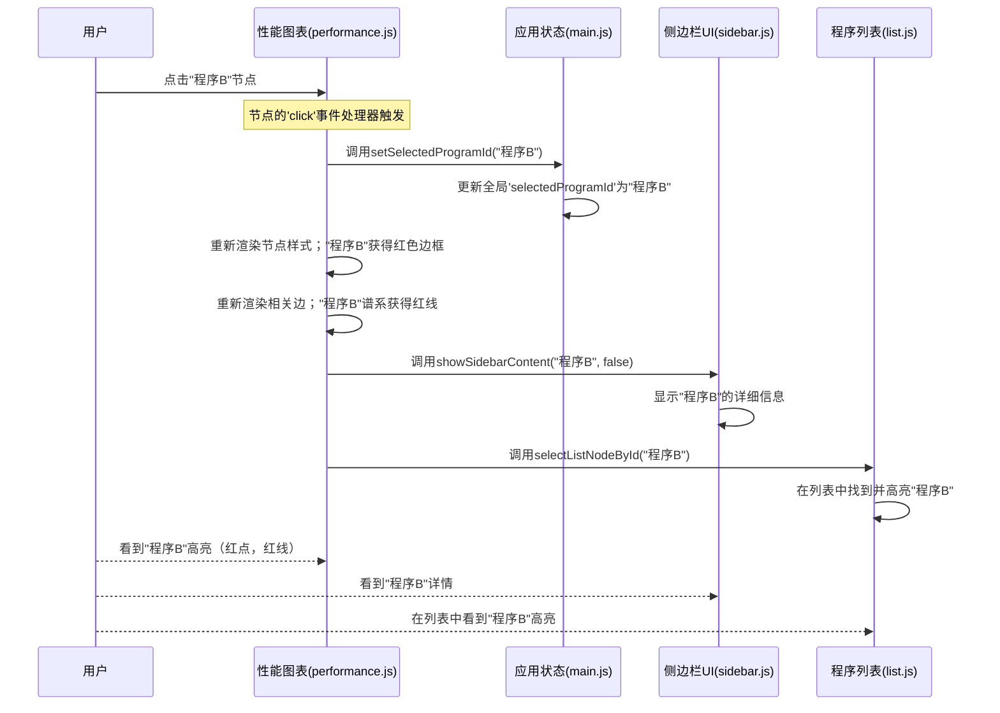

# 第4章：性能图表可视化

在上一章[分支图可视化](03_branching_graph_visualization_.md)中，我们学习了OpenEvolve如何帮助我们查看演化程序的"族谱"。我们可以追溯谱系并理解谁来自谁。但如果我们想知道程序是否真的随着时间的推移变得*更好*呢？如何发现性能方面的佼佼者，并观察==性能在不同代际间的变化==？

这就是**性能图表可视化**的用武之地。它就像是演化代码的健身追踪器，让我们一目了然地看到实验是否在取得进展

## 代码的健身追踪器

想象我们正在追踪自己的健身历程。我们不仅想看到所有锻炼的族谱，还想看到进展图表！例如，我们的跑步速度（性能指标）在不同周（代际）中如何提升。

OpenEvolve中的"==性能图表可视化=="正是为代码实现这一功能。它的主要职责是：
1.  **展示进展**：显示程序性能在不同代际间的变化。
2.  **发现趋势**：帮助我们快速判断程序整体是在变好、变差还是趋于稳定。
3.  **识别顶尖表现者**：轻松找到任何代际中得分最高的程序。
4.  **比较程序**：允许我们基于代际和性能指标比较单个程序。

## 我们的核心用例：追踪随时间变化的性能

假设我们正在运行一个旨在提升"得分"指标的演化实验，实验已经运行了许多代。我们打开可视化工具后希望：
*   看到一个图表，其中每个程序是一个点。
*   这些点根据它们的"代际"（年龄）和"得分"（表现）放置。
*   轻松识别得分最高的程序，观察得分是否随着代际增加而提升，并点击任何感兴趣的程序查看其详情。

性能图表可视化旨在直观地提供这些洞察。

## 性能图表的关键概念

这种可视化是一种**散点图**，意味着它使用点（或"节点"）来表示单个数据片段，并根据两种不同的测量值定位。

以下是核心概念：

### 1. X轴：性能指标（我们的"得分"）

*   **它是什么**：图表底部（或顶部）的水平线。
*   **它展示什么**：这个轴代表选定的性能指标（如"得分"、"错误"或"适应度"）。得分更好的程序（例如"越高越好"的更高值）会放置在更右侧。
*   **类比**：如果我们追踪跑步，这将是我们的"速度"或"距离"。

### 2. Y轴：代际（演化中的时间）

*   **它是什么**：图表左侧的垂直线。
*   **它展示什么**：这个轴代表程序的"代际"。较早代际（较老）的程序通常在底部，较新的代际在顶部。
*   **类比**：这将是训练的"周"或"月"。

### 3. 节点（圆圈）：单个程序

*   **它们是什么**：图表上的每个小圆圈（或点）代表实验中的一个演化程序。
*   **它们展示什么**：与[分支图可视化](03_branching_graph_visualization_.md)类似，它们的大小和颜色可以表示其他重要属性，例如性能（得分越高圆圈越大）或它们所属的"岛"（在多群体实验中）。
*   **交互性**：我们可以点击这些圆圈选择程序，高亮它并在侧边栏显示其详情。

### 4. 边（线）：父子链接（在此视图中）

*   **它们是什么**：连接程序的线，显示它们的父子关系，就像分支图中一样。
*   **它们展示什么**：这些线连接一个程序与其父程序，让我们可以追溯程序的谱系，并观察其性能如何从祖先一代代演化而来。

### 5. "NaN"框：处理缺失数据

*   **它是什么**：有时，程序可能没有选定性能指标的有效数值（例如它"失败"或未测量该指标）。这些程序被分组在一个特殊的框中，通常位于图表的最左侧，标记为"NaN"（非数字）。
*   **目的**：这确保所有程序都被表示，即使那些当前指标数据不完整的程序，保持它们的有序和可见。

### 6. "显示岛屿"切换：多群体视图

*   **它是什么**：一个复选框，允许我们决定如何显示来自不同"岛"（演化实验中的独立群体）的程序。
*   **工作原理**：
    *   **关闭**：所有程序绘制在单个图表上，无论它们属于哪个岛。
    *   **打开**：图表被分成多个部分，每个岛一个部分，便于比较不同群体间的性能趋势。

## OpenEvolve如何显示性能图表

性能图表可视化使用**D3.js（数据驱动文档）**构建，就像[分支图可视化](03_branching_graph_visualization_.md)一样。它位于`scripts/static/js/performance.js`文件中。

创建和更新此图表的主要函数是`updatePerformanceGraph`。每当新数据到达、选择不同的指标、切换到"性能"标签页、窗口调整大小或更改"显示岛屿"切换时，[应用状态管理](02_application_state_management_.md)系统就会调用此函数。

让我们看看`updatePerformanceGraph`的简化流程：

### 步骤1：设置绘图区域

首先，系统确保在"性能"标签页（`index.html`中的`view-performance` div）中有一个`<svg>`（可缩放矢量图形）元素准备就绪。它还==根据浏览器窗口大小和侧边栏的存在计算此SVG的适当宽度和高度==。

```javascript
// scripts/static/js/performance.js (简化)

function updatePerformanceGraph(nodes, options = {}) {
    let svg = d3.select('#performance-graph');
    if (svg.empty()) { // 如果不存在SVG，创建一个
        svg = d3.select('#view-performance').append('svg').attr('id', 'performance-graph');
    }

    let g = svg.select('g.zoom-group');
    if (g.empty()) { // 为缩放/平移创建一个组
        g = svg.append('g').attr('class', 'zoom-group');
    }

    // 根据窗口大小和侧边栏计算尺寸
    const windowWidth = window.innerWidth;
    const sidebarWidth = document.getElementById('sidebar').offsetWidth || 400;
    const padding = 32;
    const width = Math.max(windowWidth - sidebarWidth - padding, 400); // 确保最小宽度
    // ... 根据代际和岛的数量计算svgHeight ...
    svg.attr('width', width).attr('height', svgHeight);
    // ...
}
```

**说明**：这段代码确保我们有一个专用的绘图板（`svg`）用于图表，以及一个可以移动和缩放的容器（`g`）

动态调整此绘图板的尺寸以适应可用的屏幕空间。

### 步骤2：定义数据如何映射到位置（比例尺）

接下来，我们需要告诉D3如何==将程序的"代际"和"指标得分"转换为`svg`画布上的像素坐标==。这是使用D3的`scaleLinear`函数完成的。

```javascript
// scripts/static/js/performance.js (简化)

function updatePerformanceGraph(nodes, options = {}) {
    // ... (之前的设置) ...

    const metric = getSelectedMetric(); // 获取当前选定的性能指标
    const validNodes = nodes.filter(n => n.metrics && typeof n.metrics[metric] === 'number');

    // 选定指标的X轴比例尺
    const xExtent = d3.extent(validNodes, d => d.metrics[metric]); // 找到指标值的最小/最大值
    const x = d3.scaleLinear()
        .domain([xExtent[0], xExtent[1]]).nice() // 输入：从最小到最大指标值
        .range([margin.left + graphXOffset, width - margin.right]); // 输出：从左到右的屏幕像素

    // 代际的Y轴比例尺（如果显示岛则为多个）
    const yExtent = d3.extent(nodes, d => d.generation); // 找到代际的最小/最大值
    const minGen = 0; // 始终从代际0开始
    const maxGen = yExtent[1]; // 观察到的最大代际
    let yScales = {};
    const showIslands = document.getElementById('show-islands-toggle')?.checked;
    const islands = showIslands ? Array.from(new Set(nodes.map(n => n.island))).sort() : [null];

    islands.forEach((island, i) => { // 为每个岛（或无岛时为一个）创建Y比例尺
        yScales[island] = d3.scaleLinear()
            .domain([minGen, maxGen]).nice() // 输入：从最小到最大代际
            .range([margin.top + i * graphHeight, margin.top + (i + 1) * graphHeight - margin.bottom]); // 输出：从上到下的屏幕像素（每个岛偏移）
    });
    // ...
}
```

**说明**：这部分至关重要。`x`是我们的"性能标尺"，根据程序的指标测量水平位置。`yScales`是我们的"代际标尺"，测量垂直位置。如果"显示岛屿"开启，它会为每个岛创建单独的垂直标尺，堆叠在一起。`d3.extent`自动找到数据中的最低和最高值来设置这些标尺的范围。

### 步骤3：绘制轴和标签

现在我们的"标尺"（比例尺）已定义，我们可以在图表上==绘制标尺，并添加标签==。

```javascript
// scripts/static/js/performance.js (简化)

function updatePerformanceGraph(nodes, options = {}) {
    // ... (比例尺定义) ...
    g.selectAll('.axis, .axis-label, .island-label, .nan-label, .nan-box').remove(); // 首先清除旧轴

    // 绘制X轴（性能指标）
    g.append('g').attr('class', 'axis x-axis')
        .attr('transform', `translate(0,${margin.top})`) // 定位在顶部
        .call(d3.axisTop(x)); // 使用我们的'x'比例尺
    g.append('text').attr('class', 'x-axis-label')
        .attr('x', (width + undefinedBoxWidth) / 2).attr('y', margin.top - 28)
        .text(metric); // 用选定的指标名称标记

    // 为每个岛（或单个）绘制Y轴（代际）
    islands.forEach((island, i) => {
        g.append('g').attr('class', 'axis')
            .attr('transform', `translate(${margin.left + graphXOffset},0)`) // 定位在左侧
            .call(d3.axisLeft(yScales[island]).ticks(Math.min(12, genCount))); // 使用岛的'y'比例尺
        g.append('text') // Y轴标签
            .attr('class', 'axis-label')
            .attr('transform', `rotate(-90)`)
            .attr('y', margin.left + graphXOffset + 8)
            .attr('x', -(margin.top + i*graphHeight + (graphHeight - margin.top - margin.bottom)/2))
            .text('代际');
        if (showIslands) { // 可选：为每个岛部分添加标签
            g.append('text').attr('class', 'island-label')
                .attr('x', (width + undefinedBoxWidth) / 2).attr('y', margin.top + i*graphHeight + 38)
                .text(`岛 ${island}`);
        }
    });
    // ... (如果有未定义节点，绘制"NaN"框的代码) ...
}
```

**说明**：这段代码使用D3绘制我们看到的轴线和数字。

它添加了"代际"和选定的性能`指标`名称的标签。如果"显示岛屿"激活，它会为每个岛绘制单独的Y轴，并添加"岛X"标签。如果任何程序没有有效的指标数据，它还会为"NaN"框创建一个占位符。

### 步骤4：将程序（节点）绘制为圆圈

现在我们放置程序作为圆圈。我们将它们过滤为`validNodes`（有指标数据）和`undefinedNodes`（用于"NaN"框）。

```javascript
// scripts/static/js/performance.js (简化)

function updatePerformanceGraph(nodes, options = {}) 
{
    // ... (比例尺和轴定义) ...
    const highlightFilter = document.getElementById('highlight-select').value;
    const highlightNodes = getHighlightNodes(nodes, highlightFilter, metric);
    const highlightIds = new Set(highlightNodes.map(n => n.id));

    // 有效节点（散点图点）的数据连接
    const nodeSel = g.selectAll('circle.performance-node')
        .data(validNodes, d => d.id); // 绑定数据，使用程序ID作为唯一键

    nodeSel.enter().append('circle') // 为新程序创建圆圈
        .attr('class', 'performance-node')
        .attr('cx', d => x(d.metrics[metric])) // 使用X比例尺
        .attr('cy', d => yScales[showIslands ? d.island : null](d.generation)) // 使用Y比例尺
        .attr('r', d => getNodeRadius(d)) // 基于性能的半径（来自graph.js）
        .attr('fill', d => getNodeColor(d)) // 基于岛的颜色（来自graph.js）
        .on('click', function(event, d) { // 当点击圆圈时
            setSelectedProgramId(d.id); // 更新全局选定的程序ID
            showSidebarContent(d, false); // 在侧边栏显示详情
            // ... (列表等的进一步更新) ...
        })
        .merge(nodeSel) // 更新现有圆圈和新创建的圆圈
        .transition().duration(500) // 变化的平滑动画
        .attr('cx', d => x(d.metrics[metric])) // 更新位置
        .attr('cy', d => yScales[showIslands ? d.island : null](d.generation)) // 更新位置
        .attr('stroke', d => selectedProgramId === d.id ? 'red' : (highlightIds.has(d.id) ? '#2196f3' : '#333')) // 高亮选定/过滤的
        .attr('stroke-width', d => selectedProgramId === d.id ? 3 : 1.5);
    nodeSel.exit().transition().duration(300).attr('opacity', 0).remove(); // 移除旧程序

    // 未定义（NaN）节点的数据连接
    const nanSel = g.selectAll('circle.performance-nan')
        .data(undefinedNodes, d => d.id);
    nanSel.enter().append('circle') // 为NaN节点创建新圆圈
        .attr('class', 'performance-nan')
        .attr('cx', d => d._nanX) // NaN框的特殊X位置
        .attr('cy', d => yScales[showIslands ? d.island : null](d.generation))
        .attr('r', d => getNodeRadius(d))
        .attr('fill', d => getNodeColor(d))
        .on('click', function(event, d) { /* ... 与上述相同的点击逻辑 ... */ })
        .merge(nanSel)
        .transition().duration(500)
        .attr('cx', d => d._nanX)
        .attr('cy', d => yScales[showIslands ? d.island : null](d.generation))
        .attr('stroke', d => selectedProgramId === d.id ? 'red' : '#333');
    nanSel.exit().transition().duration(300).attr('opacity', 0).remove();
}
```

**说明**：这是程序显示为点的地方

它获取我们的`validNodes`并为每个程序创建一个圆圈，使用`x`和`y`比例尺放置它。它还处理`undefinedNodes`，将它们放在"NaN"框中。当用户点击一个圆圈时，它会更新中央的`selectedProgramId`（来自[应用状态管理](02_application_state_management_.md)）并触发侧边栏显示详情（来自[侧边栏UI管理器](07_sidebar_ui_manager_.md)）。`getNodeRadius`和`getNodeColor`是辅助函数（也由[分支图可视化](03_branching_graph_visualization_.md)使用）来确定每个圆圈的外观。

### 步骤5：绘制谱系的边（线）

最后，我们绘制连接父程序与其子程序的线，以在此性能图表上可视化演化路径。

```javascript
// scripts/static/js/performance.js (简化)

function updatePerformanceGraph(nodes, options = {}) {
    // ... (节点绘制) ...

    const nodeById = Object.fromEntries(nodes.map(n => [n.id, n]));
    const edges = nodes.filter(n => n.parent_id && nodeById[n.parent_id])
                       .map(n => ({ source: nodeById[n.parent_id], target: n }));

    g.selectAll('line.performance-edge').remove(); // 首先清除所有现有线

    g.selectAll('line.performance-edge')
        .data(edges, d => d.target.id) // 绑定数据，使用目标ID作为键
        .enter()
        .append('line') // 为每个新边追加一条线
        .attr('class', 'performance-edge')
        // 计算每条线的起点（x1, y1）和终点（x2, y2）
        .attr('x1', d => getNodeXY(d.source, x, yScales, showIslands, metric)[0])
        .attr('y1', d => getNodeXY(d.source, x, yScales, showIslands, metric)[1])
        .attr('x2', d => getNodeXY(d.target, x, yScales, showIslands, metric)[0])
        .attr('y2', d => getNodeXY(d.target, x, yScales, showIslands, metric)[1])
        .attr('stroke', d => { // 如果谱系中的程序被选中，高亮谱系
            if (selectedProgramId && (d.source.id === selectedProgramId || d.target.id === selectedProgramId)) {
                return 'red';
            }
            return '#888';
        })
        .attr('stroke-width', d => (selectedProgramId && (d.source.id === selectedProgramId || d.target.id === selectedProgramId)) ? 3 : 1.5)
        .attr('opacity', 0.5); // 轻微透明
}

// 获取节点X/Y的辅助函数，考虑NaN节点
function getNodeXY(node, x, yScales, showIslands, metric) {
    if (!node) return [null, null];
    const y = yScales[showIslands ? node.island : null](node.generation);
    if (node.metrics && typeof node.metrics[metric] === 'number') {
        return [x(node.metrics[metric]), y];
    } else if (typeof node._nanX === 'number') { // 使用特殊的NaN X坐标
        return [node._nanX, y];
    }
    return [null, null]; // 后备
}
```

**说明**：这部分绘制连接线。它找到每个程序的父程序，然后使用`getNodeXY`辅助函数（正确处理常规程序和"NaN"程序）获取每条线的起点和终点的正确坐标，显示演化的路径。如果程序或其父程序被选中，线的颜色将变为红色以高亮显示。

### 步骤6：缩放和平移

与分支图类似，性能图表也允许我们放大/缩小和平移大型数据集。

```javascript
// scripts/static/js/performance.js (简化)

let zoomBehavior = null; // 存储我们的缩放控制器

function updatePerformanceGraph(nodes, options = {}) {
    // ... (图表元素创建) ...

    if (!zoomBehavior) { // 仅设置一次缩放行为
        zoomBehavior = d3.zoom() // 创建缩放控制器
            .scaleExtent([0.2, 10]) // 允许从20%到1000%缩放
            .on('zoom', function(event) { // 当缩放/平移发生时做什么
                g.attr('transform', event.transform); // 对我们的绘图组'g'应用缩放/平移变换
                // ... (如果内容超出屏幕显示"重新居中"按钮的逻辑) ...
            });
        svg.call(zoomBehavior); // 将此缩放控制器应用于我们的SVG
    }

    // 初始加载或请求时自动缩放以适应所有内容
    if (options.autoZoom || (!lastTransform && nodes.length)) {
        // ... (计算适应所有节点的变换的逻辑) ...
        svg.transition().duration(500).call(zoomBehavior.transform, t); // 用平滑动画应用它
    }
}
```

**说明**：`d3.zoom()`功能捕获鼠标滚轮滚动（用于缩放）和拖动动作（用于平移）。当这些发生时，它告诉主绘图组`g`（包含所有圆圈和线）变换自身，使所有内容看起来平滑地缩放或平移。还有智能逻辑在首次加载或请求时自动缩放和居中图表，这样我们就不会从一个空视图开始。

## 交互式点击的协调过程

让我们回顾我们的核心用例：我们在性能图表中点击一个程序。以下是OpenEvolve如何使一切做出反应：



**说明**：当我们点击一个程序节点时，点击处理器（来自步骤4）被激活。它更新`main.js`中的中央`selectedProgramId`。这一变化然后触发性能图表本身重新样式化点击的节点（使其边框变红）及其父/子连接（红线）。它还告诉[侧边栏UI管理器](07_sidebar_ui_manager_.md)显示程序的详情，以及[程序列表视图](05_program_list_view_.md)高亮对应的条目。所有这些更新都无缝且即时地发生，这要归功于[应用状态管理](02_application_state_management_.md)。

## 总结

在本章中，我们探索了"性能图表可视化"，这是OpenEvolve中理解演化实验定量进展的强大工具。我们了解到它：

*   将程序显示为**散点图**，在X轴上使用选定的**性能指标**，在Y轴上使用**代际**。
*   清晰地展示性能随时间的**趋势**，并帮助**识别高表现个体**。
*   通过将缺失指标数据的程序分组在特殊的"**NaN**"框中来处理它们。
*   可以将图表分成多个部分以显示来自不同"**岛**"（群体）的程序。
*   使用**D3.js**构建，并利用==共享状态提供交互式体验==，允许我们点击程序查看其详情并在性能上下文中追踪其谱系。

这种可视化让我们深入了解演化算法的表现如何，帮助我们引导实验走向更好的结果。

现在我们已经将程序可视化为图表，让我们看看如何==在可搜索和可排序的列表中查看它们==。

[下一章：程序列表视图](05_program_list_view_.md)

