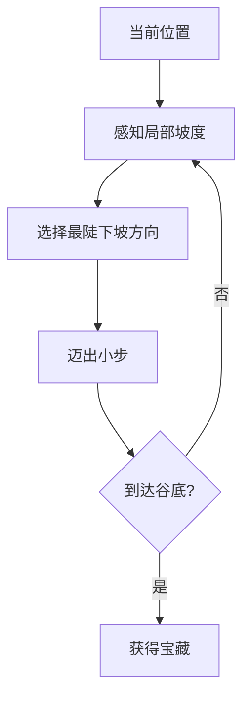
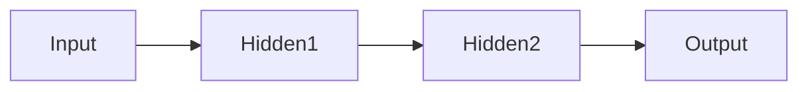
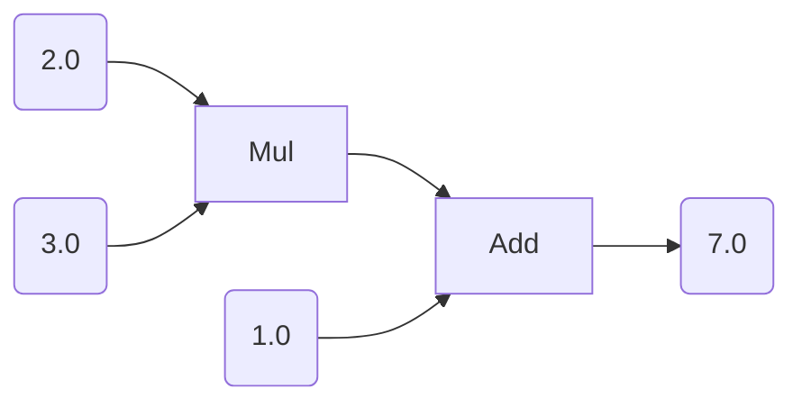

# Chapter 02: Micrograd  
*自动微分与反向传播实现*  

## 概要
- 机器学习三要素：数据 + 模型 + 算法
- 损失函数：预测值与真实值的差距度量
- 反向传播 = 梯度下降 + 动态规划
- micrograd：极简自动微分库实现

---

## 一、直觉理解

### 1.1 机器学习三要素
**类比职场模型**：
| 要素     | 职场对应物   | 功能说明         |
| -------- | ------------ | ---------------- |
| 数据     | 培训材料     | 提供学习基础     |
| 模型     | 打工人       | 执行预测任务     |
| 损失函数 | KPI考核      | 量化工作质量     |
| 优化算法 | 绩效改进计划 | 持续优化工作表现 |

### 1.2 梯度下降原理
**山中寻宝比喻**：


### 1.3 反向传播本质
**双重技术融合**：
1. **梯度下降**：参数优化基础
2. **动态规划**：解决深层网络梯度计算难题

**突破性意义**：
- 解决深层网络"蝴蝶效应"问题
- 获得2024年诺贝尔物理学奖

### 1.4 自动微分革命
**发展历程**：
```timeline
2010年前 : 手动推导导数公式
2012年 : 主流框架引入自动微分
2020年 : PyTorch/TensorFlow成熟
```

---

## 二、数学原理

### 2.1 损失函数类型
| 类型          | 公式                               | 特性           |
| ------------- | ---------------------------------- | -------------- |
| 均方误差(MSE) | $\frac{1}{n}\sum(y_i-\hat{y_i})^2$ | 放大异常值影响 |
| 交叉熵        | $-\sum y_i\log(\hat{y_i})$         | 分类任务常用   |

### 2.2 梯度下降算法
**参数更新规则**：
$$
\theta_{t+1} = \theta_t - \eta \nabla_\theta L(\theta_t)
$$

**关键参数**：
- $\eta$：学习率（步长控制）
- $\nabla_\theta L$：损失函数梯度

**停止条件**：
1. 梯度模长 < 阈值
2. 达到最大迭代次数

### 2.3 反向传播机制
#### 2.3.1 网络结构


#### 2.3.2 计算流程
**前向传播**：
$$
\begin{aligned}
z^{[1]} &= W^{[1]}x + b^{[1]} \\
a^{[1]} &= \sigma(z^{[1]})
\end{aligned}
$$

**反向传播**：
$$
\begin{aligned}
\delta^{[2]} &= \nabla_a L \odot \sigma'(z^{[2]}) \\
\delta^{[1]} &= (W^{[2]T}\delta^{[2]}) \odot \sigma'(z^{[1]})
\end{aligned}
$$

#### 2.3.3 参数更新
$$
W^{[l]} := W^{[l]} - \eta \delta^{[l]}a^{[l-1]T}
$$

---

## 三、代码实现

### 3.1 micrograd核心设计
#### 3.1.1 Value类结构
```python
class Value:
    def __init__(self, data):
        self.data = data      # 标量值
        self.grad = 0        # 梯度值
        self._backward = None # 梯度计算函数
        self._prev = set()    # 前驱节点
```

#### 3.1.2 反向传播实现
```python
def backward(self):
    # 拓扑排序
    topo = []
    visited = set()
    def build_topo(v):
        if v not in visited:
            visited.add(v)
            for child in v._prev:
                build_topo(child)
            topo.append(v)
    
    # 链式求导
    self.grad = 1
    for v in reversed(topo):
        v._backward()
```

### 3.2 计算图示例
**正向传播**：


**反向传播梯度计算**：
| 变量 | 梯度值 | 计算过程                            |
| ---- | ------ | ----------------------------------- |
| x    | 3.0    | $\frac{\partial z}{\partial x} = y$ |
| y    | 2.0    | $\frac{\partial z}{\partial y} = x$ |
| b    | 1.0    | $\frac{\partial z}{\partial b} = 1$ |

---

## sum
1. **动态规划思想**：通过存储中间结果大幅提升计算效率
2. **模块化设计**：Value类封装数据和梯度计算
3. **拓扑排序**：确保梯度传播的正确顺序

