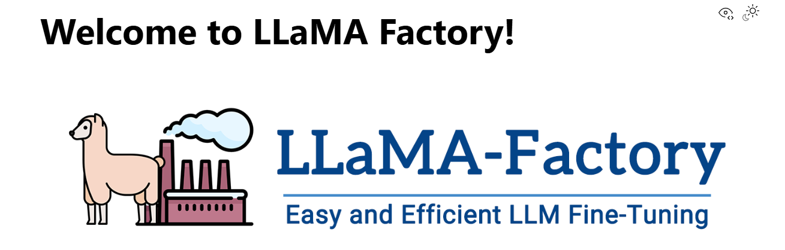
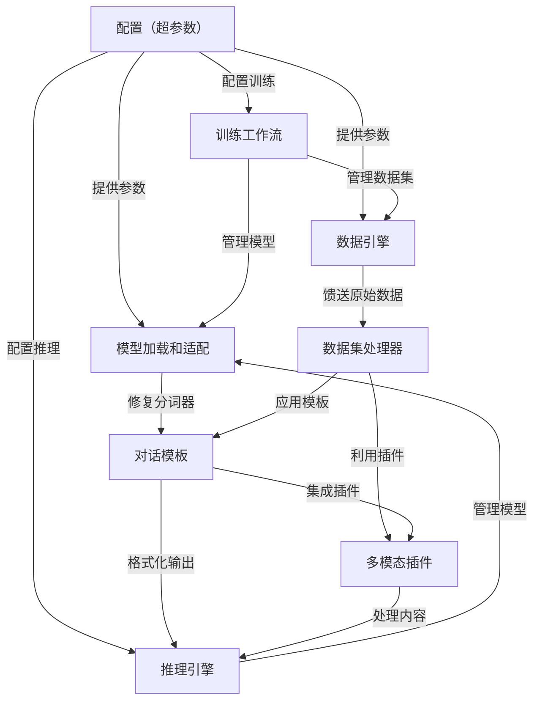

链接：[LLaMA Factory](https://llamafactory.readthedocs.io/zh-cn/latest/)

# docs：LLaMA-Factory

LLaMA-Factory是一个**强大且灵活的框架**，专为大型语言模型（LLMs）和视觉语言模型（VLMs）的*==高效微调和部署==*而设计。

- 提供了一个*综合工具包*，用于自定义模型行为、管理多样化数据集，以及==简化==整个训练和推理流程，==支持各种技术，如LoRA、DPO和多模态适配==。

通过 LLaMA Factory，可以在无需编写任何代码的前提下，在本地完成上百种预训练模型的微调，框架特性包括：

- 模型种类：LLaMA、LLaVA、Mistral、Mixtral-MoE、Qwen、Yi、Gemma、Baichuan、ChatGLM、Phi 等等。
- 训练算法：（增量）预训练、（多模态）指令监督微调、奖励模型训练、PPO 训练、DPO 训练、KTO 训练、ORPO 训练等等。
- 运算精度：16 比特全参数微调、冻结微调、LoRA 微调和基于 AQLM/AWQ/GPTQ/LLM.int8/HQQ/EETQ 的 2/3/4/5/6/8 比特 QLoRA 微调。
- 优化算法：GaLore、BAdam、DoRA、LongLoRA、LLaMA Pro、Mixture-of-Depths、LoRA+、LoftQ 和 PiSSA。
- 加速算子：FlashAttention-2 和 Unsloth。
- 推理引擎：Transformers 和 vLLM。
- 实验监控：LlamaBoard、TensorBoard、Wandb、MLflow、SwanLab 等等。

## 可视化

## 章节

1. [配置（超参数）
](01_configuration__hparams__.md)
2. [模型加载和适配
](02_model_loading_and_adaptation_.md)
3. [数据引擎
](03_data_engine_.md)
4. [数据集处理器
](04_dataset_processor_.md)
5. [对话模板
](05_chat_template_.md)
6. [多模态插件
](06_multimodal_plugin_.md)
7. [训练工作流
](07_training_workflow_.md)
8. [推理引擎
](08_inference_engine_.md)

---

