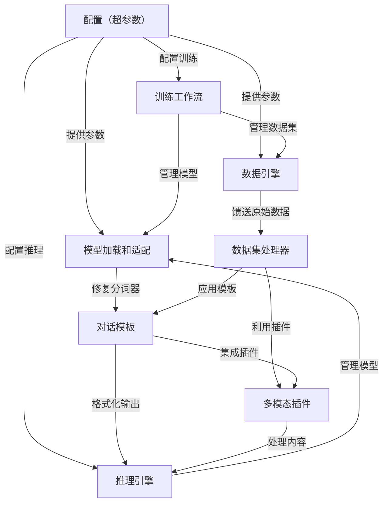
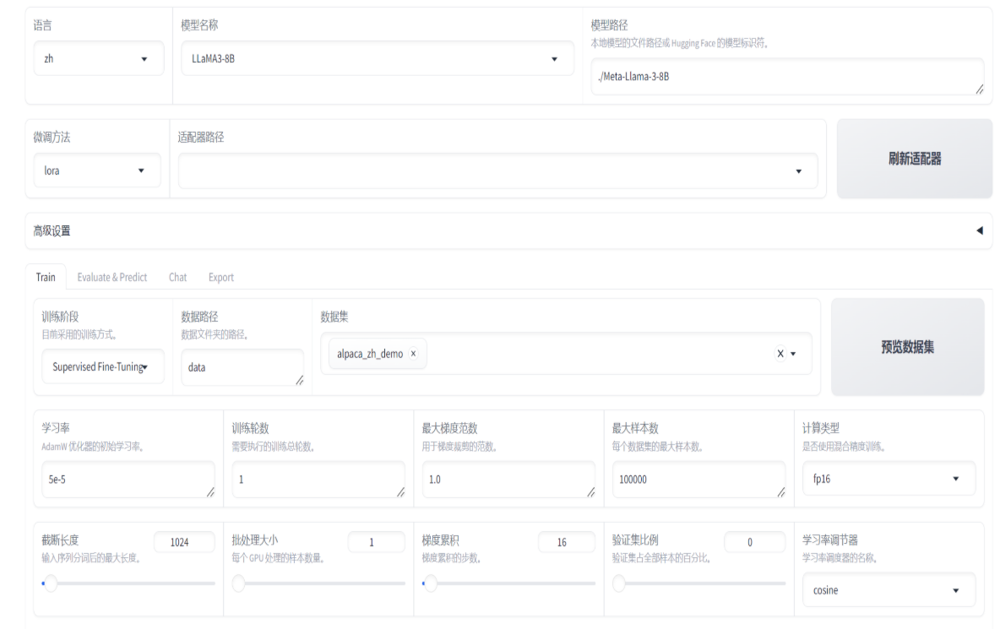
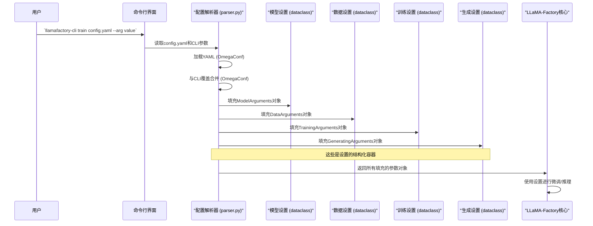

链接：[LLaMA Factory](https://llamafactory.readthedocs.io/zh-cn/latest/)


# docs：LLaMA-Factory

> （用于LLM微调）

是一个**强大且灵活的框架**，专为大型语言模型（LLMs）和视觉语言模型（VLMs）的*==高效微调和部署==*而设计。

- 提供了一个*综合工具包*，用于自定义模型行为、管理多样化数据集，以及==简化==整个训练和推理流程，==支持各种技术，如LoRA、DPO和多模态适配==。

通过 LLaMA Factory，可以在无需编写任何代码的前提下，在本地完成上百种预训练模型的微调，框架特性包括：

- 模型种类：LLaMA、LLaVA、Mistral、Mixtral-MoE、Qwen、Yi、Gemma、Baichuan、ChatGLM、Phi 等等。
- 训练算法：（增量）预训练、（多模态）指令监督微调、奖励模型训练、PPO 训练、DPO 训练、KTO 训练、ORPO 训练等等。
- 运算精度：16 比特全参数微调、冻结微调、LoRA 微调和基于 AQLM/AWQ/GPTQ/LLM.int8/HQQ/EETQ 的 2/3/4/5/6/8 比特 QLoRA 微调。
- 优化算法：GaLore、BAdam、DoRA、LongLoRA、LLaMA Pro、Mixture-of-Depths、LoRA+、LoftQ 和 PiSSA。
- 加速算子：FlashAttention-2 和 Unsloth。
- 推理引擎：Transformers 和 vLLM。
- 实验监控：LlamaBoard、TensorBoard、Wandb、MLflow、SwanLab 等等。


## 可视化



## 章节

1. [配置（超参数）
](01_configuration__hparams__.md)
2. [模型加载和适配
](02_model_loading_and_adaptation_.md)
3. [数据引擎
](03_data_engine_.md)
4. [数据集处理器
](04_dataset_processor_.md)
5. [对话模板
](05_chat_template_.md)
6. [多模态插件
](06_multimodal_plugin_.md)
7. [训练工作流
](07_training_workflow_.md)
8. [推理引擎
](08_inference_engine_.md)

---

# 第1章：配置（超参数）

欢迎来到LLaMA-Factory

第一章将向我们介绍微调之旅的"控制面板"：**配置**，也称为**超参数**（Hparams，Hyperparameters的缩写）。可以将其视为主蓝图，它准确地告诉LLaMA-Factory如何构建和训练我们定制的大型语言模型（LLM）。



## 控制面板：为什么配置是关键

想象一下我们正在开车。我们不会只是跳进车里就期待最好的结果，对吧？我们会调整座椅、后视镜，启动引擎，也许还会设置收音机。同样，当我们想要微调一个LLM时，需要告诉系统很多事情：
*   我们想从哪个基础模型开始（例如，Llama-2-7B）？
*   它应该从什么特定数据中学习？
*   它应该学习多快（"学习率"）？
*   它应该一次处理多少数据（"批次大小"）？
*   当它生成文本时，应该有多创造性或多事实性（"温度"）？

这就是**配置（超参数）**的用武之地。它是我们定义所有这些关键设置和参数的中心位置。没有它，LLaMA-Factory就不知道该做什么！它解决了需要以有组织和灵活的方式为我们的模型、数据和训练过程指定无数选项的问题。

## 我们的第一个微调配方：一个用例

让我们具体一点。假设我们想在客户支持对话数据集上微调一个小型Llama模型。以下是我们可能需要的一些基本设置：

*   **模型名称**：`meta-llama/Llama-2-7b-hf`（我们想使用的特定Llama模型）
*   **数据集**：`my_customer_support_data`（我们的自定义数据集）
*   **最大序列长度**：`1024`（每段文本输入可以有多长）
*   **学习率**：`2e-5`（模型调整其知识速度的常见起点）
*   **批次大小**：`4`（模型在每个GPU上一次处理多少个示例）
*   **输出目录**：`./output_support_model`（保存我们微调模型的位置）

我们可以通过两种主要方式向LLaMA-Factory提供这些设置：

1.  **YAML文件（推荐用于复杂设置）：** YAML是一种人性化的数据序列化标准。它非常适合将所有设置保存在一个可读的文件中。
2.  **命令行参数（适合快速更改和覆盖）：** 我们可以在运行LLaMA-Factory时直接输入参数，这对于在不编辑文件的情况下进行小调整非常方便。

### 示例：使用YAML文件进行微调

让我们创建一个名为`train_settings.yaml`的简单YAML文件：

```yaml
# train_settings.yaml
model_name_or_path: meta-llama/Llama-2-7b-hf
dataset: my_customer_support_data
cutoff_len: 1024
learning_rate: 2e-5
per_device_train_batch_size: 4
num_train_epochs: 3
output_dir: ./output_support_model
```

现在，我们可以使用此文件运行LLaMA-Factory：

```bash
llamafactory-cli train train_settings.yaml
```

此命令告诉LLaMA-Factory使用`train_settings.yaml`中指定的配置进行"训练"。

### 示例：使用命令行参数覆盖设置

如果我们想在不更改`train_settings.yaml`的情况下快速尝试不同的学习率怎么办？我们可以直接在命令行中覆盖它：

```bash
llamafactory-cli train train_settings.yaml --learning_rate 1e-5
```

现在，此次运行的学习率将是`1e-5`，而`train_settings.yaml`中的所有其他设置将保持不变。这种灵活性对于实验来说非常强大！

## 底层机制：LLaMA-Factory如何管理配置

那么，LLaMA-Factory如何将我们的YAML文件或命令行输入转换为可操作的设置？

### 配置之旅：一个简单的类比

想象LLaMA-Factory是一位熟练的厨师。在烹饪之前，厨师需要一份食谱。
1.  **我们（用户）** 给厨师一份食谱（我们的`train_settings.yaml`文件）以及一些最后一刻的口头指示（命令行参数）。
2.  **配置解析器（LLaMA-Factory的大脑）** 读取所有内容。它有预定义的类别，如"模型配料"、"数据配料"、"烹饪说明"和"上菜建议"。
3.  它仔细地将我们的食谱细节组织到这些类别中，为每个类别创建特定的列表。
4.  最后，厨师（LLaMA-Factory）使用这些有组织的列表来准备和烹饪（微调）我们的LLM。

以下是简化的事件序列：



### 设置背后的代码

LLaMA-Factory使用Python的`dataclasses`来定义所有可能的配置选项。每个dataclass将相关设置分组，使它们易于管理。

#### 1. 定义参数类别

让我们看看这些dataclass的简化版本：

**`src/llamafactory/hparams/model_args.py`**：这定义了与我们的模型相关的设置。

```python
# 来自src/llamafactory/hparams/model_args.py的简化摘录
from dataclasses import dataclass, field
from typing import Optional

@dataclass
class BaseModelArguments:
    model_name_or_path: Optional[str] = field(
        default=None,
        metadata={"help": "模型路径或来自Hugging Face的标识符。"},
    )
    trust_remote_code: bool = field(
        default=False,
        metadata={"help": "信任来自Hugging Face的远程代码。"},
    )
    # ... 更多模型特定设置 ...

@dataclass
class ModelArguments(BaseModelArguments):
    # 此类继承BaseModelArguments的所有字段
    # 并可能添加更多专门的模型相关参数。
    pass
```
**解释：** `ModelArguments`是一个`dataclass`。`@dataclass`装饰器会自动为我们生成像`__init__`这样的方法，使创建保存数据的对象变得容易。每个`field`都有一个`default`值和`metadata`来提供有用的描述，当我们运行`llamafactory-cli --help`时经常会看到这些。

**`src/llamafactory/hparams/data_args.py`**：这定义了我们数据集的设置。

```python
# 来自src/llamafactory/hparams/data_args.py的简化摘录
from dataclasses import dataclass, field
from typing import Optional

@dataclass
class DataArguments:
    dataset: Optional[str] = field(
        default=None,
        metadata={"help": "用于训练的数据集名称。"},
    )
    cutoff_len: int = field(
        default=2048,
        metadata={"help": "标记化输入的截断长度。"},
    )
    # ... 更多数据特定设置 ...
```
**解释：** 与`ModelArguments`类似，`DataArguments`保存关于我们数据的所有必要信息，如使用哪个`dataset`以及限制输入文本长度的`cutoff_len`。

**`src/llamafactory/hparams/training_args.py`**：这定义了训练过程本身的设置。

```python
# 来自src/llamafactory/hparams/training_args.py的简化摘录
from dataclasses import dataclass, field
from transformers import Seq2SeqTrainingArguments # 来自Hugging Face的基类

@dataclass
class TrainingArguments(Seq2SeqTrainingArguments):
    # LLaMA-Factory扩展了Hugging Face的TrainingArguments
    # 以添加其自己的特定功能或覆盖默认值。
    output_dir: str = field(
        default="output",
        metadata={"help": "训练结果的输出目录。"},
    )
    # 此类有更多从Seq2SeqTrainingArguments继承的字段
    # 如learning_rate、per_device_train_batch_size、num_train_epochs等。
    # ... LLaMA-Factory的特定训练设置 ...
```
**解释：** `TrainingArguments`很特殊，因为它继承自流行的Hugging Face Transformers库的`Seq2SeqTrainingArguments`。这意味着LLaMA-Factory自动支持大量标准训练选项，并可以在此基础上添加自己的选项。

**`src/llamafactory/hparams/generating_args.py`**：这定义了模型如何生成新文本的设置。

```python
# 来自src/llamafactory/hparams/generating_args.py的简化摘录
from dataclasses import dataclass, field
from typing import Any

@dataclass
class GeneratingArguments:
    do_sample: bool = field(
        default=True,
        metadata={"help": "是否使用采样。"},
    )
    temperature: float = field(
        default=0.95,
        metadata={"help": "用于调节下一个token概率的值。"},
    )
    max_new_tokens: int = field(
        default=1024,
        metadata={"help": "要生成的最大token数。"},
    )
    # ... 更多生成特定设置 ...
```
**解释：** `GeneratingArguments`纯粹关注模型在创建新文本时应该如何表现，控制创造性（`temperature`）、长度（`max_new_tokens`）等。

#### 2. 解析器：将一切整合在一起

`src/llamafactory/hparams/parser.py`文件包含读取我们的输入并填充这些dataclass的逻辑。它使用`HfArgumentParser`（来自Hugging Face）来高效处理这一过程。

```python
# 来自src/llamafactory/hparams/parser.py的简化摘录
import sys
from pathlib import Path
from omegaconf import OmegaConf # 用于处理YAML文件
from transformers import HfArgumentParser

# 导入我们的参数dataclass
from .data_args import DataArguments
from .model_args import ModelArguments
from .training_args import TrainingArguments
from .finetuning_args import FinetuningArguments # 微调方法的另一个类别
from .generating_args import GeneratingArguments

# 定义训练的所有参数类
_TRAIN_ARGS = [ModelArguments, DataArguments, TrainingArguments, FinetuningArguments, GeneratingArguments]

def get_train_args(args=None):
    # HfArgumentParser知道如何从dataclass创建对象
    parser = HfArgumentParser(_TRAIN_ARGS)

    # 这部分决定我们是从YAML文件还是命令行加载
    if args is None: # 通常从CLI调用时
        if len(sys.argv) > 1 and (sys.argv[1].endswith(".yaml") or sys.argv[1].endswith(".yml")):
            # 首先加载YAML文件
            dict_config = OmegaConf.load(Path(sys.argv[1]).absolute())
            # YAML文件后的命令行参数可以覆盖
            override_config = OmegaConf.from_cli(sys.argv[2:])
            parsed_args = OmegaConf.to_container(OmegaConf.merge(dict_config, override_config))
        else:
            # 如果没有YAML，假设所有都是命令行参数
            parsed_args = sys.argv[1:]
    else: # 如果以编程方式提供args（例如，从Python脚本）
        parsed_args = args

    # HfArgumentParser将字典/列表转换为我们的dataclass对象
    model_args, data_args, training_args, finetuning_args, generating_args = parser.parse_dict(parsed_args)

    # ... (LLaMA-Factory在这里执行许多检查和后处理步骤) ...

    return model_args, data_args, training_args, finetuning_args, generating_args

# 如何在内部使用的示例：
if __name__ == "__main__":
    # 要运行此程序，我们通常会执行llamafactory-cli，它调用get_train_args
    # 但为了说明：
    # `python -m src.llamafactory.hparams.parser train_settings.yaml --learning_rate 1e-5`
    print("解析参数...")
    model_args, data_args, training_args, finetuning_args, generating_args = get_train_args()
    print(f"要使用的模型: {model_args.model_name_or_path}")
    print(f"训练数据集: {data_args.dataset}")
    print(f"初始学习率: {training_args.learning_rate}")
    print(f"输出目录: {training_args.output_dir}")
```
**解释：**
1.  `HfArgumentParser(_TRAIN_ARGS)`：这行代码创建了一个强大的解析器，它了解我们在dataclass中定义的所有类型的设置（模型、数据、训练、微调、生成）。
2.  `OmegaConf.load()`和`OmegaConf.from_cli()`：这些函数来自`omegaconf`库，LLaMA-Factory使用它从YAML文件读取设置，并将它们与我们通过命令行提供的任何覆盖结合起来。
3.  `parser.parse_dict(parsed_args)`：这是神奇的一步！解析器获取组合的设置（作为字典）并填充我们的`ModelArguments`、`DataArguments`、`TrainingArguments`、`FinetuningArguments`和`GeneratingArguments`对象的所有字段。
4.  然后该函数返回这些结构化对象，准备供LLaMA-Factory的其余部分使用。

## 结论

我们刚刚迈出了理解LLaMA-Factory的第一步

配置（超参数）是我们将执行的每个任务的基础，从简单的微调到复杂的多阶段训练。通过在YAML文件中或通过命令行参数定义我们的设置，我们可以完全控制LLaMA-Factory的行为。

既然我们知道如何告诉LLaMA-Factory使用什么模型，下一个合乎逻辑的步骤是了解LLaMA-Factory实际上如何加载该模型并为训练或推理做准备。这直接引导我们进入下一章：[第2章：模型加载和适配](02_model_loading_and_adaptation_.md)。

