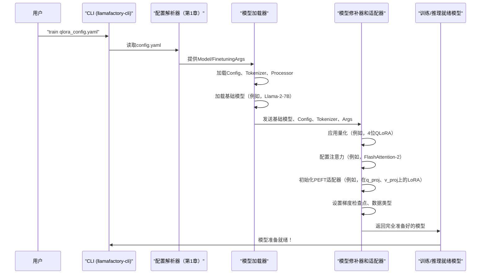

# 第2章：模型加载和适配

欢迎回来

在[第1章：配置（超参数）](01_configuration__hparams__.md)中，我们学习了如何成为LLaMA-Factory的"控制面板操作员"，使用超参数告诉它*使用什么*模型以及*如何*训练它。现在，在第2章中，我们将深入探讨LLaMA-Factory如何接受这些指令并实际让我们选择的大型语言模型（LLM）运行起来：**模型加载和适配**。

## 让我们的LLM运行起来：为什么不仅仅是加载

想象一下我们买了一辆强大的全新赛车。仅仅把它放在车库里是不足以赢得比赛的，对吧？我们需要：
1.  **把它从车库里开出来：** 这就像从存储中加载核心LLM。
2.  **阅读手册并准备驾驶员：** 这涉及加载模型的"分词器"和任何帮助它理解和生成文本/多模态输入的"处理器"。
3.  **为比赛调整和适配它：** 这是"适配"部分。我们可能会优化引擎（FlashAttention）、减轻车重（量化）或添加特殊的赛车组件（PEFT适配器，如LoRA）。我们还会专门为训练或仅为驾驶（推理）进行设置。

LLM也类似。它们庞大而复杂。仅仅加载原始模型文件是不够的。LLaMA-Factory需要执行几个关键步骤，使它们为高效的训练或推理做好准备。这个抽象处理所有这些，解决了将通用基础模型转换为高度优化和任务特定的强大模型的问题。

## 我们的目标：使用QLoRA微调Llama

让我们使用一个具体的例子：我们想要获取一个基础的Llama-2-7B模型，应用**QLoRA**（一种高效微调的强大技术），并为训练做准备。然后，稍后，我们将加载这个适配的模型进行预测（推理）。

为了实现这一点，LLaMA-Factory需要：
1.  从Hugging Face加载`meta-llama/Llama-2-7b-hf`模型。
2.  加载其关联的分词器。
3.  为4位量化（QLoRA中的"Q"）配置模型以节省内存。
4.  将**LoRA**（低秩适配）层附加到模型的特定部分，使*只有这些小层*可训练，同时保持巨大的基础模型冻结。
5.  可选地，启用其他优化，如**FlashAttention-2**以提高速度。
6.  设置**梯度检查点**以在训练期间进一步减少内存使用。

所有这些操作都由我们在[第1章：配置（超参数）](01_configuration__hparams__.md)中定义的超参数指导。

## 模型加载和适配的关键概念

让我们分解LLaMA-Factory在这个阶段处理的主要思想：

### 1. 加载核心LLM、分词器和处理器

第一步始终是获取基本组件。

*   **核心LLM：** 这是我们应用程序的大脑。LLaMA-Factory使用Hugging Face的`AutoModelForCausalLM`（或类似的`AutoModel`类用于特定模型类型，如视觉-语言模型）根据我们的`model_name_or_path`加载大型预训练模型。
*   **分词器：** LLM不理解原始文本。分词器将人类可读的文本转换为模型可以处理的数字token，反之亦然。LLaMA-Factory使用`AutoTokenizer`加载它。
*   **处理器：** 对于多模态模型（例如，处理图像和文本的模型），处理器处理非文本输入（如图像），将它们转换为模型理解的格式。LLaMA-Factory使用`AutoProcessor`加载它。

这三个组件一起加载，以确保模型拥有与外界通信所需的一切。

### 2. 模型适配和优化："调整"部分

一旦加载，模型将被配置和修改以实现特定目标。这是大部分"魔法"发生的地方，使训练和推理变得高效。

#### A. 量化：使模型更精简

量化就像通过使用更少的位（数字信息单位）来表示其数字，将一本巨大的书缩小为更小的版本。这减少了内存使用，并可以加快计算速度。

*   **QLoRA（4位量化）：** 一种流行的技术，将基础模型量化为4位，然后附加LoRA适配器。这允许我们在消费级GPU上微调非常大的模型（例如，70B参数）。LLaMA-Factory通过`quantization_bit: 4`设置启用此功能。
*   **其他量化方法：** LLaMA-Factory还支持使用`bitsandbytes`进行8位量化，以及`HQQ`和`EETQ`用于不同的量化策略。它还支持**GPTQ**用于训练后量化（PTQ），这意味着模型在*加载之前*被量化。

#### B. 高效架构和注意力机制

这些优化直接影响模型处理信息的方式。

*   **FlashAttention-2 (FA2) / SDPA：** 这些是高度优化的注意力机制，通过使计算更高效来加速训练和推理，特别是在现代GPU上。我们可以使用`flash_attn: fa2`或`flash_attn: sdpa`启用它们。
*   **LLaMA Pro：** 一种优化参数效率的特定架构。如果启用，LLaMA-Factory可以配置模型使用它。

#### C. PEFT适配器（LoRA、OFT）：高效微调

与其训练LLM中的*所有*数十亿参数（这非常昂贵），**参数高效微调（PEFT）**方法只训练其中的一小部分。

*   **LoRA（低秩适配）：** 在原始大层旁边添加小的、可训练的"适配器"层。只有这些小适配器层被训练。完成后，我们可以只保存小的适配器权重，而不是整个巨大的模型。这由`finetuning_type: lora`和`lora_target`（模型的哪些部分获得LoRA适配器）控制。
*   **OFT（正交微调）：** 另一种PEFT方法，在适配模型的同时保留模型的能力。

#### D. 其他训练准备

LLaMA-Factory还应用其他基本调整：

*   **梯度检查点：** 训练期间的一种节省内存的技术，它重新计算激活值而不是存储它们，用计算时间换取减少的内存。默认启用，除非`disable_gradient_checkpointing: True`。
*   **数据类型转换：** 确保可训练参数在`float32`中（为了稳定性），而其他部分可能在`float16`或`bfloat16`中（为了速度/内存）。
*   **词汇表调整大小：** 如果我们添加新token或特殊token，模型的输入/输出层需要调整大小以适应它们。

## 如何使用模型加载和适配

我们不直接"调用"`模型加载和适配`。相反，我们使用[第1章：配置（超参数）](01_configuration__hparams__.md)中的设置（超参数）来配置它，当我们开始训练或推理时，LLaMA-Factory会自动应用这些步骤。

让我们重新审视我们的QLoRA微调用例。这是一个典型的YAML配置文件（`qlora_config.yaml`）：

```yaml
# qlora_config.yaml
model_name_or_path: meta-llama/Llama-2-7b-hf
finetuning_type: lora           # 我们想使用LoRA适配器
lora_target: q_proj,v_proj      # 将LoRA附加到查询和值投影层
quantization_bit: 4             # 启用4位量化（QLoRA）
flash_attn: fa2                 # 如果可用，使用FlashAttention-2以提高速度
cutoff_len: 1024                # 最大输入长度（来自第1章）
output_dir: ./output_qlora_model # 保存微调模型的位置
```

要运行此命令，我们将使用第1章中的命令：

```bash
llamafactory-cli train qlora_config.yaml
```

**LLaMA-Factory将做什么**
当我们运行此命令时，LLaMA-Factory将：

1.  从`qlora_config.yaml`读取所有设置。
2.  看到`model_name_or_path: meta-llama/Llama-2-7b-hf`并开始加载该基础模型。
3.  加载Llama-2-7B的分词器。
4.  检测到`quantization_bit: 4`并对基础模型应用4位量化。
5.  检测到`finetuning_type: lora`和`lora_target: q_proj,v_proj`，然后在这些特定层上初始化LoRA适配器。
6.  检测到`flash_attn: fa2`并尝试启用FlashAttention-2。
7.  设置梯度检查点和其他训练特定的优化。

结果是一个`model`对象，它是一个Llama-2-7B基础模型，有效冻结（或以4位量化形式加载），附加了小的、可训练的LoRA层，并准备好进行高效微调。

## 底层机制：模型准备流程

让我们窥探幕后，看看LLaMA-Factory如何执行这些步骤。

### 模型准备之旅：一个简单的类比

将LLaMA-Factory想象成一个熟练的维修团队准备赛车：


这里的关键组件是获取核心部分的`模型加载器`，以及根据我们的配置执行所有修改和优化的`模型修补器和适配器`。

### 模型加载和适配背后的代码

此过程的核心逻辑主要位于`src/llamafactory/model/loader.py`、`src/llamafactory/model/patcher.py`和`src/llamafactory/model/adapter.py`中。

#### 1. `loader.py` - 获取模型的核心

`loader.py`文件负责加载基础模型、分词器和配置。

```python
# 来自src/llamafactory/model/loader.py的简化摘录

from transformers import AutoConfig, AutoModelForCausalLM, AutoTokenizer
from .patcher import patch_config, patch_model, patch_tokenizer
from .adapter import init_adapter # 用于PEFT方法

def load_tokenizer(model_args):
    # 根据model_name_or_path加载分词器
    tokenizer = AutoTokenizer.from_pretrained(
        model_args.model_name_or_path, **init_kwargs
    )
    patch_tokenizer(tokenizer, model_args) # 应用分词器特定的修改
    return {"tokenizer": tokenizer, "processor": None} # 简化版

def load_config(model_args):
    # 加载模型的配置
    config = AutoConfig.from_pretrained(model_args.model_name_or_path, **init_kwargs)
    return config

def load_model(tokenizer, model_args, finetuning_args, is_trainable=False, add_valuehead=False):
    init_kwargs = _get_init_kwargs(model_args)
    config = load_config(model_args)
    patch_config(config, tokenizer, model_args, init_kwargs, is_trainable) # 应用配置修改

    # 加载基础模型（例如，Llama-2-7B）
    model = AutoModelForCausalLM.from_pretrained(
        model_args.model_name_or_path, config=config, **init_kwargs
    )

    patch_model(model, tokenizer, model_args, is_trainable, add_valuehead) # 应用模型修改

    model = init_adapter(config, model, model_args, finetuning_args, is_trainable) # 初始化适配器

    if not is_trainable:
        model.requires_grad_(False) # 冻结用于推理
        model.eval()
    else:
        model.train() # 设置为训练模式

    # ... 参数计数和日志记录 ...
    return model
```
**解释：**
- `load_tokenizer`和`load_config`获取基本的非模型组件。注意立即调用了`patch_tokenizer`。
- 主要的`load_model`函数首先加载`config`，然后在实际的`AutoModelForCausalLM.from_pretrained`调用*之前*调用`patch_config`来修改它。这确保模型使用正确的设置（例如，用于量化或注意力）实例化。
- 加载基础模型后，`patch_model`执行一般的加载后调整。
- 最后，调用`init_adapter`来设置微调策略（LoRA、Freeze、Full）。

#### 2. `patcher.py` - 精炼组件

此文件包含根据我们的设置修改分词器、配置和模型本身的函数。

**`patch_tokenizer`（来自`src/llamafactory/model/patcher.py`）：**
```python
# 来自src/llamafactory/model/patcher.py的简化摘录
def patch_tokenizer(tokenizer: "PreTrainedTokenizer", model_args: "ModelArguments") -> None:
    # 如果在超参数中指定，则扩大最大长度
    if (
        model_args.model_max_length is not None
        and tokenizer.model_max_length < model_args.model_max_length
    ):
        tokenizer.model_max_length = model_args.model_max_length

    # 如果指定，添加新token，可能稍后调整词汇表大小
    if model_args.add_tokens is not None:
        num_added_tokens = tokenizer.add_tokens(
            new_tokens=model_args.add_tokens, special_tokens=False
        )
        if num_added_tokens > 0:
            model_args.resize_vocab = True # 指示稍后需要调整词汇表大小
```
**解释：** 此函数根据`ModelArguments`调整分词器的内部设置，例如其最大序列长度或添加新token。

**`patch_config`（来自`src/llamafactory/model/patcher.py`）：**
```python
# 来自src/llamafactory/model/patcher.py的简化摘录
from .model_utils.attention import configure_attn_implementation
from .model_utils.quantization import configure_quantization # 稍后详细介绍

def patch_config(config, tokenizer, model_args, init_kwargs, is_trainable):
    # 确定计算的数据类型（例如，float16、bfloat16）
    if model_args.compute_dtype is None:
        model_args.compute_dtype = infer_optim_dtype(
            model_dtype=getattr(config, "torch_dtype", None)
        )

    configure_attn_implementation(config, model_args) # 配置FlashAttention、SDPA等
    configure_quantization(config, tokenizer, model_args, init_kwargs) # 应用量化设置
    # ... 其他配置，如rope、longlora、moe、packing、kv_cache ...

    # 设置模型初始化的数据类型
    init_kwargs["torch_dtype"] = model_args.compute_dtype
    # 处理设备映射以高效加载大型模型
    if init_kwargs["low_cpu_mem_usage"] and not is_fsdp_enabled():
        if "device_map" not in init_kwargs and model_args.device_map:
            init_kwargs["device_map"] = model_args.device_map
```
**解释：** `patch_config`至关重要，因为它在加载模型本身*之前*设置模型的蓝图（`config`）。它确定`compute_dtype`、使用哪种注意力机制（如`flash_attn`），以及通过调用`configure_quantization`设置关键的量化设置。它还将`torch_dtype`和`device_map`传递给`init_kwargs`，以便`AutoModelForCausalLM.from_pretrained`正确加载模型。

**`patch_model`（来自`src/llamafactory/model/patcher.py`）：**
```python
# 来自src/llamafactory/model/patcher.py的简化摘录
from .model_utils.checkpointing import prepare_model_for_training
from .model_utils.embedding import resize_embedding_layer

def patch_model(model, tokenizer, model_args, is_trainable, add_valuehead):
    # 确保生成配置合理（例如，如果设置了temp/top_p，则启用采样）
    gen_config = model.generation_config

    if add_valuehead: # 用于基于人类反馈的强化学习（RLHF）
        prepare_valuehead_model(model)

    if model_args.resize_vocab: # 如果添加了新token
        resize_embedding_layer(model, tokenizer)

    if is_trainable:
        prepare_model_for_training(model, model_args) # 处理梯度检查点、layernorm上转换
        # ... 其他训练特定设置 ...
```
**解释：** `patch_model`直接对加载的模型实例执行修改。这包括如果添加了新token则调整嵌入层的大小，以及关键地，当`is_trainable`为true时调用`prepare_model_for_training`。

#### 3. `model_utils/quantization.py` - 深入探讨量化

`patch_config`调用的`configure_quantization`函数设置量化策略。

```python
# 来自src/llamafactory/model/model_utils/quantization.py的简化摘录
from transformers import BitsAndBytesConfig, GPTQConfig, HqqConfig, EetqConfig
from ..extras.constants import QuantizationMethod

def configure_quantization(config, tokenizer, model_args, init_kwargs):
    if getattr(config, "quantization_config", None): # 模型已经是PTQ量化的
        quant_method = getattr(config, "quantization_config", {}).get("quant_method", "")
        # ... 处理已量化的模型 ...
    elif model_args.export_quantization_bit is not None: # 为导出量化（GPTQ）
        init_kwargs["quantization_config"] = GPTQConfig(bits=model_args.export_quantization_bit, ...)
    elif model_args.quantization_bit is not None: # 即时量化（例如，QLoRA）
        if model_args.quantization_method == QuantizationMethod.BNB: # Bitsandbytes（4位、8位）
            if model_args.quantization_bit == 4:
                init_kwargs["quantization_config"] = BitsAndBytesConfig(load_in_4bit=True, ...)
            elif model_args.quantization_bit == 8:
                init_kwargs["quantization_config"] = BitsAndBytesConfig(load_in_8bit=True)
            # ... BNB的device_map调整 ...
        elif model_args.quantization_method == QuantizationMethod.HQQ: # HQQ
            init_kwargs["quantization_config"] = HqqConfig(nbits=model_args.quantization_bit, ...)
        elif model_args.quantization_method == QuantizationMethod.EETQ: # EETQ
            init_kwargs["quantization_config"] = EetqConfig()
```
**解释：** 此函数检查模型是否已量化（PTQ），我们是否想导出量化模型（GPTQ），或者我们是否想在加载期间应用量化（`quantization_bit`和`quantization_method`）。然后，它在`init_kwargs`字典中设置适当的`quantization_config`（如用于QLoRA的`BitsAndBytesConfig`），`AutoModelForCausalLM.from_pretrained`将使用它以量化状态加载模型。

#### 4. `model_utils/checkpointing.py` - 为训练做准备

当`is_trainable`为true时，`patch_model`调用的`prepare_model_for_training`函数配置基本的训练优化。

```python
# 来自src/llamafactory/model/model_utils/checkpointing.py的简化摘录
import torch
from types import MethodType
from functools import partial

def _gradient_checkpointing_enable(self_model, gradient_checkpointing_kwargs, use_unsloth_gc):
    # 修补模型的gradient_checkpointing_enable方法
    # 以应用自定义梯度检查点逻辑（例如，Unsloth或选择性GC）
    # ... 关于如何设置自定义梯度检查点函数的详细信息 ...
    setattr(self_model.config, "use_cache", False) # 启用GC时关闭

def prepare_model_for_training(model, model_args):
    if model_args.upcast_layernorm: # 确保layernorm在fp32中以保持稳定性
        for name, param in model.named_parameters():
            if param.ndim == 1 and any(ln_name in name for ln_name in LAYERNORM_NAMES):
                param.data = param.data.to(torch.float32)

    if not model_args.disable_gradient_checkpointing:
        # 用LLaMA-Factory的自定义方法替换默认的gradient_checkpointing_enable
        gradient_checkpointing_enable = partial(
            _gradient_checkpointing_enable, use_unsloth_gc=model_args.use_unsloth_gc
        )
        model.gradient_checkpointing_enable = MethodType(gradient_checkpointing_enable, model)
        model.gradient_checkpointing_enable(
            gradient_checkpointing_kwargs={"use_reentrant": model_args.use_reentrant_gc}
        )
```
**解释：** 此函数确保模型为训练做好准备。它可以将LayerNorm层上转换为`float32`以获得更好的数值稳定性，最重要的是，通过用自定义方法替换模型的默认`gradient_checkpointing_enable`方法来配置**梯度检查点**，该方法进一步优化内存。

#### 5. `adapter.py` - 设置微调策略

在`load_model`的最后调用的`init_adapter`函数确定并应用特定的微调方法。

```python
# 来自src/llamafactory/model/adapter.py的简化摘录
from peft import LoraConfig, OFTConfig, get_peft_model, PeftModel, TaskType

def _setup_lora_tuning(config, model, model_args, finetuning_args, is_trainable, cast_trainable_params_to_fp32):
    # 如果恢复训练或为推理加载适配器，首先合并以前的适配器
    if model_args.adapter_name_or_path is not None:
        for adapter_path in model_args.adapter_name_or_path:
            model = PeftModel.from_pretrained(model, adapter_path).merge_and_unload()
        # 如果仍需要训练，则再次加载最后一个适配器作为可训练的（如果is_trainable）

    if is_trainable and not model_args.adapter_name_or_path: # 为新训练创建新适配器
        target_modules = finetuning_args.lora_target
        if target_modules == ["all"]:
            target_modules = find_all_linear_modules(model)
        
        if finetuning_args.finetuning_type == "lora":
            peft_config = LoraConfig(
                task_type=TaskType.CAUSAL_LM,
                inference_mode=False,
                r=finetuning_args.lora_rank,
                lora_alpha=finetuning_args.lora_alpha,
                target_modules=target_modules,
                # ... 其他LoRA特定设置 ...
            )
        elif finetuning_args.finetuning_type == "oft":
            peft_config = OFTConfig(
                task_type=TaskType.CAUSAL_LM,
                inference_mode=False,
                r=finetuning_args.oft_rank,
                # ... OFT特定设置 ...
            )
        model = get_peft_model(model, peft_config) # 将PEFT适配器附加到模型
    
    return model

def init_adapter(config, model, model_args, finetuning_args, is_trainable):
    cast_trainable_params_to_fp32 = True # ... (确定是否需要转换的逻辑) ...

    if finetuning_args.finetuning_type == "full":
        # 使所有符合条件的参数可训练
        _setup_full_tuning(model, finetuning_args, is_trainable, cast_trainable_params_to_fp32)
    elif finetuning_args.finetuning_type == "freeze":
        # 使特定的一组层可训练（例如，LLaMA Pro）
        _setup_freeze_tuning(model, finetuning_args, is_trainable, cast_trainable_params_to_fp32)
    elif finetuning_args.finetuning_type in ["lora", "oft"]:
        # 附加LoRA/OFT适配器
        model = _setup_lora_tuning(config, model, model_args, finetuning_args, is_trainable, cast_trainable_params_to_fp32)
    # ... 处理其他微调类型 ...

    return model
```
**解释：**
- `init_adapter`是微调方法的中央调度器。
- 对于"full"微调，`_setup_full_tuning`遍历参数并设置`requires_grad=True`。
- 对于"freeze"微调，`_setup_freeze_tuning`选择特定层（例如，使用`freeze_trainable_layers`或`use_llama_pro`）并仅使这些层可训练。
- 对于"lora"或"oft"微调（我们的QLoRA示例！），`_setup_lora_tuning`处理加载现有适配器或创建新适配器。它使用`LoraConfig`或`OFTConfig`来定义适配器参数（秩、alpha、目标模块），然后使用PEFT库中的`get_peft_model`将这些小的、可训练的层注入基础模型。
- 它还确保将要训练的参数转换为`float32`，以在优化期间获得更好的稳定性。

## 结论

我们现在已经揭示了LLaMA-Factory如何获取我们的配置设置并将它们转换为完全加载和适配的LLM

从获取基础模型及其分词器，到应用QLoRA和FlashAttention等高级优化，以及设置LoRA等高效微调策略，这个"模型加载和适配"步骤至关重要。它确保我们的LLM准备好高效有效地学习或生成文本。

现在我们的模型已加载并准备好行动，下一个合乎逻辑的步骤是为它提供一些知识

在下一章中，我们将探讨LLaMA-Factory如何处理数据准备。前往[第3章：数据引擎](03_data_engine_.md)继续我们的旅程