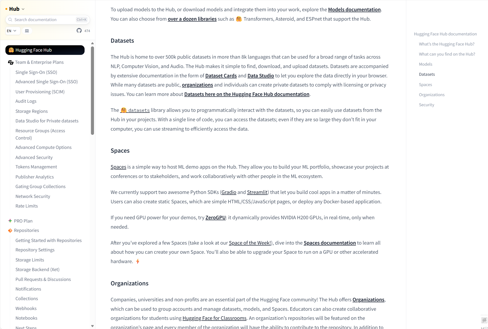
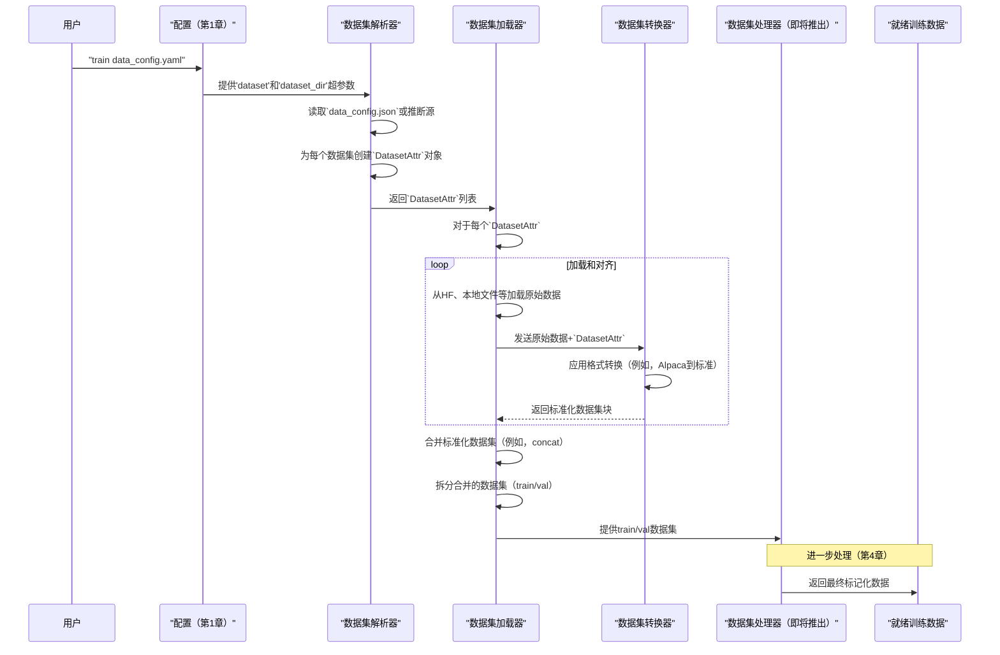

# 第3章：数据引擎

欢迎回来

在[第2章：模型加载和适配](02_model_loading_and_adaptation_.md)中，我们学习了LLaMA-Factory如何加载我们选择的LLM并为其准备行动，包括应用像QLoRA这样的巧妙优化。现在我们有了一个强大的模型准备就绪，它需要一些东西来学习：**数据**

这就是**数据引擎**的用武之地。将数据引擎想象成**所有数据集的主厨**。它是一个中央枢纽，从各个地方收集原始食材（我们的数据），将它们分类，切成一致的格式，并为实际的烹饪过程做准备（这发生在下一阶段，[数据集处理器](04_dataset_processor_.md)）。

## 数据厨师：为什么数据引擎是关键

想象一下我们正在举办一个大型晚宴，我们需要准备许多不同的菜肴。我们不会只是把所有食材（蔬菜、肉类、香料、酱汁）倒在柜台上就开始烹饪，对吧？我们首先会：
1.  **收集食材：** 从冰箱、储藏室、农贸市场。
2.  **检查和清洁：** 检查新鲜度，清洗蔬菜。
3.  **标准化：** 将所有东西切成可用的大小，也许切一些，切块一些，但都以适合我们食谱的方式。
4.  **组织：** 将切好的食材放入碗中，贴上标签。

LLM也是如此。它们需要大量数据，但这些数据通常来自许多来源，并且有许多不同的"方言"或格式。例如：
*   一些数据可能在Hugging Face Hub上。
*   其他数据可能是本地JSON文件。
*   一些可能是"Alpaca"格式（简单的指令/输入/输出）。
*   其他可能是"ShareGPT"格式（一系列用户/助手消息）。

**数据引擎**解决了这种多样性的问题。它确保无论我们的数据来自哪里或具有什么原始格式，它总是被转换为一个单一的、标准化的、内部结构，LLaMA-Factory可以轻松理解并处理用于训练。这使我们不必每次都编写复杂的数据加载和清理脚本。

## 我们的目标：使用多样化数据进行训练

假设我们想在两个数据集上微调一个LLM：
1.  来自Hugging Face的公共`llamafactory/v1-sft-demo`数据集，它是基本的"Alpaca"格式。
2.  我们计算机上的本地`my_chat_data.json`文件，其中包含"ShareGPT"格式的对话。

数据引擎的工作是加载两者，将它们转换为LLaMA-Factory的内部标准，组合它们，然后将它们分成训练集和验证集。

## 数据引擎的关键概念

让我们分解数据引擎如何执行其魔法：

### 1. 数据源：我们的数据存放在哪里

LLaMA-Factory在获取数据方面非常灵活。它可以从以下位置加载数据集：



*   **Hugging Face Hub (`hf_hub`)：** 托管在Hugging Face上的公共或私有数据集
*   **ModelScope Hub (`ms_hub`)：** 另一个流行的AI模型和数据集平台。
*   **OpenMind Hub (`om_hub`)：** 类似的平台，可能面向中国用户。
*   **本地文件 (`file`)：** 存储在我们计算机上的JSON、JSONL、CSV或其他格式。
*   **云文件 (`cloud_file`)：** 直接来自云存储（如AWS S3或Google Cloud Storage）的文件。
*   **自定义脚本 (`script`)：** 如果我们的数据集需要特殊的加载逻辑，我们可以提供Python脚本。

我们在配置中告诉LLaMA-Factory源的类型和位置。

### 2. 数据集属性（`DatasetAttr`）：数据的身份证

每个数据集都有一个称为`DatasetAttr`的"身份证"。这个dataclass保存有关特定数据集的所有重要信息，例如：

*   `dataset_name`：数据集的实际名称或路径。
*   `load_from`：哪种类型的源（例如，`hf_hub`、`file`）。
*   `formatting`：原始格式是什么（例如，`alpaca`、`sharegpt`、`openai`）。
*   `split`：要加载数据集的哪一部分（例如，"train"、"validation"）。
*   `prompt`、`query`、`response`、`messages`：我们原始数据中的哪些列对应于对话的这些特定部分。

这个`DatasetAttr`至关重要，因为它准确地告诉数据引擎如何查找、理解和转换我们的数据。

### 3. 数据集转换器：标准化多样化格式

这是最强大的功能之一

数据引擎使用"数据集转换器"将数据从不同的原始格式（如Alpaca或ShareGPT）转换为单一的、一致的内部表示。

LLaMA-Factory用于每个示例的内部标准是一个具有以下键的字典：

*   `_prompt`：字典列表，表示对话历史（例如，`[{"role": "user", "content": "..."}]`）。
*   `_response`：字典列表，表示模型的期望响应（或排名任务的多个响应）。
*   `_system`：系统消息（如果有）。
*   `_tools`：有关可用工具的信息（如果有）。
*   `_images`、`_videos`、`_audios`：多媒体文件的路径（用于多模态模型）。

| 原始格式     | 示例输入列                                  | 转换器的工作                                                 | 输出内部列                                      |
| :----------- | :------------------------------------------ | :----------------------------------------------------------- | :---------------------------------------------- |
| **Alpaca**   | `instruction`、`input`、`output`、`history` | 将`instruction`和`input`组合到`_prompt`的`user`角色，将`output`映射到`_response`的`assistant`角色，处理`history`。 | `_prompt`、`_response`、`_system`等。           |
| **ShareGPT** | `conversations`（`from`/`value`列表）       | 解析`from`（`human`/`gpt`/`system`）和`value`到具有适当角色的`_prompt`和`_response`。 | `_prompt`、`_response`、`_system`等。           |
| **OpenAI**   | `messages`（`role`/`content`列表）          | 类似于ShareGPT，但专门处理`tool_calls`和`observation`角色。  | `_prompt`、`_response`、`_system`、`_tools`等。 |

这种标准化意味着LLaMA-Factory的后期阶段不需要担心原始数据集格式。

### 4. 合并和拆分数据集

一旦我们所有的单个数据集都被加载和标准化，数据引擎可以：

*   **合并数据集：** 将多个数据集组合成一个大型数据集用于训练。我们可以选择不同的策略：
    *   `concat`：简单地将它们一个接一个地附加。
    *   `interleave_under`或`interleave_all_exhausted`：混合来自不同数据集的样本（对流式传输有用）。
*   **拆分数据集：** 自动将我们的主要训练数据集划分为训练集和较小的验证集（使用`val_size`）。这对于监控我们模型的进度和防止过拟合至关重要。如果我们提供单独的`eval_dataset`，它将直接用作验证集。

## 如何使用数据引擎

我们不直接"调用"数据引擎。相反，我们使用[第1章：配置（超参数）](01_configuration__hparams__.md)中的设置来配置它，当我们开始训练时，LLaMA-Factory会自动使用它。

让我们配置上面的示例：在Hugging Face Alpaca风格数据集和本地ShareGPT风格JSON文件上进行微调。

首先，确保我们有一个本地JSON文件，例如，`my_chat_data.json`：

```json
[
  {
    "conversations": [
      { "from": "human", "value": "Hello! How are you?" },
      { "from": "gpt", "value": "I'm doing great, thanks for asking!" },
      { "from": "human", "value": "Can you tell me a joke?" }
    ]
  },
  {
    "conversations": [
      { "from": "human", "value": "What is the capital of France?" },
      { "from": "gpt", "value": "The capital of France is Paris." }
    ]
  }
]
```

现在，创建我们的配置YAML文件（`data_config.yaml`）：

```yaml
# data_config.yaml
model_name_or_path: meta-llama/Llama-2-7b-hf # （来自第1章和第2章）

# 在这里定义我们的数据集
dataset:
  - llamafactory/v1-sft-demo # Hugging Face数据集（默认为'alpaca'格式）
  - my_chat_data # 我们的本地数据集（我们将在下面配置其详细信息）

dataset_dir: ./my_custom_data # 我们的'DATA_CONFIG'或本地文件所在的目录

# 可选：如果我们想使用特定的验证集，或从训练数据中拆分
val_size: 0.1 # 使用组合训练数据的10%用于验证

# 其他训练设置（来自第1章）
cutoff_len: 1024
learning_rate: 2e-5
per_device_train_batch_size: 4
output_dir: ./output_data_model
```

接下来，我们需要告诉LLaMA-Factory有关我们本地数据集格式的信息。我们通过在我们的`dataset_dir`（在此示例中为`./my_custom_data`）中创建一个特殊的`data_config.json`文件来做到这一点。

创建一个名为`my_custom_data`的目录，并在其中放置`my_chat_data.json`和`data_config.json`：

```json
# ./my_custom_data/data_config.json
{
  "my_chat_data": {
    "file_name": "my_chat_data.json",
    "formatting": "sharegpt",
    "columns": {
      "messages": "conversations"
    },
    "tags": {
      "user_tag": "human",
      "assistant_tag": "gpt"
    }
  }
}
```

现在，运行LLaMA-Factory：

```bash
llamafactory-cli train data_config.yaml
```

**LLaMA-Factory将做什么（高级）：**

1.  ==读取==`data_config.yaml`并发现两个数据集：`llamafactory/v1-sft-demo`和`my_chat_data`。
2.  对于`llamafactory/v1-sft-demo`，它将确定它来自Hugging Face Hub，默认为`alpaca`格式。
3.  对于`my_chat_data`，它将在`./my_custom_data`中找到`data_config.json`，了解它是一个本地`file`（`my_chat_data.json`），并且是具有特定列和角色标签的`sharegpt`格式。
4.  它将==加载==两个原始数据集。
5.  它将对第一个数据集使用`AlpacaDatasetConverter`，对第二个数据集使用`SharegptDatasetConverter`，将它们转换为标准内部格式（`_prompt`、`_response`等）。
6.  然后，它将`concat`（默认`mix_strategy`）这两个标准化数据集为一个大型数据集。
7.  最后，它将`split`这个组合数据集，==取10%用于验证==，其余用于训练。
8.  准备好的训练和验证数据集然后传递到下一阶段。

## 底层机制：数据准备流程

让我们窥探幕后，看看LLaMA-Factory的数据引擎如何做到这一切。

### 数据准备

想象LLaMA-Factory需要为食谱准备食材。



### 数据引擎背后的代码

数据引擎的核心逻辑主要位于`src/llamafactory/data/parser.py`、`src/llamafactory/data/loader.py`、`src/llamafactory/data/converter.py`和`src/llamafactory/data/data_utils.py`中。

#### 1. `src/llamafactory/data/parser.py` - 理解我们的数据源

此文件定义了`DatasetAttr`和解析我们的`dataset_dir`以创建这些属性对象的逻辑。

```python
# 来自src/llamafactory/data/parser.py的简化摘录
from dataclasses import dataclass
from typing import Literal, Optional, Any

@dataclass
class DatasetAttr:
    load_from: Literal["hf_hub", "ms_hub", "om_hub", "script", "file"]
    dataset_name: str
    formatting: Literal["alpaca", "sharegpt", "openai"] = "alpaca"
    # ... 更多用于子集、拆分、列映射的字段 ...

    def join(self, attr: dict[str, Any]) -> None:
        # 此方法根据字典更新dataclass字段
        # （例如，来自我们的data_config.json）
        self.set_attr("formatting", attr, default="alpaca")
        self.set_attr("subset", attr)
        # ... 将原始数据集列映射到内部列的逻辑 ...

def get_dataset_list(dataset_names: Optional[list[str]], dataset_dir: Union[str, dict]) -> list["DatasetAttr"]:
    # 此函数获取我们的数据集名称列表和dataset_dir，
    # 然后为每个数据集确定`DatasetAttr`。
    # 如果`dataset_dir`是路径，它会读取`data_config.json`。
    # 如果没有配置，它默认为Hugging Face Hub。
    dataset_list: list[DatasetAttr] = []
    for name in dataset_names:
        if dataset_dir == "ONLINE": # 默认为Hugging Face或ModelScope
            dataset_attr = DatasetAttr("hf_hub", dataset_name=name)
        else: # 尝试从data_config.json加载
            # ... 加载data_config.json并查找数据集信息的逻辑 ...
            dataset_attr = DatasetAttr(load_from_config, dataset_name=actual_name)
            dataset_attr.join(info_from_config) # 更新属性
        dataset_list.append(dataset_attr)
    return dataset_list
```
**解释：** `DatasetAttr`充当每个数据集的蓝图。`get_dataset_list`函数是数据引擎的第一步：它解释我们的`dataset`和`dataset_dir`设置，以生成`DatasetAttr`对象列表，每个对象完全描述数据集的源、格式和列映射。

#### 2. `src/llamafactory/data/loader.py` - 获取和编排数据

此文件处理原始数据的实际加载并编排转换和合并。

```python
# 来自src/llamafactory/data/loader.py的简化摘录
from datasets import load_dataset # 来自Hugging Face数据集库
from .converter import align_dataset # 我们的自定义转换器
from .data_utils import merge_dataset, split_dataset
from .parser import get_dataset_list

def _load_single_dataset(dataset_attr, model_args, data_args, training_args):
    # 此函数根据其DatasetAttr加载一个特定数据集
    logger.info_rank0(f"Loading dataset {dataset_attr}...")
    if dataset_attr.load_from == "hf_hub":
        dataset = load_dataset(path=dataset_attr.dataset_name, split=dataset_attr.split, ...)
    elif dataset_attr.load_from == "file":
        # ... 加载本地JSON/CSV文件的逻辑 ...
        dataset = load_dataset(path=data_path, data_files=data_files, split=dataset_attr.split, ...)
    # ... 处理其他load_from类型 ...

    return align_dataset(dataset, dataset_attr, data_args, training_args) # 转换为标准格式

def _get_merged_dataset(dataset_names, model_args, data_args, training_args, stage):
    # 加载多个数据集，对齐它们，并合并它们。
    if dataset_names is None: return None
    datasets = {}
    for dataset_name, dataset_attr in zip(dataset_names, get_dataset_list(dataset_names, data_args.dataset_dir)):
        datasets[dataset_name] = _load_single_dataset(dataset_attr, model_args, data_args, training_args)
    return merge_dataset(list(datasets.values()), data_args, seed=training_args.seed) # 合并所有

def get_dataset(template, model_args, data_args, training_args, stage, tokenizer, processor):
    # 这是数据引擎的主要入口点。
    # 它编排加载、转换、合并和拆分。
    dataset = _get_merged_dataset(data_args.dataset, model_args, data_args, training_args, stage)
    eval_dataset = _get_merged_dataset(data_args.eval_dataset, model_args, data_args, training_args, stage, return_dict=...)

    # ... 更多步骤，包括预处理（第4章）...

    dataset_dict = split_dataset(dataset, eval_dataset, data_args, seed=training_args.seed)
    return get_dataset_module(dataset_dict) # 返回{"train_dataset": ..., "eval_dataset": ...}
```
**解释：** `_load_single_dataset`使用Hugging Face的`load_dataset`（或其他源的类似方法）完成从其源加载数据的实际工作

关键的是，它然后将这些原始数据传递给`align_dataset`。`_get_merged_dataset`为多个数据集包装此操作并调用`merge_dataset`。顶级`get_dataset`函数编排整个过程。

#### 3. `src/llamafactory/data/converter.py` - 标准化魔法

此文件包含执行格式标准化的"数据集转换器"类。

```python
# 来自src/llamafactory/data/converter.py的简化摘录
from dataclasses import dataclass
from typing import Any
from .data_utils import Role

@dataclass
class DatasetConverter:
    dataset_attr: "DatasetAttr"
    data_args: "DataArguments"
    # ... 基本方法 ...

@dataclass
class AlpacaDatasetConverter(DatasetConverter):
    def __call__(self, example: dict[str, Any]) -> dict[str, Any]:
        prompt = []
        if self.dataset_attr.history and isinstance(example[self.dataset_attr.history], list):
            # 处理提示的历史
            for old_prompt, old_response in example[self.dataset_attr.history]:
                prompt.append({"role": Role.USER.value, "content": old_prompt})
                prompt.append({"role": Role.ASSISTANT.value, "content": old_response})

        query = []
        if self.dataset_attr.prompt and example[self.dataset_attr.prompt]:
            query.append(example[self.dataset_attr.prompt])
        if self.dataset_attr.query and example[self.dataset_attr.query]:
            query.append(example[self.dataset_attr.query])

        prompt.append({"role": Role.USER.value, "content": "\n".join(query)}) # "instruction\ninput"
        response = [{"role": Role.ASSISTANT.value, "content": example[self.dataset_attr.response]}] # "output"

        return {
            "_prompt": prompt,
            "_response": response,
            "_system": example[self.dataset_attr.system] if self.dataset_attr.system else "",
            # ... 其他字段 ...
        }

@dataclass
class SharegptDatasetConverter(DatasetConverter):
    def __call__(self, example: dict[str, Any]) -> dict[str, Any]:
        messages = example[self.dataset_attr.messages] # 获取原始对话消息
        aligned_messages = []
        # 循环遍历消息，将原始'from'标签转换为内部'role'
        # 例如，"human" -> Role.USER.value，"gpt" -> Role.ASSISTANT.value
        # 并存储内容
        for message in messages:
            role = self.dataset_attr.tag_mapping[message[self.dataset_attr.role_tag]]
            aligned_messages.append({"role": role, "content": message[self.dataset_attr.content_tag]})

        prompt = aligned_messages[:-1] # 除最后一条消息外的所有消息都是提示
        response = aligned_messages[-1:] # 最后一条消息是响应

        return {
            "_prompt": prompt,
            "_response": response,
            "_system": "", # 或来自特定系统标签
            # ... 其他字段 ...
        }

def get_dataset_converter(name: str, dataset_attr: "DatasetAttr", data_args: "DataArguments") -> "DatasetConverter":
    # 根据DatasetAttr中的'formatting'返回正确的转换器
    return DATASET_CONVERTERS[name](dataset_attr, data_args)

def align_dataset(dataset, dataset_attr, data_args, training_args):
    # 此函数将转换器应用于整个数据集
    dataset_converter = get_dataset_converter(dataset_attr.formatting, dataset_attr, data_args)
    return dataset.map(dataset_converter, batched=False, remove_columns=column_names, ...)
```
**解释：** `AlpacaDatasetConverter`和`SharegptDatasetConverter`是如何将原始数据（例如，`example["instruction"]`或`example["conversations"]`）精心转换为LLaMA-Factory期望的`_prompt`、`_response`、`_system`格式的示例。然后，`align_dataset`函数将选择的转换器应用于我们加载的数据集中的每个示例。

#### 4. `src/llamafactory/data/data_utils.py` - 合并和拆分

此文件包含用于组合和划分数据集的辅助函数。

```python
# 来自src/llamafactory/data/data_utils.py的简化摘录
from datasets import concatenate_datasets, interleave_datasets, DatasetDict

def merge_dataset(all_datasets, data_args, seed):
    if len(all_datasets) == 1: return all_datasets[0]
    if data_args.mix_strategy == "concat":
        return concatenate_datasets(all_datasets)
    elif data_args.mix_strategy.startswith("interleave"):
        return interleave_datasets(datasets=all_datasets, ...)

def split_dataset(dataset, eval_dataset, data_args, seed):
    dataset_dict = {}
    if dataset is not None:
        if data_args.val_size > 1e-6: # 如果给出了验证拆分百分比
            # 使用Hugging Face数据集中的train_test_split进行拆分
            split_result = dataset.train_test_split(test_size=data_args.val_size, seed=seed)
            dataset_dict["train"] = split_result["train"]
            dataset_dict["validation"] = split_result["test"]
        else:
            dataset_dict["train"] = dataset
    
    if eval_dataset is not None: # 如果提供了专用的eval数据集
        # ... 将eval_dataset添加到dataset_dict的逻辑 ...
        dataset_dict["validation"] = eval_dataset

    return DatasetDict(dataset_dict)
```
**解释：** `merge_dataset`获取标准化数据集列表，并使用我们定义的`mix_strategy`组合它们。然后，`split_dataset`获取组合的数据集，并根据`val_size`智能地将其划分为`train`和`validation`集，或使用提供的`eval_dataset`。

## 结论

数据引擎是一个强大而灵活的系统，它消除了管理多样化数据集的麻烦。它智能地从各种源加载我们的数据，将不同的格式转换为统一的内部结构，组合多个数据集，并通过将它们拆分为适当的集来为训练做准备。这个基础对于成功和可重现的微调至关重要。

现在我们的数据已加载、清理和组织，下一步是为LLM本身进一步处理它，这涉及标记化和创建模型期望的确切输入格式。这直接引导我们进入下一章：[第4章：数据集处理器](04_dataset_processor_.md)。

