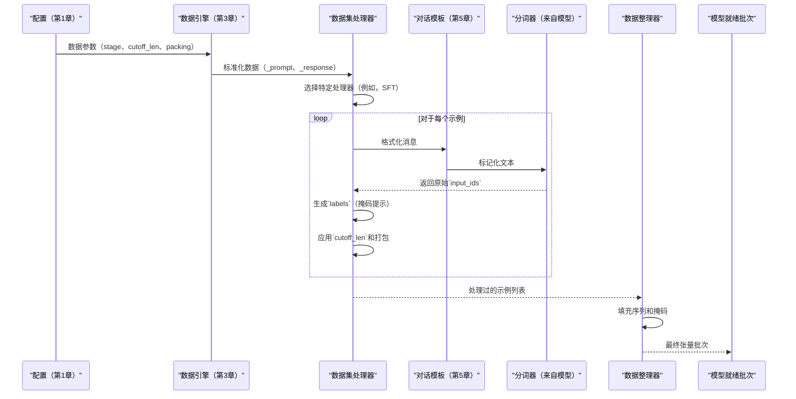

# 第4章：数据集处理器

欢迎回来

在[第3章：数据引擎](03_data_engine_.md)中，我们掌握了LLaMA-Factory如何巧妙地==收集和标准化我们多样化的原始数据集为一致的内部格式==（如`_prompt`、`_response`）。现在，随着我们的数据被清理和组织，是时候进行下一个关键步骤了：**数据集处理器**

## 模型的翻译器：为什么数据集处理器是关键

想象一下数据引擎（第3章）是一位准备好所有食材的厨师：切好的蔬菜、准备好的肉类等。现在，我们需要实际*烹饪*这顿饭。但烤箱（我们的大型语言模型，或LLM）不直接理解"切好的胡萝卜"。它需要具体的指令："准确地将200克胡萝卜，切成1厘米的立方体，放入烤盘，然后加盐，在180摄氏度下烹饪30分钟。"

同样，LLM不理解像`{"role": "user", "content": "法国的首都是什么？"}`这样的原始文本。它们需要将所有内容转换为**数字（token）**，以及其他信息，如：
*   哪些数字代表*输入*（提示）？
*   哪些数字代表*输出*（要学习的目标响应）？
*   哪些数字只是"填充"以使序列长度相同？
*   模型应该*预测*（并被评估）哪些部分，应该*忽略*哪些部分（如某些任务中的提示本身）？

这就是**数据集处理器**的工作。它充当**模型的翻译器**，==将数据引擎中人类可读的、标准化的示例转换为我们的LLM期望用于高效训练的确切数字格式==（token ID、注意力掩码、标签）。解决了弥合人类语言和LLM深层数字世界之间差距的问题，同时为不同的微调任务定制格式。

## 我们的目标：准备监督微调（SFT）数据

让我们坚持我们的目标，即微调一个LLM以遵循指令。我们正在进行**监督微调（SFT）**。这意味着对于每条指令，我们都有一个期望的响应。

数据集处理器需要获取一个示例，如：
```json
{
  "_prompt": [{"role": "user", "content": "给我讲个笑话。"}],
  "_response": [{"role": "assistant", "content": "为什么科学家不信任原子？因为它们组成一切！"}]
}
```
并将其转换为数字数组（`input_ids`、`attention_mask`、`labels`），看起来像这样：
```
input_ids:       [<BOS>,  user_token, "给", "我", "讲", "个", "笑话", "。", assistant_token, "为什么", "科学家", ..., <EOS>, <PAD>, <PAD>]
attention_mask:  [1,      1,          1,    1,    1,     1,    1,      1,    1,               1,        1,         ..., 1,     0,     0    ]
labels:          [<IGN>,  <IGN>,      <IGN>,<IGN>,<IGN>, <IGN>,<IGN>,  <IGN>,<IGN>,           "为什么", "科学家", ..., <EOS>, <IGN>, <IGN>]
```
其中：
*   `<BOS>`（序列开始）、`<EOS>`（序列结束）、`<PAD>`（填充）是特殊token。
*   `<IGN>`（IGNORE_INDEX）告诉模型的损失函数忽略此token以计算错误，确保它只从期望的响应中学习。
*   `input_ids`包含完整的对话。
*   `attention_mask`指示哪些token是真实的（`1`），哪些是填充的（`0`）。
*   `labels`本质上是移位的`input_ids`，但提示和填充部分用`IGNORE_INDEX`掩码，因此模型只尝试预测助手的响应。

## 数据集处理器

让我们分解数据集处理器执行的基本任务：

### 1. 标记化：文本到数字

这是最基本的步骤。我们的LLM只理解数字。**分词器**（LLaMA-Factory在[第2章：模型加载和适配](02_model_loading_and_adaptation_.md)中与我们的模型一起加载）将原始文本转换为数字"token"序列（词片段、单词或字符）。例如，"Hello world!"可能变成`[15339, 1917, 29937]`，其中每个数字代表一个特定的token。

### 2. 使用对话模板格式化

在标记化之前，特别是对于多轮对话，文本需要格式化为LLM训练时使用的特定结构（例如，`USER: ... ASSISTANT: ...`）。LLaMA-Factory使用**对话模板**（[第5章：对话模板](05_chat_template_.md)）来处理这个问题，确保我们数据的对话流程与我们的模型期望的相匹配。数据集处理器调用对话模板来准备文本。

### 3. 创建标签和注意力掩码

*   **`input_ids`**：完整的token序列（提示+响应+特殊token+填充）。
*   **`attention_mask`**：二进制掩码（1和0），告诉模型`input_ids`中哪些token ID是实际内容（1），哪些只是填充（0）。这防止模型关注无意义的填充token。
*   **`labels`**：对于监督任务，这些是模型应该学习预测的token ID。通常，提示token被替换为特殊的`IGNORE_INDEX`值（例如，`-100`），以便模型只训练预测*响应*，而不是回忆*提示*。

### 4. 处理`cutoff_len`（序列长度）

LLM有一个最大上下文窗口，由LLaMA-Factory中的`cutoff_len`定义（例如，1024个token）。
*   **截断：** 如果序列长于`cutoff_len`，它将被截短。
*   **填充：** 如果序列短于`cutoff_len`，它将用`padding_token`填充，直到达到所需长度。这通常由处理器之后的`DataCollator`处理。

### 5. 任务特定处理

不同的微调阶段有独特的输入要求：

*   **监督微调（SFT）：** 如上所述，生成`input_ids`、`attention_mask`和`labels`，其中提示在标签中被掩码。
*   **预训练：** 通常涉及无监督学习，如预测连续文本流中的下一个token。标签可能只是移位的`input_ids`。
*   **成对（例如，DPO、RLAIF）：** 需要同一提示的两个响应——一个"选择的"（首选）响应和一个"拒绝的"（不太首选）响应。处理器创建两组`input_ids`、`attention_mask`和`labels`进行比较。
*   **反馈（例如，KTO）：** 为特定的基于反馈的对齐算法生成数据，通常涉及正面和负面示例。

### 6. 打包序列（为了效率）

如果我们有许多短序列，打包将几个序列组合成一个更长的序列，直到`cutoff_len`。这更好地利用了GPU内存，并通过减少填充来加快训练速度。处理器可以添加特殊的"边界"token或注意力掩码索引以保持它们分离。

### 7. 多模态支持

==对于处理图像、视频或音频的模型，数据集处理器还与**多模态插件**（[第6章：多模态插件](06_multimodal_plugin_.md)）集成==，以确保这些非文本输入被正确准备并与标记化文本对齐。

## 如何使用数据集处理器

与[数据引擎](03_data_engine_.md)和[模型加载](02_model_loading_and_adaptation_.md)类似，我们使用YAML文件中的超参数（来自[第1章：配置（超参数）](01_configuration__hparams__.md)）配置数据集处理器的行为。然后，LLaMA-Factory根据我们的`stage`设置自动选择正确的处理器。

让我们继续我们的SFT示例。我们想对第3章中准备的数据应用监督微调。

```yaml
# sft_config.yaml
model_name_or_path: meta-llama/Llama-2-7b-hf
dataset:
  - llamafactory/v1-sft-demo
  - my_chat_data # 来自第3章
dataset_dir: ./my_custom_data
val_size: 0.1

stage: sft # 这是监督微调的关键设置
cutoff_len: 1024 # 标记化输入的最大序列长度
train_on_prompt: False # 不在提示token上训练（掩码它们）
packing: True # 尝试将多个短示例打包到一个序列中

# 其他训练设置...
output_dir: ./output_sft_model
```

要运行此命令，我们将使用以下命令：

```bash
llamafactory-cli train sft_config.yaml
```

**LLaMA-Factory将做什么：**

1.  **加载配置：** 读取`sft_config.yaml`，识别`stage: sft`、`cutoff_len: 1024`、`train_on_prompt: False`和`packing: True`。
2.  **数据引擎（第3章）：** 将`llamafactory/v1-sft-demo`和`my_chat_data`加载并标准化为`_prompt`、`_response`格式。
3.  **数据集处理器（本章）：**
    *   由于`stage`是`sft`且`packing`是`True`，它选择`PackedSupervisedDatasetProcessor`。
    *   对于每个示例，它使用**对话模板**（第5章）将`_prompt`和`_response`格式化为单个文本字符串。
    *   然后它使用**分词器**将此字符串转换为`input_ids`。
    *   它通过获取`input_ids`并用`IGNORE_INDEX`掩码提示token来生成`labels`（因为`train_on_prompt: False`）。
    *   它创建基本的`attention_mask`值（最初全为1）。
    *   它应用**打包**，尝试组合多个短的`input_ids`序列，直到它们达到`cutoff_len`。
    *   处理器输出这些处理过的、标记化的和打包的示例列表。
4.  **数据整理器：** 获取这些`input_ids`、`attention_mask`和`labels`列表，然后将它们填充到*当前批次中最长的序列*（或如果指定则为`cutoff_len`）以创建统一大小的张量。

## 底层机制：处理器的旅程

让我们看看LLaMA-Factory的数据集处理器如何编排这些步骤。

### 处理器流程：一个简单的类比

数据集处理器充当质量控制和包装线：



### 数据集处理器背后的代码

数据集处理器的核心逻辑位于`src/llamafactory/data/processor/`目录中，每个阶段都有特定的文件（例如，`supervised.py`、`pairwise.py`）。`src/llamafactory/data/collator.py`处理最终的批次准备。

#### 1. `src/llamafactory/data/processor/__init__.py` - 处理器调度器

此文件注册并提供不同的处理器类：

```python
# 来自src/llamafactory/data/processor/__init__.py的简化摘录
from .feedback import FeedbackDatasetProcessor
from .pairwise import PairwiseDatasetProcessor
from .pretrain import PretrainDatasetProcessor
from .processor_utils import DatasetProcessor # 基类
from .supervised import PackedSupervisedDatasetProcessor, SupervisedDatasetProcessor
from .unsupervised import UnsupervisedDatasetProcessor

# ... (所有可用处理器的列表) ...
__all__ = [
    "DatasetProcessor",
    "FeedbackDatasetProcessor",
    "PackedSupervisedDatasetProcessor", # 我们的带打包的SFT！
    "PairwiseDatasetProcessor",
    "PretrainDatasetProcessor",
    "SupervisedDatasetProcessor", # 我们的不带打包的SFT
    "UnsupervisedDatasetProcessor",
]
```
**解释：** 这只是显示LLaMA-Factory对不同的`stage`类型有不同的类

当我们设置`stage: sft`和`packing: True`时，LLaMA-Factory将选择`PackedSupervisedDatasetProcessor`。如果`packing`是`False`，它将选择`SupervisedDatasetProcessor`。

#### 2. `src/llamafactory/data/processor/processor_utils.py` - 基础处理器

所有特定处理器都继承自基础`DatasetProcessor`类：

```python
# 来自src/llamafactory/data/processor/processor_utils.py的简化概念视图
from dataclasses import dataclass
from typing import TYPE_CHECKING, Any

if TYPE_CHECKING:
    from transformers import PreTrainedTokenizer, ProcessorMixin
    from ...hparams import DataArguments
    from ..template import Template # 来自第5章

@dataclass
class DatasetProcessor:
    tokenizer: "PreTrainedTokenizer"
    template: "Template"
    data_args: "DataArguments"
    processor: "ProcessorMixin" = None # 用于多模态

    # 子类必须实现的抽象方法
    def preprocess_dataset(self, examples: dict[str, list[Any]]) -> dict[str, list[Any]]:
        raise NotImplementedError

    def print_data_example(self, example: dict[str, list[int]]) -> None:
        raise NotImplementedError

# 基于cutoff_len推断序列长度的辅助函数
def infer_seqlen(source_len: int, target_len: int, cutoff_len: int) -> tuple[int, int]:
    if source_len + target_len > cutoff_len:
        # 优先考虑目标长度，如果需要则截断源
        # ... 调整source_len和target_len的逻辑 ...
    return source_len, target_len
```
**解释：** 这个`DatasetProcessor`类提供了所有特定处理器都需要的通用工具（分词器、模板、数据参数）

`preprocess_dataset`方法是每批示例的主要处理发生的地方。`infer_seqlen`辅助函数对于确保序列遵守`cutoff_len`至关重要。

#### 3. `src/llamafactory/data/processor/supervised.py` - SFT处理

此文件包含监督微调的逻辑。我们将查看`_encode_data_example`方法，它处理*单个示例*。

```python
# 来自src/llamafactory/data/processor/supervised.py的简化摘录
from collections import defaultdict
from ...extras.constants import IGNORE_INDEX
from .processor_utils import DatasetProcessor, infer_seqlen

@dataclass
class SupervisedDatasetProcessor(DatasetProcessor):
    def _encode_data_example(
        self,
        prompt: list[dict[str, str]], # 例如，[{"role": "user", "content": "..."}]
        response: list[dict[str, str]], # 例如，[{"role": "assistant", "content": "..."}]
        system: Optional[str],
        tools: Optional[str],
        images: list, videos: list, audios: list, # 用于多模态
    ) -> tuple[list[int], list[int]]: # 返回token ID和标签
        # 1. 使用对话模板格式化消息（第5章）
        # 这将把[{user}, {assistant}]转换为单个消息列表
        messages = self.template.mm_plugin.process_messages(prompt + response, images, videos, audios, self.processor)

        # 2. 分别标记化提示和响应
        # encode_multiturn处理多轮的对话模板和标记化
        encoded_pairs = self.template.encode_multiturn(self.tokenizer, messages, system, tools)
        # 对于单轮SFT，encoded_pairs将看起来像[([prompt_ids], [response_ids])]

        input_ids = []
        labels = []
        total_length = 0

        # 3. 遍历轮次（对于多轮，但也适用于单轮）
        for turn_idx, (source_ids, target_ids) in enumerate(encoded_pairs):
            if total_length >= self.data_args.cutoff_len: # 检查最大长度
                break

            # 推断截断的长度
            source_len, target_len = infer_seqlen(
                len(source_ids), len(target_ids), self.data_args.cutoff_len - total_length
            )
            source_ids = source_ids[:source_len]
            target_ids = target_ids[:target_len]
            total_length += source_len + target_len

            # 4. 创建标签：掩码提示，保留响应
            if self.data_args.train_on_prompt: # 如果我们也想在提示上训练
                source_label = source_ids
            else: # 掩码提示token
                source_label = [IGNORE_INDEX] * source_len

            target_label = target_ids # 总是在响应上训练

            # 5. 组合token和标签
            input_ids += source_ids + target_ids
            labels += source_label + target_label

        # 6. 如果启用efficient_eos，添加EOS token及其标签
        if self.template.efficient_eos:
            input_ids += [self.tokenizer.eos_token_id]
            labels += [self.tokenizer.eos_token_id]

        return input_ids, labels

    def preprocess_dataset(self, examples: dict[str, list[Any]]) -> dict[str, list[Any]]:
        # 此函数遍历一批示例，并为每个示例调用_encode_data_example
        model_inputs = defaultdict(list)
        for i in range(len(examples["_prompt"])):
            # 输入示例的基本验证
            if len(examples["_prompt"][i]) % 2 != 1 or len(examples["_response"][i]) != 1:
                # ... 记录警告 ...
                continue

            input_ids, labels = self._encode_data_example(
                prompt=examples["_prompt"][i],
                response=examples["_response"][i],
                system=examples["_system"][i],
                tools=examples["_tools"][i],
                images=examples["_images"][i] or [],
                videos=examples["_videos"][i] or [],
                audios=examples["_audios"][i] or [],
            )
            model_inputs["input_ids"].append(input_ids)
            model_inputs["attention_mask"].append([1] * len(input_ids)) # 初始注意力掩码
            model_inputs["labels"].append(labels)
            # ... 附加多模态输入 ...

        return model_inputs
```
**解释：**
- `_encode_data_example`是SFT处理器的核心。它获取一个`_prompt`和`_response`，并将它们转换为`input_ids`和`labels`。
- 它利用`template.encode_multiturn`（来自第5章），它处理特定的聊天格式和标记化。
- `train_on_prompt`参数控制提示token是否在`labels`中用`IGNORE_INDEX`掩码。将其设置为`False`（指令微调常见）意味着模型只学习生成响应。
- `infer_seqlen`确保组合的`input_ids`长度不超过`cutoff_len`。

#### 4. `PackedSupervisedDatasetProcessor` - 为效率打包

当`packing: True`时，LLaMA-Factory使用`PackedSupervisedDatasetProcessor`，它继承自`SupervisedDatasetProcessor`，但覆盖`preprocess_dataset`以包含打包逻辑。

```python
# 来自src/llamafactory/data/processor/supervised.py的简化摘录
@dataclass
class PackedSupervisedDatasetProcessor(SupervisedDatasetProcessor):
    def preprocess_dataset(self, examples: dict[str, list[Any]]) -> dict[str, list[Any]]:
        valid_num = 0
        batch_input_ids, batch_labels = [], [] # ... 和多模态输入
        lengths = [] # 存储每个示例的长度
        length2indexes = defaultdict(list) # 将长度映射到示例索引

        # 1. 首先，单独处理每个示例（像SupervisedDatasetProcessor）
        for i in range(len(examples["_prompt"])):
            if len(examples["_prompt"][i]) % 2 != 1 or len(examples["_response"][i]) != 1:
                # ... 记录无效示例 ...
                continue

            input_ids, labels = self._encode_data_example( # 调用父类的方法
                prompt=examples["_prompt"][i], response=examples["_response"][i],
                system=examples["_system"][i], tools=examples["_tools"][i],
                images=examples["_images"][i] or [], videos=examples["_videos"][i] or [], audios=examples["_audios"][i] or [],
            )
            length = len(input_ids)
            if length > self.data_args.cutoff_len:
                # ... 记录过长示例 ...
            else:
                lengths.append(length)
                length2indexes[length].append(valid_num)
                batch_input_ids.append(input_ids)
                batch_labels.append(labels)
                # ... 存储多模态输入 ...
                valid_num += 1

        model_inputs = defaultdict(list)
        # 2. 使用"贪婪背包"算法组合短序列
        knapsacks = greedy_knapsack(lengths, self.data_args.cutoff_len) # 找到最优组合

        for knapsack in knapsacks: # 每个背包是要组合的长度列表
            packed_input_ids, packed_labels, packed_attention_masks, packed_position_ids = [], [], [], []
            packed_images, packed_videos, packed_audios = [], [], []

            for i, length in enumerate(knapsack):
                index = length2indexes[length].pop() # 获取原始示例索引
                packed_input_ids += batch_input_ids[index]
                packed_labels += batch_labels[index]
                packed_position_ids += list(range(len(batch_input_ids[index]))) # 对于需要位置ID的模型
                
                # 创建指示打包段的注意力掩码（neat_packing用于高级FA2）
                if self.data_args.neat_packing:
                    packed_attention_masks += [i + 1] * len(batch_input_ids[index]) # 段索引
                else:
                    packed_attention_masks += [1] * len(batch_input_ids[index]) # 简单掩码

            # 3. 将打包的序列填充到cutoff_len + 1（对于某些模型/注意力类型）
            pad_length = self.data_args.cutoff_len - len(packed_input_ids) + 1
            packed_input_ids += [self.tokenizer.pad_token_id] * pad_length
            packed_labels += [IGNORE_INDEX] * pad_length
            packed_attention_masks += [0] * pad_length # 用零填充

            model_inputs["input_ids"].append(packed_input_ids)
            model_inputs["attention_mask"].append(packed_attention_masks)
            model_inputs["position_ids"].append(packed_position_ids)
            model_inputs["labels"].append(packed_labels)
            # ... 附加打包的多模态输入 ...

        return model_inputs
```
**解释：**
- `PackedSupervisedDatasetProcessor`首先单独处理每个示例以获取其`input_ids`和`labels`，并记录其长度。
- 然后它使用`greedy_knapsack`算法智能地将这些单独的序列组合成更大的"打包"序列，直到`cutoff_len`。这大大减少了填充量。
- 对于每个打包的序列，它构造`input_ids`、`labels`、`attention_mask`和`position_ids`。`attention_mask`可以增强（`neat_packing`）以准确告诉模型打包序列中哪些部分属于哪个原始示例，允许更高效的注意力机制，如FlashAttention-2。

#### 5. `src/llamafactory/data/collator.py` - 批处理和最终填充

在数据集处理器生成单个（或打包的）标记化示例列表后，`DataCollator`接管，将这些分组为小批次，并应用最终填充以确保批次内的所有序列具有相同的长度。

```python
# 来自src/llamafactory/data/collator.py的简化摘录
from dataclasses import dataclass
import torch
from transformers import DataCollatorForSeq2Seq

@dataclass
class MultiModalDataCollatorForSeq2Seq(DataCollatorForSeq2Seq):
    # 此类继承自Hugging Face的DataCollatorForSeq2Seq
    # 并为多模态数据扩展它。
    template: "Template" = None
    processor: "ProcessorMixin" = None

    def __call__(self, features: list[dict[str, Any]]) -> dict[str, "torch.Tensor"]:
        # 1. 处理多模态数据（例如，提取图像，添加占位符）
        # ... `batch_images`、`batch_videos`、`batch_audios`的逻辑 ...

        # 2. 调用父DataCollatorForSeq2Seq执行实际填充
        # 这将把`input_ids`、`attention_mask`、`labels`填充到批次中最长的序列
        features: dict[str, torch.Tensor] = super().__call__(features)

        # 3. 进一步的多模态特定处理（例如，VLM的position_ids）
        # ... `rope_func`、`position_ids`、`rope_deltas`的逻辑 ...

        return features

@dataclass
class SFTDataCollatorWith4DAttentionMask(MultiModalDataCollatorForSeq2Seq):
    # SFT的专用整理器，特别是在使用高级注意力时
    block_diag_attn: bool = False
    attn_implementation: Literal["eager", "sdpa", "flash_attention_2"] = "eager"

    def __call__(self, features: list[dict[str, Any]]) -> dict[str, "torch.Tensor"]:
        features = super().__call__(features) # 首先，使用基础多模态整理器

        # 如果使用块对角注意力且不是FlashAttention-2，
        # 它将注意力掩码转换为4D格式。
        if self.block_diag_attn and self.attn_implementation != "flash_attention_2":
            # 这是一种高级技术，这里不详细介绍，
            # 但它为打包序列创建特定的掩码。
            features["attention_mask"] = prepare_4d_attention_mask(features["attention_mask"], self.compute_dtype)

        return features
```
**解释：**
- `MultiModalDataCollatorForSeq2Seq`（及其专用的SFT变体）从处理器获取标记化示例列表。
- 然后它使用`super().__call__(features)`方法（来自Hugging Face的`DataCollatorForSeq2Seq`）自动将当前小批次内的所有`input_ids`、`attention_mask`和`labels`填充到相同长度。这通常是该批次中最长序列的长度。
- 它还处理任何最终的多模态数据准备，并可以将注意力掩码转换为高级格式（如4D），如果模型或注意力实现需要（例如，对于带有`neat_packing`的打包序列）。
- 结果是一个PyTorch张量字典，准备直接馈送到我们的LLM进行训练。

## 结论

数据集处理器是精心准备我们的数据以进行高效LLM训练的无名英雄。

- 它将类似人类的指令翻译成我们的模型理解的精确数字语言，处理标记化、标签掩码、序列长度管理和任务特定格式。
- 根据我们的`stage`和`packing`设置自动选择正确的处理流程，LLaMA-Factory使我们免于复杂的数据工程。

现在我们的数据已完美格式化并准备就绪，下一步是了解数据集处理器用于构建我们对话的强大**对话模板**。深入[第5章：对话模板](05_chat_template_.md)，看看LLaMA-Factory如何确保我们的模型说正确的语言

