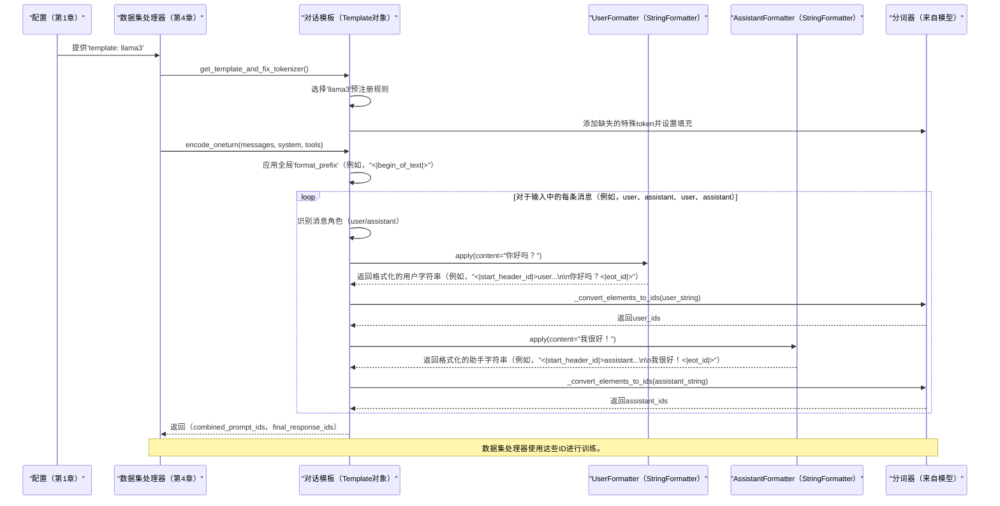

# 第5章：对话模板

欢迎回来

在[第4章：数据集处理器](04_dataset_processor_.md)中，我们学习了LLaMA-Factory如何==获取我们整齐组织的数据并将其处理为我们的大型语言模型（LLM）可以理解的数字输入==（token ID、注意力掩码、标签）。这个过程的关键部分是"使用对话模板格式化"。现在，在第5章中，我们将探讨这个强大的概念：**对话模板**。

## 为什么对话模板至关重要

想象一下我们试图与某人交谈，但他们说一种非常特定的方言。我们不能只是脱口而出我们的想法；我们需要知道他们独特的问候语、他们如何构建问题，以及他们用来表示说话结束的特殊短语。

如果我们使用错误的方言，他们可能会误解我们，或者更糟，根本不回应！

LLM非常相似。在初始训练期间，它们学习理解以**非常特定格式**结构化的对话。这种格式通常包括：
*   **特殊token：** 如`<s>`（句子开始）、`</s>`（句子结束）、`<|user|>`（用户轮次）、`<|assistant|>`（助手轮次）或`<|eot_id|>`（轮次结束ID）。
*   **特定前缀/后缀：** 例如，用户的消息可能总是以"USER: "开头并以换行符结束，而助手的消息以"ASSISTANT: "开头。
*   **系统消息：** 如何引入系统指令（例如，"你是一个有用的AI助手。"）
*   **工具调用和推理步骤：** 如果模型被设计为使用外部工具或显示其思考过程，则使用特殊结构。

如果我们使用*错误*的格式微调LLM或尝试与其聊天，它根本不会按预期执行。这就像试图对只懂德语的人说法语。

LLaMA-Factory中的**对话模板**解决了这个复杂的问题。它充当我们对话的**通用翻译器**，==自动将我们的原始消息（来自[数据引擎](03_data_engine_.md)的`_prompt`和`_response`）格式化为我们选择的LLM期望的*确切*"方言"==（特定格式）。这意味着我们不需要手动记住或为每个不同的模型实现复杂的格式化规则

## 我们的目标：为Llama-3模型格式化

让我们继续我们微调Llama-3模型的示例。这个模型有一个特定的聊天格式，它在训练时使用。

我们的原始数据（来自[数据引擎](03_data_engine_.md)）可能看起来像这样：
```json
{
  "_prompt": [
    {"role": "user", "content": "你好吗？"},
    {"role": "assistant", "content": "我很好！"},
    {"role": "user", "content": "给我讲个笑话。"}
  ],
  "_response": [{"role": "assistant", "content": "为什么科学家不信任原子？因为它们组成一切！"}]
}
```

对话模板的工作是获取这个结构化数据并将其转换为Llama-3模型期望的字符串格式，其中包括特殊token，如`<|begin_of_text|>`、`<|start_header_id|>`、`<|end_header_id|>`和`<|eot_id|>`。最终格式化的字符串将由[数据集处理器](04_dataset_processor_.md)标记化。

## 对话模板的关键概念

让我们分解LLaMA-Factory对话模板背后的基本思想：

### 1. `Template`类：我们模型的食谱书

在LLaMA-Factory中，每个对话模板都由一个`Template` Python类（或其专用子类）表示。将其视为如何为特定LLM格式化对话的食谱书。此类保存构建正确聊天字符串所需的所有规则和组件。

### 2. 格式化器：对话的构建块

`Template`类不会一次性格式化整个对话。相反，它为对话的每个部分使用更小的、专用的"格式化器"：

*   **`StringFormatter`：** 最常见的格式化器。它获取一段内容（如用户的消息）并将其嵌入到预定义的字符串模式中，添加必要的前缀、后缀和特殊token。例如，`StringFormatter(slots=["USER: {{content}}\n"])`会将"hello"转换为"USER: hello\n"。
*   **`EmptyFormatter`：** 用于不依赖于输入内容的固定字符串或特殊token，如全局序列开始token（`<s>`）。
*   **`FunctionFormatter`：** 处理模型需要输出"工具调用"时的格式化（例如，`{"name": "calculator", "arguments": {"expression": "2+2"}}`）。它将此JSON格式化为模型期望的工具调用语法。
*   **`ToolFormatter`：** 用于格式化我们提供给模型的可用工具的*描述*（在系统消息中）。

这些格式化器中的每一个都有`slots`，它们是包含字符串、特殊token（由`dict`或`set`表示以提供灵活性）和占位符（如`{{content}}`）的列表，我们的实际消息将放在那里。

### 3. 特殊Token和停止词

对话模板与模型的分词器深度集成。它们确保：

*   **序列开始/结束（BOS/EOS）：** 标记整个序列开始和结束的特殊token（`<s>`、`</s>`、`<|begin_of_text|>`）。
*   **填充Token（PAD）：** 用于将较短序列填充到统一长度的token。
*   **停止词：** 告诉LLM"好的，现在停止生成"的特定token或字符串。这在推理期间至关重要，以防止模型生成超出其预期响应（例如，生成另一个用户的轮次）。示例包括`</s>`、`<|eot_id|>`，甚至`Human:`。
*   **词汇表调整大小：** 如果模板引入了基础分词器无法识别的新特殊token，LLaMA-Factory可以自动调整模型的词汇表大小以容纳它们（[第2章：模型加载和适配](02_model_loading_and_adaptation_.md)）。

### 4. Jinja模板和Ollama Modelfiles

LLaMA-Factory模板还可以生成兼容的Jinja模板（由Hugging Face的`tokenizer.apply_chat_template`和vLLM等工具使用）和Ollama Modelfiles。这确保了广泛的兼容性和我们微调模型的轻松部署。

### 5. 编码策略：单轮与多轮

模板提供以不同方式编码对话的方法：

*   **`encode_oneturn`：** 将*整个*对话历史（所有用户/助手轮次）作为"提示"的一部分处理，并生成*最终*助手响应。这通常用于监督微调（SFT），我们希望模型学习生成完整的最终答案。
*   **`encode_multiturn`：** 将对话分解为多个（提示，响应）对，每个助手轮次一个。这对于逐轮评估或更高级的训练策略很有用，其中每个助手响应都被视为单独的目标。

## 如何使用对话模板

我们使用配置中的`template`超参数（来自[第1章：配置（超参数）](01_configuration__hparams__.md)）选择对话模板。LLaMA-Factory处理其余部分，将其与[数据集处理器](04_dataset_processor_.md)和我们模型的分词器无缝集成。

让我们设置我们的配置（`llama3_sft_config.yaml`）以使用`llama3`模板：

```yaml
# llama3_sft_config.yaml
model_name_or_path: meta-llama/Llama-3-8B-Instruct # 我们的Llama-3模型
dataset: my_chat_data # 来自第3章的我们的数据
dataset_dir: ./my_custom_data
val_size: 0.1

template: llama3 # <-- 这是关键设置！

stage: sft
cutoff_len: 1024
# 其他训练设置...
output_dir: ./output_llama3_model
```

当我们运行：
```bash
llamafactory-cli train llama3_sft_config.yaml
```

**LLaMA-Factory将做什么（高级）：**
1.  **配置：** 它从我们的配置中读取`template: llama3`。
2.  **模板选择：** 它在内部找到预定义的`llama3`模板（一个`Template`对象）。
3.  **分词器修复：** 它确保我们模型的分词器具有所有必要的特殊token（如`<|eot_id|>`）并设置填充。
4.  **数据集处理：** [数据集处理器](04_dataset_processor_.md)然后将使用这个`llama3` `Template`对象来格式化每个`_prompt`和`_response`示例。它将调用`template.encode_oneturn()`来获取模型的正确格式化（和标记化）输入。

**示例输入和格式化输出（对于`encode_oneturn`）：**

让我们获取我们的示例数据：
```json
{
  "_prompt": [
    {"role": "user", "content": "你好吗？"},
    {"role": "assistant", "content": "我很好！"},
    {"role": "user", "content": "给我讲个笑话。"}
  ],
  "_response": [{"role": "assistant", "content": "为什么科学家不信任原子？因为它们组成一切！"}]
}
```

`llama3`对话模板将把这个转换为两个字符串（然后由[数据集处理器](04_dataset_processor_.md)标记化为`input_ids`和`labels`）：

*   **格式化的提示字符串：**
    ```
    <|begin_of_text|><|start_header_id|>user<|end_header_id|>
    
    你好吗？<|eot_id|><|start_header_id|>assistant<|end_header_id|>
    
    我很好！<|eot_id|><|start_header_id|>user<|end_header_id|>
    
    给我讲个笑话。<|eot_id|><|start_header_id|>assistant<|end_header_id|>
    
    ```
*   **格式化的响应字符串：**
    ```
    为什么科学家不信任原子？因为它们组成一切！<|eot_id|>
    ```
    注意LLaMA-Factory自动添加的所有特殊token（`<|begin_of_text|>`、`<|start_header_id|>`等）！这就是对话模板的魔力。

## 底层机制：模板的编排

让我们揭开层层面纱，看看LLaMA-Factory的对话模板机制如何在内部工作。

### 模板的工作流程：一个简单的类比

将对话模板想象成一位拥有几位专业助手的主厨，每位助手负责餐点的不同部分。



### 对话模板背后的代码

对话模板的核心逻辑主要位于`src/llamafactory/data/template.py`和`src/llamafactory/data/formatter.py`中。

#### 1. `src/llamafactory/data/template.py` - Template类

此文件定义了`Template`类及其方法，充当聊天格式化的主控制器。

```python
# 来自src/llamafactory/data/template.py的简化摘录
from dataclasses import dataclass
from typing import TYPE_CHECKING, Optional, Union

if TYPE_CHECKING:
    from transformers import PreTrainedTokenizer
    from .formatter import Formatter # 下面定义

@dataclass
class Template:
    format_user: "Formatter"        # 如何格式化用户消息
    format_assistant: "Formatter"   # 如何格式化助手消息
    format_system: "Formatter"      # 如何格式化系统消息
    format_function: "Formatter"    # 如何格式化工具调用
    format_observation: "Formatter" # 如何格式化工具输出
    format_tools: "Formatter"       # 如何格式化可用工具描述
    format_prefix: "Formatter"      # 初始全局前缀
    default_system: str             # 默认系统消息
    stop_words: list[str]           # 停止生成的token/字符串
    efficient_eos: bool             # EOS是否被高效处理
    # ... 特定模板的其他配置 ...

    def encode_oneturn(
        self,
        tokenizer: "PreTrainedTokenizer",
        messages: list[dict[str, str]], # 来自数据引擎的输入消息
        system: Optional[str] = None,
        tools: Optional[str] = None,
    ) -> tuple[list[int], list[int]]:
        # 将整个对话编码为一个提示和一个响应。
        encoded_messages = self._encode(tokenizer, messages, system, tools)
        prompt_ids = []
        for encoded_ids in encoded_messages[:-1]: # 除最后一条消息外的所有消息都是提示的一部分
            prompt_ids += encoded_ids
        response_ids = encoded_messages[-1] # 最后一条消息是响应
        return prompt_ids, response_ids

    def _encode(
        self,
        tokenizer: "PreTrainedTokenizer",
        messages: list[dict[str, str]],
        system: Optional[str],
        tools: Optional[str],
    ) -> list[list[int]]:
        # 这是遍历消息并应用格式化器的核心方法。
        system = system or self.default_system
        encoded_messages = []

        for i, message in enumerate(messages):
            elements = []
            if i == 0: # 仅在开始时处理前缀和初始系统/工具消息
                elements += self.format_prefix.apply()
                if system or tools:
                    tool_text = self.format_tools.apply(content=tools)[0] if tools else ""
                    elements += self.format_system.apply(content=(system + tool_text))

            # 根据消息的角色应用特定的格式化器
            if message["role"] == "user":
                elements += self.format_user.apply(content=message["content"])
            elif message["role"] == "assistant":
                elements += self.format_assistant.apply(content=message["content"])
            # ... 处理其他角色，如"observation"、"function" ...

            # 将格式化的字符串元素转换为token ID
            encoded_messages.append(self._convert_elements_to_ids(tokenizer, elements))
        return encoded_messages

    def fix_special_tokens(self, tokenizer: "PreTrainedTokenizer") -> None:
        # 确保分词器具有必要的EOS、PAD和自定义停止token。
        # ... 将EOS、PAD和stop_words添加/替换到分词器的逻辑 ...
```
**解释：**
- `Template` dataclass存储对各种`Formatter`对象的引用，每个对象负责格式化特定的消息角色。
- `_encode`方法是核心：它遍历原始`messages`，应用正确的`Formatter`（例如，对于"user"角色使用`format_user`），然后使用`_convert_elements_to_ids`（包装`tokenizer.encode`）将生成的格式化字符串部分转换为token ID。
- `encode_oneturn`然后将这些编码部分组合成一个`prompt_ids`列表和一个`response_ids`列表，适合SFT。
- `fix_special_tokens`在流程早期调用，以确保分词器为所选模板正确配置。

#### 2. `src/llamafactory/data/formatter.py` - Formatter类

此文件定义了`Template`使用的不同`Formatter`类型。

```python
# 来自src/llamafactory/data/formatter.py的简化摘录
from dataclasses import dataclass, field
from abc import ABC, abstractmethod
import re

# SLOTS是字符串、字典（用于token）或集合（用于特殊token）列表的类型提示
SLOTS = list[Union[str, dict[str, str], set[str]]]

@dataclass
class Formatter(ABC):
    slots: SLOTS = field(default_factory=list) # 模板字符串/token
    tool_format: Optional[str] = None # 用于工具特定的格式化器

    @abstractmethod
    def apply(self, **kwargs) -> SLOTS:
        # 抽象方法：子类必须实现如何将内容应用于slots。
        ...

@dataclass
class StringFormatter(Formatter):
    def apply(self, **kwargs) -> SLOTS:
        elements = []
        for slot in self.slots:
            if isinstance(slot, str):
                # 用实际消息内容替换占位符，如{{content}}
                for name, value in kwargs.items():
                    slot = slot.replace("{{" + name + "}}", value, 1)
                elements.append(slot)
            # ... 处理特殊token的字典/集合 ...
            else:
                elements.append(slot) # 保持特殊token不变
        return elements

@dataclass
class EmptyFormatter(Formatter):
    def apply(self, **kwargs) -> SLOTS:
        # 简单地返回其预定义的slots，忽略kwargs（不需要内容）。
        return self.slots
```
**解释：**
- `Formatter`是所有特定格式化器的基类。
- `StringFormatter`的`apply`方法至关重要：它获取`content`（和其他关键字参数）并将它们替换到`slots`字符串中，创建对话的最终格式化片段。
- `EmptyFormatter`更简单，只返回其固定的`slots`（例如，`["<|begin_of_text|>"]`），不需要任何动态内容。

#### 3. `get_template_and_fix_tokenizer` - 入口点

此函数（也在`src/llamafactory/data/template.py`中）是[数据集处理器](04_dataset_processor_.md)调用以获取正确`Template`对象的主要入口点。

```python
# 来自src/llamafactory/data/template.py的简化摘录
from transformers import PreTrainedTokenizer
from ..hparams import DataArguments

def get_template_and_fix_tokenizer(tokenizer: "PreTrainedTokenizer", data_args: "DataArguments") -> "Template":
    # 1. 根据data_args.template选择模板（例如，"llama3"）
    if data_args.template is None:
        # ... 从tokenizer.chat_template自动检测模板或默认为"empty"的逻辑 ...
        template = TEMPLATES["empty"]
    else:
        template = TEMPLATES[data_args.template] # 加载预注册的模板

    # 2. 如果指定，配置工具格式化
    if data_args.tool_format is not None:
        template.format_function = FunctionFormatter(slots=["{{content}}"], tool_format=data_args.tool_format)
        template.format_tools = ToolFormatter(tool_format=data_args.tool_format)

    # 3. 如果指定，应用默认系统消息
    if data_args.default_system is not None:
        template.default_system = data_args.default_system

    # 4. 关键的是，根据所选模板的需求修复分词器
    template.fix_special_tokens(tokenizer)
    template.fix_jinja_template(tokenizer) # 更新分词器的内部chat_template以实现Hugging Face兼容性

    return template # 返回完全配置的Template对象
```
**解释：**
- `get_template_and_fix_tokenizer`负责从全局注册表（`TEMPLATES`）加载正确的`Template`对象。
- 它允许我们覆盖默认的工具格式或系统消息。
- 最重要的是，它调用`template.fix_special_tokens(tokenizer)`和`template.fix_jinja_template(tokenizer)`以确保`tokenizer`本身被正确配置以使用所选模板的独特token和格式化规则。这使模板与Hugging Face的`apply_chat_template`实用程序兼容。

## 结论

对话模板是LLaMA-Factory的基础组件，充当我们人类可读的对话和LLM期望的精确、特定于token的格式之间的基本翻译器

- 通过==抽象复杂的格式化规则和特殊token==，LLaMA-Factory使我们能够==无缝==地微调和与各种模型交互，而无需深入的提示工程知识。

现在我们了解了LLaMA-Factory如何处理核心的基于文本的对话格式化，我们准备探索它如何将此功能扩展到包括图像和视频等非文本输入。前往[第6章：多模态插件](06_multimodal_plugin_.md)继续我们的旅程

