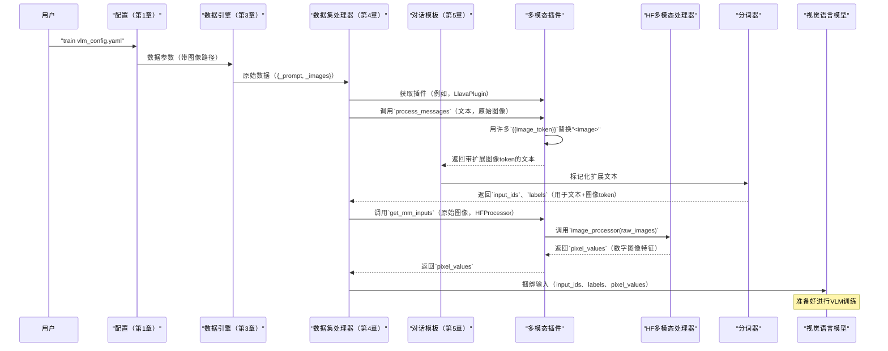
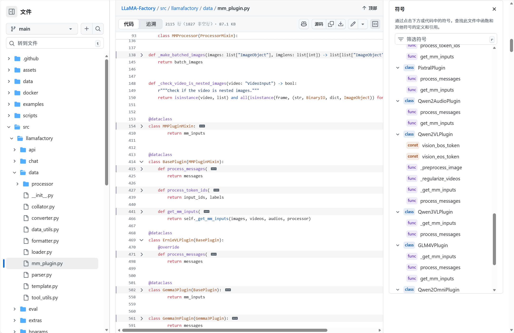

# 第6章：多模态插件

欢迎回来

在[第5章：对话模板](05_chat_template_.md)中，我们掌握了LLaMA-Factory如何将文本对话结构化为我们的大型语言模型（LLM）理解的确切"方言"。但是，如果我们的模型需要理解的不仅仅是文本呢？如果它需要看图像、观看视频或听音频呢？

这就是**多模态插件**的用武之地

将其视为**非文本数据的专业解释器**。虽然对话模板处理对话的文本部分，但多模态插件负责将图像、视频或音频翻译成我们的模型可以处理的语言，然后将它们无缝集成到我们的提示中。

## 模型的额外感官：为什么多模态插件是关键

想象一下我们正在训练一个智能助手。我们已经教它理解口头命令并用文本回应。但现在我们希望它回答关于我们展示的图片的问题，或描述视频中的场景。

标准LLM无法直接"看到"图片文件（如`.jpg`）或"听到"音频片段（如`.mp3`）。它需要这些不同类型的数据（称为"模态"）被：
1.  **识别：** 模型如何知道图像即将到来？
2.  **处理：** 原始图像文件如何转换为模型可以使用的数字？
3.  **表示：** 这些数字如何与我们的文字一起插入文本流中？

**多模态插件**解决了这些挑战。它为理解不仅仅是文本的模型提供了关键的抽象，通常称为**视觉语言模型（VLM）**或**多模态LLM**。它处理图像、视频或音频的专门预处理，将特殊的"多模态token"插入我们的文本提示中，并将所有这些不同的输入捆绑在一起，以便我们的模型能够理解复杂的、多感官的信息。

## 我们的目标：使用图像微调VLM

假设我们想微调一个LLaVA模型（一个流行的VLM）来为图像生成标题。

我们的原始数据（来自[数据引擎](03_data_engine_.md)）将包括文本和图像文件，如：
```json
{
  "_prompt": [{"role": "user", "content": "描述这张图片：<image>"}],
  "_response": [{"role": "assistant", "content": "这张图片显示了一只毛茸茸的猫在阳光明媚的窗台上睡觉。"}],
  "_images": ["./path/to/cat.jpg"]
}
```

多模态插件的工作是：
1.  看到文本中的`<image>`占位符。
2.  找到实际的图像文件（`./path/to/cat.jpg`）。
3.  处理`cat.jpg`（例如，调整大小，转换为数字像素值）。
4.  用*许多*特殊token（例如，``后跟数百个`<image_patch_token>`）替换文本中的单个`<image>`占位符，因为单个图像包含大量视觉信息。
5.  将这些处理过的图像像素值与标记化的文本输入捆绑在一起，为LLaVA模型做好准备。

## 多模态插件的关键概念

让我们分解这个"额外感官"解释器的工作原理：

### 1. 多模态数据类型

除了文本，LLaMA-Factory还支持：

*   **图像：**（数据中的`_images`字段）- 原始图像文件（例如，JPG、PNG）。
*   **视频：**（数据中的`_videos`字段）- 原始视频文件（例如，MP4）。
*   **音频：**（数据中的`_audios`字段）- 原始音频文件（例如，MP3、WAV）。

### 2. 文本提示中的占位符

要告诉模型*在哪里*集成非文本输入，我们在提示中使用特殊占位符：

*   `<image>`：用于图像。
*   `<video>`：用于视频。
*   `<audio>`：用于音频。

这些是常见的约定。插件知道要查找这些。

### 3. Token替换：从简单占位符到丰富表示

这是一个核心功能。我们文本中的单个`<image>`占位符需要扩展为许多"图像token"的序列（例如，`<img_patch><img_patch>...</img>`）。为什么？因为大型图像包含大量视觉信息，无法仅用一个token表示。所需的token数量（"图像序列长度"）因模型和图像大小而异。

| 插件之前                    | 插件之后（概念）                                             |
| :-------------------------- | :----------------------------------------------------------- |
| `描述这张图片：<image>`     | `描述这张图片：<image_patch_token><image_patch_token>...<image_patch_token></img>` |
| `这个视频里有什么？<video>` | `这个视频里有什么？<video_frame_token>...<video_frame_token>` |

### 4. 使用Hugging Face处理器的专门预处理

插件不仅插入token；它还处理将原始媒体文件转换为模型可以使用的数字数据的繁重工作。它==依赖于Hugging Face Transformers库中的`ProcessorMixin`对象（如`LlavaProcessor`或`Qwen2VLProcessor`==）。这些处理器执行以下任务：

*   **图像：** 调整大小、裁剪、归一化像素值。
*   **视频：** 采样帧、调整每帧大小、归一化。
*   **音频：** 重新采样音频、创建频谱图。

输出通常是一个PyTorch张量（例如，图像的`pixel_values`），准备馈送到模型的视觉或音频编码器。

### 5. 输入捆绑

最后，多模态插件确保标记化的文本（`input_ids`、`attention_mask`、`labels`）和处理过的非文本特征（例如，`pixel_values`）都打包到VLM期望作为其输入的单个字典中。

## 如何使用多模态插件

我们通常不直接"调用"多模态插件。相反，LLaMA-Factory根据我们选择的模型和`template`设置自动激活和配置它。

当我们在`model_name_or_path`中选择多模态模型（例如，`llava-hf/llava-1.5-7b-hf`）时，LLaMA-Factory自动：
1.  检测到它是一个多模态模型。
2.  加载其关联的`ProcessorMixin`（例如，`LlavaProcessor`）。
3.  选择适当的`多模态插件`（例如，`LlavaPlugin`）。
4.  确保使用正确的`template`（例如，`llava`），因为对话模板通常设计为与特定的多模态插件协同工作。

让我们重新审视我们的LLaVA图像标题用例。这是一个典型的YAML配置文件（`vlm_config.yaml`）：

```yaml
# vlm_config.yaml
model_name_or_path: llava-hf/llava-1.5-7b-hf # 一个LLaVA模型
dataset: my_image_captioning_data # 我们的带图像的数据集
dataset_dir: ./my_vlm_data # 包含data_config.json和图像的目录

template: llava # 明确设置LLaVA的对话模板
mm_plugin: llava # （可选）明确选择LLaVA插件，通常自动检测。

stage: sft
cutoff_len: 2048
output_dir: ./output_llava_model
```
我们的`my_vlm_data/data_config.json`可能定义一个数据集，其中`_images`指向图像路径：
```json
# ./my_vlm_data/data_config.json
{
  "my_image_captioning_data": {
    "file_name": "image_data.json",
    "formatting": "alpaca",
    "columns": {
      "prompt": "instruction",
      "response": "output",
      "images": "image_path" # 我们的图像在此列中指定
    }
  }
}
```

要运行此命令，我们将使用以下命令：

```bash
llamafactory-cli train vlm_config.yaml
```

**LLaMA-Factory将做什么（高级）：**
1.  **配置：** 它读取`model_name_or_path`、`template: llava`和`mm_plugin: llava`。
2.  **模型加载（第2章）：** 加载LLaVA模型及其`LlavaProcessor`。
3.  **数据引擎（第3章）：** 加载`my_image_captioning_data`，从每个示例中提取文本消息和`image_path`。它将这些存储为`_prompt`、`_response`和`_images`。
4.  **数据集处理器（第4章）：**
    *   它检索`LlavaPlugin`（扩展`BasePlugin`）。
    *   它使用插件的`process_messages`方法。此方法获取带有`<image>`占位符的文本和实际图像数据。然后它*用*数百个特定的"图像token"（例如，`<image_token><image_token>...</img>`）*替换*`<image>`。
    *   然后[对话模板](05_chat_template_.md)格式化这个扩展的文本，分词器将其转换为`input_ids`和`labels`。
    *   然后它调用插件的`get_mm_inputs`方法。此方法从`_images`获取原始图像，将它们馈送到`LlavaProcessor`，并返回数字`pixel_values`。
    *   最后，数据集处理器将`input_ids`、`labels`和`pixel_values`捆绑到单个字典中，为模型做好准备。

## 底层机制：多模态装配线

让我们窥探幕后，看看多模态插件如何编排这些步骤。

### 多模态流程

想象LLaMA-Factory有一条专门用于多模态数据的装配线。



### 多模态插件背后的代码

多模态插件的核心逻辑位于`src/llamafactory/data/mm_plugin.py`中。



#### 1. `src/llamafactory/data/mm_plugin.py` - 基础插件和Mixin

所有多模态插件都继承自基础`MMPluginMixin`和`BasePlugin`类，提供通用功能。

```python
# 来自src/llamafactory/data/mm_plugin.py的简化摘录
from dataclasses import dataclass
from typing import Optional, TYPE_CHECKING, Any

if TYPE_CHECKING: # 这些只是用于类型提示
    from transformers import PreTrainedTokenizer, ProcessorMixin
    from PIL.Image import Image as ImageObject

# 保存多模态插件的通用实用程序
@dataclass
class MMPluginMixin:
    image_token: Optional[str] # 例如，"<image_token>"或"<|image|>"

    def _regularize_images(self, images: list[Any], **kwargs) -> dict[str, list["ImageObject"]]:
        # 将各种图像输入（路径、字节）转换为标准化的PIL Image对象。
        # 它还处理基本的预处理，如调整大小或模式转换（RGB）。
        # ... 读取和基本处理的简化逻辑 ...
        return {"images": [Image.new("RGB", (32, 32))]} # 返回PIL Image对象列表

    def _get_mm_inputs(self, images: list[Any], videos: list[Any], audios: list[Any], processor: "ProcessorMixin") -> dict[str, Any]:
        # 这是原始多模态数据传递给实际Hugging Face处理器的地方。
        mm_inputs = {}
        if len(images) != 0:
            # 从主Hugging Face处理器获取图像处理器部分
            image_processor = getattr(processor, "image_processor", None)
            # 首先将原始图像标准化为PIL格式
            processed_images = self._regularize_images(images)["images"]
            # 应用Hugging Face图像处理器，返回张量（例如，pixel_values）
            mm_inputs.update(image_processor(processed_images, return_tensors="pt"))
        # ... 视频和音频的类似逻辑 ...
        return mm_inputs

# 所有特定插件实现的抽象基类
@dataclass
class BasePlugin(MMPluginMixin):
    # 此方法修改文本消息以替换占位符
    def process_messages(self, messages: list[dict[str, str]], images: list[Any], videos: list[Any], audios: list[Any], processor: Optional["ProcessorMixin"]) -> list[dict[str, str]]:
        return messages # 默认情况下，什么都不做（子类覆盖）

    # 此方法提取和处理实际的多模态特征
    def get_mm_inputs(self, images: list[Any], videos: list[Any], audios: list[Any], imglens: list[int], vidlens: list[int], audlens: list[int], batch_ids: list[list[int]], processor: Optional["ProcessorMixin"]) -> dict[str, Any]:
        # 调用共享实用程序以获取处理过的多模态输入
        return self._get_mm_inputs(images, videos, audios, processor)
```
**解释：** `MMPluginMixin`为规范化（清理）原始图像/视频/音频和调用适当的Hugging Face `ProcessorMixin`提供通用辅助函数。`BasePlugin`定义了特定插件（如`LlavaPlugin`）将实现的主要接口方法（`process_messages`、`get_mm_inputs`）。

#### 2. `src/llamafactory/data/mm_plugin.py` - 示例：`LlavaPlugin`

以下是像`LlavaPlugin`这样的特定插件如何覆盖`process_messages`来处理token替换：

```python
# 来自src/llamafactory/data/mm_plugin.py的简化摘录（LlavaPlugin）
from copy import deepcopy
from typing_extensions import override
from ..extras.constants import IMAGE_PLACEHOLDER # 这是"<image>"

@dataclass
class LlavaPlugin(BasePlugin):
    @override # 表示此方法正在覆盖父类的方法
    def process_messages(
        self,
        messages: list[dict[str, str]],
        images: list[Any], videos: list[Any], audios: list[Any],
        processor: Optional["MMProcessor"],
    ) -> list[dict[str, str]]:
        messages = deepcopy(messages) # 重要：始终在消息的副本上工作
        # LLaVA 1.5通常用576个token表示一张图像
        image_seqlen = 576
        
        for message in messages:
            content = message["content"]
            # 循环替换所有"<image>"占位符实例
            while IMAGE_PLACEHOLDER in content:
                # 用重复'image_seqlen'次的特定占位符替换"<image>"
                # `self.image_token`将是实际的token，如"<image_token>"或"<img_token>"
                content = content.replace(IMAGE_PLACEHOLDER, "{{image}}" * image_seqlen, 1)
            
            # 最后，用模型的实际图像token替换内部占位符
            message["content"] = content.replace("{{image}}", self.image_token)
        return messages
```
**解释：**
- `LlavaPlugin`的`process_messages`获取原始`messages`（例如，`{"content": "描述：<image>"}`）。
- 它计算`image_seqlen`（多少个token表示一张图像）。
- 然后它战略性地用许多实际`self.image_token`的序列（例如，`<image_token>`重复576次）替换用户友好的`<image>`占位符。然后返回这个扩展的字符串。

#### 3. `src/llamafactory/data/template.py` - 对话模板中的插件集成

[对话模板](05_chat_template_.md)在标记化消息*之前*使用多模态插件：

```python
# 来自src/llamafactory/data/template.py的简化摘录（在Template._encode内）
# ... 在_encode方法内 ...
        # 首先，如果存在任何非文本输入，让多模态插件处理消息。
        # 这是像"<image>"这样的占位符扩展为许多特殊token的地方。
        messages = self.mm_plugin.process_messages(messages, images, videos, audios, self.mm_processor)

        for i, message in enumerate(messages):
            elements = []
            # ... (第5章的对话模板格式化逻辑的其余部分) ...
            # 现在，`message["content"]`包含扩展的图像token，准备进行标记化。
            # 分词器（由`_convert_elements_to_ids`调用）将把这些转换为数字。
            # ...
```
**解释：** 此代码片段显示`Template._encode`方法（处理文本格式化）首先调用`self.mm_plugin.process_messages`。这确保带有多模态占位符的文本在被包装在聊天格式化器中并标记化*之前*被正确扩展。

#### 4. `src/llamafactory/data/processor/supervised.py` - 数据集处理器中的插件集成

[数据集处理器](04_dataset_processor_.md)集成多模态插件以收集处理过的数字特征：

```python
# 来自src/llamafactory/data/processor/supervised.py的简化摘录（在SupervisedDatasetProcessor.preprocess_dataset内）
# ... 在preprocess_dataset方法内，在标记化之后（来自_encode_data_example）...
            input_ids, labels = self._encode_data_example(...) # 这已经包括扩展的图像token

            # 现在，收集图像的实际数字（像素）值
            mm_inputs = self.mm_plugin.get_mm_inputs(
                images=examples["_images"][i] or [], # 数据引擎加载的原始图像数据
                videos=examples["_videos"][i] or [], # 原始视频数据
                audios=examples["_audios"][i] or [], # 原始音频数据
                imglens=[len(examples["_images"][i])] if examples["_images"][i] else [0], # 简化的占位符
                vidlens=[0], audlens=[0], batch_ids=[input_ids], # 真实模型的更复杂逻辑
                processor=self.processor # Hugging Face ProcessorMixin（例如，LlavaProcessor）
            )

            model_inputs["input_ids"].append(input_ids)
            model_inputs["attention_mask"].append([1] * len(input_ids))
            model_inputs["labels"].append(labels)
            
            # 将处理过的多模态输入（例如，pixel_values）添加到最终的model_inputs字典
            for key, value in mm_inputs.items():
                model_inputs[key].append(value) # 例如，model_inputs["pixel_values"]将包含图像张量
```
**解释：** 此代码显示，在文本和扩展的图像token被处理为`input_ids`后，`DatasetProcessor`调用`self.mm_plugin.get_mm_inputs`。此函数获取*原始*图像数据（`examples["_images"][i]`），使用Hugging Face `processor`将其转换为张量（如`pixel_values`），并返回这些。最后，这些`pixel_values`被添加到`model_inputs`字典中，这是VLM期望的。

## 结论

多模态插件是扩展大型语言模型能力的不可或缺的组件，使其能够真正通过不仅仅是文本来理解和与世界互动。通过智能处理来自图像、视频和音频的数据，它弥合了原始感官输入和高级VLM所需的数字格式之间的差距。LLaMA-Factory根据我们的模型和配置无缝集成此插件，简化了多模态微调的复杂任务。

现在我们的==多模态数据已完美处理和捆绑==，所有输入都准备好馈送到模型进行学习

在下一章中，我们将==把所有内容整合在一起，并探索完整的**训练工作流程**==。前往[第7章：训练工作流程](07_training_workflow_.md)，看看所有这些部分如何融入宏大的训练计划~

