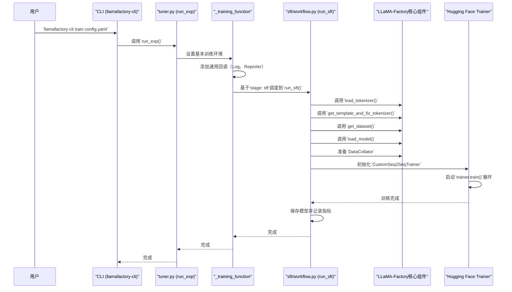
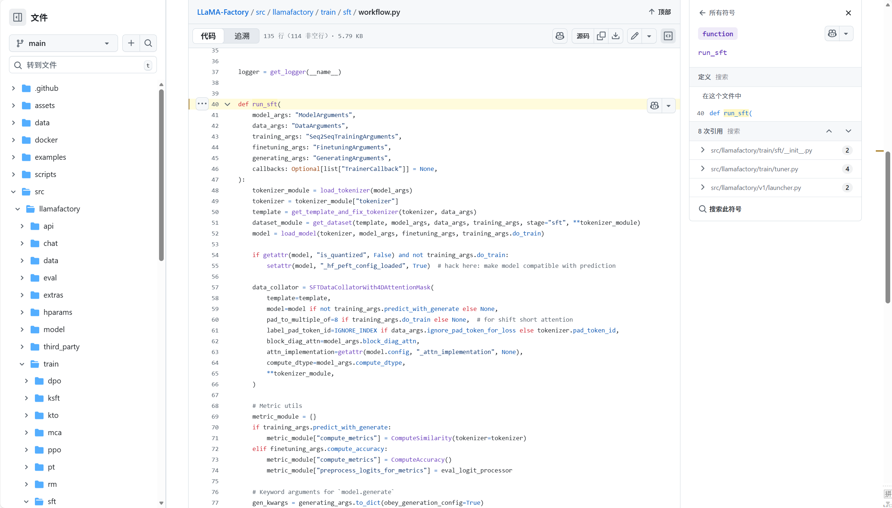

# 第7章：训练工作流程

欢迎回来

到目前为止，我们已经学习了如何设置大型语言模型（LLM）微调拼图的每一块：

*   [第1章：配置（超参数）](01_configuration__hparams__.md) – 我们的主蓝图。
*   [第2章：模型加载和适配](02_model_loading_and_adaptation_.md) – 通过优化让我们的模型运行起来。
*   [第3章：数据引擎](03_data_engine_.md) – 收集和标准化我们的原始数据。
*   [第4章：数据集处理器](04_dataset_processor_.md) – 将数据转换为数字输入。
*   [第5章：对话模板](05_chat_template_.md) – 确保我们的模型"说"正确的方言。
*   [第6章：多模态插件](06_multimodal_plugin_.md) – 为我们的模型提供图像、视频或音频的"额外感官"。

现在，是时候让所有这些精心准备的组件发挥作用了！这就是**训练工作流程**的用武之地。

## 项目经理：为什么训练工作流程是关键

想象一下我们正在建造一个复杂的项目，比如摩天大楼。我们有详细的蓝图、所有必要的材料、专门负责地基、结构和内部的团队，以及每项任务的特定工具。但是谁充当**整体项目经理**？谁确保地基团队在结构团队开始之前完成，材料按时交付，执行质量检查，以及整个项目遵循所选的建筑风格（例如，现代、经典、环保）？

**训练工作流程**正是我们LLM微调旅程的项目经理。它编排整个过程，从设置环境到实际运行训练循环并保存结果。它确保所有单个组件（模型、数据、模板等）按正确的顺序调用，并为我们的特定训练目标进行配置。

这个抽象解决了一个关键问题：**管理不同微调目标的复杂性。** 无论我们是在进行监督微调（SFT）、直接偏好优化（DPO）还是预训练（PT），每种都需要对数据、模型和训练循环进行略微不同的设置。训练工作流程处理这些变化，允许我们简单地指定我们的`stage`（例如，`sft`、`dpo`），LLaMA-Factory会在幕后处理复杂的细节。

## 我们的目标：使用SFT微调Llama-3模型

让我们继续我们的运行示例：使用**监督微调（SFT）**在指令数据集上微调Llama-3模型。这是使LLM遵循特定命令的常见而强大的方法。

为了实现这一点，训练工作流程需要：
1.  读取我们的整个配置（[第1章](01_configuration__hparams__.md)）。
2.  基于`stage: sft`，专门为SFT准备训练环境。
3.  使用我们学到的所有组件加载分词器、模板、模型并准备数据集。
4.  初始化一个专门的`Trainer`（来自Hugging Face Transformers），它知道如何执行SFT。
5.  为日志记录、保存和可能的早停添加回调。
6.  启动实际的训练过程。
7.  保存微调后的模型和训练结果。

## 训练工作流程的关键概念

让我们分解LLaMA-Factory训练工作流程背后的基本思想：

### 1. 训练阶段：不同的目标，不同的工作流程

最重要的概念是**训练`stage`**。这个单一参数告诉训练工作流程我们想要进行*什么类型*的微调。每个阶段都有一个专门为其特定要求设计的子工作流程。

| 阶段  | 描述                                                         | 目标                                                |
| :---- | :----------------------------------------------------------- | :-------------------------------------------------- |
| `pt`  | **预训练**：在原始文本数据上继续训练。                       | 提高模型的一般语言理解和生成能力。                  |
| `sft` | **监督微调**：在（提示，响应）对上训练。                     | 使模型遵循指令或生成特定输出。                      |
| `rm`  | **奖励建模**：训练一个单独的模型来评估文本质量。             | 教模型评估LLM响应的好坏。                           |
| `ppo` | **近端策略优化**：基于人类反馈的强化学习（RLHF）阶段，使用奖励。 | 通过试错使模型行为与人类偏好保持一致。              |
| `dpo` | **直接偏好优化**：另一个RLHF阶段，直接使用偏好对。           | 直接从选择/拒绝的响应使模型行为与人类偏好保持一致。 |
| `kto` | **卡尼曼-特沃斯基优化**：一种较新的基于偏好的优化方法。      | 基于期望/不期望的结果使模型行为与偏好保持一致。     |

### 2. 组件编排

训练工作流程充当中央枢纽，编排所有其他LLaMA-Factory组件：
*   它调用函数来加载我们的模型和分词器（[第2章：模型加载和适配](02_model_loading_and_adaptation_.md)）。
*   它检索正确的对话模板并修复分词器（[第5章：对话模板](05_chat_template_.md)）。
*   然后它将这些传递给[数据引擎](03_data_engine_.md)和[数据集处理器](04_dataset_processor_.md)以获取训练就绪的数据。
*   对于多模态任务，它还通过数据处理流程隐式启用[多模态插件](06_multimodal_plugin_.md)。

### 3. 训练循环管理（`Trainer`）

在其核心，工作流程设置并运行实际的训练循环。LLaMA-Factory利用Hugging Face Transformers库中强大的`Trainer`类。这个`Trainer`处理：
*   **轮次和步骤：** 遍历数据多少次。
*   **批处理：** 以小组处理数据。
*   **优化器：** 如何调整模型的权重（例如，AdamW）。
*   **学习率调度器：** 学习率如何随时间变化。
*   **梯度累积和检查点：** 节省内存的技术。
*   **分布式训练：** 在多个GPU上运行。

LLaMA-Factory经常使用自己的`CustomTrainer`或`CustomSeq2SeqTrainer`扩展这个`Trainer`，为每个阶段添加特定的功能或指标。

### 4. 回调：监控和自定义操作

工作流程允许我们附加"回调"，这些回调就像在训练期间的特定点（例如，每步之后，每个轮次之后）执行的小辅助程序。LLaMA-Factory使用回调来：
*   **日志记录：** 记录训练进度。
*   **模型保存：** 保存我们模型的检查点。
*   **早停：** 如果模型在验证集上的性能没有改善，则停止训练。
*   **自定义报告：** 将指标发送到Weights & Biases或TensorBoard等工具。

## 如何使用训练工作流程

我们不直接"调用"训练工作流程。相反，我们只需使用`llamafactory-cli train`命令，提供我们的配置（来自[第1章：配置（超参数）](01_configuration__hparams__.md)）。我们配置中的`stage`参数是激活特定工作流程的关键设置。

让我们设置我们的配置（`sft_llama3.yaml`）来执行监督微调：

```yaml
# sft_llama3.yaml
model_name_or_path: meta-llama/Llama-3-8B-Instruct
dataset: llamafactory/alpaca_en_demo # 一个示例数据集
template: llama3
cutoff_len: 1024

stage: sft # <--- 这指定了训练工作流程！

# 训练参数
learning_rate: 2e-5
per_device_train_batch_size: 2
num_train_epochs: 3
output_dir: ./output_sft_llama3
logging_steps: 10
save_steps: 50
evaluation_strategy: steps
eval_steps: 50
report_to: wandb # 可选：将指标报告给Weights & Biases
```

要运行此命令，我们将执行：

```bash
llamafactory-cli train sft_llama3.yaml
```

**LLaMA-Factory将做什么**

1.  **读取配置：** 系统读取`sft_llama3.yaml`并提取我们所有的参数。
2.  **调度工作流程：** 它看到`stage: sft`并调度到内部SFT工作流程。
3.  **组件组装：** SFT工作流程然后调用所有必要的LLaMA-Factory组件：
    *   `load_tokenizer`获取Llama-3分词器。
    *   `get_template_and_fix_tokenizer`设置`llama3`对话模板。
    *   `get_dataset`为SFT加载、处理和标记化`llamafactory/alpaca_en_demo`。
    *   `load_model`加载Llama-3模型并应用任何优化（例如，如果指定则为QLoRA）。
4.  **Trainer设置：** 它创建一个`CustomSeq2SeqTrainer`（一个专门的Hugging Face `Trainer`），其中包含加载的模型、数据、分词器和我们的训练参数。
5.  **回调：** 它为日志记录和保存添加默认回调，还有`ReporterCallback`和可能的`WandbCallback`（因为`report_to: wandb`）。
6.  **开始训练：** 调用`trainer.train()`方法，这会在我们的GPU上启动整个微调循环。
7.  **保存结果：** 训练后，模型（或其适配器）和训练指标保存到`./output_sft_llama3`。

## 底层机制：训练工作流程的编排

让我们看看我们微调命令的内部旅程。

### 训练工作流程流程：宏伟计划



### 代码

训练工作流程的核心逻辑位于`src/train.py`、`src/llamafactory/train/tuner.py`和特定阶段的工作流程文件，如`src/llamafactory/train/sft/workflow.py`中



例如，这个文件实现了 run_sft 函数：负责==加载==分词器与模型、==准备==数据和专用 data collator、==配置==生成参数与评估指标，==构建==自定义 Trainer 并执行微调/评估/预测流程，最后==保存==模型、度量、训练曲线和==生成== model card。

#### 1. `src/train.py` - 入口点

这是最简单的文件，当我们运行`llamafactory-cli train`时充当主要可执行文件。

```python
# 来自src/train.py的简化摘录
from llamafactory.train.tuner import run_exp

def main():
    run_exp() # 调用主训练执行函数

if __name__ == "__main__":
    main()
```
**解释：** 当我们输入`llamafactory-cli train`时，这个`main()`函数被执行，它只是从`tuner.py`模块调用`run_exp()`。

#### 2. `src/llamafactory/train/tuner.py` - 中央编排器

此文件包含高级`run_exp`函数和调度到特定训练阶段的`_training_function`。

```python
# 来自src/llamafactory/train/tuner.py的简化摘录
import torch.distributed as dist
from transformers import EarlyStoppingCallback # 来自Hugging Face

from ..data import get_template_and_fix_tokenizer # 来自第5章
from ..hparams import get_train_args, read_args # 来自第1章
from ..model import load_model, load_tokenizer # 来自第2章
from .callbacks import LogCallback, ReporterCallback # LLaMA-Factory特定回调
from .sft import run_sft # 我们的示例SFT工作流程
# ... 导入其他run_pt、run_dpo、run_rm等 ...

def _training_function(config: dict[str, Any]) -> None:
    args = config.get("args")
    callbacks: list[Any] = config.get("callbacks") # 初始回调

    # 1. 解析所有参数（来自config.yaml或CLI）
    model_args, data_args, training_args, finetuning_args, generating_args = get_train_args(args)

    # 2. 添加LLaMA-Factory特定和通用回调
    callbacks.append(LogCallback())
    callbacks.append(ReporterCallback(model_args, data_args, finetuning_args, generating_args))
    if finetuning_args.early_stopping_steps is not None:
        callbacks.append(EarlyStoppingCallback(early_stopping_patience=finetuning_args.early_stopping_steps))

    # 3. 调度到正确的训练阶段工作流程
    if finetuning_args.stage == "pt":
        # run_pt(...)
        pass
    elif finetuning_args.stage == "sft":
        run_sft(model_args, data_args, training_args, finetuning_args, generating_args, callbacks)
    # ... 其他阶段，如"rm"、"ppo"、"dpo"、"kto" ...
    else:
        raise ValueError(f"Unknown task: {finetuning_args.stage}.")

    # 如果使用，清理分布式训练进程
    try:
        if dist.is_initialized():
            dist.destroy_process_group()
    except Exception as e:
        logger.warning(f"Failed to destroy process group: {e}.")

def run_exp(args: Optional[dict[str, Any]] = None, callbacks: Optional[list["TrainerCallback"]] = None) -> None:
    # 这是src/train.py调用的主入口
    args = read_args(args) # 读取命令行参数或字典
    if "-h" in args or "--help" in args: # 处理帮助消息
        get_train_args(args) # 这将打印所有超参数的帮助

    callbacks = callbacks or []
    # 如果使用Ray进行分布式训练，在这里处理。
    # 否则，直接调用_training_function：
    _training_function(config={"args": args, "callbacks": callbacks})
```
**解释：**
- `run_exp`是主入口点，它主要调用`_training_function`。
- `_training_function`首先使用`get_train_args`解析我们所有的配置参数（[第1章](01_configuration__hparams__.md)）。
- 然后它设置一个`callbacks`列表，该列表将监控训练过程。
- 关键的是，它使用`finetuning_args.stage`（例如，`"sft"`）来决定*调用哪个特定的工作流程函数*（例如，`run_sft`、`run_pt`、`run_dpo`）。这是训练工作流程的中央**调度机制**。

#### 3. 再谈`src/llamafactory/train/sft/workflow.py` - SFT子工作流程

此文件包含==监督微调阶段==的特定逻辑。其他阶段（如`pt`、`dpo`）有类似的`workflow.py`文件。

```python
# 来自src/llamafactory/train/sft/workflow.py的简化摘录
from typing import TYPE_CHECKING, Optional

from ...data import SFTDataCollatorWith4DAttentionMask, get_dataset, get_template_and_fix_tokenizer
from ...extras.constants import IGNORE_INDEX
from ...extras.logging import get_logger
from ...extras.ploting import plot_loss
from ...model import load_model, load_tokenizer
from ..trainer_utils import create_modelcard_and_push # 最终模型卡的实用程序
from .metric import ComputeAccuracy # SFT特定指标
from .trainer import CustomSeq2SeqTrainer # LLaMA-Factory的自定义Trainer

if TYPE_CHECKING:
    from transformers import Seq2SeqTrainingArguments, TrainerCallback
    from ...hparams import DataArguments, FinetuningArguments, GeneratingArguments, ModelArguments

logger = get_logger(__name__)

def run_sft(
    model_args: "ModelArguments",
    data_args: "DataArguments",
    training_args: "Seq2SeqTrainingArguments",
    finetuning_args: "FinetuningArguments",
    generating_args: "GeneratingArguments",
    callbacks: Optional[list["TrainerCallback"]] = None,
):
    # 1. 加载分词器和模板
    tokenizer_module = load_tokenizer(model_args) # 第2章
    tokenizer = tokenizer_module["tokenizer"]
    template = get_template_and_fix_tokenizer(tokenizer, data_args) # 第5章

    # 2. 准备数据集
    # 这调用数据引擎（第3章）和数据集处理器（第4章）
    dataset_module = get_dataset(template, model_args, data_args, training_args, stage="sft", **tokenizer_module)

    # 3. 加载模型
    model = load_model(tokenizer, model_args, finetuning_args, training_args.do_train) # 第2章

    # 4. 准备数据整理器（馈送到模型之前的最后一步）
    # 这来自第4章并准备批次
    data_collator = SFTDataCollatorWith4DAttentionMask(
        template=template,
        model=model if not training_args.predict_with_generate else None,
        label_pad_token_id=IGNORE_INDEX if data_args.ignore_pad_token_for_loss else tokenizer.pad_token_id,
        # ... 其他数据整理器参数 ...
        **tokenizer_module,
    )

    # 5. 初始化我们的自定义Trainer
    trainer = CustomSeq2SeqTrainer(
        model=model,
        args=training_args,
        finetuning_args=finetuning_args,
        data_collator=data_collator,
        callbacks=callbacks, # 传递我们的回调列表
        gen_kwargs=generating_args.to_dict(obey_generation_config=True),
        **dataset_module, # 包含train_dataset和eval_dataset
        **tokenizer_module, # 包含tokenizer和processor
        compute_metrics=ComputeAccuracy(), # 我们的SFT特定指标
    )

    # 6. 开始训练
    if training_args.do_train:
        train_result = trainer.train(resume_from_checkpoint=training_args.resume_from_checkpoint)
        trainer.save_model() # 保存微调后的模型
        trainer.log_metrics("train", train_result.metrics)
        trainer.save_metrics("train", train_result.metrics)
        trainer.save_state()
        if trainer.is_world_process_zero() and finetuning_args.plot_loss:
            plot_loss(training_args.output_dir, keys=["loss", "eval_loss", "eval_accuracy"]) # 绘制训练损失

    # 7. （可选）评估和预测
    if training_args.do_eval:
        metrics = trainer.evaluate(metric_key_prefix="eval")
        trainer.log_metrics("eval", metrics)
        trainer.save_metrics("eval", metrics)

    # 8. 创建模型卡并推送到Hugging Face Hub（如果配置）
    create_modelcard_and_push(trainer, model_args, data_args, training_args, finetuning_args)
```
**解释：**
- `run_sft`函数是训练工作流程如何集成所有先前组件的一个很好的例子。
- 首先使用`load_tokenizer`和`get_template_and_fix_tokenizer`获取文本处理工具。
- 然后，`get_dataset`（使用[数据引擎](03_data_engine_.md)和[数据集处理器](04_dataset_processor_.md)）准备我们的数据。
- `load_model`（来自[第2章](02_model_loading_and_adaptation_.md)）将我们的LLM加载到内存中。
- 初始化`DataCollator`以批处理我们处理过的数据。
- 然后将所有这些部分传递给`CustomSeq2SeqTrainer`（一个专门的Hugging Face `Trainer`）。
- 最后，`trainer.train()`启动学习过程，`trainer.save_model()`保存我们的工作，并记录指标。

## 结论

训练工作流程是将我们整个LLaMA-Factory管弦乐队聚集在一起的强大指挥。

通过==抽象不同微调阶段的复杂性==并无缝集成我们学到的所有组件，它使我们能够用一个简单的命令启动复杂的LLM训练。

这是准备我们的模型和数据的宏伟结局，直接导致我们的LLM真正开始学习的时刻。

现在我们的模型已经训练好并准备就绪，下一个自然步骤是使用它来生成新文本或回答问题。这直接引导我们进入最后一章：[第8章：推理引擎](08_inference_engine_.md)。

