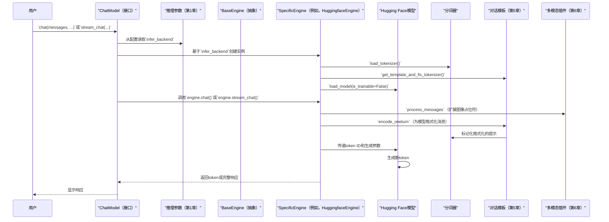
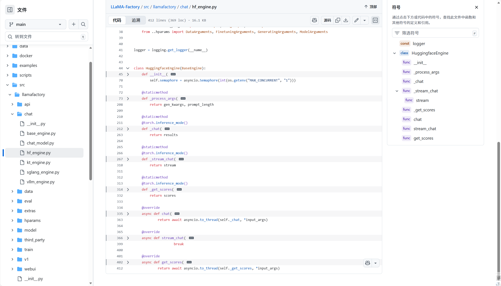

# 第8章：推理引擎

欢迎来到LLaMA-Factory旅程的最后一章~到目前为止，我们已经学习了如何：
*   [第1章：配置（超参数）](01_configuration__hparams__.md) – 设置蓝图。
*   [第2章：模型加载和适配](02_model_loading_and_adaptation_.md) – 让我们的模型运行起来。
*   [第3章：数据引擎](03_data_engine_.md) – 收集和标准化数据。
*   [第4章：数据集处理器](04_dataset_processor_.md) – 为模型准备数据。
*   [第5章：对话模板](05_chat_template_.md) – 确保模型"正确说话"。
*   [第6章：多模态插件](06_multimodal_plugin_.md) – 为我们的模型提供"额外感官"。
*   [第7章：训练工作流程](07_training_workflow_.md) – 运行整个训练过程。

现在我们已经精心==训练和微调==了我们的大型语言模型（LLM），接下来呢？我们想要==实际*使用*==它

我们想与它聊天，向它提问，并获得即时响应。这就是**推理引擎**发挥作用的地方。

## 模型的服务器：为什么推理引擎是关键

想象一下我们已经训练了一位出色的厨师（我们微调后的LLM），他可以烹饪美味的饭菜（生成文本）。但这位厨师仍在训练厨房里，周围都是重型烹饪设备。要为顾客（用户）提供饭菜，我们需要一个合适的餐厅设置：
1.  **一个干净、高效的服务区域：** 针对速度和处理许多订单进行优化。
2.  **专业的厨房设备：** 根据我们期望的顾客数量，我们可能需要一个简单的家庭厨房或高吞吐量的商业设置。
3.  **清晰的菜单和订购系统：** 接受请求（提示）并交付菜肴（响应）。

**推理引擎**正是我们训练好的LLM的这个"餐厅设置"。它以优化的方式部署我们微调后的模型，以生成响应或计算分数。它解决了将训练好的模型（准备学习）转换为功能性聊天代理或分数预测工具（准备*执行*）的关键问题。

没有推理引擎，与我们训练好的LLM交互将会很慢、占用大量内存且复杂。这就像要求我们的大厨在原始训练环境中从头开始烹饪和提供每顿饭。

## 我们的目标：与我们微调后的Llama-3模型聊天

假设我们已经微调了一个Llama-3模型，使其成为一个友好的助手。我们的目标是：
1.  加载这个微调后的Llama-3模型。
2.  与它聊天，发送像"嗨，给我讲个短故事"这样的消息。
3.  接收快速的、逐token流式响应。
4.  可选地，如果我们需要处理许多用户，切换到更快、更高效的后端引擎。

推理引擎提供了一种简单、统一的方式来实现这一点，无论哪种底层技术驱动响应。

## 推理引擎的关键概念

让我们分解LLaMA-Factory推理引擎背后的基本思想：

### 1. 统一接口：`ChatModel`

LLaMA-Factory提供了一个名为`ChatModel`的单一高级类，充当我们所有推理任务的中央控制面板。我们与`ChatModel`交互以发送提示并获得响应，而无需了解底层后端的复杂细节。

### 2. ⭕后端引擎：专业厨房

虽然`ChatModel`提供统一接口，但在幕后，LLaMA-Factory可以使用不同的"后端引擎"（如专业厨房）来实际运行我们的模型。

每个后端都有其优势：

| 后端引擎               | 描述                                                         | 最适合                                                       |
| :--------------------- | :----------------------------------------------------------- | :----------------------------------------------------------- |
| **Hugging Face (HF)**  | 使用标准的Hugging Face Transformers库。易于使用，直接加载模型，适合快速测试和其他后端可能不支持的自定义架构模型。 | 简单设置、测试、非标准模型、==小规模推理==。                 |
| **vLLM**               | 一个高性能推理引擎，以其"PagedAttention"算法而闻名。它通过高效管理GPU内存，显著加快推理速度并提高吞吐量（一次可以处理多少请求）。 | 高吞吐量场景、同时为许==多用户提供服务==、最大化GPU利用率。  |
| **SGLang**             | 另一个强大的推理引擎，专注于通过优化"提示处理"阶段来加速复杂的生成模式（例如，JSON生成、工具使用）。它通常使用HTTP服务器进行请求。 | 结构化生成（JSON）、复杂的提示工程、需要==更快提示评估==和动态控制的情况。 |
| **KTransformers (KT)** | 一个专门的推理后端，提供高度优化的内核操作和内存管理，通常为某些模型架构和硬件设置带来非常快的推理速度。它专注于纯生成速度和高效的资源使用。 | 最大生成速度、低延迟应用、专用硬件、受益于==自定义内核优化==的模型。 |

（对于vllm 可以通过写过的nano-vllm专栏了解~）

我们在配置中选择我们的`infer_backend`（来自[第1章：配置（超参数）](01_configuration__hparams__.md)），LLaMA-Factory处理启动和与所选引擎的交互。

### 3. 推理的模型加载

与训练不同（其中`is_trainable`为`True`），对于推理，模型以`eval()`模式加载，其参数通常被冻结（`requires_grad_(False)`）。这意味着不计算梯度，这节省了内存并加快了执行速度，因为模型不再"学习"。任何PEFT适配器（如来自[第2章：模型加载和适配](02_model_loading_and_adaptation_.md)的LoRA）都会被加载并自动合并或激活。

### 4. 生成参数

推理引擎遵守我们设置的`GeneratingArguments`（来自[第1章：配置（超参数）](01_configuration__hparams__.md)），例如：
*   `temperature`：控制创造力（越高=越有创造力）。
*   `max_new_tokens`：生成响应的最大长度。
*   `do_sample`：是否使用采样（随机性）或贪婪解码。
*   `top_p`、`top_k`：高级采样参数。
*   `repetition_penalty`：阻止重复单词。

这些参数允许我们在推理期间微调模型输出的*风格*。

### 5. Chat与Stream Chat

`ChatModel`提供两种主要方式来获取响应：
*   **`chat()`：** 在模型完成生成后，一次性返回完整响应。
*   **`stream_chat()`：** 在模型生成时，逐token返回响应。这类似于ChatGPT的响应方式，为实时交互提供更好的用户体验。

### 6. 多模态支持

推理引擎与[多模态插件](06_multimodal_plugin_.md)无缝集成。如果我们的模型是VLM（如LLaVA），并且我们的提示包含`<image>`占位符和实际图像数据，引擎将正确处理图像并将它们注入模型的输入流。

## 如何使用推理引擎

使用推理引擎很简单。我们通常在配置中指定所需的`infer_backend`，然后在Python脚本中使用`ChatModel`类或通过LLaMA-Factory的CLI。

让我们部署我们微调后的Llama-3模型进行聊天。

### 1. 使用`llamafactory-cli chat`命令

使用推理引擎最简单的方法是通过命令行界面。LLaMA-Factory根据我们的参数自动初始化`ChatModel`。

创建一个`infer_config.yaml`文件：

```yaml
# infer_config.yaml
model_name_or_path: meta-llama/Llama-3-8B-Instruct # 或我们微调后的模型路径
template: llama3 # 确保我们使用正确的模板
infer_backend: huggingface # 从Hugging Face开始以简化
do_sample: True # 允许创造性响应
temperature: 0.7
max_new_tokens: 256
```

现在，运行聊天界面：

```bash
llamafactory-cli chat infer_config.yaml
```

我们将看到像`User: `这样的提示。输入我们的消息，模型将响应！

```
Welcome to the CLI application, use `clear` to remove the history, use `exit` to exit the application.

User: 嗨，给我讲个短故事。
Assistant: 很久很久以前，在一个舒适的小洞穴里...（模型流式传输其响应）
```

### 2. 在Python中使用`ChatModel`

为了更多的编程控制，我们可以在Python代码中直接导入和使用`ChatModel`。

首先，确保我们的模型是基础Llama-3-8B-Instruct（`llamafactory/tiny-random-Llama-3`模拟用于测试）或微调版本。假设我们在`./output_sft_llama3`保存了一个微调模型。

```python
# chat_with_llama3.py
import asyncio
from llamafactory.chat import ChatModel

# 我们微调模型的配置
# 如果我们使用了LoRA，包括finetuning_type和adapter_name_or_path
infer_args = {
    "model_name_or_path": "./output_sft_llama3", # 我们微调模型的路径
    # "model_name_or_path": "llamafactory/tiny-random-Llama-3", # 用于快速测试
    "finetuning_type": "lora", # 如果我们用LoRA微调
    "adapter_name_or_path": "./output_sft_llama3", # LoRA适配器的路径
    "template": "llama3",
    "infer_backend": "huggingface", # 或"vllm"、"sglang"、"kt"以获得更快的推理
    "do_sample": True,
    "temperature": 0.7,
    "max_new_tokens": 256,
}

# 初始化聊天模型
# 这将加载我们的模型和分词器
chat_model = ChatModel(infer_args)

# 要发送给模型的消息
messages_to_send = [
    {"role": "user", "content": "嗨，给我讲个关于勇敢老鼠的短故事。"},
]

print("向模型请求故事...")

# --- 一次性获取完整响应 ---
print("\n--- 完整响应 ---")
responses = chat_model.chat(messages_to_send)
print(responses[0].response_text)

# --- 逐token流式传输响应 ---
print("\n--- 流式响应 ---")
streamed_full_response = ""
for new_token in chat_model.stream_chat(messages_to_send):
    print(new_token, end="", flush=True)
    streamed_full_response += new_token
print("\n(流式传输完成)")

# 获取分数的示例（如果我们的模型是奖励模型）
# try:
#     scores = chat_model.get_scores(["这是一个好句子。", "这是一个坏句子。"])
#     print(f"\n分数：{scores}")
# except ValueError as e:
#     print(f"\n无法获取分数：{e}")

# 来自tests/e2e/test_chat.py的示例
# if chat_model.chat(messages_to_send)[0].response_text == "_rho": # 虚拟测试
#     print("测试通过，预期响应。")
# else:
#     print("测试失败，意外响应。")
```

要运行此Python脚本：

```bash
python chat_with_llama3.py
```

此脚本将首先打印完整故事，然后逐token流式传输它，演示`chat()`和`stream_chat()`。

### 切换后端引擎

要切换到像vLLM这样的不同后端，我们只需更改`infer_backend`参数：

```yaml
# infer_vllm_config.yaml
model_name_or_path: meta-llama/Llama-3-8B-Instruct
template: llama3
infer_backend: vllm # 更改为vLLM
# 我们可能需要安装vLLM：pip install vllm
# 如果使用LoRA，记住adapter_name_or_path和finetuning_type
```

使用`llamafactory-cli chat infer_vllm_config.yaml`运行。`ChatModel`将自动初始化`VllmEngine`而不是`HuggingfaceEngine`。

## 底层机制：引擎的内部工作原理

让我们深入了解LLaMA-Factory的推理引擎如何编排生成过程。

### 推理流程：提供餐点



### 推理引擎背后的代码

> (四个后端引擎的整体架构 其实大同小异，明确思路-对映文档api调用-实现思路)



推理引擎的核心逻辑位于`src/llamafactory/chat/chat_model.py`、`src/llamafactory/chat/base_engine.py`和特定引擎文件，如`src/llamafactory/chat/hf_engine.py`、`src/llamafactory/chat/vllm_engine.py`、`src/llamafactory/chat/sglang_engine.py`和`src/llamafactory/chat/kt_engine.py`中。

#### 1. `src/llamafactory/chat/chat_model.py` - 入口点`ChatModel`

此类充当调度器，根据我们的`infer_backend`设置确定使用哪个==后端引擎==。

```python
# 来自src/llamafactory/chat/chat_model.py的简化摘录
import asyncio
from threading import Thread
from typing import Any, Optional
from ..extras.constants import EngineName # 如EngineName.HF、EngineName.VLLM
from ..hparams import get_infer_args # 来自第1章

class ChatModel:
    def __init__(self, args: Optional[dict[str, Any]] = None) -> None:
        model_args, data_args, finetuning_args, generating_args = get_infer_args(args)

        # 这是魔法发生的地方：选择正确的后端！
        if model_args.infer_backend == EngineName.HF:
            from .hf_engine import HuggingfaceEngine
            self.engine = HuggingfaceEngine(model_args, data_args, finetuning_args, generating_args)
        elif model_args.infer_backend == EngineName.VLLM:
            from .vllm_engine import VllmEngine # 需要安装vLLM
            self.engine = VllmEngine(model_args, data_args, finetuning_args, generating_args)
        elif model_args.infer_backend == EngineName.SGLANG:
            from .sglang_engine import SGLangEngine # 需要安装SGLang
            self.engine = SGLangEngine(model_args, data_args, finetuning_args, generating_args)
        elif model_args.infer_backend == EngineName.KT:
            from .kt_engine import KTransformersEngine # 需要安装KTransformers
            self.engine = KTransformersEngine(model_args, data_args, finetuning_args, generating_args)
        else:
            raise NotImplementedError(f"Unknown backend: {model_args.infer_backend}")

        # 在单独的线程中设置asyncio事件循环以进行异步操作
        self._loop = asyncio.new_event_loop()
        self._thread = Thread(target=lambda loop: asyncio.set_event_loop(loop) or loop.run_forever(), args=(self._loop,), daemon=True)
        self._thread.start()

    def chat(self, messages, system=None, tools=None, images=None, videos=None, audios=None, **input_kwargs):
        # 从同步上下文调用所选引擎的异步chat方法
        task = asyncio.run_coroutine_threadsafe(
            self.engine.chat(messages, system, tools, images, videos, audios, **input_kwargs), self._loop
        )
        return task.result()

    async def achat(self, messages, system=None, tools=None, images=None, videos=None, audios=None, **input_kwargs):
        # 直接调用所选引擎的异步chat方法
        return await self.engine.chat(messages, system, tools, images, videos, audios, **input_kwargs)

    # stream_chat、astream_chat、get_scores、aget_scores的类似方法
```
**解释：**
- `ChatModel.__init__`是工厂。它读取我们的`infer_backend`参数，并动态导入和创建相应引擎的实例（例如，`HuggingfaceEngine`）。
- 它在后台线程中设置一个`asyncio`事件循环。这允许同步的`chat()`和`stream_chat()`方法非阻塞地与（通常是异步的）后端引擎交互。
- `chat()`方法只是将我们的请求转发给所选`self.engine`的`chat()`方法。

#### 2. `src/llamafactory/chat/base_engine.py` - `BaseEngine`接口

这是一个抽象类，所有特定后端引擎必须实现。它定义了`ChatModel`期望的通用接口（`chat`、`stream_chat`、`get_scores`）。

```python
# 来自src/llamafactory/chat/base_engine.py的简化摘录
from abc import ABC, abstractmethod
from collections.abc import AsyncGenerator
from dataclasses import dataclass
from typing import TYPE_CHECKING, Any, Literal, Optional, Union

@dataclass
class Response:
    response_text: str
    response_length: int
    prompt_length: int
    finish_reason: Literal["stop", "length"]

class BaseEngine(ABC):
    name: "EngineName" # 例如，EngineName.HF
    model: Union["PreTrainedModel", Any] # 实际加载的模型
    tokenizer: "PreTrainedTokenizer"
    can_generate: bool # 模型是否支持文本生成
    template: "Template" # 对话模板
    generating_args: dict[str, Any] # 生成参数

    @abstractmethod
    def __init__(self, model_args, data_args, finetuning_args, generating_args) -> None:
        ... # 必须初始化引擎

    @abstractmethod
    async def chat(self, messages, system=None, tools=None, images=None, videos=None, audios=None, **input_kwargs) -> list["Response"]:
        ... # 必须实现获取完整聊天响应的方法

    @abstractmethod
    async def stream_chat(self, messages, system=None, tools=None, images=None, videos=None, audios=None, **input_kwargs) -> AsyncGenerator[str, None]:
        ... # 必须实现流式传输聊天响应的方法

    @abstractmethod
    async def get_scores(self, batch_input: list[str], **input_kwargs) -> list[float]:
        ... # 必须实现获取分数的方法（用于奖励模型）
```
**解释：** `BaseEngine`就像一个契约。任何特定引擎（如`HuggingfaceEngine`）都必须履行这些方法，确保`ChatModel`可以以一致的方式与*任何*选择的后端交互。

#### 3. `src/llamafactory/chat/hf_engine.py` - Hugging Face后端

此引擎直接使用Hugging Face Transformers模型的`generate`方法。

```python
# 来自src/llamafactory/chat/hf_engine.py的简化摘录
import asyncio
from threading import Thread
import torch
from transformers import GenerationConfig, TextIteratorStreamer # Hugging Face实用程序
from typing_extensions import override
from ..data import get_template_and_fix_tokenizer # 第5章
from ..extras.constants import IMAGE_PLACEHOLDER, EngineName
from ..model import load_model, load_tokenizer # 第2章
from .base_engine import BaseEngine, Response

class HuggingfaceEngine(BaseEngine):
    def __init__(self, model_args, data_args, finetuning_args, generating_args) -> None:
        self.name = EngineName.HF
        self.can_generate = finetuning_args.stage == "sft" # 如果是SFT模型则可以生成
        tokenizer_module = load_tokenizer(model_args)
        self.tokenizer = tokenizer_module["tokenizer"]
        self.processor = tokenizer_module["processor"] # 用于多模态模型
        self.tokenizer.padding_side = "left" # 用于生成
        self.template = get_template_and_fix_tokenizer(self.tokenizer, data_args) # 第5章
        # 为推理加载模型（is_trainable=False）
        self.model = load_model(self.tokenizer, model_args, finetuning_args, is_trainable=False, add_valuehead=(not self.can_generate))
        self.generating_args = generating_args.to_dict() # 生成参数

    @staticmethod
    @torch.inference_mode()
    def _process_args(model, tokenizer, processor, template, generating_args, messages, system=None, tools=None, images=None, videos=None, audios=None, input_kwargs={}):
        mm_input_dict = {"images": images or [], "videos": videos or [], "audios": audios or [], "imglens": [len(images) if images else 0]}
        
        # 多模态处理（第6章）
        messages = template.mm_plugin.process_messages(messages, mm_input_dict["images"], mm_input_dict["videos"], mm_input_dict["audios"], processor)
        
        # 对话模板编码（第5章）
        paired_messages = messages + [{"role": "assistant", "content": ""}]
        prompt_ids, _ = template.encode_oneturn(tokenizer, paired_messages, system, tools)
        prompt_length = len(prompt_ids)
        
        inputs = torch.tensor([prompt_ids], device=model.device)
        attention_mask = torch.ones_like(inputs, dtype=torch.long)

        # 从generating_args和input_kwargs准备生成配置
        gen_config_dict = generating_args.copy()
        gen_config_dict.update(input_kwargs) # 用户提供的参数覆盖默认值
        gen_config_dict["eos_token_id"] = template.get_stop_token_ids(tokenizer)
        gen_config_dict["pad_token_id"] = tokenizer.pad_token_id

        gen_kwargs = dict(
            inputs=inputs,
            attention_mask=attention_mask,
            generation_config=GenerationConfig(**gen_config_dict),
        )

        # 获取多模态模型的实际像素值（第6章）
        mm_inputs = template.mm_plugin.get_mm_inputs(**mm_input_dict, batch_ids=[prompt_ids], processor=processor)
        for key, value in mm_inputs.items():
            if torch.is_floating_point(value): value = value.to(model.dtype)
            gen_kwargs[key] = value.to(model.device) # 将pixel_values添加到gen_kwargs

        return gen_kwargs, prompt_length

    @override
    async def chat(self, messages, system=None, tools=None, images=None, videos=None, audios=None, **input_kwargs) -> list[Response]:
        gen_kwargs, prompt_length = self._process_args(self.model, self.tokenizer, self.processor, self.template, self.generating_args, messages, system, tools, images, videos, audios, input_kwargs)
        generate_output = self.model.generate(**gen_kwargs) # 调用Hugging Face generate
        response_ids = generate_output[:, prompt_length:]
        response_text = self.tokenizer.batch_decode(response_ids, skip_special_tokens=True, clean_up_tokenization_spaces=True)
        # 将输出处理为`Response`对象
        return [Response(response_text=response_text[0], response_length=len(response_ids[0]), prompt_length=prompt_length, finish_reason="stop")]

    @override
    async def stream_chat(self, messages, system=None, tools=None, images=None, videos=None, audios=None, **input_kwargs):
        gen_kwargs, _ = self._process_args(self.model, self.tokenizer, self.processor, self.template, self.generating_args, messages, system, tools, images, videos, audios, input_kwargs)
        streamer = TextIteratorStreamer(self.tokenizer, skip_prompt=True, skip_special_tokens=True)
        gen_kwargs["streamer"] = streamer # 将streamer传递给generate方法
        thread = Thread(target=self.model.generate, kwargs=gen_kwargs, daemon=True)
        thread.start() # 在单独的线程中运行生成
        
        async for new_token in streamer: # 从streamer流式传输token
            yield new_token

    # get_scores也在这里为奖励模型实现
```
**解释：**
- `HuggingfaceEngine.__init__`加载分词器、模板和模型本身（使用`is_trainable=False`）。
- `_process_args`为`model.generate()`准备输入：
    - 它首先使用`template.mm_plugin.process_messages`（来自[第6章](06_multimodal_plugin_.md)）处理多模态占位符。
    - 然后，`template.encode_oneturn`（来自[第5章](05_chat_template_.md)）格式化消息并将它们标记化为`prompt_ids`。
    - 它将`generating_args`和`input_kwargs`组合到`GenerationConfig`中。
    - 最后，它调用`template.mm_plugin.get_mm_inputs`获取数字`pixel_values`（如果是多模态）并将它们添加到`gen_kwargs`。
- `chat()`方法直接调用`self.model.generate()`并解码完整输出。
- `stream_chat()`方法使用Hugging Face的`TextIteratorStreamer`。它在单独的线程中运行`model.generate()`，并从`streamer`异步产生token。

#### 4. `src/llamafactory/chat/vllm_engine.py`、`sglang_engine.py`、`kt_engine.py` - 其他后端

这些文件分别为vLLM、SGLang和KTransformers实现`BaseEngine`接口。它们的`__init__`方法将设置特定后端（例如，启动SGLang服务器，初始化`vllm.AsyncLLMEngine`），它们的`chat`/`stream_chat`方法将调整输入和输出以与该后端的API交互。它们还利用相同的[对话模板](05_chat_template_.md)和[多模态插件](06_multimodal_plugin_.md)进行一致的输入格式化。

例如，`SGLangEngine`的`__init__`将SGLang服务器作为子进程启动：

```python
# 来自src/llamafactory/chat/sglang_engine.py的简化摘录
import atexit
import json
import requests
from typing_extensions import override
from ..extras.constants import EngineName
from ..model import load_config, load_tokenizer
from .base_engine import BaseEngine, Response

# 假设sglang可用
from sglang.utils import launch_server_cmd, terminate_process, wait_for_server

class SGLangEngine(BaseEngine):
    def __init__(self, model_args, data_args, finetuning_args, generating_args) -> None:
        self.name = EngineName.SGLANG
        # ... (通用设置：tokenizer、template、generating_args) ...
        self.tokenizer = load_tokenizer(model_args)["tokenizer"]
        self.template = get_template_and_fix_tokenizer(self.tokenizer, data_args)

        # 将SGLang服务器作为单独的进程启动
        launch_cmd = [
            "python3 -m sglang.launch_server",
            f"--model-path {model_args.model_name_or_path}",
            f"--dtype {model_args.infer_dtype}",
            # ... 其他SGLang特定参数 ...
        ]
        self.server_process, port = launch_server_cmd(" ".join(launch_cmd))
        self.base_url = f"http://localhost:{port}"
        atexit.register(self._cleanup_server) # 确保退出时停止服务器
        wait_for_server(self.base_url, timeout=300) # 等待服务器准备就绪
        # ...

    def _cleanup_server(self):
        if hasattr(self, "server_process") and self.server_process:
            terminate_process(self.server_process)

    @override
    async def chat(self, messages, system=None, tools=None, images=None, videos=None, audios=None, **input_kwargs) -> list[Response]:
        # ... (使用template.mm_plugin和template.encode_oneturn进行提示准备) ...
        # 向SGLang服务器发送HTTP请求
        json_data = {"input_ids": prompt_ids, "sampling_params": sampling_params, "stream": False}
        response = requests.post(f"{self.base_url}/generate", json=json_data)
        result = response.json()
        # 将SGLang服务器的结果处理为`Response`对象
        return [Response(response_text=result["text"], response_length=result["meta_info"]["completion_tokens"], prompt_length=result["meta_info"]["prompt_tokens"], finish_reason="stop")]

    @override
    async def stream_chat(self, messages, system=None, tools=None, images=None, videos=None, audios=None, **input_kwargs):
        # ... (提示准备) ...
        # 向SGLang服务器发送流式HTTP请求并产生块
        json_data = {"input_ids": prompt_ids, "sampling_params": sampling_params, "stream": True}
        response = requests.post(f"{self.base_url}/generate", json=json_data, stream=True)
        for chunk in response.iter_lines(decode_unicode=False):
            if chunk.startswith(b"data:"):
                yield json.loads(chunk[5:].decode("utf-8"))["text"]
```
**解释：** `SGLangEngine`演示了如何集成基于外部服务器的后端。它启动一个服务器，通过HTTP连接到它，然后向该服务器发送生成请求。

> ==`ChatModel`不需要知道这些细节；它只是调用`chat()`或`stream_chat()`方法，`SGLangEngine`在幕后处理服务器通信==

## 结论

推理引擎是使我们微调的LLM有用和可访问的重要最后步骤

通过==在各种强大的后端引擎上提供统一的`ChatModel`接口，LLaMA-Factory使我们能够高效地部署==我们的模型，无论是用于简单测试还是高吞吐量服务

我们已经学习了如何选择正确的引擎、控制生成参数，以及通过编程或CLI与我们的模型交互，让我们的LLM焕发生机

LLaMA-Factory的教程之旅结束啦。我们现在对其核心组件有了一些了解，从配置到训练和推理。祝微调和部署愉快

END *★,°*:.☆(￣▽￣)/.°★* 。