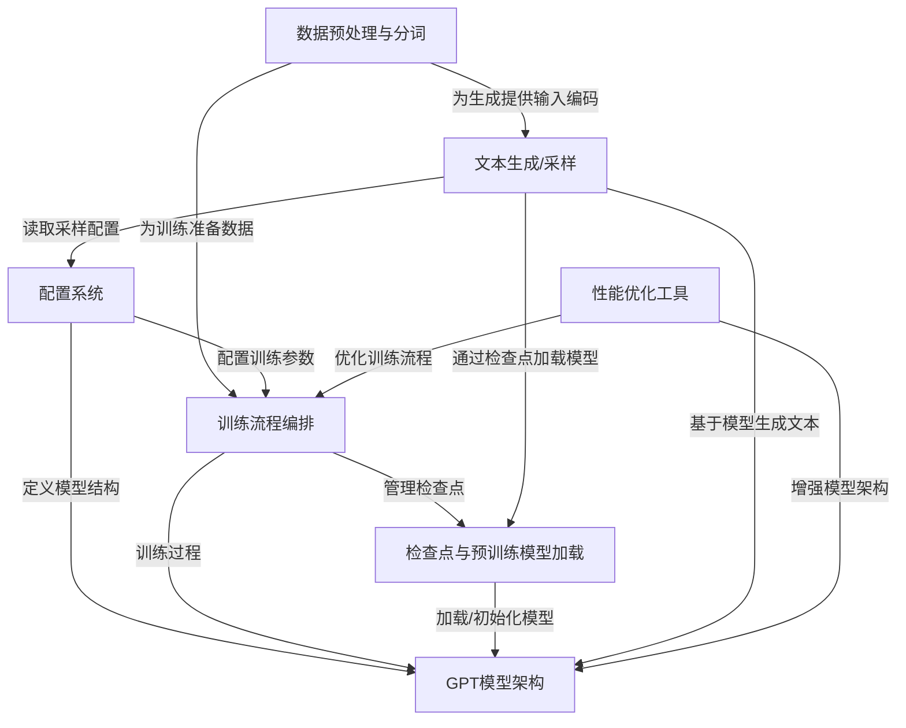
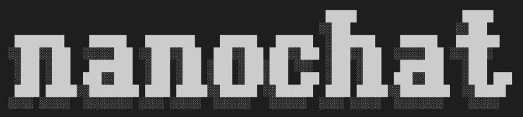
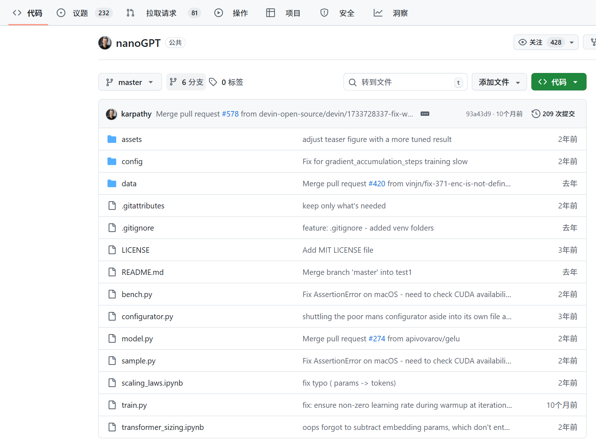
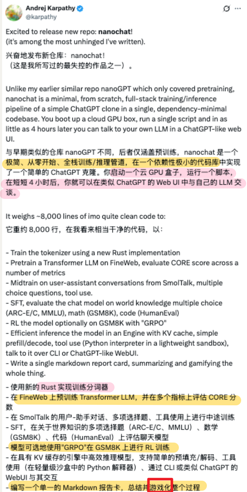
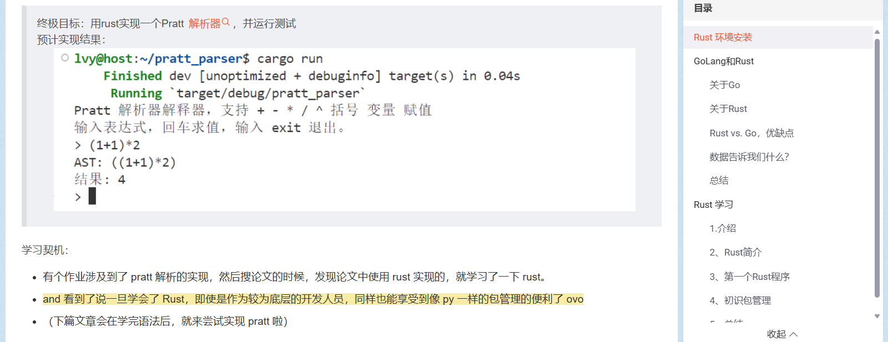

链接：

https://github.com/karpathy/nanochat

https://x.com/karpathy/status/1977755427569111362

https://github.com/karpathy/nanochat/discussions/1

https://analyticsindiamag.com/ai-news-updates/andrej-karpathy-releases-nanochat-a-minimal-chatgpt-clone/

# docs：nanoGPT

nanoGPT项目致力于提供一个**简洁**、**高效**且**易于定制**的GPT模型训练与微调实现方案。

它完整覆盖了从**原始文本数据预处理**到数值化转换，从**训练流程编排**（包含优化器与学习率调度），再到基于训练模型的**文本生成**全过程。

该项目特别强调==**性能优化**和**灵活配置系统**==，旨在让语言模型实验变得高效且易于实施。

## 可视化



## 章节内容

1. [数据预处理与分词](01_data_preparation___tokenization_.md)
2. [GPT模型架构](02_gpt_model_architecture_.md)
3. [配置系统](03_configuration_system_.md)
4. [训练流程编排](04_training_loop_orchestration_.md)
5. [检查点与预训练模型加载](05_checkpointing_and_pre_trained_model_loading_.md)
6. [文本生成/采样](06_text_generation___sampling_.md)
7. [性能优化工具](07_performance_and_efficiency_tools_.md)

---

前文传送：

[[Andrej Karpathy\] 大型语言模型作为新型操作系统-CSDN博客](https://blog.csdn.net/2301_80171004/article/details/148926956?ops_request_misc=%7B%22request%5Fid%22%3A%2288b706cd4b5feb2ae93c4f52bdac7c8a%22%2C%22scm%22%3A%2220140713.130102334.pc%5Fblog.%22%7D&request_id=88b706cd4b5feb2ae93c4f52bdac7c8a&biz_id=0&utm_medium=distribute.pc_search_result.none-task-blog-2~blog~first_rank_ecpm_v1~rank_v31_ecpm-1-148926956-null-null.nonecase&utm_term=Andrej Karpathy&spm=1018.2226.3001.4450)

[[Andrej Karpathy_2\] vibe coding | 大型语言模型的1960年代 | 自主性滑块_menu genen-CSDN博客](https://blog.csdn.net/2301_80171004/article/details/148978470?ops_request_misc=%7B%22request%5Fid%22%3A%2288b706cd4b5feb2ae93c4f52bdac7c8a%22%2C%22scm%22%3A%2220140713.130102334.pc%5Fblog.%22%7D&request_id=88b706cd4b5feb2ae93c4f52bdac7c8a&biz_id=0&utm_medium=distribute.pc_search_result.none-task-blog-2~blog~first_rank_ecpm_v1~rank_v31_ecpm-2-148978470-null-null.nonecase&utm_term=Andrej Karpathy&spm=1018.2226.3001.4450)

今天，前 OpenAI 联合创始人、Eureka Labs 创始人 Andrej Karpathy（安德烈·卡帕西）带来了一个全新的开源项目——nanochat。

用他自己的话说，这是他写过的最“疯狂”的作品之一：

只要 4 个小时、100 美元，就能“手搓”一款属于自己的 ChatGPT。倘若花上 12 个小时来训练，其性能可超越 GPT-2。



简而言之，nanochat 可以看做是一个类似 ChatGPT 的 LLM 的全栈实现，它把训练和推理的全流程都整合进了一个干净、轻量、可修改、几乎零依赖的代码库里。

你只要启动一台云端 GPU，运行一条脚本命令，大约 4 小时后，就能在 ChatGPT 风格的网页界面中，与自己训练的 LLM 对话了。不仅如此，它还可以写诗、讲故事和回答一些简单的问题等等。

可喜的是，此项目遵循 MIT 协议开源，这意味着任何人都可以自己去尝试做一款 GPT。正因此，项目发布数小时内，便斩获了 40.1k Star，引发无数 AI 开发者热议与尝试。



话不多说，感兴趣的小伙伴可通过 GitHub 开源地址，即刻上手体验：https://github.com/karpathy/nanochat

# 1.仅有 8000 行代码的 nanochat

根据 Karpathy 介绍，nanochat 约有 8000 行代码，几乎覆盖了整个模型训练与推理流程，具体包括：

- 训练前处理：使用全新的 Rust 实现训练分词器（tokenizer）实现，以加快文本编码效率。
- 预训练阶段：在 FineWeb 数据集上对 Transformer LLM 进行预训练，并通过多个指标评估 CORE 分数。
- 中期训练：使用 SmolTalk 数据集进行中期训练，涵盖用户-助手对话、多项选择题和工具使用场景。
- 监督微调（SFT）：在以下任务上评估聊天模型，如世界知识多项选择题（ARC-Easy / ARC-Challenge、MMLU）、数学题（GSM8K）、编程题（HumanEval）。
- 可选强化学习（RL）阶段：在 GSM8K 上通过 GRPO 算法进一步优化模型性能。
- 推理引擎：在带有 KV 缓存的引擎中高效推理模型，支持简单的预填充/解码、工具调用（轻量沙箱中的 Python 解释器），用户可通过命令行或 ChatGPT 风格网页界面与模型交互。
- 此外，系统还会自动生成一份 Markdown 格式报告，总结模型性能表现。



（Andrej Karpathy 游戏化的赛博活佛orz）

Karpathy 进一步表示，模型训练的规模可根据时间与成本灵活调整：

- 仅使用约 100 美元成本，在单台 8×H100 GPU 节点上训练 4 小时，即可得到一个能进行基础对话的 ChatGPT 小模型；
- 训练 12 小时左右，模型即可超过 GPT-2 CORE 基准；
- 若将预算扩大至约 1000美元（训练约 41.6 小时），模型将具备更高连贯性，能解决简单的数学与编程问题，并回答多项选择题。

与此同时，Karpathy 在 GitHub 上打趣道：

“这是 100 美元能构建的最强 ChatGPT。”

而对于未来目标，Karpathy 称：

我的目标是把整个“强基线”（strong baseline）技术栈整合到一个统一、简洁、可读、可修改、便于分叉的仓库中。==nanochat 将成为正在开发中的课程 LLM101n 的收官项目==。


LLM101n 是 Karpathy 所创立的教育公司 Eureka Labs 面向本科生开设的一门课程，旨在带领学生==从零构建属于自己的 AI 模型==

其补充说，nanochat 未来有望像 nanoGPT 一样，发展成一个研究平台或基准项目

# 2.快速上手

为了让更多的爱好者迅速上手，Karpathy 在 GitHub 上（https://github.com/karpathy/nanochat/discussions/1）详细分享了 nanochat 的教程。

nanochat 被设计为在单个 **8×H100 GPU 机器**上运行，此次教程中，Karpathy 使用了 Lambda GPU Cloud，每小时大约 24 美元。当然想要尝试的爱好者们也可根据个人情况自行选择，进行了尝试。

接下来看看他到底是怎么做的？

环境搭建

首先，克隆项目并进入目录：

```bash
git clone git@github.com:karpathy/nanochat.gitcd nanochat
```

用 **100 美元训练出最强的类 ChatGPT，其背后**最快体验魔力的方法是运行 **speedrun.sh** （速通）脚本。

> speedrun.sh 脚本可以在一台新机器上直接运行，从头到尾完成训练和推理。

一切的前提就是需要确保安装了新的 **uv 项目管理工具**。然后创建虚拟环境、安装依赖并激活它，这样在终端输入 python 时，就会==使用虚拟环境里的 Python，而不是系统自带的 Python==：

```bash
# 安装 uv（如果还没安装的话）command -v uv &> /dev/null || curl -LsSf https://astral.sh/uv/install.sh | sh# 创建本地虚拟环境 .venv（如果不存在的话）[ -d ".venv" ] || uv venv# 安装仓库依赖uv sync# 激活虚拟环境，这样 `python` 就会使用项目的虚拟环境source .venv/bin/activate
```

接下来，需要==安装 **Rust/Cargo** 来编译 nanochat 中自定义的 Rust 分词器==

（对于rust分词器这块，最开始学习rust就是因为一个分词器的demo..回旋镖）



（[[Rust_1\] 环境配置 | vs golang | 程序运行 | 包管理_rust vs golang-](https://lvynote.blog.csdn.net/article/details/148317003)命运的齿轮开始转动bush

Karpathy 称，引入新的分词器确实有点麻烦，但之前 Python 版本的 minbpe 太慢，而 HuggingFace 的 tokenizer 太臃肿且复杂。

所以他自己==实现了一个新的 Rust 分词器来训练==（经过测试效果与 Python 版本一致），但推理阶段仍会使用 OpenAI 的 **tiktoken** 来保证效率。

编译分词器步骤如下：

```bash
# 安装 Rust / Cargocurl --proto '=https' --tlsv1.2 -sSf https://sh.rustup.rs | sh -s -- -ysource "$HOME/.cargo/env"# 编译 rustbpe Tokenizeruv run maturin develop --release --manifest-path rustbpe/Cargo.toml
```

这样就完成了分词器的编译和环境搭建，为后续训练做准备。

训练分词器

接下来，就需要**预训练数据**，以便完成两个任务：

1. 训练分词器（tokenizer）
2. 预训练模型

这里的预训练数据就是大量网页文本，在教程中，Karpathy 使用的是 **FineWeb-EDU 数据集**。

他解释道，通常大家可以直接用 HuggingFace 的 datasets.load_dataset() 来加载，但这个==太笨重、臃肿==，而且把一些很简单的逻辑隐藏起来，所以他自己选择了重新打包了整个数据集，生成了简单、完全随机打乱的**数据分片**，方便高效访问。

此外，Karpathy 还把 **sample-100B 版本**上传成了 karpathy/fineweb-edu-100b-shuffle（https://huggingface.co/datasets/karpathy/fineweb-edu-100b-shuffle）。

每个分片是一个简单的 **Parquet 文件**，约 0.**25M 个字符**，压缩后**（gzip 压缩）在**磁盘占用约 **100MB 空间**。数据集总共有 **1822 个分片**，但训练一个 **depth=20** 的模型只需要 **240 个分片**。

下载数据：

```apache
python -m nanochat.dataset -n 240
```

默认情况下，这些数据会存放在 ~/.cache/nanochat。

下载完成后，就可以训练分词器了。==分词器的作用是把文本在**字符串**和**代码表符号序列**之间互相转换==

同样在默认情况下，Karpathy 表示，训练的词表大小是 **2¹⁶ = 65,536** 个 token，这个数字比较好记。其中少数 token 被保留作特殊用途（后续聊天 schema 会用到）。训练集大小约 **20 亿字符**，训练时间仅需 **约 1 分钟**。

训练算法与 OpenAI 的方法一致（==正则分割 + byte-level BPE==）。

训练完成后，可以评估分词器效果：

```apache
python -m scripts.tok_train --max_chars=2000000000python -m scripts.tok_eval
```

评估结果显示，分词器**压缩率约为 4.8**，也就是说**平均 4.8 个原始字符会变成 1 个 token**。同时，也可以将 nanochat 的结果与 **GPT-2** 和 **GPT-4** 分词器做对比：

- 相比 GPT-2（50257 个 token）， nanochat 的分词器在大部分文本压缩上表现更好，数学文本略差一些。


- 相比 GPT-4，nanochat 的表现稍逊，但要注意 GPT-4 的词表更大（100,277 个 token），在多语言、代码和数学上优势明显。


有趣的是，虽然词汇量较小，但在 **FineWeb 数据集** 上，nanochat 的分词器表现略胜 GPT-4。这是因为 nanochat 的分词器正好针对这个数据集训练（过拟合训练的说...），能够更好地匹配文档分布，比如在英语文本压缩上略占优势。

我们马上就可以进入训练阶段啦 下篇文章见~